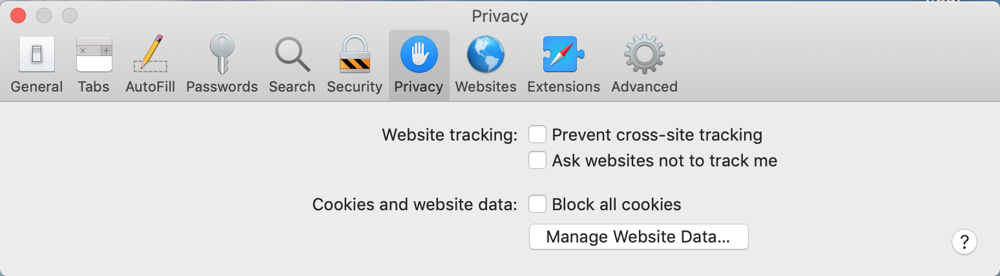

# Known issues on Safari browser with MSAL.js 

## Silent token renewal on Safari 12 and ITP 2.0

Apple iOS 12 and MacOS 10.14 operating systems included a release of the [Safari 12 browser](https://developer.apple.com/safari/whats-new/). For purposes of security and privacy, Safari 12 includes the [Intelligent Tracking Prevention 2.0](https://webkit.org/blog/8311/intelligent-tracking-prevention-2-0/). This essentially causes the browser to drop third-party cookies being set. ITP 2.0 also treats the cookies set by identity providers as third-party cookies.

### Impact on MSAL.js

MSAL.js uses a hidden Iframe to perform silent token acquisition and renewal as part of the `acquireTokenSilent` calls. The silent token requests rely on the Iframe having access to the authenticated user session represented by the cookies set by Azure AD. With ITP 2.0 preventing access to these cookies, MSAL.js fails to silently acquire and renew tokens and this results in `acquireTokenSilent` failures.

There is no solution for this issue at this point and we are evaluating options with the standards community.

### Work around

By default the ITP setting is enabled on Safari browser. You can disable this setting by navigating to
**Preferences** -> **Privacy** and unchecking the **Prevent cross-site tracking** option.

You will need to handle the `acquireTokenSilent` failures with an interactive acquire token call, which prompts the user to sign in.
To avoid repeated sign-ins, an approach you can implement is to handle the `acquireTokenSilent` failure and provide the user an option to disable the ITP setting in Safari before proceeding with the interactive call. Once the setting is disabled, subsequent silent token renewals should succeed.
