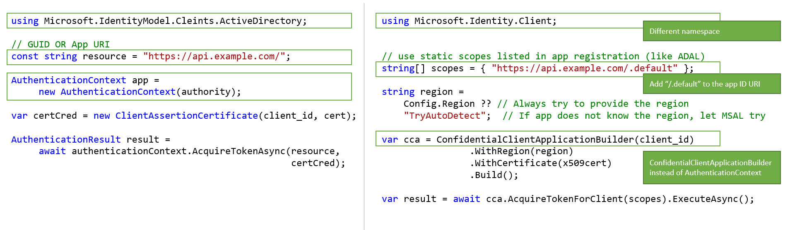

# Differences between ADAL.NET and MSAL.NET apps

Migrating your applications from using ADAL to using MSAL comes with security and resiliency benefits. This article outlines differences between MSAL.NET and ADAL.NET. All new applications should use MSAL.NET and the Microsoft identity platform, which is the latest generation of Microsoft Authentication Libraries. Using MSAL.NET, you acquire tokens for users signing-in to your application with Azure AD (work and school accounts), Microsoft (personal) accounts (MSA), or Azure AD B2C. If you have an existing application that is using ADAL.NET, migrate it to MSAL.NET.

You still need to use ADAL.NET if your application needs to sign in users with earlier versions of [Active Directory Federation Services (ADFS)](/windows-server/identity/active-directory-federation-services). For more information, see [ADFS support](https://aka.ms/msal-net-adfs-support).

## Prerequisites

Go through [MSAL overview](./msal-overview.md) to learn more about MSAL.

## Differences

|   | **ADAL NET**  | **MSAL NET**  |
|-----------------------------|--------------------------------------------|---------------------|
| **NuGet packages and Namespaces**  |ADAL was consumed from the [Microsoft.IdentityModel.Clients.ActiveDirectory](https://www.nuget.org/packages/Microsoft.IdentityModel.Clients.ActiveDirectory) NuGet package. The namespace was `Microsoft.IdentityModel.Clients.ActiveDirectory`.  | Add the [Microsoft.Identity.Client](https://www.nuget.org/packages/Microsoft.Identity.Client) NuGet package, and use the `Microsoft.Identity.Client` namespace. If you're building a confidential client application, check out [Microsoft.Identity.Web](https://www.nuget.org/packages/Microsoft.Identity.Web). |
| **Scopes and resources**  | ADAL.NET acquires tokens for *resources*. |  MSAL.NET acquires tokens for *scopes*. Several MSAL.NET `AcquireTokenXXX` overrides require a parameter called scopes(`IEnumerable<string> scopes`). This parameter is a simple list of strings that declare the permissions and resources that are requested. Well-known scopes are the [Microsoft Graph's scopes](/graph/permissions-reference). You can also [access v1.0 resources using MSAL.NET](#scopes). |
| **Core classes**  | ADAL.NET used [AuthenticationContext](https://github.com/AzureAD/azure-activedirectory-library-for-dotnet/wiki/AuthenticationContext:-the-connection-to-Azure-AD) as the representation of your connection to the Security Token Service (STS) or authorization server, through an Authority. | MSAL.NET is designed around [client applications](https://github.com/AzureAD/microsoft-authentication-library-for-dotnet/wiki/Client-Applications). It defines `IPublicClientApplication` interfaces for public client applications and `IConfidentialClientApplication` for confidential client applications, as well as a base interface `IClientApplicationBase` for the contract common to both types of applications.|
| **Token acquisition**  | In public clients, ADAL uses `AcquireTokenAsync` and `AcquireTokenSilentAsync` for authentication calls. | In public clients, MSAL uses `AcquireTokenInteractive` and `AcquireTokenSilent` for the same authentication calls. The parameters are different from the ADAL ones. <br><br>In Confidential client applications, there are [token acquisition methods](https://github.com/AzureAD/microsoft-authentication-library-for-dotnet/wiki/Acquiring-Tokens) with an explicit name depending on the scenario. Another difference is that, in MSAL.NET, you no longer have to pass in the `ClientID` of your application in every AcquireTokenXX call. The `ClientID` is set only once when building `IPublicClientApplication` or `IConfidentialClientApplication`.|
|  **IAccount and IUser**  | ADAL defines the notion of user through the IUser interface. However, a user is a human or a software agent. As such, a user can own one or more accounts in the Microsoft identity platform (several Azure AD accounts, Azure AD B2C, Microsoft personal accounts). The user can also be responsible for one or more Microsoft identity platform accounts. | MSAL.NET defines the concept of account (through the IAccount interface). The IAccount interface represents information about a single account. The user can have several accounts in different tenants. MSAL.NET provides better information in guest scenarios, as home account information is provided. You can read more about the [differences between IUser and IAccount](https://github.com/AzureAD/microsoft-authentication-library-for-dotnet/wiki/msal-net-2-released#iuser-is-replaced-by-iaccount).|
|  **Cache persistence**  | ADAL.NET allows you to extend the `TokenCache` class to implement the desired persistence functionality on platforms without a secure storage (.NET Framework and .NET core) by using the `BeforeAccess`, and `BeforeWrite` methods. For details, see [token cache serialization in ADAL.NET](https://github.com/AzureAD/azure-activedirectory-library-for-dotnet/wiki/Token-cache-serialization). | MSAL.NET makes the token cache a sealed class, removing the ability to extend it. As such, your implementation of token cache persistence must be in the form of a helper class that interacts with the sealed token cache. This interaction is described in [token cache serialization in MSAL.NET](https://github.com/AzureAD/microsoft-authentication-library-for-dotnet/wiki/token-cache-serialization) article. The serialization for a public client application (See [token cache for a public client application](https://github.com/AzureAD/microsoft-authentication-library-for-dotnet/wiki/token-cache-serialization#token-cache-for-a-public-client-application)), is different from that of for a confidential client application (See [token cache for a web app or web API](https://github.com/AzureAD/microsoft-authentication-library-for-dotnet/wiki/token-cache-serialization#token-cache-for-a-public-client-application)). |
| **Common authority** | ADAL uses Azure AD v1.0. `https://login.microsoftonline.com/common` authority in Azure AD v1.0 (which ADAL uses) allows users to sign in using any Azure AD organization (work or school) account. Azure AD v1.0 doesn't allow sign in with Microsoft personal accounts. For more information, see [authority validation in ADAL.NET](https://github.com/AzureAD/azure-activedirectory-library-for-dotnet/wiki/AuthenticationContext:-the-connection-to-Azure-AD#authority-validation). | MSAL uses Azure AD v2.0. `https://login.microsoftonline.com/common` authority in Azure AD v2.0 (which MSAL uses) allows users to sign in with any Azure AD organization (work or school) account or with a Microsoft personal account. To restrict sign in using only organization accounts (work or school account) in MSAL, you'll need to use the `https://login.microsoftonline.com/organizations` endpoint.  For details, see the `authority` parameter in [public client application](https://github.com/AzureAD/microsoft-authentication-library-for-dotnet/wiki/Client-Applications#publicclientapplication). |

## Supported grants

Below is a summary comparing MSAL.NET and ADAL.NET supported grants for both public and confidential client applications.

### Public client applications

The following image summarizes some of the differences between ADAL.NET and MSAL.NET for a public client application.

[](media/msal-compare-msaldotnet-and-adaldotnet/differences.png#lightbox)

Here are the grants supported in ADAL.NET and MSAL.NET for Desktop and Mobile applications.

Grant                             | MSAL.NET                                                                                                                     | ADAL.NET                                                                                                                                                                                                   |
--------------------------------- | ---------------------------------------------------------------------------------------------------------------------------- | ---------------------------------------------------------------------------------------------------------------------------------------------------------------------------------------------------------- |
Interactive                       | [Acquiring tokens interactively in MSAL.NET](scenario-desktop-acquire-token-interactive.md)    | [Interactive Auth](https://github.com/AzureAD/azure-activedirectory-library-for-dotnet/wiki/Acquiring-tokens-interactively---Public-client-application-flows)                                              |
Integrated Windows authentication | [Integrated Windows authentication](scenario-desktop-acquire-token-integrated-windows-authentication.md)         | [Integrated authentication on Windows (Kerberos)](https://github.com/AzureAD/azure-activedirectory-library-for-dotnet/wiki/AcquireTokenSilentAsync-using-Integrated-authentication-on-Windows-(Kerberos))  |
Username / Password               | [Username-password authentication](scenario-desktop-acquire-token-username-password.md)                      | [Acquiring tokens with username and password](https://github.com/AzureAD/azure-activedirectory-library-for-dotnet/wiki/Acquiring-tokens-with-username-and-password)                                        |
Device code flow                  | [Device code flow](scenario-desktop-acquire-token-device-code-flow.md)                    | [Device profile for devices without web browsers](https://github.com/AzureAD/azure-activedirectory-library-for-dotnet/wiki/Device-profile-for-devices-without-web-browsers)                                |

### Confidential client applications

The following image summarizes some of the differences between ADAL.NET and MSAL.NET for a confidential client application.
 
[](media/msal-net-migration/confidential-client-application.png#lightbox)


Here are the grants supported in ADAL.NET, MSAL.NET, and Microsoft.Identity.Web for web applications, web APIs, and daemon applications.

Type of App              | Grant              | MSAL.NET                                                                                                                             | ADAL.NET                                                                                                                                                                                              |
------------------------ | ------------------ | ------------------------------------------------------------------------------------------------------------------------------------ | ----------------------------------------------------------------------------------------------------------------------------------------------------------------------------------------------------- |
Web app, web API, daemon | Client Credentials | [Client credential flows in MSAL.NET](scenario-daemon-acquire-token.md#acquiretokenforclient-api)                        | [Client credential flows in ADAL.NET](https://github.com/AzureAD/azure-activedirectory-library-for-dotnet/wiki/Client-credential-flows)                                                               |
Web API                  | On behalf of       | [On behalf of in MSAL.NET](https://github.com/AzureAD/microsoft-authentication-library-for-dotnet/wiki/on-behalf-of)                 | [Service to service calls on behalf of the user with ADAL.NET](https://github.com/AzureAD/azure-activedirectory-library-for-dotnet/wiki/Service-to-service-calls-on-behalf-of-the-user)               |
Web app                  | Auth Code          | [Acquiring tokens with authorization codes on web apps with A MSAL.NET](scenario-web-app-call-api-acquire-token.md)  | [Acquiring tokens with authorization codes on web apps with ADAL.NET](https://github.com/AzureAD/azure-activedirectory-library-for-dotnet/wiki/Acquiring-tokens-with-authorization-codes-on-web-apps) |

## Migrating from ADAL 2.x with refresh tokens

In ADAL.NET v2.X, the refresh tokens were exposed allowing you to develop solutions around the use of these tokens by caching them and using the `AcquireTokenByRefreshToken` methods provided by ADAL 2.x.

Some of those solutions were used in scenarios such as:

- Long running services that do actions including refreshing dashboards for the users when the users are no longer connected / signed-in to the app.
- WebFarm scenarios for enabling the client to bring the refresh token to the web service (caching is done client side, encrypted cookie, and not server side).

MSAL.NET doesn't expose refresh tokens for security reasons. MSAL handles refreshing tokens for you.

Fortunately, MSAL.NET has an API that allows you to migrate your previous refresh tokens (acquired with ADAL) into the `IConfidentialClientApplication`:

```csharp
/// <summary>
/// Acquires an access token from an existing refresh token and stores it and the refresh token into
/// the application user token cache, where it will be available for further AcquireTokenSilent calls.
/// This method can be used in migration to MSAL from ADAL v2 and in various integration
/// scenarios where you have a RefreshToken available.
/// (see https://aka.ms/msal-net-migration-adal2-msal2)
/// </summary>
/// <param name="scopes">Scope to request from the token endpoint.
/// Setting this to null or empty will request an access token, refresh token and ID token with default scopes</param>
/// <param name="refreshToken">The refresh token from ADAL 2.x</param>
IByRefreshToken.AcquireTokenByRefreshToken(IEnumerable<string> scopes, string refreshToken);
```

With this method, you can provide the previously used refresh token along with any scopes (resources) you want. The refresh token will be exchanged for a new one and cached into your application.

As this method is intended for scenarios that aren't typical, it isn't readily accessible with the `IConfidentialClientApplication` without first casting it to `IByRefreshToken`.

The code snippet below shows some migration code in a confidential client application.

```csharp
TokenCache userCache = GetTokenCacheForSignedInUser();
string rt = GetCachedRefreshTokenForSignedInUser();

IConfidentialClientApplication app;
app = ConfidentialClientApplicationBuilder.Create(clientId)
 .WithAuthority(Authority)
 .WithRedirectUri(RedirectUri)
 .WithClientSecret(ClientSecret)
 .Build();
IByRefreshToken appRt = app as IByRefreshToken;

AuthenticationResult result = await appRt.AcquireTokenByRefreshToken(null, rt)
                                         .ExecuteAsync()
                                         .ConfigureAwait(false);
```

`GetCachedRefreshTokenForSignedInUser` retrieves the refresh token that was stored in some storage by a previous version of the application that used to use ADAL 2.x. `GetTokenCacheForSignedInUser` deserializes a cache for the signed-in user (as confidential client applications should have one cache per user).

An access token and an ID token are returned in the `AuthenticationResult` value while the new refresh token is stored in the cache. You can also use this method for various integration scenarios where you have a refresh token available.

## v1.0 and v2.0 tokens

There are two versions of tokens: v1.0 tokens and  v2.0 tokens. The v1.0 endpoint (used by ADAL) emits v1.0 ID tokens while the v2.0 endpoint (used by MSAL) emits v2.0 ID tokens. However, both endpoints emit access tokens of the version of the token that the web API accepts. A property of the application manifest of the web API enables developers to choose which version of token is accepted. See `accessTokenAcceptedVersion` in the [application manifest](reference-app-manifest.md) reference documentation.

For more information about v1.0 and v2.0 access tokens, see [Azure Active Directory access tokens](access-tokens.md).

## Exceptions

### Interaction required exceptions

Using MSAL.NET, you catch `MsalUiRequiredException` as described in [AcquireTokenSilent](https://github.com/AzureAD/microsoft-authentication-library-for-dotnet/wiki/AcquireTokenSilentAsync-using-a-cached-token).

```csharp
catch(MsalUiRequiredException exception)
{
 try {"try to authenticate interactively"}
}
```

For details, see [Handle errors and exceptions in MSAL.NET](msal-error-handling-dotnet.md)

ADAL.NET had less explicit exceptions. For example, when silent authentication failed in ADAL the procedure was to catch the exception and look for the `user_interaction_required` error code:

```csharp
catch(AdalException exception)
{
 if (exception.ErrorCode == "user_interaction_required")
 {
  try
  {“try to authenticate interactively”}}
 }
}
```

For details, see [the recommended pattern to acquire a token in public client applications](https://github.com/AzureAD/azure-activedirectory-library-for-dotnet/wiki/AcquireTokenSilentAsync-using-a-cached-token#recommended-pattern-to-acquire-a-token) with ADAL.NET.

### Prompt behavior

Prompt behavior in MSAL.NET is equivalent to prompt behavior in ADAL.NET:

|  ADAL.NET | MSAL.NET | Description |
| ----------- | ----------- | -------------|
| `PromptBehavior.Auto`| `NoPrompt`| Azure AD chooses the best behavior (signing in users silently if they are signed in with only one account, or displaying the account selector if they are signed in with several accounts). |
| `PromptBehavior.Always`| `ForceLogin` | Resets the sign-in box and forces the user to reenter their credentials. |
| `PromptBehavior.RefreshSession`| `Consent`| Forces the user to consent again to all permissions. |
| `PromptBehavior.Never`| `Never`| Don't use; instead, use the [recommended pattern for public client apps](scenario-desktop-acquire-token.md?tabs=dotnet). |
| `PromptBehavior.SelectAccount`| `SelectAccount`| Displays the account selector and forces the user to select an account. |

### Handling claim challenge exceptions

At times when acquiring a token, Azure AD throws an exception in case a resource requires more claims from the user (for instance two-factor authentication).

In MSAL.NET, claim challenge exceptions are handled in the following way:

- The `Claims` are surfaced in the `MsalServiceException`.
- There's a `.WithClaim(claims)` method that can apply to the `AcquireTokenXXX` builders.

For details see [Handling MsalUiRequiredException](msal-error-handling-dotnet.md#msaluirequiredexception).

In ADAL.NET, claim challenge exceptions were handled in the following way:

- `AdalClaimChallengeException` is an exception (deriving from `AdalServiceException`). The `Claims` member contains some JSON fragment with the claims, which are expected. 
- The public client application receiving this exception needed to call the `AcquireTokenInteractive` override having a claims parameter. This override of `AcquireTokenInteractive` doesn't even try to hit the cache as it isn't necessary. The reason is that the token in the cache doesn't have the right claims (otherwise an `AdalClaimChallengeException` wouldn't have been thrown). As such, there's no need to look at the cache. The `ClaimChallengeException` can be received in a WebAPI doing OBO, but the `AcquireTokenInteractive` needs to be called in a public client application calling this web API.

For details, including samples see [handling AdalClaimChallengeException](https://github.com/AzureAD/azure-activedirectory-library-for-dotnet/wiki/Exceptions-in-ADAL.NET#handling-adalclaimchallengeexception).


## Scopes

ADAL uses the concept of resources with `resourceId` string, MSAL.NET, however, uses scopes. The logic used by Azure AD is as follows:

- For ADAL (v1.0) endpoint with a v1.0 access token (the only possible), `aud=resource`.
- For MSAL (v2.0 endpoint) asking an access token for a resource accepting v2.0 tokens, `aud=resource.AppId`.
- For MSAL (v2.0 endpoint) asking an access token for a resource accepting a v1.0 access token, Azure AD parses the desired audience from the requested scope. This is done by taking everything before the last slash and using it as the resource identifier. As such, if `https://database.windows.net` expects an audience of `https://database.windows.net/`, you'll need to request a scope of `https://database.windows.net//.default` (notice the double slash before ./default). This is illustrated by examples 1 and 2 below.

### Example 1

If you want to acquire tokens for an application accepting v1.0 tokens (for instance the Microsoft Graph API, which is `https://graph.microsoft.com`), you'd need to create `scopes` by concatenating a desired resource identifier with a desired OAuth2 permission for that resource.

For instance, to access the name of the user via a v1.0 web API whose App ID URI is `ResourceId`, you'd want to use:

```csharp
var scopes = new [] { ResourceId+"/user_impersonation" };
```

If you want to read and write with MSAL.NET Azure Active Directory using the Microsoft Graph API (`https://graph.microsoft.com/`), you'd create a list of scopes like in the code snippet below:

```csharp
string ResourceId = "https://graph.microsoft.com/"; 
string[] scopes = { ResourceId + "Directory.Read", ResourceId + "Directory.Write" }
```

### Example 2

If resourceId ends with a '/', you'll need to have a double '/' when writing the scope value. For example, if you want to write the scope corresponding to the Azure Resource Manager API (`https://management.core.windows.net/`), request the following scope (note the two slashes).

```csharp
var resource = "https://management.core.windows.net/"
var scopes = new[] {"https://management.core.windows.net//user_impersonation"};
var result = await app.AcquireTokenInteractive(scopes).ExecuteAsync();

// then call the API: https://management.azure.com/subscriptions?api-version=2016-09-01
```

This is because the Resource Manager API expects a slash in its audience claim (`aud`), and then there's a slash to separate the API name from the scope.

If you want to acquire a token for all the static scopes of a v1.0 application, you'd create your scopes list as shown in the code snippet below:

```csharp
ResourceId = "someAppIDURI";
var scopes = new [] { ResourceId+"/.default" };
```

For a client credential flow, the scope to pass would also be `/.default`. This scope tells to Azure AD: "all the app-level permissions that the admin has consented to in the application registration.

## Next steps

[Migrate your apps from ADAL to MSAL](msal-net-migration.md)
[Migrate your ADAL.NET confidential client apps to use MSAL.NET](msal-net-migration-confidential-client.md)
