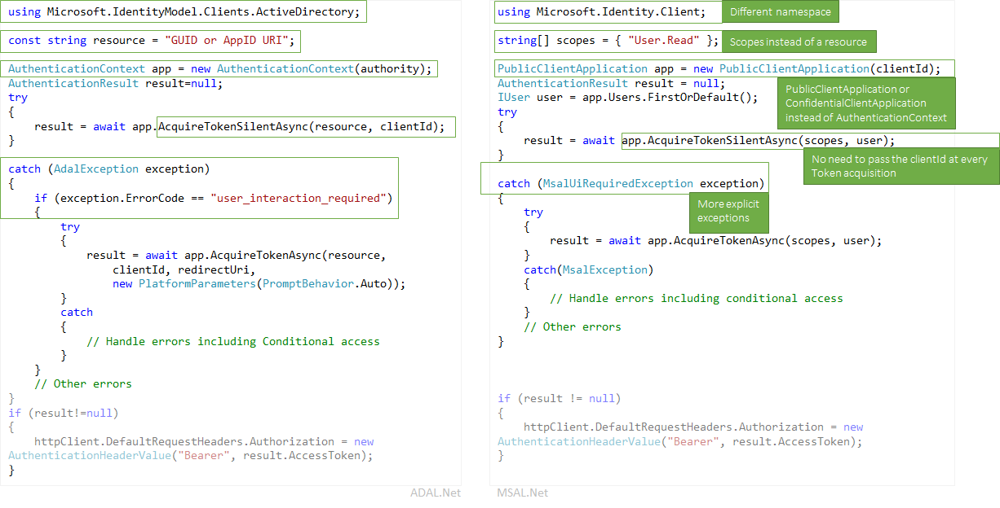

# Migrating applications to MSAL.NET

Both Microsoft Authentication Library for .NET (MSAL.NET) and Azure AD Authentication Library for .NET (ADAL.NET) are used to authenticate Azure AD entities and request tokens from Azure AD. Up until now, most developers have worked with Azure AD for developers platform (v1.0) to authenticate Azure AD identities (work and school accounts) by requesting tokens using Azure AD Authentication Library (ADAL). Using MSAL:

- you can authenticate a broader set of Microsoft identities (Azure AD identities and Microsoft accounts, and social and local accounts through Azure AD B2C) as it uses the Microsoft identity platform endpoint,
- your users will get the best single-sign-on experience.
- your application can enable incremental consent, and supporting Conditional Access is easier
- you benefit from the innovation.

**MSAL.NET is now the recommended auth library to use with the Microsoft identity platform**. No new features will be implemented on ADAL.NET. The efforts are focused on improving MSAL.

This article describes the differences between the Microsoft Authentication Library for .NET (MSAL.NET) and Azure AD Authentication Library for .NET (ADAL.NET) and helps you migrate to MSAL.  

## Differences between ADAL and MSAL apps

In most cases you want to use MSAL.NET and the Microsoft identity platform endpoint, which is the latest generation of Microsoft authentication libraries. Using MSAL.NET, you acquire tokens for users signing-in to your application with Azure AD (work and school accounts), Microsoft (personal) accounts (MSA), or Azure AD B2C. 

If you are already familiar with the Azure AD for developers (v1.0) endpoint (and ADAL.NET), you might want to read [What's different about the Microsoft identity platform (v2.0) endpoint?](active-directory-v2-compare.md).

However, you still need to use ADAL.NET if your application needs to sign in users with earlier versions of [Active Directory Federation Services (ADFS)](/windows-server/identity/active-directory-federation-services). For more information, see [ADFS support](https://aka.ms/msal-net-adfs-support).

The following picture summarizes some of the differences between ADAL.NET and MSAL.NET


### NuGet packages and Namespaces

ADAL.NET is consumed from the [Microsoft.IdentityModel.Clients.ActiveDirectory](https://www.nuget.org/packages/Microsoft.IdentityModel.Clients.ActiveDirectory) NuGet package. the namespace to use is `Microsoft.IdentityModel.Clients.ActiveDirectory`.

To use MSAL.NET you will need to add the [Microsoft.Identity.Client](https://www.nuget.org/packages/Microsoft.Identity.Client) NuGet package, and use the `Microsoft.Identity.Client` namespace

### Scopes not resources

ADAL.NET acquires tokens for *resources*, but MSAL.NET acquires tokens for *scopes*. A number of MSAL.NET AcquireToken overrides require a parameter called scopes(`IEnumerable<string> scopes`). This parameter is a simple list of strings that declare the desired permissions and resources that are requested. Well known scopes are the [Microsoft Graph's scopes](/graph/permissions-reference).

It's also possible in MSAL.NET to access v1.0 resources. See details in [Scopes for a v1.0 application](#scopes-for-a-web-api-accepting-v10-tokens). 

### Core classes

- ADAL.NET uses [AuthenticationContext](https://github.com/AzureAD/azure-activedirectory-library-for-dotnet/wiki/AuthenticationContext:-the-connection-to-Azure-AD) as the representation of your connection to the Security Token Service (STS) or authorization server, through an Authority. On the contrary, MSAL.NET is designed around [client applications](https://github.com/AzureAD/microsoft-authentication-library-for-dotnet/wiki/Client-Applications). It provides two separate classes: `PublicClientApplication` and `ConfidentialClientApplication`

- Acquiring Tokens: ADAL.NET and MSAL.NET have the same authentication calls (`AcquireTokenAsync` and  `AcquireTokenSilentAsync` for ADAL.NET, and `AcquireTokenInteractive` and `AcquireTokenSilent` in MSAL.NET) but with different parameters required. One difference is the fact that, in MSAL.NET, you no longer have to pass in the `ClientID` of your application in every AcquireTokenXX call. Indeed, the `ClientID` is set only once when building the (`IPublicClientApplication` or `IConfidentialClientApplication`).

### IAccount not IUser

ADAL.NET manipulated users. However, a user is a human or a software agent, but it can possess/own/be responsible for one or more accounts in the Microsoft identity system (several Azure AD accounts, Azure AD B2C, Microsoft personal accounts). 

MSAL.NET 2.x now defines the concept of Account (through the IAccount interface). This breaking change provides the right semantics: the fact that the same user can have several accounts, in different Azure AD directories. Also MSAL.NET provides better information in guest scenarios, as home account information is provided.

For more information about the differences between IUser and IAccount, see [MSAL.NET 2.x](https://aka.ms/msal-net-2-released).

### Exceptions

#### Interaction required exceptions

MSAL.NET has more explicit exceptions. For example, when silent authentication fails in ADAL the procedure is to catch the exception and look for the `user_interaction_required` error code:

```csharp
catch(AdalException exception)
{
 if (exception.ErrorCode == "user_interaction_required")
 {
  try
  {“try to authenticate interactively”}}
 }
}
```

See details in [The recommended pattern to acquire a token](https://github.com/AzureAD/azure-activedirectory-library-for-dotnet/wiki/AcquireTokenSilentAsync-using-a-cached-token#recommended-pattern-to-acquire-a-token) with ADAL.NET

Using MSAL.NET, you catch `MsalUiRequiredException` as described in [AcquireTokenSilent](https://github.com/AzureAD/microsoft-authentication-library-for-dotnet/wiki/AcquireTokenSilentAsync-using-a-cached-token).

```csharp
catch(MsalUiRequiredException exception)
{
 try {“try to authenticate interactively”}
}
```

#### Handling claim challenge exceptions

In ADAL.NET, claim challenge exceptions are handled in the following way:

- `AdalClaimChallengeException` is an exception (deriving from `AdalServiceException`) thrown by the service in case a resource requires more claims from the user (for instance two-factors authentication). The `Claims` member contains some JSON fragment with the claims, which are expected.
- Still in ADAL.NET, the public client application receiving this exception needs to call the `AcquireTokenInteractive` override having a claims parameter. This override of `AcquireTokenInteractive` does not even try to hit the cache as it is not necessary. The reason is that the token in the cache does not have the right claims (otherwise an `AdalClaimChallengeException` would not have been thrown). Therefore, there is no need to look at the cache. Note that the `ClaimChallengeException` can be received in a WebAPI doing OBO, whereas the `AcquireTokenInteractive` needs to be called in a public client application calling this Web API.
- for details, including samples see Handling [AdalClaimChallengeException](https://github.com/AzureAD/azure-activedirectory-library-for-dotnet/wiki/Exceptions-in-ADAL.NET#handling-adalclaimchallengeexception)

In MSAL.NET, claim challenge exceptions are handled in the following way:

- The `Claims` are surfaced in the `MsalServiceException`.
- There is a `.WithClaim(claims)` method that can apply to the `AcquireTokenInteractive` builder. 

### Supported grants

Not all the grants are yet supported in MSAL.NET and the v2.0 endpoint. The following is a summary comparing ADAL.NET and MSAL.NET's supported grants.

#### Public client applications

Here are the grants supported in ADAL.NET and MSAL.NET for Desktop and Mobile applications

Grant | ADAL.NET | MSAL.NET
----- |----- | -----
Interactive | [Interactive Auth](https://github.com/AzureAD/azure-activedirectory-library-for-dotnet/wiki/Acquiring-tokens-interactively---Public-client-application-flows) | [Acquiring tokens interactively in MSAL.NET](https://github.com/AzureAD/microsoft-authentication-library-for-dotnet/wiki/Acquiring-tokens-interactively)
Integrated Windows Authentication | [Integrated authentication on Windows (Kerberos)](https://github.com/AzureAD/azure-activedirectory-library-for-dotnet/wiki/AcquireTokenSilentAsync-using-Integrated-authentication-on-Windows-(Kerberos)) | [Integrated Windows Authentication](msal-authentication-flows.md#integrated-windows-authentication)
Username / Password | [Acquiring tokens with username and password](https://github.com/AzureAD/azure-activedirectory-library-for-dotnet/wiki/Acquiring-tokens-with-username-and-password)| [Username Password Authentication](msal-authentication-flows.md#usernamepassword)
Device code flow | [Device profile for devices without web browsers](https://github.com/AzureAD/azure-activedirectory-library-for-dotnet/wiki/Device-profile-for-devices-without-web-browsers) | [Device Code flow](msal-authentication-flows.md#device-code)

#### Confidential client applications

Here are the grants supported in ADAL.NET and MSAL.NET for Web Applications, Web APIs, and daemon applications:

Type of App | Grant | ADAL.NET | MSAL.NET
----- | ----- | ----- | -----
Web App, Web API, daemon | Client Credentials | [Client credential flows in ADAL.NET](https://github.com/AzureAD/azure-activedirectory-library-for-dotnet/wiki/Client-credential-flows) | [Client credential flows in MSAL.NET](msal-authentication-flows.md#client-credentials))
Web API | On behalf of | [Service to service calls on behalf of the user with ADAL.NET](https://github.com/AzureAD/azure-activedirectory-library-for-dotnet/wiki/Service-to-service-calls-on-behalf-of-the-user) | [On behalf of in MSAL.NET](msal-authentication-flows.md#on-behalf-of)
Web App | Auth Code | [Acquiring tokens with authorization codes on web apps with ADAL.NET](https://github.com/AzureAD/azure-activedirectory-library-for-dotnet/wiki/Acquiring-tokens-with-authorization-codes-on-web-apps) | [Acquiring tokens with authorization codes on web apps with A MSAL.NET](msal-authentication-flows.md#authorization-code)

### Cache persistence

ADAL.NET allows you to extend the `TokenCache` class to implement the desired persistence functionality on platforms without a secure storage (.NET Framework and .NET core) by using the `BeforeAccess`, and `BeforeWrite` methods. For details, see [Token Cache Serialization in ADAL.NET](https://github.com/AzureAD/azure-activedirectory-library-for-dotnet/wiki/Token-cache-serialization).

MSAL.NET makes the token cache a sealed class, removing the ability to extend it. Therefore, your implementation of token cache persistence must be in the form of a helper class that interacts with the sealed token cache. This interaction is described in [Token Cache Serialization in MSAL.NET](https://github.com/AzureAD/microsoft-authentication-library-for-dotnet/wiki/token-cache-serialization).

## Signification of the common authority

In v1.0, if you use the https://login.microsoftonline.com/common authority, you will allow users to sign in with any AAD account (for any organization). See [Authority Validation in ADAL.NET](https://github.com/AzureAD/azure-activedirectory-library-for-dotnet/wiki/AuthenticationContext:-the-connection-to-Azure-AD#authority-validation)

If you use the https://login.microsoftonline.com/common authority in v2.0, you will allow users to sign in with any AAD organization or a Microsoft personal account (MSA). In MSAL.NET, if you want to restrict login to any AAD account (same behavior as with ADAL.NET), you need to use https://login.microsoftonline.com/organizations. For details, see the `authority` parameter in [public client application](https://github.com/AzureAD/microsoft-authentication-library-for-dotnet/wiki/Client-Applications#publicclientapplication).

## v1.0 and v2.0 tokens

There are two versions of tokens:
- v1.0 tokens
- v2.0 tokens 

The v1.0 endpoint (used by ADAL) only emits v1.0 tokens.

However, the v2.0 endpoint (used by MSAL) emits the version of the token that the Web API accepts. A property of the application manifest of the Web API enables developers to choose which version of token is accepted. See `accessTokenAcceptedVersion` in the [Application manifest](reference-app-manifest.md) reference documentation.

For more information about v1.0 and v2.0 tokens, see [Azure Active Directory access tokens](access-tokens.md)

## Scopes for a Web API accepting v1.0 tokens

OAuth2 permissions are permission scopes that a v1.0 web API (resource) application exposes to client applications. These permission scopes may be granted to client applications during consent. See the section about oauth2Permissions in [Azure Active Directory application manifest](active-directory-application-manifest.md).

### Scopes to request access to specific OAuth2 permissions of a v1.0 application

If you want to acquire tokens for specific scopes of a v1.0 application (for instance the AAD graph, which is https://graph.windows.net), you'd need to create `scopes` by concatenating a desired resource identifier with a desired OAuth2 permission for that resource.

For instance, to access in the name of the user a v1.0 Web API which App ID URI is `ResourceId`, you'd want to use:

```csharp
var scopes = new [] {  ResourceId+"/user_impersonation"};
```

If you want to read and write with MSAL.NET Azure Active Directory using the AAD graph API (https://graph.windows.net/), you would create a list of scopes like in the following snippet:

```csharp
ResourceId = "https://graph.windows.net/";
var scopes = new [] { ResourceId + "Directory.Read", ResourceID + "Directory.Write"}
```

#### Warning: Should you have one or two slashes in the scope corresponding to a v1.0 Web API

If you want to write the scope corresponding to the Azure Resource Manager API (https://management.core.windows.net/), you need to request the following scope (note the two slashes) 

```csharp
var scopes = new[] {"https://management.core.windows.net//user_impersonation"};
var result = await app.AcquireTokenInteractive(scopes).ExecuteAsync();

// then call the API: https://management.azure.com/subscriptions?api-version=2016-09-01
```

This is because the Resource Manager API expects a slash in its audience claim (`aud`), and then there is a slash to separate the API name from the scope.

The logic used by Azure AD is the following:
- For ADAL (v1.0) endpoint with a v1.0 access token (the only possible), aud=resource
- For MSAL (v2.0 endpoint) asking an access token for a resource accepting v2.0 tokens, aud=resource.AppId
- For MSAL (v2.0 endpoint) asking an access token for a resource accepting a v1.0 access token (which is the case above), Azure AD parses the desired audience from the requested scope by taking everything before the last slash and using it as the resource identifier. Therefore if https:\//database.windows.net expects an audience of "https://database.windows.net/", you'll need to request a scope of https:\//database.windows.net//.default. See also issue #[747](https://github.com/AzureAD/microsoft-authentication-library-for-dotnet/issues/747): Resource url's trailing slash is omitted, which caused sql auth failure #747


### Scopes to request access to all the permissions of a v1.0 application

For instance, if you want to acquire a token for all the static scopes of a v1.0 application, one would need to use

```csharp
ResourceId = "someAppIDURI";
var scopes = new [] {  ResourceId+"/.default"};
```

### Scopes to request in the case of client credential flow / daemon app

In the case of client credential flow, the scope to pass would also be `/.default`. This scope tells to Azure AD: "all the app-level permissions that the admin has consented to in the application registration.

## ADAL to MSAL migration

In ADAL.NET v2.X, the refresh tokens were exposed allowing you to develop solutions around the use of these tokens by caching them and using the `AcquireTokenByRefreshToken` methods provided by ADAL 2.x. 
Some of those solutions were used in scenarios such as:
* Long running services that do actions including refreshing dashboards on behalf of the users whereas the users are no longer connected. 
* WebFarm scenarios for enabling the client to bring the RT to the web service (caching is done client side, encrypted cookie, and not server side)

MSAL.NET does not expose refresh tokens, for security reasons: MSAL handles refreshing tokens for you. 

Fortunately, MSAL.NET now has an API that allows you to migrate your previous refresh tokens (acquired with ADAL) into the `IConfidentialClientApplication`:

```csharp
/// <summary>
/// Acquires an access token from an existing refresh token and stores it and the refresh token into 
/// the application user token cache, where it will be available for further AcquireTokenSilent calls.
/// This method can be used in migration to MSAL from ADAL v2 and in various integration 
/// scenarios where you have a RefreshToken available. 
/// (see https://aka.ms/msal-net-migration-adal2-msal2)
/// </summary>
/// <param name="scopes">Scope to request from the token endpoint. 
/// Setting this to null or empty will request an access token, refresh token and ID token with default scopes</param>
/// <param name="refreshToken">The refresh token from ADAL 2.x</param>
IByRefreshToken.AcquireTokenByRefreshToken(IEnumerable<string> scopes, string refreshToken);
```
 
With this method, you can provide the previously used refresh token along with any scopes (resources) you desire. The refresh token will be exchanged for a new one and cached into your application.  

As this method is intended for scenarios that are not typical, it is not readily accessible with the `IConfidentialClientApplication` without first casting it to `IByRefreshToken`.

This code snippet shows some migration code in a confidential client application. `GetCachedRefreshTokenForSignedInUser` retrieve the refresh token that was stored in some storage by a previous version of the application that used to leverage ADAL 2.x. `GetTokenCacheForSignedInUser` deserializes a cache for the signed-in user (as confidential client applications should have one cache per user).

```csharp
TokenCache userCache = GetTokenCacheForSignedInUser();
string rt = GetCachedRefreshTokenForSignedInUser();

IConfidentialClientApplication app;
app = ConfidentialClientApplicationBuilder.Create(clientId)
 .WithAuthority(Authority)
 .WithRedirectUri(RedirectUri)
 .WithClientSecret(ClientSecret)
 .Build();
IByRefreshToken appRt = app as IByRefreshToken;
         
AuthenticationResult result = await appRt.AcquireTokenByRefreshToken(null, rt)
                                         .ExecuteAsync()
                                         .ConfigureAwait(false);
```

You will see an access token and ID token returned in your AuthenticationResult while your new refresh token is stored in the cache.

You can also use this method for various integration scenarios where you have a refresh token available.

## Next steps

You can find more information about the scopes in [Scopes, permissions, and consent in the Microsoft identity platform endpoint](v2-permissions-and-consent.md)
