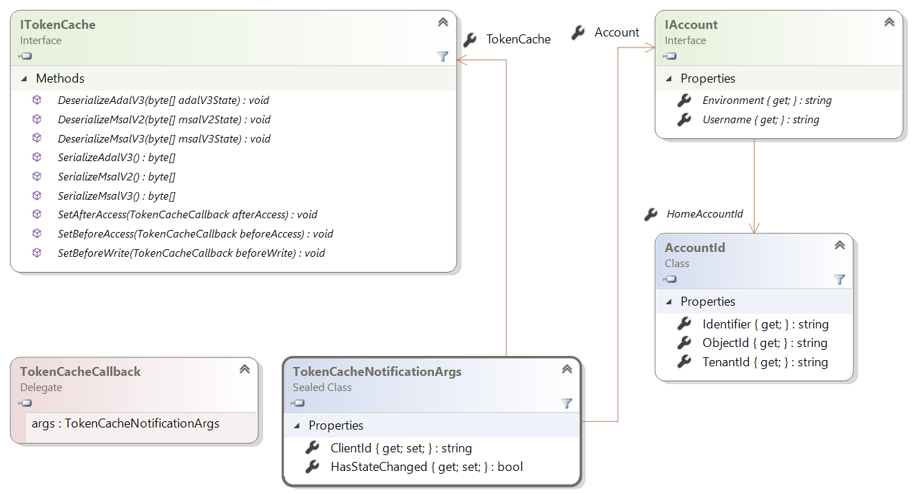
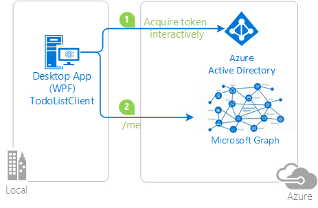

# Token cache serialization in MSAL.NET
After a [token is acquired](msal-acquire-cache-tokens.md), it is cached by Microsoft Authentication Library (MSAL).  Application code should try to get a token from the cache before acquiring a token by another method.  This article discusses default and custom serialization of the token cache in MSAL.NET.

This article is for MSAL.NET 3.x. If you're interested in MSAL.NET 2.x, see [Token cache serialization in MSAL.NET 2.x](https://github.com/AzureAD/microsoft-authentication-library-for-dotnet/wiki/Token-cache-serialization-2x).

## Default serialization for mobile platforms

In MSAL.NET, an in-memory token cache is provided by default. Serialization is provided by default for platforms where secure storage is available for a user as part of the platform. This is the case for Universal Windows Platform (UWP), Xamarin.iOS, and Xamarin.Android.

> [!Note]
> When you migrate a Xamarin.Android project from MSAL.NET 1.x to MSAL.NET 3.x, you might want to add `android:allowBackup="false"` to your project to avoid old cached tokens from coming back when Visual Studio deployments trigger a restore of local storage. See [Issue #659](https://github.com/AzureAD/microsoft-authentication-library-for-dotnet/issues/659#issuecomment-436181938).

## Custom serialization for Windows desktop apps and web apps/web APIs

Remember, custom serialization isn't available on mobile platforms (UWP, Xamarin.iOS, and Xamarin.Android). MSAL already defines a secure and performant serialization mechanism for these platforms. .NET desktop and .NET Core applications, however, have varied architectures and MSAL can't implement a general-purpose serialization mechanism. For example, web sites may choose to store tokens in a Redis cache, or desktop apps store tokens in an encrypted file. So serialization isn't provided out-of-the-box. To have a persistent token cache application in .NET desktop or .NET Core, you need to customize the serialization.

The following classes and interfaces are used in token cache serialization:

- `ITokenCache`, which defines events to subscribe to token cache serialization requests as well as methods to serialize or de-serialize the cache at various formats (ADAL v3.0, MSAL 2.x, and MSAL 3.x = ADAL v5.0).
- `TokenCacheCallback` is a callback passed to the events so that you can handle the serialization. They'll be called with arguments of type `TokenCacheNotificationArgs`.
- `TokenCacheNotificationArgs` only provides the `ClientId` of the application and a reference to the user for which the token is available.

  

> [!IMPORTANT]
> MSAL.NET creates token caches for you and provides you with the `IToken` cache when you call an application's `UserTokenCache` and `AppTokenCache` properties. You are not supposed to implement the interface yourself. Your responsibility, when you implement a custom token cache serialization, is to:
> - React to `BeforeAccess` and `AfterAccess` "events" (or their Async flavors). The `BeforeAccess` delegate is responsible to deserialize the cache, whereas the `AfterAccess` one is responsible for serializing the cache.
> - Part of these events store or load blobs, which are passed through the event argument to whatever storage you want.

The strategies are different depending on if you're writing a token cache serialization for a [public client application](msal-client-applications.md) (desktop), or a [confidential client application](msal-client-applications.md)) (web app / web API, daemon app).

### Token cache for a public client

Since MSAL.NET v2.x you have several options for serializing the token cache of a public client. You can serialize the cache only to the MSAL.NET format (the unified format cache is common across MSAL and the platforms).  You can also support the [legacy](https://github.com/AzureAD/azure-activedirectory-library-for-dotnet/wiki/Token-cache-serialization) token cache serialization of ADAL V3.

Customizing the token cache serialization to share the single sign-on state between ADAL.NET 3.x, ADAL.NET 5.x, and MSAL.NET is explained in part of the following sample: [active-directory-dotnet-v1-to-v2](https://github.com/Azure-Samples/active-directory-dotnet-v1-to-v2).

> [!Note]
> The MSAL.NET 1.1.4-preview token cache format is no longer supported in MSAL 2.x. If you have applications leveraging MSAL.NET 1.x, your users will have to re-sign-in. Alternately, the migration from ADAL 4.x (and 3.x) is supported.

#### Simple token cache serialization (MSAL only)

Below is an example of a naive implementation of custom serialization of a token cache for desktop applications. Here, the user token cache is a file in the same folder as the application.

After you build the application, you enable the serialization by calling the `TokenCacheHelper.EnableSerialization()` method and passing the application `UserTokenCache`.

```csharp
app = PublicClientApplicationBuilder.Create(ClientId)
    .Build();
TokenCacheHelper.EnableSerialization(app.UserTokenCache);
```

The `TokenCacheHelper` helper class is defined as:

```csharp
static class TokenCacheHelper
 {
  public static void EnableSerialization(ITokenCache tokenCache)
  {
   tokenCache.SetBeforeAccess(BeforeAccessNotification);
   tokenCache.SetAfterAccess(AfterAccessNotification);
  }

  /// <summary>
  /// Path to the token cache. Note that this could be something different for instance for MSIX applications:
  /// private static readonly string CacheFilePath =
$"{Environment.GetFolderPath(Environment.SpecialFolder.LocalApplicationData)}\{AppName}\msalcache.bin";
  /// </summary>
  public static readonly string CacheFilePath = System.Reflection.Assembly.GetExecutingAssembly().Location + ".msalcache.bin3";

  private static readonly object FileLock = new object();


  private static void BeforeAccessNotification(TokenCacheNotificationArgs args)
  {
   lock (FileLock)
   {
    args.TokenCache.DeserializeMsalV3(File.Exists(CacheFilePath)
            ? ProtectedData.Unprotect(File.ReadAllBytes(CacheFilePath),
                                      null,
                                      DataProtectionScope.CurrentUser)
            : null);
   }
  }

  private static void AfterAccessNotification(TokenCacheNotificationArgs args)
  {
   // if the access operation resulted in a cache update
   if (args.HasStateChanged)
   {
    lock (FileLock)
    {
     // reflect changesgs in the persistent store
     File.WriteAllBytes(CacheFilePath,
                         ProtectedData.Protect(args.TokenCache.SerializeMsalV3(),
                                                 null,
                                                 DataProtectionScope.CurrentUser)
                         );
    }
   }
  }
 }
```

A product quality token cache file based serializer for public client applications (for desktop applications running on Windows, Mac and Linux) is available from the [Microsoft.Identity.Client.Extensions.Msal](https://github.com/AzureAD/microsoft-authentication-extensions-for-dotnet/tree/master/src/Microsoft.Identity.Client.Extensions.Msal) open-source library. You can include it in your applications from the following NuGet package: [Microsoft.Identity.Client.Extensions.Msal](https://www.nuget.org/packages/Microsoft.Identity.Client.Extensions.Msal/).

#### Dual token cache serialization (MSAL unified cache and ADAL v3)

If you want to implement token cache serialization both with the unified cache format (common to ADAL.NET 4.x, MSAL.NET 2.x, and other MSALs of the same generation or older, on the same platform), take a look at the following code:

```csharp
string appLocation = Path.GetDirectoryName(Assembly.GetEntryAssembly().Location;
string cacheFolder = Path.GetFullPath(appLocation) + @"..\..\..\..");
string adalV3cacheFileName = Path.Combine(cacheFolder, "cacheAdalV3.bin");
string unifiedCacheFileName = Path.Combine(cacheFolder, "unifiedCache.bin");

IPublicClientApplication app;
app = PublicClientApplicationBuilder.Create(clientId)
                                    .Build();
FilesBasedTokenCacheHelper.EnableSerialization(app.UserTokenCache,
                                               unifiedCacheFileName,
                                               adalV3cacheFileName);

```

This time the helper class as defined as:

```csharp
using System;
using System.IO;
using System.Security.Cryptography;
using Microsoft.Identity.Client;

namespace CommonCacheMsalV3
{
 /// <summary>
 /// Simple persistent cache implementation of the dual cache serialization (ADAL V3 legacy
 /// and unified cache format) for a desktop applications (from MSAL 2.x)
 /// </summary>
 static class FilesBasedTokenCacheHelper
 {
  /// <summary>
  /// Enables the serialization of the token cache
  /// </summary>
  /// <param name="adalV3CacheFileName">File name where the cache is serialized with the
  /// ADAL V3 token cache format. Can
  /// be <c>null</c> if you don't want to implement the legacy ADAL V3 token cache
  /// serialization in your MSAL 2.x+ application</param>
  /// <param name="unifiedCacheFileName">File name where the cache is serialized
  /// with the Unified cache format, common to
  /// ADAL V4 and MSAL V2 and above, and also across ADAL/MSAL on the same platform.
  ///  Should not be <c>null</c></param>
  /// <returns></returns>
  public static void EnableSerialization(ITokenCache tokenCache, string unifiedCacheFileName, string adalV3CacheFileName)
  {
   UnifiedCacheFileName = unifiedCacheFileName;
   AdalV3CacheFileName = adalV3CacheFileName;

   tokenCache.SetBeforeAccess(BeforeAccessNotification);
   tokenCache.SetAfterAccess(AfterAccessNotification);
  }

  /// <summary>
  /// File path where the token cache is serialized with the unified cache format
  /// (ADAL.NET V4, MSAL.NET V3)
  /// </summary>
  public static string UnifiedCacheFileName { get; private set; }

  /// <summary>
  /// File path where the token cache is serialized with the legacy ADAL V3 format
  /// </summary>
  public static string AdalV3CacheFileName { get; private set; }

  private static readonly object FileLock = new object();

  public static void BeforeAccessNotification(TokenCacheNotificationArgs args)
  {
   lock (FileLock)
   {
    args.TokenCache.DeserializeAdalV3(ReadFromFileIfExists(AdalV3CacheFileName));
    try
    {
     args.TokenCache.DeserializeMsalV3(ReadFromFileIfExists(UnifiedCacheFileName));
    }
    catch(Exception ex)
    {
     // Compatibility with the MSAL v2 cache if you used one
     args.TokenCache.DeserializeMsalV2(ReadFromFileIfExists(UnifiedCacheFileName));
    }
   }
  }

  public static void AfterAccessNotification(TokenCacheNotificationArgs args)
  {
   // if the access operation resulted in a cache update
   if (args.HasStateChanged)
   {
    lock (FileLock)
    {
     WriteToFileIfNotNull(UnifiedCacheFileName, args.TokenCache.SerializeMsalV3());
     if (!string.IsNullOrWhiteSpace(AdalV3CacheFileName))
     {
      WriteToFileIfNotNull(AdalV3CacheFileName, args.TokenCache.SerializeAdalV3());
     }
    }
   }
  }

  /// <summary>
  /// Read the content of a file if it exists
  /// </summary>
  /// <param name="path">File path</param>
  /// <returns>Content of the file (in bytes)</returns>
  private static byte[] ReadFromFileIfExists(string path)
  {
   byte[] protectedBytes = (!string.IsNullOrEmpty(path) && File.Exists(path))
       ? File.ReadAllBytes(path) : null;
   byte[] unprotectedBytes = encrypt ?
       ((protectedBytes != null) ? ProtectedData.Unprotect(protectedBytes, null, DataProtectionScope.CurrentUser) : null)
       : protectedBytes;
   return unprotectedBytes;
  }

  /// <summary>
  /// Writes a blob of bytes to a file. If the blob is <c>null</c>, deletes the file
  /// </summary>
  /// <param name="path">path to the file to write</param>
  /// <param name="blob">Blob of bytes to write</param>
  private static void WriteToFileIfNotNull(string path, byte[] blob)
  {
   if (blob != null)
   {
    byte[] protectedBytes = encrypt
      ? ProtectedData.Protect(blob, null, DataProtectionScope.CurrentUser)
      : blob;
    File.WriteAllBytes(path, protectedBytes);
   }
   else
   {
    File.Delete(path);
   }
  }

  // Change if you want to test with an un-encrypted blob (this is a json format)
  private static bool encrypt = true;
 }
}
```

### Token cache for a web app (confidential client application)

In web apps or web APIs the cache could leverage the session, a Redis cache, or a database.

In web apps or web APIs, keep one token cache per account.  For web apps, the token cache should be keyed by the account ID.  For web APIs, the account should be keyed by the hash of the token used to call the API. MSAL.NET provides custom token cache serialization in .NET Framework and .NET Core subplatforms. Events are fired when the cache is accessed, apps can choose whether to serialize or deserialize the cache. On confidential client applications that handle users (web apps that sign in users and call web APIs, and web APIs calling downstream web APIs), there can be many users and the users are processed in parallel. For security and performance reasons, our recommendation is to serialize one cache per user. Serialization events compute a cache key based on the identity of the processed user and serialize/deserialize a token cache for that user.

The [Microsoft.Identity.Web](https://github.com/AzureAD/microsoft-identity-web) library provides a preview NuGet package [Microsoft.Identity.Web](https://www.nuget.org/packages/Microsoft.Identity.Web) containing token cache serialization:


| Extension Method | Microsoft.Identity.Web sub namespace | Description  |
| ---------------- | --------- | ------------ |
| `AddInMemoryTokenCaches` | `TokenCacheProviders.InMemory` | In memory token cache serialization. This implementation is great in samples. It's also good in production applications provided you don't mind if the token cache is lost when the web app is restarted. `AddInMemoryTokenCaches` takes an optional parameter of type `MsalMemoryTokenCacheOptions` that enables you to specify the duration after which the cache entry will expire unless it's used.
| `AddSessionTokenCaches` | `TokenCacheProviders.Session` | The token cache is bound to the user session. This option isn't ideal if the ID token contains many claims as the cookie would become too large.
| `AddDistributedTokenCaches` | `TokenCacheProviders.Distributed` | The token cache is an adapter against the ASP.NET Core `IDistributedCache` implementation, therefore enabling you to choose between a distributed memory cache, a Redis cache, a distributed NCache, or a SQL Server cache. For details about the `IDistributedCache` implementations, see https://docs.microsoft.com/aspnet/core/performance/caching/distributed#distributed-memory-cache.

Simple case using the in-memory cache:

```C#
// or use a distributed Token Cache by adding
    services.AddSignIn(Configuration);
    services.AddWebAppCallsProtectedWebApi(Configuration, new string[] { scopesToRequest })
            .AddInMemoryTokenCaches();
```


Examples of possible distributed caches:

```C#
// or use a distributed Token Cache by adding
    services.AddSignIn(Configuration);
    services.AddWebAppCallsProtectedWebApi(Configuration, new string[] { scopesToRequest })
            .AddDistributedTokenCaches();

// and then choose your implementation

// For instance the distributed in memory cache (not cleared when you stop the app)
services.AddDistributedMemoryCache()

// Or a Redis cache
services.AddStackExchangeRedisCache(options =>
{
 options.Configuration = "localhost";
 options.InstanceName = "SampleInstance";
});

// Or even a SQL Server token cache
services.AddDistributedSqlServerCache(options =>
{
 options.ConnectionString = _config["DistCache_ConnectionString"];
 options.SchemaName = "dbo";
 options.TableName = "TestCache";
});
```

Their usage is featured in the [ASP.NET Core web app tutorial](https://docs.microsoft.com/aspnet/core/tutorials/first-mvc-app/) in the phase [2-2 Token Cache](https://github.com/Azure-Samples/active-directory-aspnetcore-webapp-openidconnect-v2/tree/master/2-WebApp-graph-user/2-2-TokenCache).

## Next steps

The following samples illustrate token cache serialization.

| Sample | Platform | Description|
| ------ | -------- | ----------- |
|[active-directory-dotnet-desktop-msgraph-v2](https://github.com/azure-samples/active-directory-dotnet-desktop-msgraph-v2) | Desktop (WPF) | Windows Desktop .NET (WPF) application calling the Microsoft Graph API. |
|[active-directory-dotnet-v1-to-v2](https://github.com/Azure-Samples/active-directory-dotnet-v1-to-v2) | Desktop (Console) | Set of Visual Studio solutions illustrating the migration of Azure AD v1.0 applications (using ADAL.NET) to Microsoft identity platform applications (using MSAL.NET). In particular, see [Token Cache Migration](https://github.com/Azure-Samples/active-directory-dotnet-v1-to-v2/blob/master/TokenCacheMigration/README.md)|
