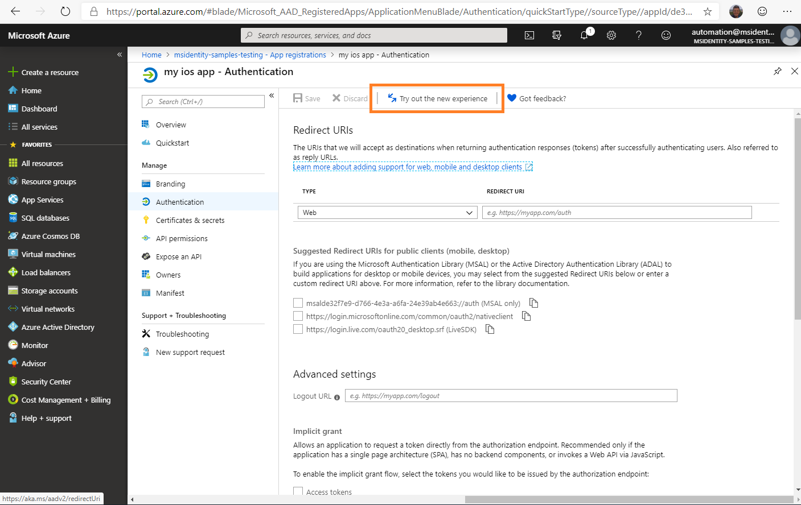
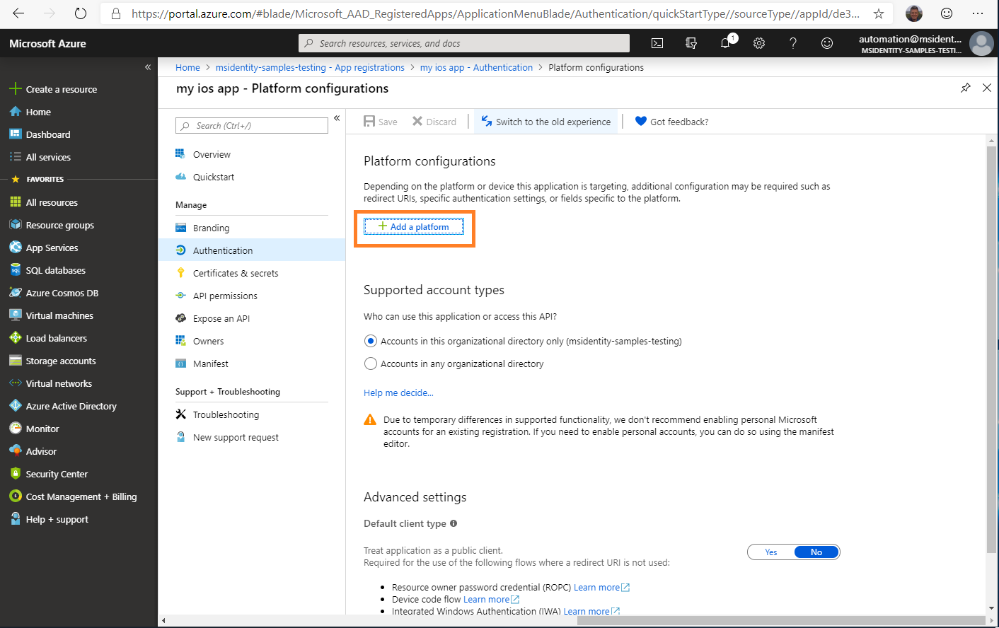
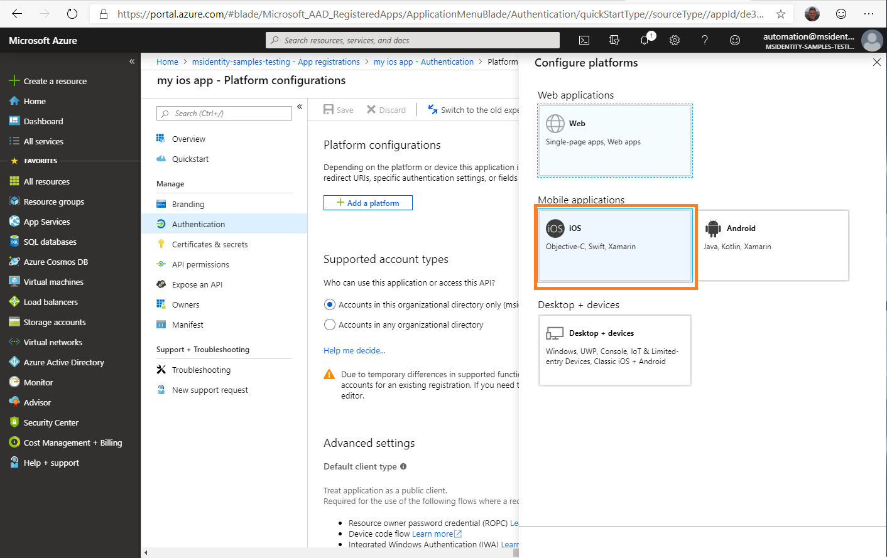
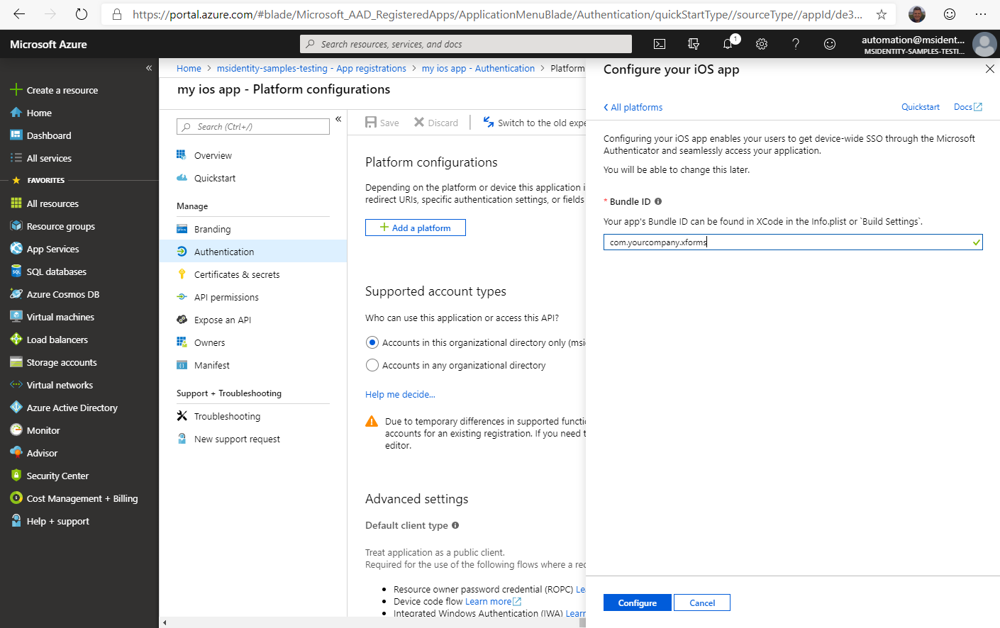
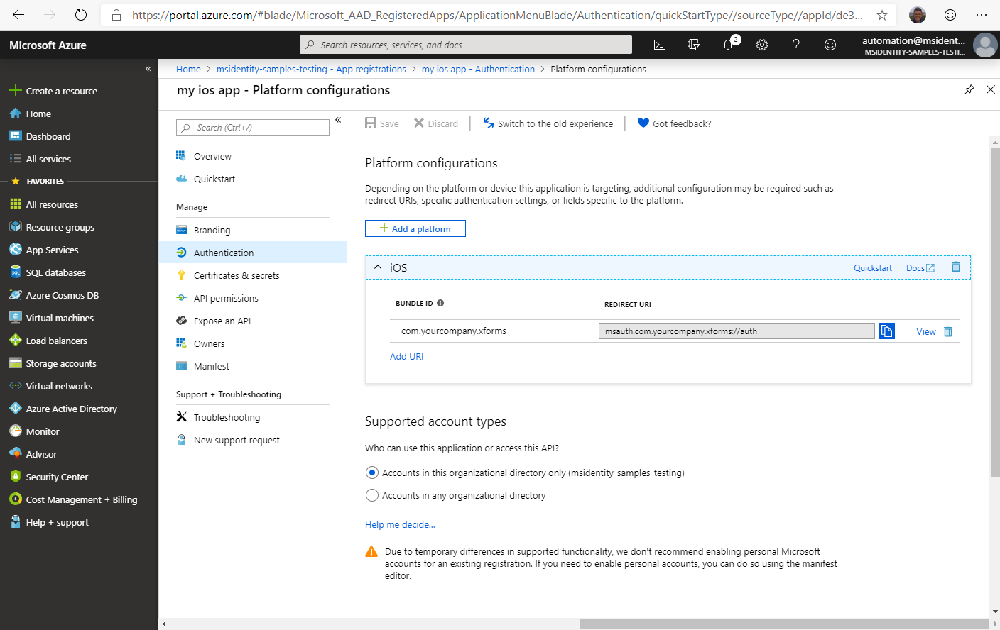

# Use Microsoft Authenticator or Intune Company Portal on Xamarin applications

On Android and iOS, brokers like Microsoft Authenticator and the Android-specific Microsoft Intune Company Portal enable:

- **Single sign-on (SSO)**: Users don't need to sign in to each application.
- **Device identification**: The broker accesses the device certificate. This certificate is created on the device when it's joined to the workplace.
- **Application identification verification**: When an application calls the broker, it passes its redirect URL. The broker verifies the URL.

To enable one of these features, use the `WithBroker()` parameter when you call the `PublicClientApplicationBuilder.CreateApplication` method. The `.WithBroker()` parameter is set to true by default. 

Also use the instructions in the following sections to set up brokered authentication for [iOS](#brokered-authentication-for-ios) applications or [Android](#brokered-authentication-for-android) applications.

## Brokered authentication for iOS

Use the following steps to enable your Xamarin.iOS app to talk with the [Microsoft Authenticator](https://itunes.apple.com/us/app/microsoft-authenticator/id983156458) app.

### Step 1: Enable broker support
You must enable broker support for individual instances of `PublicClientApplication`. Support is disabled by default. When you create `PublicClientApplication` through `PublicClientApplicationBuilder`, use the `WithBroker()` parameter as the following example shows. The `WithBroker()` parameter is set to true by default.

```csharp
var app = PublicClientApplicationBuilder
                .Create(ClientId)
                .WithBroker()
                .WithReplyUri(redirectUriOnIos) // $"msauth.{Bundle.Id}://auth" (see step 6 below)
                .Build();
```

### Step 2: Enable keychain access

To enable keychain access, you must have a keychain access group for your application. You can use the `WithIosKeychainSecurityGroup()` API to set your keychain access group when you create your application:

```csharp
var builder = PublicClientApplicationBuilder
     .Create(ClientId)
      
     .WithIosKeychainSecurityGroup("com.microsoft.adalcache")
     .Build();
```

For more information, see [Enable keychain access](msal-net-xamarin-ios-considerations.md#enable-keychain-access).

### Step 3: Update AppDelegate to handle the callback
When Microsoft Authentication Library for .NET (MSAL.NET) calls the broker, the broker calls back to your application through the `OpenUrl` method of the `AppDelegate` class. Because MSAL waits for the broker's response, your application needs to cooperate to call MSAL.NET back. To enable this cooperation, update the `AppDelegate.cs` file to override the following method.

```csharp
public override bool OpenUrl(UIApplication app, NSUrl url, 
                             string sourceApplication,
                             NSObject annotation)
{
    if (AuthenticationContinuationHelper.IsBrokerResponse(sourceApplication))
    {
      AuthenticationContinuationHelper.SetBrokerContinuationEventArgs(url);
      return true;
    }
    
    else if (!AuthenticationContinuationHelper.SetAuthenticationContinuationEventArgs(url))
    {                
         return false;                  
    }
    
    return true;     
}            
```

This method is invoked every time the application is started. It's used as an opportunity to process the response from the broker and complete the authentication process that MSAL.NET started.

### Step 4: Set UIViewController()
Still in the `AppDelegate.cs` file, you need to set an object window. Normally, for Xamarin iOS you don't need to set the object window. But you do need an object window to send and receive responses from the broker. 

To set up the object window: 
1. In the `AppDelegate.cs` file, set `App.RootViewController` to a new `UIViewController()`. This assignment ensures that the call to the broker includes `UIViewController`. If this setting is assigned incorrectly, you might get this error:

      `"uiviewcontroller_required_for_ios_broker":"UIViewController is null, so MSAL.NET cannot invoke the iOS broker. See https://aka.ms/msal-net-ios-broker"`

1. On the `AcquireTokenInteractive` call, use `.WithParentActivityOrWindow(App.RootViewController)` and then pass in the reference to the object window you'll use.

    In `App.cs`:

    ```csharp
       public static object RootViewController { get; set; }
    ```

    In `AppDelegate.cs`:

    ```csharp
       LoadApplication(new App());
       App.RootViewController = new UIViewController();
    ```

    In the `AcquireToken` call:

    ```csharp
    result = await app.AcquireTokenInteractive(scopes)
                 .WithParentActivityOrWindow(App.RootViewController)
                 .ExecuteAsync();
    ```

### Step 5: Register a URL scheme
MSAL.NET uses URLs to invoke the broker and then return the broker response to your app. To complete the round trip, register a URL scheme for your app in the `Info.plist` file.

The `CFBundleURLSchemes` name must include `msauth.` as a prefix. Follow the prefix with `CFBundleURLName`. 

In the URL scheme, `BundleId` uniquely identifies the app: `$"msauth.(BundleId)"`. So if `BundleId` is `com.yourcompany.xforms`, then the URL scheme is `msauth.com.yourcompany.xforms`.

> [!NOTE]
> This URL scheme becomes part of the redirect URI that uniquely identifies your app when it receives the response from the broker.

```XML
 <key>CFBundleURLTypes</key>
    <array>
      <dict>
        <key>CFBundleTypeRole</key>
        <string>Editor</string>
        <key>CFBundleURLName</key>
        <string>com.yourcompany.xforms</string>
        <key>CFBundleURLSchemes</key>
        <array>
          <string>msauth.com.yourcompany.xforms</string>
        </array>
      </dict>
    </array>
```

### Step 6: Add the broker identifier to the LSApplicationQueriesSchemes section

MSAL uses `–canOpenURL:` to check whether the broker is installed on the device. In iOS 9, Apple locked down the schemes that an application can query for. 

Add `msauthv2` to the `LSApplicationQueriesSchemes` section of the `Info.plist` file, as in the following example:

```XML
<key>LSApplicationQueriesSchemes</key>
    <array>
      <string>msauthv2</string>
      <string>msauthv3</string>
    </array>
```

### Step 7: Register your redirect URI in the application portal

When you use the broker, your redirect URI has an extra requirement. The redirect URI _must_ have the following format:

```csharp
$"msauth.{BundleId}://auth"
```

Here's an example:

```csharp
public static string redirectUriOnIos = "msauth.com.yourcompany.XForms://auth"; 
```

Notice that the redirect URI matches the `CFBundleURLSchemes` name that you included in the `Info.plist` file.

### Step 8: Make sure the redirect URI is registered with your app

The redirect URI needs to be registered on the [app registration portal](https://portal.azure.com) as a valid redirect URI for your application. 

The app registration portal provides a new experience to help you compute the brokered reply URI from the bundle ID. 

To compute the redirect URI:

1. In the app registration portal, choose **Authentication** > **Try out the new experience**.

   

1. Select **Add a platform**.

   

1. When the list of platforms is supported, select **iOS**.

   

1. Enter your bundle ID as requested, and then select **Configure**.

   

When you're done with the steps, the redirect URI is computed for you.



## Brokered authentication for Android

### Step 1: Enable broker support

Broker support is enabled on a per-PublicClientApplication basis. It's disabled by default. Use the `WithBroker()` parameter (set to true by default) when creating the `IPublicClientApplication` through the `PublicClientApplicationBuilder`.

```CSharp
var app = PublicClientApplicationBuilder
                .Create(ClientId)
                .WithBroker()
                .WithRedirectUri(redirectUriOnAndroid) //(see step 4 below)
                .Build();
```

### Step 2: Update AppDelegate to handle the callback

When MSAL.NET calls the broker, the broker will, in turn, call back to your application with the OnActivityResult() method. Since MSAL will wait for the response from the broker, your application needs to route the result to MSAL.NET.
This can be achieved by routing the result to the `SetAuthenticationContinuationEventArgs(int requestCode, Result resultCode, Intent data)` by overriding the OnActivityResult() method as shown below

```CSharp
protected override void OnActivityResult(int requestCode, Result resultCode, Intent data)
{
   base.OnActivityResult(requestCode, resultCode, data);
   AuthenticationContinuationHelper.SetAuthenticationContinuationEventArgs(requestCode, resultCode, data);
}
```

This method is invoked every time the broker application is launched and is used as an opportunity to process the response from the broker and complete the authentication process started by MSAL.NET.

### Step 3: Set an Activity

For brokered authentication to work you'll need to set an activity so that MSAL can send and receive the response from broker.

To do this, you'll need to provide the activity(usually the MainActivity) to the `WithParentActivityOrWindow(object parent)` as the parent object. 

**For example:**

In the Acquire Token call:

```CSharp
result = await app.AcquireTokenInteractive(scopes)
             .WithParentActivityOrWindow((Activity)context))
             .ExecuteAsync();
```

### Step 4: Register your RedirectUri in the application portal

MSAL uses URLs to invoke the broker and then return back to your app. To complete that round trip, you need to register a URL scheme for your app. This Redirect URI needs to be registered on the Azure AD app registration portal as a valid redirect URI for your application.


The redirect URI needed for your application is dependent on the certificate used to sign the APK.

```
Example: msauth://com.microsoft.xforms.testApp/hgbUYHVBYUTvuvT&Y6tr554365466=
```

The last part of the URI, `hgbUYHVBYUTvuvT&Y6tr554365466=`, is the signature that the APK is signed with, base64 encoded.
However, during the development phase of your application using Visual Studio, if you're debugging your code without signing the apk with a specific certificate, Visual Studio will sign the apk for you for debugging purposes, giving the APK a unique signature for the machine that it's built on. Thus, each time you build your app on a different machine, you'll need to update the redirect URI in the application's code and the application's registration in the Azure portal in order to authenticate with MSAL. 

While debugging, you may encounter an MSAL exception (or log message) stating the redirect URI provided is incorrect. **This exception will also provide you with the redirect URI that you should be using** with the current machine you are debugging on. You can use this redirect URI to continue developing for the time being.

Once you are ready to finalize your code, be sure to update the redirect URI in the code and on the application's registration in the Azure portal to use the signature of the certificate you will be signing the APK with.

In practice, this means that you have to register a redirect URI for each member of the team, plus a redirect URI for the production signed version of the APK.

You can also compute this signature yourself, similar to how MSAL does it: 

```CSharp
   private string GetRedirectUriForBroker()
   {
      string packageName = Application.Context.PackageName;
      string signatureDigest = this.GetCurrentSignatureForPackage(packageName);
      if (!string.IsNullOrEmpty(signatureDigest))
      {
            return string.Format(CultureInfo.InvariantCulture, "{0}://{1}/{2}", RedirectUriScheme,
               packageName.ToLowerInvariant(), signatureDigest);
      }

      return string.Empty;
   }

   private string GetCurrentSignatureForPackage(string packageName)
   {
            PackageInfo info = Application.Context.PackageManager.GetPackageInfo(packageName,
               PackageInfoFlags.Signatures);
            if (info != null && info.Signatures != null && info.Signatures.Count > 0)
            {
               // First available signature. Applications can be signed with multiple signatures.
               // The order of Signatures is not guaranteed.
               Signature signature = info.Signatures[0];
               MessageDigest md = MessageDigest.GetInstance("SHA");
               md.Update(signature.ToByteArray());
               return Convert.ToBase64String(md.Digest(), Base64FormattingOptions.None);
               // Server side needs to register all other tags. ADAL will
               // send one of them.
            }
   }
```

You also have the option of acquiring the signature for your package by using the keytool with the following commands:

For Windows: `keytool.exe -list -v -keystore "%LocalAppData%\Xamarin\Mono for Android\debug.keystore" -alias androiddebugkey -storepass android -keypass android`

For Mac: `keytool -exportcert -alias androiddebugkey -keystore ~/.android/debug.keystore | openssl sha1 -binary | openssl base64`

## Next steps

Learn about [Considerations for using Universal Windows Platform with MSAL.NET](msal-net-uwp-considerations.md).
