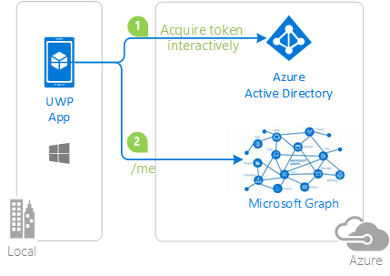

# Universal Windows Platform-specific considerations with MSAL.NET
On UWP, there are several considerations that you must take into account when using MSAL.NET.

## The UseCorporateNetwork property
In the WinRT platform, `PublicClientApplication` has the following boolean property ``UseCorporateNetwork``. This property enables Win8.1 and UWP applications to benefit from Integrated Windows Authentication (and therefore SSO with the user signed-in with the operating system) if the user is signed-in with an account in a federated Azure AD tenant. When you set this property, MSAL.NET leverages WAB (Web Authentication Broker).

> [!IMPORTANT]
> Setting this property to true assumes that the application developer has enabled Integrated Windows Authentication (IWA) in the application. For this:
> - In the ``Package.appxmanifest`` for your UWP application, in the **Capabilities** tab, enable the following capabilities:
> 	- Enterprise Authentication
> 	- Private Networks (Client & Server)
> 	- Shared User Certificate

IWA isn't enabled by default because applications requesting the Enterprise Authentication or Shared User Certificates capabilities require a higher level of verification to be accepted into the Windows Store, and not all developers may wish to perform the higher level of verification.

The underlying implementation on the UWP platform (WAB) doesn't work correctly in Enterprise scenarios where Conditional Access was enabled. The symptom is that the user tries to sign-in with Windows hello, and is proposed to choose a certificate, but:

- the certificate for the pin isn't found,
- or the user chooses it, but never get prompted for the Pin.

A workaround is to use an alternative method (username/password + phone authentication), but the experience isn't good.

## Troubleshooting

Some customers have reported that in some specific enterprise environments, there was the following sign-in error:

```Text
We can't connect to the service you need right now. Check your network connection or try this again later
```

whereas they know they have an internet connection, and that works with a public network.

A workaround is to make sure that WAB (the underlying Windows component) allows private network. You can do that by setting a registry key:

```Text
HKEY_LOCAL_MACHINE\SOFTWARE\Microsoft\Windows NT\CurrentVersion\Image File Execution Options\authhost.exe\EnablePrivateNetwork = 00000001
```

For details, see [Web authentication broker - Fiddler](https://docs.microsoft.com/windows/uwp/security/web-authentication-broker#fiddler).

## Next steps
More details are provided in the following samples:

Sample | Platform | Description 
|------ | -------- | -----------|
|[active-directory-dotnet-native-uwp-v2](https://github.com/azure-samples/active-directory-dotnet-native-uwp-v2) | UWP | A Universal Windows Platform client application using msal.net, accessing the Microsoft Graph for a user authenticating with Azure AD v2.0 endpoint. <br>|
|[https://github.com/Azure-Samples/active-directory-xamarin-native-v2](https://github.com/Azure-Samples/active-directory-xamarin-native-v2) | Xamarin iOS, Android, UWP | A simple Xamarin Forms app showcasing how to use MSAL to authenticate MSA and Azure AD via the AAD v2.0 endpoint, and access the Microsoft Graph with the resulting token. <br>|
