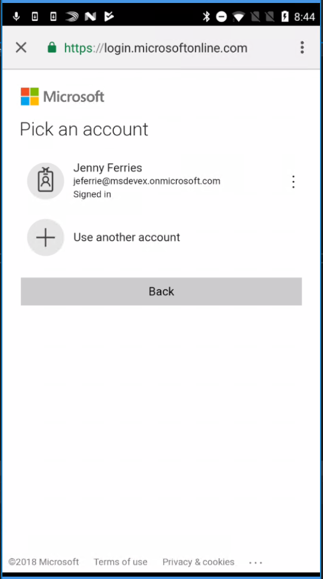

# Using web browsers (MSAL.NET)

Web browsers are required for interactive authentication. By default, MSAL.NET supports the [system web browser](#system-web-browser-on-xamarinios-xamarinandroid) on Xamarin.iOS and Xamarin.Android. But [you can also enable the Embedded Web browser](#enable-embedded-webviews-on-ios-and-android) depending on your requirements (UX, need for single sign-on (SSO), security)  in [Xamarin.iOS](#choosing-between-embedded-web-browser-or-system-browser-on-xamarinios) and [Xamarin.Android](#detecting-the-presence-of-custom-tabs-on-xamarinandroid) apps. And you can even [choose dynamically](#detecting-the-presence-of-custom-tabs-on-xamarinandroid) which web browser to use based on the presence of Chrome or a browser supporting Chrome custom tabs in Android. MSAL.NET only supports the system browser in .NET Core desktop applications.

## Web browsers in MSAL.NET

### Interaction happens in a Web browser

It's important to understand that when acquiring a token interactively, the content of the dialog box isn't provided by the library but by the STS (Security Token Service). The authentication endpoint sends back some HTML and JavaScript that controls the interaction, which is rendered in a web browser or web control. Allowing the STS to handle the HTML interaction has many advantages:

- The password (if one was typed) is never stored by the application, nor the authentication library.
- Enables redirections to other identity providers (for instance login-in with a work school account or a personal account with MSAL, or with a social account with Azure AD B2C).
- Lets the STS control Conditional Access, for example, by having the user do multiple factor authentication (MFA) during the authentication phase (entering a Windows Hello pin, or being called on their phone, or on an authentication app on their phone). In cases where the required multi factor authentication isn't set it up yet, the user can set it up just in time in the same dialog.  The user enters their mobile phone number and is guided to install an authentication application and scan a QR tag to add their account. This server driven interaction is a great experience!
- Lets the user change their password in this same dialog when the password has expired (providing additional fields for the old password and the new password).
- Enables branding of the tenant, or the application (images) controlled by the Azure AD tenant admin / application owner.
- Enables the users to consent to let the application access resources / scopes in their name just after the authentication.

### Embedded vs System Web UI

MSAL.NET is a multi-framework library and has framework-specific code to host a browser in a UI control (for example, on .Net Classic it uses WinForms, on Xamarin it uses native mobile controls etc.). This control is called `embedded` web UI. Alternatively, MSAL.NET is also able to kick off the system OS browser.

Generally, it's recommended that you use the platform default, and this is typically the system browser. The system browser is better at remembering the users that have logged in before. If you need to change this behavior, use `WithUseEmbeddedWebView(bool)`

### At a glance

| Framework        | Embedded | System | Default |
| ------------- |-------------| -----| ----- |
| .NET Classic     | Yes | Yes^ | Embedded |
| .NET Core     | No | Yes^ | System |
| .NET Standard | No | Yes^ | System |
| UWP | Yes | No | Embedded |
| Xamarin.Android | Yes | Yes  | System |
| Xamarin.iOS | Yes | Yes  | System |
| Xamarin.Mac| Yes | No | Embedded |

^ Requires "http://localhost" redirect URI

## System web browser on Xamarin.iOS, Xamarin.Android

By default, MSAL.NET supports the system web browser on Xamarin.iOS, Xamarin.Android, and .NET Core. For all the platforms that provide UI (that is, not .NET Core), a dialog is provided by the library embedding a Web browser control. MSAL.NET also uses an embedded web view for the .NET Desktop and WAB for the UWP platform. However, it leverages by default the **system web browser** for Xamarin iOS and Xamarin Android applications. On iOS, it even chooses the web view to use depending on the version of the Operating System (iOS12, iOS11, and earlier).

Using the system browser has the significant advantage of sharing the SSO state with other applications and with web applications without needing a broker (Company portal / Authenticator). The system browser was used, by default, in MSAL.NET for the Xamarin iOS and Xamarin Android platforms because, on these platforms, the system web browser occupies the whole screen, and the user experience is better. The system web view isn't distinguishable from a dialog. On iOS, though, the user might have to give consent for the browser to call back the application, which can be annoying.

## System browser experience on .NET Core

On .NET Core, MSAL.NET will start the system browser as a separate process. MSAL.NET doesn't have control over this browser, but once the user finishes authentication, the web page is redirected in such a way that MSAL.NET can intercept the Uri.

You can also configure apps written for .NET Classic to use this browser, by specifying

```csharp
await pca.AcquireTokenInteractive(s_scopes)
         .WithUseEmbeddedWebView(false)
```

MSAL.NET cannot detect if the user navigates away or simply closes the browser. Apps using this technique are encouraged to define a timeout (via `CancellationToken`). We recommend a timeout of at least a few minutes, to take into account cases where the user is prompted to change password or perform multi-factor-authentication.

### How to use the Default OS Browser

MSAL.NET needs to listen on `http://localhost:port` and intercept the code that AAD sends when the user is done authenticating (See [Authorization code](v2-oauth2-auth-code-flow.md) for details)

To enable the system browser:

1. During app registration, configure `http://localhost` as a redirect uri (not currently supported by B2C)
2. When you construct your PublicClientApplication, specify this redirect uri:

```csharp
IPublicClientApplication pca = PublicClientApplicationBuilder
                            .Create("<CLIENT_ID>")
                             // or use a known port if you wish "http://localhost:1234"
                            .WithRedirectUri("http://localhost")  
                            .Build();
```

> [!Note]
> If you configure `http://localhost`, internally MSAL.NET will find a random open port and use it.

### Linux and MAC

On Linux, MSAL.NET will open the default OS browser using the xdg-open tool. To troubleshoot, run the tool from a terminal for example, `xdg-open "https://www.bing.com"`  
On Mac, the browser is opened by invoking `open <url>`

### Customizing the experience

> [!NOTE]
> Customization is available in MSAL.NET 4.1.0 or later.

MSAL.NET is able to respond with an HTTP message when a token is received or in case of error. You can display an HTML message or redirect to an url of your choice:

```csharp
var options = new SystemWebViewOptions() 
{
    HtmlMessageError = "<p> An error occured: {0}. Details {1}</p>",
    BrowserRedirectSuccess = new Uri("https://www.microsoft.com");
}

await pca.AcquireTokenInteractive(s_scopes)
         .WithUseEmbeddedWebView(false)
         .WithSystemWebViewOptions(options)
         .ExecuteAsync();
```

### Opening a specific browser (Experimental)

You may customize the way MSAL.NET opens the browser. For example instead of using whatever browser is the default, you can force open a specific browser:

```csharp
var options = new SystemWebViewOptions() 
{
    OpenBrowserAsync = SystemWebViewOptions.OpenWithEdgeBrowserAsync
}
```

### UWP doesn't use the System Webview

For desktop applications, however, launching a System Webview leads to a subpar user experience, as the user sees the browser, where they might already have other tabs opened. And when authentication has happened, the users gets a page asking them to close this window. If the user doesn't pay attention, they can close the entire process (including other tabs, which are unrelated to the authentication). Leveraging the system browser on desktop would also require opening local ports and listening on them, which might require advanced permissions for the application. You, as a developer, user, or administrator, might be reluctant about this requirement.

## Enable embedded webviews on iOS and Android

You can also enable embedded webviews in Xamarin.iOS and Xamarin.Android apps. Starting with MSAL.NET 2.0.0-preview, MSAL.NET also supports using the **embedded** webview option. For ADAL.NET, embedded webview is the only option supported.

As a developer using MSAL.NET targeting Xamarin, you may choose to use either embedded webviews or system browsers. This is your choice depending on the user experience and security concerns you want to target.

Currently, MSAL.NET doesn't yet support the Android and iOS brokers. Therefore if you need to provide single sign-on (SSO), the system browser might still be a better option. Supporting brokers with the embedded web browser is on the MSAL.NET backlog.

### Differences between embedded webview and system browser
There are some visual differences between embedded webview and system browser in MSAL.NET.

**Interactive sign-in with MSAL.NET using the Embedded Webview:**


**Interactive sign-in with MSAL.NET using the System Browser:**



### Developer Options

As a developer using MSAL.NET, you have several options for displaying the interactive dialog from STS:

- **System browser.** The system browser is set by default in the library. If using Android, read [system browsers](msal-net-system-browser-android-considerations.md) for specific information about which browsers are supported for authentication. When using the system browser in Android, we recommend the device has a browser that supports Chrome custom tabs.  Otherwise, authentication may fail.
- **Embedded webview.** To use only embedded webview in MSAL.NET, the `AcquireTokenInteractively` parameters builder contains a `WithUseEmbeddedWebView()` method.

    iOS

    ```csharp
    AuthenticationResult authResult;
    authResult = app.AcquireTokenInteractively(scopes)
                    .WithUseEmbeddedWebView(useEmbeddedWebview)
                    .ExecuteAsync();
    ```

    Android:

    ```csharp
    authResult = app.AcquireTokenInteractively(scopes)
                .WithParentActivityOrWindow(activity)
                .WithUseEmbeddedWebView(useEmbeddedWebview)
                .ExecuteAsync();
    ```

#### Choosing between embedded web browser or system browser on Xamarin.iOS

In your iOS app, in `AppDelegate.cs` you can initialize the `ParentWindow` to `null`. It's not used in iOS

```csharp
App.ParentWindow = null; // no UI parent on iOS
```

#### Choosing between embedded web browser or system browser on Xamarin.Android

In your Android app, in `MainActivity.cs` you can set the parent activity, so that the authentication result gets back to it:

```csharp
 App.ParentWindow = this;
```

Then in the `MainPage.xaml.cs`:

```csharp
authResult = await App.PCA.AcquireTokenInteractive(App.Scopes)
                      .WithParentActivityOrWindow(App.ParentWindow)
                      .WithUseEmbeddedWebView(true)
                      .ExecuteAsync();
```

#### Detecting the presence of custom tabs on Xamarin.Android

If you want to use the system web browser to enable SSO with the apps running in the browser, but are worried about the user experience for Android devices not having a browser with custom tab support, you have the option to decide by calling the `IsSystemWebViewAvailable()` method in `IPublicClientApplication`. This method returns `true` if the PackageManager detects custom tabs and `false` if they aren't detected on the device.

Based on the value returned by this method, and your requirements, you can make a decision:

- You can return a custom error message to the user. For example: "Please install Chrome to continue with authentication" -OR-
- You can fall back to the embedded webview option and launch the UI as an embedded webview.

The code below shows the embedded webview option:

```csharp
bool useSystemBrowser = app.IsSystemWebviewAvailable();

authResult = await App.PCA.AcquireTokenInteractive(App.Scopes)
                      .WithParentActivityOrWindow(App.ParentWindow)
                      .WithUseEmbeddedWebView(!useSystemBrowser)
                      .ExecuteAsync();
```

#### .NET Core doesn't support interactive authentication with an embedded browser

For .NET Core, acquisition of tokens interactively is only available through the system web browser, not with embedded web views. Indeed, .NET Core doesn't provide UI yet.
If you want to customize the browsing experience with the system web browser, you can implement the [IWithCustomUI](scenario-desktop-acquire-token.md#withcustomwebui) interface and even provide your own browser.
