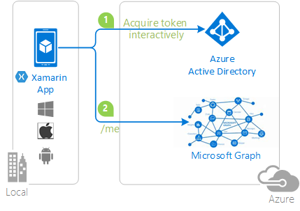

# Xamarin iOS-specific considerations with MSAL.NET
On Xamarin iOS, there are several considerations that you must take into account when using MSAL.NET

- [Known issues with iOS 12 and authentication](#known-issues-with-ios-12-and-authentication)
- [Override and implement the `OpenUrl` function in the `AppDelegate`](#implement-openurl)
- [Enable Keychain groups](#enable-keychain-groups)
- [Enable token cache sharing](#enable-token-cache-sharing-across-ios-applications)
- [Enable Keychain access](#enable-keychain-access)

## Known issues with iOS 12 and authentication
Microsoft has released a [security advisory](https://github.com/aspnet/AspNetCore/issues/4647) to provide information about an incompatibility between iOS12 and some types of authentication. The incompatibility breaks social, WSFed and OIDC logins. This advisory also provides guidance on what developers can do to remove current security restrictions added by ASP.NET to their applications to become compatible with iOS12.  

When developing MSAL.NET applications on Xamarin iOS, you may see an infinite loop when trying to sign in to websites from iOS 12 (similiar to this [ADAL issue](https://github.com/AzureAD/azure-activedirectory-library-for-dotnet/issues/1329). 

You might also see a break in ASP.NET Core OIDC authentication with iOS 12 Safari as described in this [WebKit issue](https://bugs.webkit.org/show_bug.cgi?id=188165).

## Implement OpenUrl

First you need to override the `OpenUrl` method of the `FormsApplicationDelegate` derived class and call `AuthenticationContinuationHelper.SetAuthenticationContinuationEventArgs`.

```csharp
public override bool OpenUrl(UIApplication app, NSUrl url, NSDictionary options)
{
    AuthenticationContinuationHelper.SetAuthenticationContinuationEventArgs(url);
    return true;
}
```

You also need to define a URL scheme, require permissions for your app to call another app, have a specific form for the redirect URL, and register this redirect URL in the [Azure portal](https://portal.azure.com).

## Enable KeyChain Groups

In order to make the token cache work and have the `AcquireTokenSilentAsync` method work, multiple steps must be followed:
1. Enable keychain access in your *`*Entitlements.plist* file and specify the **Keychain Groups** in your bundle identifier.
2. Select *`*Entitlements.plist*`* file in the **Custom Entitlements** field in the iOS project options window's **Bundle Signing View**.
3. When signing a certificate, make sure XCode uses the same Apple ID.

## Enable token cache sharing across iOS applications

Starting in MSAL 2.x, you can specify a keychain security group to use for persisting the token cache across multiple applications. This enables you to share the token cache between several applications having the same keychain security group including those developed with [ADAL.NET](https://aka.ms/adal-net), MSAL.NET Xamarin.iOS applications, and native iOS applications developed with [ADAL.objc](https://github.com/AzureAD/azure-activedirectory-library-for-objc) or [MSAL.objc](https://github.com/AzureAD/microsoft-authentication-library-for-objc)).

Sharing the token cache allows single sign-on (SSO) between all of the applications that use the same keychain security group.

To enable single sign-on, you need to set the `PublicClientApplication.iOSKeychainSecurityGroup` property to the same value in all of the applications.

An example of this using MSAL v3.x would be:
```csharp
var builder = PublicClientApplicationBuilder
     .Create(ClientId)
     .WithIosKeychainSecurityGroup("com.microsoft.msalrocks")
     .Build();
```

An example of this using MSAL v2.7.x would be:

```csharp
PublicClientApplication.iOSKeychainSecurityGroup = "com.microsoft.msalrocks";
```

> [!NOTE]
> The `KeychainSecurityGroup` property has been deprecated. Previously, in MSAL 2.x, developers were forced to include the TeamId prefix when using the `KeychainSecurityGroup` property. 
> 
> Now, starting in MSAL 2.7.x, MSAL will resolve the TeamId prefix during runtime when using the `iOSKeychainSecurityGroup` property. When using this property, the value should not contain the TeamId prefix. 
> 
> Use the new `iOSKeychainSecurityGroup` property, which does not require developers to provide the TeamId. The `KeychainSecurityGroup` property is now obsolete. 

## Enable keychain access

In MSAL 2.x and ADAL 4.x, the TeamId is used to access the keychain, which enables the authentication libraries to provide single sign-on (SSO) between applications of the same publisher. 

What is the [TeamIdentifierPrefix](/xamarin/ios/deploy-test/provisioning/entitlements?tabs=vsmac) (TeamId)? It is a unique identifier (company or personal) in the App Store. The AppId is unique for an app. If you have more than one app, the TeamId for all the apps will be the same, but the AppId will be different. The keychain access group is prefixed by TeamId automatically for each group by the system. It's how the OS enforces that apps from the same publisher can access the shared keychain. 

When initializing the `PublicClientApplication`, if you receive an `MsalClientException` with the message: `TeamId returned null from the iOS keychain...`, you will need to do the following in the iOS Xamarin app:

1. In VS, under Debug tab, go to  nameOfMyApp.iOS Properties...
2. Then go to iOS Bundle Signing 
3. Under Custom Entitlements, click the ... and select the Entitlements.plist file from your app
4. In the csproj file of the iOS app, you should have this line now included:
`<CodesignEntitlements>Entitlements.plist</CodesignEntitlements>`
5. **Rebuild** the project.

This is *in addition* to enabling keychain access in the `Entitlements.plist` file, using either the below access group or your own:

```xml
<?xml version="1.0" encoding="UTF-8" ?>
<!DOCTYPE plist PUBLIC "-//Apple//DTD PLIST 1.0//EN" "https://www.apple.com/DTDs/PropertyList-1.0.dtd">
<plist version="1.0">
<dict>
  <key>keychain-access-groups</key>
  <array>
    <string>$(AppIdentifierPrefix)com.microsoft.adalcache</string>
  </array>
</dict>
</plist>
```

## Next steps

More details are provided in the [iOS Specific Considerations](https://github.com/azure-samples/active-directory-xamarin-native-v2#ios-specific-considerations) paragraph of the following sample's readme.md file:

Sample | Platform | Description 
------ | -------- | -----------
[https://github.com/Azure-Samples/active-directory-xamarin-native-v2](https://github.com/azure-samples/active-directory-xamarin-native-v2) | Xamarin iOS, Android, UWP | A simple Xamarin Forms app showcasing how to use MSAL to authenticate MSA and Azure AD via the AAD V2.0 endpoint, and access the Microsoft Graph with the resulting token. <br>