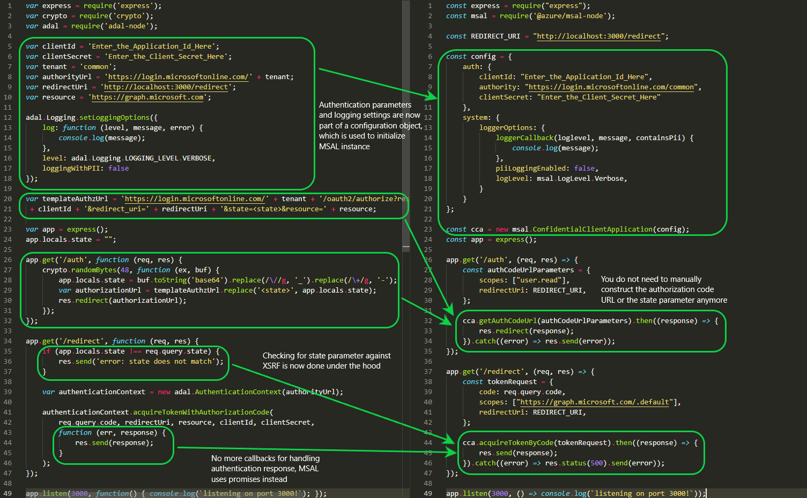

# Migrating applications to MSAL Node

Many developers have built and deployed applications using the [Active Directory Authentication Library](https://github.com/AzureAD/azure-activedirectory-library-for-nodejs) (ADAL Node). We now recommend using the [Microsoft Authentication Library](https://github.com/AzureAD/microsoft-authentication-library-for-js/tree/dev/lib/msal-node) (MSAL Node). By using MSAL instead of ADAL:

- You can authenticate a broader set of identities:
  - Azure AD identities (i.e. work and school accounts)
  - personal Microsoft accounts
  - Social and local accounts by using [Azure AD B2C](https://docs.microsoft.com/azure/active-directory-b2c/overview)
- Your users will get the best single-sign-on experience.
- Your application can enable incremental consent.
- Supporting [Conditional Access](https://docs.microsoft.com/azure/active-directory/develop/v2-conditional-access-dev-guide) is easier.
- You benefit from innovation. Because all Microsoft development efforts are now focused on MSAL, no new features will be implemented in ADAL.

## Differences between ADAL and MSAL apps

This section outlines the differences between ADAL Node and MSAL Node. You will first see the full code for a web application secured with ADAL Node and then the same application with MSAL Node. After the comparison, aspects of the code will be discussed in depth.

### Code Comparison

The snippet below demonstrates a confidential client web app in Express.js framework. The web app performs a sign-in when a user hits the authentication route `/auth`, acquires an access token for Microsoft Graph via the `/redirect` route and then displays the said token.



### Initialization

In ADAL Node, you initialize an `AuthenticationContext` object, which then exposes the methods you can use in different authentication grants/flows (e.g. `acquireTokenWithAuthorizationCode` for web apps). When initializing, the only mandatory parameter is the **authority URI**:

```javascript
var adal = require('adal-node');

var authorityURI = "https://login.microsoftonline.com/common";
var authenticationContex = new adal.AuthenticationContext(authorityURI);
```

In MSAL Node, you have two alternatives instead: If you are building a mobile app or a desktop app, you instantiate a `PublicClientApplication` object. The constructor expects a [configuration object](#configuration-options) that contains the `clientId` parameter at the very least. MSAL defaults the authority URI to `https://login.microsoftonline.com/common` if you do not specify it.

```javascript
const msal = require('@azure/msal-node');

const pca = new msal.PublicClientApplication({
        auth: {
            clientId = "YOUR_CLIENT_ID"
        }
    });
```

On the other hand, if you are building a web app or a daemon app, you instantiate a `ConfidentialClientApplication` object. With such apps you also need to supply a *client credential*, such as a client secret:

```javascript
const msal = require('@azure/msal-node');

const cca = new msal.ConfidentialClientApplication({
        auth: {
            clientId = "YOUR_CLIENT_ID",
            clientSecret = "YOUR_CLIENT_SECRET"
        }
    });
```

Both `PublicClientApplication` and `ConfidentialClientApplication`, unlike ADAL's `AuthenticationContext`, is bind to a client ID. This means that if you have different client IDs that you like to use in your application, you need to instantiate a new MSAL instance for each. See for more: [Initialization of MSAL Node](https://github.com/AzureAD/microsoft-authentication-library-for-js/blob/dev/lib/msal-node/docs/initialize-confidential-client-application.md)

### Configuration options

When building apps on Microsoft identity platform, your app will contain many parameters related to authentication. In ADAL Node, the `AuthenticationContext` object has a limited number of configuration parameters that you can instantiate it with, while the remaining parameters hang freely in your code (e.g. *clientSecret*):

```javascript
var adal = require('adal-node');

var authority = "https://login.microsoftonline.com/YOUR_TENANT_ID"
var validateAuthority = true,
var cache = null;

var authenticationContex = new adal.AuthenticationContext(authority, validateAuthority, cache);
```

- `authority`: URL that identifies a token authority
- `validateAuthority`: a feature that prevents your code from requesting tokens from a potentially malicious authority
- `cache`: sets the token cache used by this AuthenticationContext instance.  If this parameter is not set, then a default, in memory cache is used

MSAL Node on the other hand uses a configuration object of type [Configuration](https://azuread.github.io/microsoft-authentication-library-for-js/ref/modules/_azure_msal_node.html#configuration). It contains the following fields:

```javascript
const msal = require('@azure/msal-node');

const msalConfig = {
    auth: {
        clientId: "YOUR_CLIENT_ID",
        authority: "https://login.microsoftonline.com/YOUR_TENANT_ID",
        clientSecret: "YOUR_TENANT_ID",
        knownAuthorities: [], 
    },
    cache: {
        // your implementation of caching
    },
    system: {
        loggerOptions: { /** logging related options */ }
    }
}


const cca = new msal.ConfidentialClientApplication(msalConfig);
```

As a notable difference, MSAL does not have a flag to disable authority validation and authorities are always validated. MSAL now compares your requested authority against a list of authorities known to Microsoft or a list of authorities you've specified in your configuration. See for more: [Configuration Options](https://github.com/AzureAD/microsoft-authentication-library-for-js/blob/dev/lib/msal-node/docs/configuration.md)

### Logging in MSAL Node

In ADAL Node, you configure logging separately at any place in your code:

```javascript
var adal = require('adal-node');

//PII or OII logging disabled. Default Logger does not capture any PII or OII.
adal.logging.setLoggingOptions({
  log: function (level, message, error) {
    console.log(message);

    if (error) {
      console.log(error);
    }
  },
  level: logging.LOGGING_LEVEL.VERBOSE, // provide the logging level
  loggingWithPII: false  // Determine if you want to log personal identification information. The default value is false.
});
```

In MSAL Node, logging is part of the configuration options and is created with the initialization of the MSAL Node instance:

```javascript
const msal = require('@azure/msal-node');

const msalConfig = {
    auth: {
        // authentication related parameters
    },
    cache: {
        // cache related parameters
    },
    system: {
        loggerOptions: {
            loggerCallback(loglevel, message, containsPii) {
                console.log(message);
            },
            piiLoggingEnabled: false,
            logLevel: msal.LogLevel.Verbose,
        }
    }
}

const cca = new msal.ConfidentialClientApplication(msalConfig);
```

### Caching in MSAL Node

In ADAL Node, you had the option of importing an in-memory token cache. The token cache is used as a parameter when initializing an `AuthenticationContext` object:

```javascript
var MemoryCache = require('adal-node/lib/memory-cache');

var cache = new MemoryCache();
var authorityURI = "https://login.microsoftonline.com/common";

var context = new AuthenticationContext(authorityURI, true, cache);
```

MSAL Node uses an in-memory token cache by default. You do not need to explicitly import it; it is exposed as part of the `ConfidentialClientApplication` and `PublicClientApplication` objects.

```javascript
const msalTokenCache = publicClientApplication.getTokenCache();
```

You can also write your cache to disk by providing your own **cache plugin**. The cache plugin must implement the interface [ICachePlugin](https://azuread.github.io/microsoft-authentication-library-for-js/ref/interfaces/_azure_msal_common.icacheplugin.html). Like logging, caching is part of the configuration options and is created with the initialization of the MSAL Node instance:

```javascript
const msal = require('@azure/msal-node');

const msalConfig = {
    auth: {
        // authentication related parameters 
    },
    cache: {
        cachePlugin // your implementation of cache plugin
    },
    system: {
        // logging related options 
    }
}

const msalInstance = new ConfidentialClientApplication(msalConfig);
```

An example cache plugin can be implemented as below:

```javascript
const fs = require('fs');

// Call back APIs which automatically write and read into a .json file - example implementation
const beforeCacheAccess = async (cacheContext) => {
    cacheContext.tokenCache.deserialize(await fs.readFile(cachePath, "utf-8"));
};

const afterCacheAccess = async (cacheContext) => {
    if(cacheContext.cacheHasChanged){
        await fs.writeFile(cachePath, cacheContext.tokenCache.serialize());
    }
};

// Cache Plugin
const cachePlugin = {
    beforeCacheAccess,
    afterCacheAccess
};
```

If you are developing [public client applications](https://docs.microsoft.com/azure/active-directory/develop/msal-client-applications) like desktop apps, the [Microsoft Authentication Extensions for Node](https://github.com/AzureAD/microsoft-authentication-library-for-js/tree/dev/extensions/msal-node-extensions) offers secure mechanisms for client applications to perform cross-platform token cache serialization and persistence. Supported platforms are Windows, Mac and Linux.

> [!NOTE]
> This is not recommended for web applications, as it may lead to scale and performance issues. Web apps are recommended to persist the cache in session.

### Public API

Most of the public methods in ADAL Node have equivalents in MSAL Node:

| ADAL                                | MSAL                              | Notes                             |
|-------------------------------------|-----------------------------------|-----------------------------------|
| `acquireToken`                      | `acquireTokenSilent`              | Renamed and now expects an [account](https://azuread.github.io/microsoft-authentication-library-for-js/ref/modules/_azure_msal_common.html#accountinfo) object |
| `acquireTokenWithAuthorizationCode` | `acquireByAuthorizationCode`      |                                   |
| `acquireTokenWithClientCredentials` | `acquireTokenByClientCredentials` |                                   |
| `acquireTokenWithRefreshToken`      | `acquireTokenByRefreshToken`      |                                   |
| `acquireTokenWithDeviceCode`        | `acquireTokenByDeviceCode`        | Now abstracts user code acquisition (see below) |
| `acquireTokenWithUsernamePassword`  | `acquireTokenByUsernamePassword`  |                                   |

However, some methods in ADAL Node are deprecated, while MSAL Node offers new methods:

| ADAL                              | MSAL                            | Notes                             |
|-----------------------------------|---------------------------------|-----------------------------------|
| `acquireUserCode`                   | N/A                             | Merged with `acquireTokeByDeviceCode` (see above)|
| N/A                               | `acquireTokenOnBehalfOf`          | A new method that abstracts [OBO flow](https://docs.microsoft.com/azure/active-directory/develop/v2-oauth2-on-behalf-of-flow) |
| `acquireTokenWithClientCertificate` | N/A                             | No longer needed as certificates are assigned during initialization now (see [configuration options](#configuration-options)) |
| N/A                               | `getAuthCodeUrl`                  | A new method that abstracts [authorize endpoint](https://docs.microsoft.com/azure/active-directory/develop/active-directory-v2-protocols#endpoints) URL construction |

### Other notable differences

#### Promises, not callbacks

In ADAL Node, callbacks are used for any operation after the authentication succeeds and a response is obtained:

```javascript
var context = new AuthenticationContext(authorityUrl, validateAuthority);

context.acquireTokenWithClientCredentials(resource, clientId, clientSecret, function(err, response) {
  if (err) {
    console.log(err);
  } else {
    // do something with the authentication response
  }
});
```

In MSAL Node, promises are used instead:

```javascript
    const cca = new msal.ConfidentialClientApplication(msalConfig);

    cca.acquireTokenByClientCredentials(tokenRequest).then((response) => {
        // do something with the authentication response
    }).catch((error) => {
        console.log(error);
    });
```

You can also use the **async/await** syntax that comes with ES8:

```javascript
    try {
        const authResponse = await cca.acquireTokenByCode(tokenRequest);
    } catch (error) {
        console.log(error);
    }
```

#### Making use of refresh tokens

In ADAL Node, the refresh tokens (RT) were exposed allowing you to develop solutions around the use of these tokens by caching them and using the `acquireTokenWithRefreshToken` method. Typical scenarios where RTs are especially relevant:

* Long running services that do actions including refreshing dashboards on behalf of the users where the users are no longer connected.
* WebFarm scenarios for enabling the client to bring the RT to the web service (caching is done client side, encrypted cookie, and not server side).

MSAL Node does not expose refresh tokens for security reasons. Instead, MSAL handles refreshing tokens for you. As such, you no longer need to built logic for this. Still, if you need to migrate and make use of your previously acquired refresh tokens, MSAL Node offers `acquireTokenByRefreshToken`, which is equivalent to ADAL Node's `acquireTokenWithRefreshToken` method.

#### Proof Key for Code Exchange support

MSAL Node supports authorization code grant with [Proof Key for Code Exchange (PKCE)](https://oauth.net/2/pkce/), which provides enhanced security to [public client applications](https://docs.microsoft.com/azure/active-directory/develop/msal-client-applications) such as desktop apps. MSAL Node offers PKCE generation tools through the [CryptoProvider](https://azuread.github.io/microsoft-authentication-library-for-js/ref/classes/_azure_msal_node.cryptoprovider.html) class, which exposes the `generatePkceCodes` asynchronous method.

```javascript
// Create msal application object
const pca = new msal.PublicClientApplication(config);

app.locals.pkceCodes = {
    challengeMethod: "S256", // Use SHA256 Algorithm
    verifier: "", // Generate a code verifier for the Auth Code Request first
    challenge: "" // Generate a code challenge from the previously generated code verifier
};

app.get('/', (req, res) => {
    // Initialize CryptoProvider instance
    const cryptoProvider = new msal.CryptoProvider();
    // Generate PKCE Codes before starting the authorization flow
    cryptoProvider.generatePkceCodes().then(({ verifier, challenge }) => {
        // Set generated PKCE Codes as app variables
        app.locals.pkceCodes.verifier = verifier;
        app.locals.pkceCodes.challenge = challenge;

        // Add PKCE code challenge and challenge method to authCodeUrl request object
        const authCodeUrlParameters = {
            scopes: ["user.read"],
            redirectUri: "http://localhost:3000/redirect",
            codeChallenge: app.locals.pkceCodes.challenge, // PKCE Code Challenge
            codeChallengeMethod: app.locals.pkceCodes.challengeMethod // PKCE Code Challenge Method
        };
    
        // Get url to sign user in and consent to scopes needed for application
        pca.getAuthCodeUrl(authCodeUrlParameters).then((response) => {
            res.redirect(response);
        }).catch((error) => console.log(JSON.stringify(error)));
    });
});

app.get('/redirect', (req, res) => {
    // Add PKCE code verifier to token request object
    const tokenRequest = {
        code: req.query.code,
        scopes: ["user.read"],
        redirectUri: "http://localhost:3000/redirect",
        codeVerifier: app.locals.pkceCodes.verifier // PKCE Code Verifier
    };

    pca.acquireTokenByCode(tokenRequest).then((response) => {
        res.send(response);
    }).catch((error) => {
        res.send(error);
    });
});
```

#### New behavior for the "common" authority

In v1.0, if you use the `https://login.microsoftonline.com/common` authority, you will allow users to sign in with any AAD account (for any organization). 

If you use the `https://login.microsoftonline.com/common` authority in v2.0, you will allow users to sign in with any AAD organization or a personal Microsoft account (MSA). In MSAL Node, if you want to restrict login to any AAD account (same behavior as with ADAL Node), use `https://login.microsoftonline.com/organizations`.

#### v1.0 vs. v2.0 resources

When working with ADAL Node, you were likely using the **Azure AD v1.0 endpoint**. An important difference between v1.0 vs. v2.0 endpoints is about how the resources are accessed. In ADAL Node, you would first register a permission on app registration portal, and then request an access token for a resource as shown below:

```javascript
  authenticationContext.acquireTokenWithAuthorizationCode(
    req.query.code,
    redirectUri,
    resource, // e.g. 'https://graph.microsoft.com'
    clientId,
    clientSecret,
    function (err, response) {
      // do something with the authentication response
  );
```

MSAL Node supports both **v1.0** and **v2.0** endpoints. The v2.0 endpoint employs a scope-centric model to access resources. Thus when you request an access token for a resource, you also need to specify the scope for that resource:

```javascript
    const tokenRequest = {
        code: req.query.code,
        scopes: ["https://graph.microsoft.com/User.Read"],
        redirectUri: REDIRECT_URI,
    };

    pca.acquireTokenByCode(tokenRequest).then((response) => {
        // do something with the authentication response
    }).catch((error) => {
        console.log(error);
    });
```

One advantage of the scope-centric model is the ability to use *dynamic scopes*. When building applications using v1.0, you needed to register the full set of permissions (called *static scopes*) required by the application for the user to consent to at the time of login. In v2.0, you can use the scope parameter to request the permissions at the time you want them (hence, *dynamic scopes*). This allows the user to provide **incremental consent** to scopes. So if at the beginning you just want the user to sign in to your application and you don’t need any kind of access, you can do so. If later you need the ability to read the calendar of the user, you can then request the calendar scope in the acquireToken methods and get the user's consent. See for more: [Resources and scopes](https://github.com/AzureAD/microsoft-authentication-library-for-js/blob/dev/lib/msal-browser/docs/resources-and-scopes.md)

#### v1.0 vs. v2.0 tokens

There are two versions of tokens:

- v1.0 tokens
- v2.0 tokens

The v1.0 endpoint (used by ADAL) only emits v1.0 tokens.

However, the v2.0 endpoint emits the version of the token that the web API accepts. A property of the application manifest of the web API enables developers to choose which version of token is accepted. See `accessTokenAcceptedVersion` in the [Application manifest](reference-app-manifest.md) reference documentation.

For more information about v1.0 and v2.0 tokens, see [Azure Active Directory access tokens](access-tokens.md).

## More Information

- [Why update to Microsoft identity platform (v2.0)?](https://docs.microsoft.com/azure/active-directory/azuread-dev/azure-ad-endpoint-comparison)
- [Migrate applications to the Microsoft Authentication Library (MSAL)](https://docs.microsoft.com/azure/active-directory/develop/msal-migration)
- [Scopes, permissions, and consent in the Microsoft identity platform](https://docs.microsoft.com/azure/active-directory/develop/v2-permissions-and-consent)
- [MSAL Node API reference](https://azuread.github.io/microsoft-authentication-library-for-js/ref/modules/_azure_msal_node.html)
- [MSAL Node Code samples](https://github.com/AzureAD/microsoft-authentication-library-for-js/tree/dev/samples/msal-node-samples/standalone-samples)
