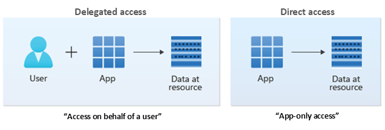

# Introduction to permissions and consent

To *access* a protected resource like email or calendar data, your application needs the resource owner's *authorization*. The resource owner can *consent* to or deny your app's request. Understanding these foundational concepts will help you build more secure and trustworthy applications that request only the access they need, when they need it, from users and administrators.

## Access scenarios

As an application developer, you must identify how your application will access data. The application can use delegated access, acting on behalf of a signed-in user, or app-only access, acting only as the application's own identity.

### Delegated access (access on behalf of a user)

In this access scenario, a user has signed into a client application. The client application accesses the resource on behalf of the user. Delegated access requires delegated permissions. Both the client and the user must be authorized separately to make the request. For more information about the delegated access scenario, see [delegated access scenario](delegated-access-primer.md).

For the client app, the correct delegated permissions must be granted. Delegated permissions can also be referred to as scopes. Scopes are permissions for a given resource that represent what a client application can access on behalf of the user. For more information about scopes, see [scopes and permissions](scopes-oidc.md).

For the user, the authorization relies on the privileges that the user has been granted for them to access the resource. For example, the user could be authorized to access directory resources by [Microsoft Entra role-based access control (RBAC)](../roles/custom-overview.md) or to access mail and calendar resources by Exchange Online RBAC. For more information on RBAC for applications, see [RBAC for applications](custom-rbac-for-developers.md).

### App-only access (Access without a user)

In this access scenario, the application acts on its own with no user signed in. Application access is used in scenarios such as automation, and backup. This scenario includes apps that run as background services or daemons. It's appropriate when it's undesirable to have a specific user signed in, or when the data required can't be scoped to a single user. For more information about the app-only access scenario, see [App-only-access](app-only-access-primer.md).

App-only access uses app roles instead of delegated scopes. When granted through consent, app roles may also be called applications permissions. For app-only access, the client app must be granted appropriate app roles of the resource app it's calling in order to access the requested data. For more information about assigning app roles to client applications, see [Assigning app roles to applications](./howto-add-app-roles-in-apps.md#assign-app-roles-to-applications).

## Types of permissions

**Delegated permissions** are used in the delegated access scenario. They're permissions that allow the application to act on a user's behalf. The application will never be able to access anything the signed in user themselves couldn't access.

For example, imagine an application that has been granted the Files.Read.All delegated permission on behalf of Tom, the user. The application will only be able to read files that Tom can personally access.

**Application permissions**, sometimes called app roles are used in the app-only access scenario, without a signed-in user present. The application will be able to access any data that the permission is associated with. For example, an application granted the Files.Read.All application permission will be able to read any file in the tenant.  Only an administrator or owner of the service principal can consent to application permissions.

There are other ways in which applications can be granted authorization for app-only access. For example, an application can be assigned a Microsoft Entra RBAC role.

### Comparison of delegated and application permissions

| Permission types | Delegated permissions | Application permissions |
|--|--|--|
| Types of apps | Web / Mobile / single-page app (SPA) | Web / Daemon |
| Access context | Get access on behalf of a user | Get access without a user |
| Who can consent | - Users can consent for their data   - Admins can consent for all users | Only admin can consent |
| Consent methods | - Static: configured list on app registration   - Dynamic: request individual permissions at login | - Static ONLY: configured list on app registration |
| Other names | - Scopes   - OAuth2 permission scopes | - App roles   - App-only permissions |
| Result of consent (specific to Microsoft Graph)  | [oAuth2PermissionGrant](/graph/api/resources/oauth2permissiongrant) | [appRoleAssignment](/graph/api/resources/approleassignment) |

## Consent

One way that applications are granted permissions is through consent. Consent is a process where users or admins authorize an application to access a protected resource. For example, when a user attempts to sign into an application for the first time, the application can request permission to see the user's profile and read the contents of the user's mailbox. The user sees the list of permissions the app is requesting through a consent prompt. Other scenarios where users may see a consent prompt include:

- When previously granted consent is revoked.
- When the application is coded to specifically prompt for consent during sign-in.
- When the application uses dynamic consent to ask for new permissions as needed at run time. 

The key details of a consent prompt are the list of permissions the application requires and the publisher information. For more information about the consent prompt and the consent experience for both admins and end-users, see [application consent experience](application-consent-experience.md).

### User consent

User consent happens when a user attempts to sign into an application. The user provides their sign-in credentials. These credentials are checked to determine whether consent has already been granted. If no previous record of user or admin consent for the required permissions exists, the user is shown a consent prompt, and asked to grant the application the requested permissions. In many cases, an admin may be required to grant consent on behalf of the user.

### Administrator consent

Depending on the permissions they require, some applications might require an administrator to be the one who grants consent. For example, application permissions and many high-privilege delegated permissions can only be consented to by an administrator. Administrators can grant consent for themselves or for the entire organization. For more information about user and admin consent, see [user and admin consent overview](../manage-apps/user-admin-consent-overview.md).

### Preauthorization

Preauthorization allows a resource application owner to grant permissions without requiring users to see a consent prompt for the same set of permissions that have been preauthorized. This way, an application that has been preauthorized won't ask users to consent to permissions. Resource owners can preauthorize client apps in the Azure portal or by using PowerShell and APIs, like Microsoft Graph.

## See also

- [Delegated access scenario](delegated-access-primer.md)
- [User and admin consent overview](../manage-apps/user-admin-consent-overview.md)
- [OpenID connect scopes](scopes-oidc.md)
-- [Making your application multi-tenant](./howto-convert-app-to-be-multi-tenant.md)
- [Microsoft Entra Microsoft Q&A](/answers/tags/455/entra-id)
