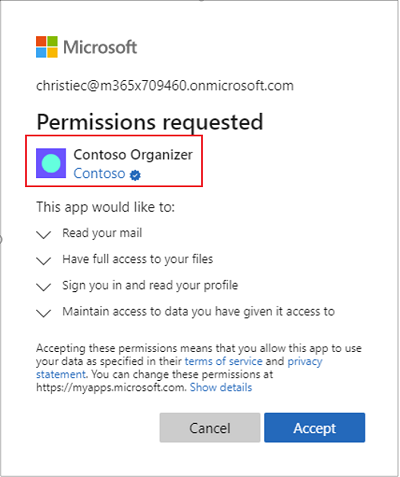

# Publisher verification (preview)

Publisher verification (preview) helps admins and end users understand the authenticity of application developers integrating with the Microsoft identity platform. When an application is marked as publisher verified, it means that the publisher has verified their identity using a [Microsoft Partner Network](https://partner.microsoft.com/membership) account that has completed the [verification](/partner-center/verification-responses) process and has associated this MPN account with their application registration. 

A blue "verified" badge appears on the Azure AD consent prompt and other screens:

This feature is primarily for developers building multi-tenant apps that leverage [OAuth 2.0 and OpenID Connect](active-directory-v2-protocols.md) with the [Microsoft identity platform](v2-overview.md). These apps can sign users in using OpenID Connect, or they may use OAuth 2.0 to request access to data using APIs like [Microsoft Graph](https://developer.microsoft.com/graph/).

## Benefits
Publisher verification provides the following benefits:
- **Increased transparency and risk reduction for customers**- this capability helps customers understand which apps being used in their organizations are published by developers they trust. 

- **Improved branding**- a “verified” badge appears on the Azure AD [consent prompt](application-consent-experience.md), Enterprise Apps page, and additional UX surfaces used by end users and admins. 

- **Smoother enterprise adoption**- admins can configure new User Consent Policies, and publisher verification status will be one of the primary policy criteria. 

- **Improved risk evaluation**- Microsoft’s detections for “risky” consent requests will include publisher verification as a signal. 

## Requirements
There are a few pre-requisites for publisher verification, some of which will have already been completed by many Microsoft partners. They are: 

-  An MPN ID for a valid [Microsoft Partner Network](https://partner.microsoft.com/membership) account that has completed the [verification](/partner-center/verification-responses) process. This MPN account must be the [Partner global account (PGA)](/partner-center/account-structure#the-top-level-is-the-partner-global-account-pga) for your organization. 

-  An Azure AD tenant with a DNS-verified [custom domain](/azure/active-directory/fundamentals/add-custom-domain). The custom domain must match the domain of the email address used during verification in the previous step. 

-  An app registered in an Azure AD tenant, with a [Publisher Domain](howto-configure-publisher-domain.md) configured using the same domain as previously used. 

-  The user performing verification must be authorized to make changes to both the app registration in Azure AD and the MPN account in Partner Center. 

    -  In Azure AD this user must either be the Owner of the app or have one of the following [roles](/azure/active-directory/users-groups-roles/directory-assign-admin-roles): Application Admin, Cloud Application Admin, Global Admin. 

    -  In Partner Center this user must have of the following [roles](/partner-center/permissions-overview): MPN Admin, Accounts Admin, or a Global Admin (this is a shared role mastered in Azure AD).
    
-  The publisher agrees to the [Microsoft identity platform for developers Terms of Use](/legal/microsoft-identity-platform/terms-of-use).

Developers who have already met these pre-requisites can get verified in a matter of minutes. If the requirements have not been met, getting set up is free. 

## Frequently asked questions 
Below are some frequently asked questions regarding the publisher verification program. For FAQs related to the requirements and the process, see [mark an app as publisher verified](mark-app-as-publisher-verified.md).

- **What information does publisher verification __not__ provide?**  When an application is marked publisher verified this does not indicate whether the application or its publisher  has achieved any specific certifications, complies with industry standards, adheres to best practices, etc. Other Microsoft programs do provide this information, including [Microsoft 365 App Certification](/microsoft-365-app-certification/overview).

- **How much does this cost? Does it require any license?** Microsoft does not charge developers for publisher verification and it does not require any specific license. 

- **How does this relate to Microsoft 365 Publisher Attestation? What about Microsoft 365 App Certification?** These are complementary programs that developers can use to create trustworthy apps that can be confidently adopted by customers. Publisher verification is the first step in this process, and should be completed by all developers creating apps that meet the above criteria. 

  Developers who are also integrating with Microsoft 365 can receive additional benefits from these programs. For more information, refer to [Microsoft 365 Publisher Attestation](/microsoft-365-app-certification/docs/attestation) and [Microsoft 365 App Certification](/microsoft-365-app-certification/docs/certification). 

- **Is this the same thing as the Azure AD Application Gallery?** No- publisher verification is a complementary but separate program to the [Azure Active Directory application gallery](/azure/active-directory/azuread-dev/howto-app-gallery-listing). Developers who fit the above criteria should complete the publisher verification process independently of participation in that program. 

## Next steps
* Learn how to [mark an app as publisher verified](mark-app-as-publisher-verified.md).
* [Troubleshoot](troubleshoot-publisher-verification.md) publisher verification.