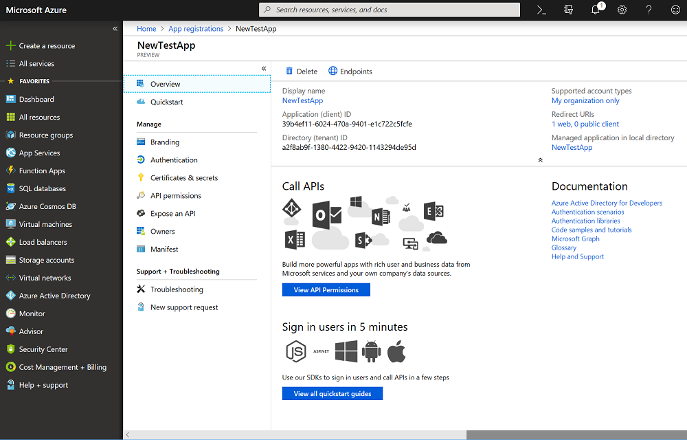

# Quickstart: Register an app with Microsoft identity platform (Preview)

Enterprise developers and software-as-a-service (SaaS) providers can develop commercial cloud services or line-of-business applications that can be integrated with Microsoft identity platform to provide secure sign-in and authorization for their services.

This quickstart shows you how to add and register an application in the Azure portal so that it can be integrated with Microsoft identity platform.

## Prerequisite

To get started, make sure have an Azure AD tenant that you can use to register your apps to. If you don't already have a tenant, [learn how to get one](quickstart-create-new-tenant.md).

## Register a new application using the Azure portal

1. Sign in to the [Azure portal](https://portal.azure.com) using either a work or school account or a personal Microsoft account.
1. If your account gives you access to more than one tenant, select your account in the top right corner, and set your portal session to the desired Azure AD tenant.
1. In the left-hand navigation pane, select the **Azure Active Directory** service, and then select **App registrations > New registration**.
1. When the **Register an application** page appears, enter your application's registration information:

    - **Name** - Enter a meaningful application name that will be displayed to users of the app.
    - **Supported account types** - Select which accounts you would like your application to support.

        | Supported account types | Description |
        |-------------------------|-------------|
        | **Accounts in this organizational directory only** | Select this option if you are building a line-of-business (LOB) application. This option is not available if you are not registering the application in a directory.  This option maps to an Azure AD only single tenant.  This is the default option unless you are registering the app outside of a directory. In cases where the app is registered outside of a directory, the default is Azure AD multi-tenant and personal Microsoft accounts. |
        | **Accounts in any organizational directory** | Select this option if you would like to target all business and educational customers.  This option maps to an Azure AD only multi-tenant.  If you registered the app as Azure AD only single-tenant, you can update it to be Azure AD multi-tenant and back to single-tenant through the **Authentication** blade. |
        | **Accounts in any organizational directory and personal Microsoft accounts** | Select this option to target the widest set of customers.  This option maps to Azure AD multi-tenant and personal Microsoft accounts.  If you registered the app as Azure AD multi-tenant and personal Microsoft accounts, you cannot change this in the UI. Instead, you must use the application manifest editor to change the supported account types. |

    - **Redirect URI (optional)** - Select the type of app you're building, **Web** or **Public client (mobile & desktop)**, and then enter the redirect URI (or reply URL) for your application.
        - For web applications, provide the base URL of your app. For example, `http://localhost:31544` might be the URL for a web app running on your local machine. Users would use this URL to sign in to a web client application.
        - For public client applications, provide the URI used by Azure AD to return token responses. Enter a value specific to your application, such as `http://MyFirstApp`.

    To see specific examples for web applications or native applications, check out our [quickstarts](https://docs.microsoft.com/azure/active-directory/develop/#quickstarts).

1. When finished, select **Register**.

    

Azure AD assigns a unique application ID to your app, and you're taken to your application's **Overview** page. To add additional capabilities to your application, you can select other configuration options including branding, certificates and secrets, API permissions, and more.

## Next steps

- See [Azure AD consent framework](consent-framework.md) for an overview of consent.
- To enable additional configuration features in your application registration, such as credentials and permissions, and enable sign-in for users from other tenants, see [Update an application registered with Microsoft identity platform](quickstart-update-azure-ad-app-preview.md).
- Learn more about the two Azure AD objects that represent a registered application and the relationship between them, see [Application objects and service principal objects](app-objects-and-service-principals.md).
- Learn more about the branding guidelines you should use when developing apps, see [Branding guidelines for applications](howto-add-branding-in-azure-ad-apps.md).
