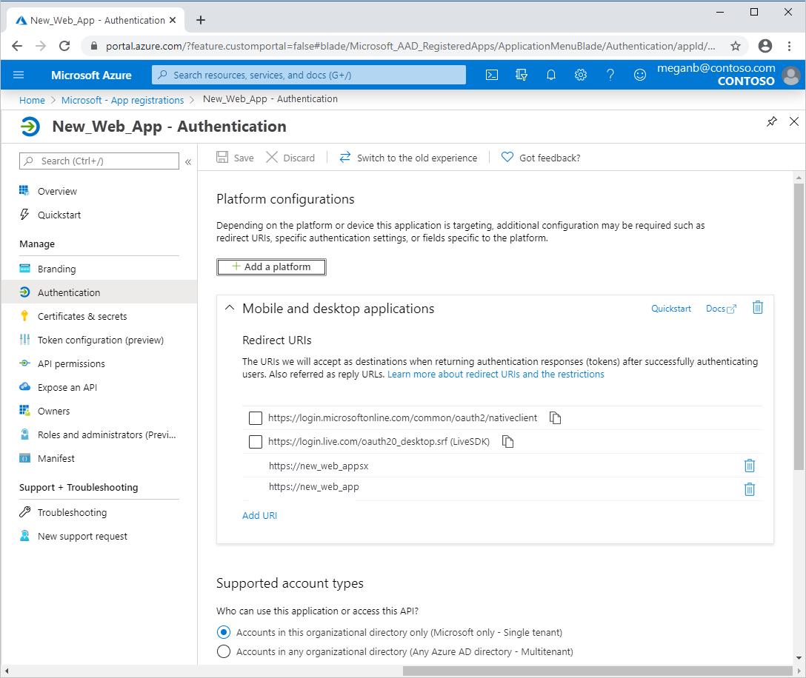
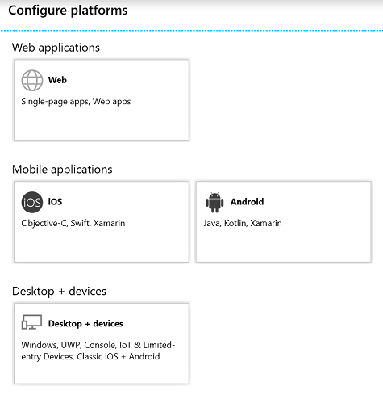

# Quickstart: Configure a client application to access web APIs

In this quickstart, you add redirect URIs, credentials, or permissions to access web APIs for your application. A web or confidential client application needs to establish secure credentials to participate in an authorization grant flow that requires authentication. The default authentication method supported by the Azure portal is client ID + secret key. The app obtains an access token during this process.

Before a client can access a web API exposed by a resource application, such as Microsoft Graph API, the consent framework ensures the client obtains the permission grant required for the permissions requested. By default, all applications can request permissions from the Microsoft Graph API.

## Prerequisites

* Completion of [Quickstart: Register an application with the Microsoft identity platform](quickstart-register-app.md).
* Review of [Permissions and consent in the Microsoft identity platform endpoint](v2-permissions-and-consent.md).
* An Azure account with an active subscription. [Create an account for free](https://azure.microsoft.com/free/?ref=microsoft.com&utm_source=microsoft.com&utm_medium=docs&utm_campaign=visualstudio).

## Sign in to the Azure portal and select the app

1. Sign in to the [Azure portal](https://portal.azure.com) using either a work or school account or a personal Microsoft account.
1. If your account gives you access to more than one tenant, select your account in the upper right corner. Set your portal session to the Azure AD tenant that you want.
1. Search for and select **Azure Active Directory**. Under **Manage**, select **App registrations**.
1. Find and select the application you want to configure. After you select the app, you see the application's **Overview** or main registration page.

Use the following procedures to configure your application to access web APIs.

## Add redirect URIs to your application

You can add custom redirect URIs and suggested redirect URIs to your application. To add a custom redirect URI for web and public client applications:

1. From the app **Overview** page, select **Authentication**.
1. Locate **Redirect URIs**. You may need to select **Switch to the old experience**.
1. Select the type of application you're building: **Web** or **Public client/native (mobile & desktop)**.
1. Enter the Redirect URI for your application.

   * For web applications, provide the base URL of your application. For example, `http://localhost:31544` might be the URL for a web application running on your local machine. Users would use this URL to sign into a web client application.
   * For public applications, provide the URI used by Azure AD to return token responses. Enter a value specific to your application, for example: `https://MyFirstApp`.
1. Select **Save**.

To choose from suggested redirect URIs for public clients, follow these steps:

1. From the app **Overview** page, select **Authentication**.
1. Locate **Suggested Redirect URIs for public clients (mobile, desktop)**. You may need to select **Switch to the old experience**.
1. Select one or more redirect URIs for your application. You can also enter a custom redirect URI. If you're not sure what to use, see the library documentation.
1. Select **Save**.

Certain restrictions apply to redirect URIs. For more information, see [Redirect URI/reply URL restrictions and limitations](https://docs.microsoft.com/azure/active-directory/develop/reply-url).

> [!NOTE]
> Try out the new **Authentication** settings experience where you can configure settings for your application based on the platform or device that you want to target.
>
> To see this view, select **Try out the new experience** from the **Authentication** page.
>
> 
>
> This takes you to the [new **Platform configurations** page](#configure-platform-settings-for-your-application).

### Configure advanced settings for your application

Depending on the application you're registering, there are some additional settings that you may need to configure, such as:

* **Logout URL**.
* For single-page apps, you can enable **Implicit grant** and select the tokens that you'd like the authorization endpoint to issue.
* For desktop apps that acquire tokens by using Integrated Windows Authentication, device code flow, or username/password in the **Default client type** section, set the **Treat application as public client** setting to **Yes**.
* For legacy apps that were using the Live SDK to integrate with the Microsoft account service, configure **Live SDK support**. New apps don't need this setting.
* **Default client type**.
* **Supported account types**.

### Modify supported account types

The **Supported account types** specify who can use the application or access the API.

If you configured the supported account types when you registered the application, you can only change this setting using the application manifest editor if:

* You change account types from **AzureADMyOrg** or **AzureADMultipleOrgs** to **AzureADandPersonalMicrosoftAccount**, or the other way around, or
* You change account types from **AzureADMyOrg** to **AzureADMultipleOrgs**, or the other way around.

To change the supported account types for an existing app registration, update the `signInAudience` key. For more information, see [Configure the application manifest](reference-app-manifest.md#configure-the-app-manifest).

## Configure platform settings for your application

To configure application settings based on the platform or device, you're targeting:

1. In the **Platform configurations** page, select **Add a platform** and choose from the available options.

   

1. Enter the settings info based on the platform you selected.

   | Platform                | Configuration settings            |
   |-------------------------|-----------------------------------|
   | **Web**              | Enter the **Redirect URI** for your application. |
   | **iOS / macOS**              | Enter the app **Bundle ID**, which you can find in XCode in Info.plist, or Build Settings. Adding the bundle ID automatically creates a redirect URI for the application. |
   | **Android**          | Provide the app **Package name**, which you can find in the AndroidManifest.xml file. Generate and enter the **Signature hash**. Adding the signature hash automatically creates a redirect URI for the application.  |
   | **Mobile and desktop applications**  | Optional. Select one of the recommended **Suggested redirect URIs** if you're building apps for desktop and devices. Optional. Enter a **Custom redirect URI**, which is used as the location where Azure AD will redirect users in response to authentication requests. For example, for .NET Core applications where you want interaction, use `http://localhost`. |

   > [!NOTE]
   > On Active Directory Federation Services (AD FS) and Azure AD B2C, you must also specify a port number.  For example: `http://localhost:1234`. 

   > [!IMPORTANT]
   > For mobile applications that aren't using the latest Microsoft Authentication Library (MSAL) or not using a broker, you must configure the redirect URIs for these applications in **Desktop + devices**.

Depending on the platform you chose, there may be additional settings that you can configure. For **Web** apps, you can:

* Add more redirect URIs
* Configure **Implicit grant** to select the tokens you'd like to be issued by the authorization endpoint:

  * For single-page apps, select both **Access tokens** and **ID tokens**
  * For web apps, select **ID tokens**

## Add credentials to your web application

To add a credential to your web application, either add a certificate or create a client secret. To add a certificate:

1. From the app **Overview** page, select the **Certificates & secrets** section.
1. Select **Upload certificate**.
1. Select the file you'd like to upload. It must be one of the following file types: .cer, .pem, .crt.
1. Select **Add**.

To add a client secret:

1. From the app **Overview** page, select the **Certificates & secrets** section.
1. Select **New client secret**.
1. Add a description for your client secret.
1. Select a duration.
1. Select **Add**.

> [!NOTE]
> After you save the configuration changes, the right-most column will contain the client secret value. **Be sure to copy the value** for use in your client application code as it's not accessible once you leave this page.

## Add permissions to access web APIs

The [Graph API sign-in and read user profile permission](https://developer.microsoft.com/graph/docs/concepts/permissions_reference#user-permissions) is selected by default. You can select from [two types of permissions](developer-glossary.md#permissions) for each web API:

* **Application permissions**. Your client application needs to access the web API directly as itself, without user context. This type of permission requires administrator consent. This permission isn't available for desktop and mobile client applications.
* **Delegated permissions**. Your client application needs to access the web API as the signed-in user, but with access limited by the selected permission. This type of permission can be granted by a user unless the permission requires administrator consent.

  > [!NOTE]
  > Adding a delegated permission to an application does not automatically grant consent to the users within the tenant. Users must still manually consent for the added delegated permissions at runtime, unless the administrator grants consent on behalf of all users.

To add permissions to access resource APIs from your client:

1. From the app **Overview** page, select **API permissions**.
1. Under **Configured permissions**, select **Add a permission**.
1. By default, the view allows you to select from **Microsoft APIs**. Select the section of APIs that you're interested in:

    * **Microsoft APIs**. Lets you select permissions for Microsoft APIs such as Microsoft Graph.
    * **APIs my organization uses**. Lets you select permissions for APIs that your organization exposes, or APIs that your organization has integrated with.
    * **My APIs**. Lets you select permissions for APIs that you expose.

1. Once you've selected the APIs, you'll see the **Request API Permissions** page. If the API exposes both delegated and application permissions, select which type of permission your application needs.
1. When finished, select **Add permissions**.

You return to the **API permissions** page. The permissions have been saved and added to the table.

## Understanding API permissions and admin consent UI

### Configured permissions

This section shows the permissions that have been explicitly configured on the application object. These permissions are part of the app's required resource access list. You may add or remove permissions from this table. As an admin, you can also grant or revoke admin consent for a set of an API's permissions or individual permissions.

### Other permissions granted

If your application is registered in a tenant, you may see an additional section titled **Other permissions granted for Tenant**. This section shows permissions granted for the tenant that haven't been explicitly configured on the application object. These permissions were dynamically requested and consented. This section only appears if there is at least one permission that applies.

You may add a set of an API's permissions or individual permissions that appear in this section to the **Configured permissions** section. As an admin, you can also revoke admin consent for individual APIs or permissions in this section.

### Admin consent button

If your application is registered in a tenant, you see a **Grant admin consent for Tenant** button. It's disabled if you aren't an admin, or if no permissions have been configured for the application.
This button allows an admin to grant admin consent to the permissions configured for the application. Clicking the admin consent button launches a new window with a consent prompt showing all the configured permissions.

> [!NOTE]
> There is a delay between permissions being configured for the application and them appearing on the consent prompt. If you do not see all the configured permissions in the consent prompt, close it and launch it again.

If you have permissions that have been granted but not configured, the admin consent button prompts you to handle these permissions. You may add them to configured permissions or you may remove them.

The consent prompt provides the option to **Accept** or **Cancel**. Select **Accept** to grant admin consent. If you select **Cancel**, admin consent isn't granted. An error message states that consent has been declined.

> [!NOTE]
> There is a delay between granting admin consent by selecting **Accept** on the consent prompt and the status of admin consent being reflected in the portal.

## Next steps

Advance to the next article to learn how to expose web APIs.
> [!div class="nextstepaction"]
> [Quickstart: Configure an application to expose web APIs](quickstart-configure-app-expose-web-apis.md)

* To learn more about the two Azure AD objects that represent a registered application and the relationship between them, see [Application objects and service principal objects](app-objects-and-service-principals.md).

* To learn more about the branding guidelines you should use when developing applications with Azure Active Directory, see [Branding guidelines for applications](howto-add-branding-in-azure-ad-apps.md).

* [Quickstart: Register an application with the Microsoft identity platform](quickstart-register-app.md)

* [Quickstart: Modify the accounts supported by an application](quickstart-modify-supported-accounts.md)

* [Quickstart: Remove an application registered with the Microsoft identity platform](quickstart-remove-app.md)
