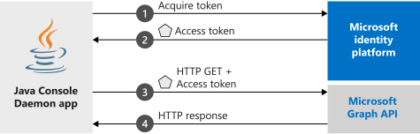

# Quickstart: Acquire a token and call Microsoft Graph from a Java daemon app

In this quickstart, you download and run a code sample that demonstrates how a Java application can get an access token using the app's identity to call the Microsoft Graph API and display a [list of users](/graph/api/user-list) in the directory. The code sample demonstrates how an unattended job or Windows service can run with an application identity, instead of a user's identity.




## Prerequisites

To run this sample, you need:

- [Java Development Kit (JDK)](https://openjdk.java.net/) 8 or greater
- [Maven](https://maven.apache.org/)

## Register and download your quickstart app

[!INCLUDE [portal updates](~/articles/active-directory/includes/portal-update.md)]

### Step 1: Register the application

To register your application and add the app's registration information to your solution manually, follow these steps:

1. Sign in to the [Microsoft Entra admin center](https://entra.microsoft.com) as at least an [Application Developer](../roles/permissions-reference.md#application-developer).
1. If you have access to multiple tenants, use the **Directories + subscriptions** filter :::image type="icon" source="media/common/portal-directory-subscription-filter.png" border="false"::: in the top menu to switch to the tenant in which you want to register the application.
1. Browse to **Identity** > **Applications** > **Application registrations**.
1. Select **New registration**.
1. Enter a **Name** for your application, for example `Daemon-console`. Users of your app might see this name, and you can change it later.
1. Select **Register**.
1. Under **Manage**, select  **Certificates & secrets**.
1. Under **Client secrets**, select **New client secret**, enter a name, and then select **Add**. Record the secret value in a safe location for use in a later step.
1. Under **Manage**, select **API Permissions** > **Add a permission**. Select **Microsoft Graph**.
1. Select **Application permissions**.
1. Under **User** node, select **User.Read.All**, then select **Add permissions**.

### Step 2: Download the Java project
[Download the Java daemon project](https://github.com/Azure-Samples/ms-identity-java-daemon/archive/master.zip)

### Step 3: Configure the Java project

1. Extract the zip file to a local folder close to the root of the disk, such as `C:\Azure-Samples`.
1. Navigate to the `msal-client-credential-secret` subfolder.
1. Edit `src\main\resources\application.properties` and replace the values of the fields `AUTHORITY`, `CLIENT_ID`, and `SECRET` with the following snippet:

 ```
   AUTHORITY=https://login.microsoftonline.com/Enter_the_Tenant_Id_Here/
   CLIENT_ID=Enter_the_Application_Id_Here
   SECRET=Enter_the_Client_Secret_Here
 ```
  Where:
   - `Enter_the_Application_Id_Here` - is the **Application (client) ID** for the application you registered.
   - `Enter_the_Tenant_Id_Here` - replace this value with the **Tenant Id** or **Tenant name** (for example, contoso.microsoft.com).
   - `Enter_the_Client_Secret_Here` - replace this value with the client secret created on step 1.

>[!TIP]
>To find the values of **Application (client) ID**, **Directory (tenant) ID**, go to the app's **Overview** page. To generate a new key, go to **Certificates & secrets** page.

### Step 4: Admin consent

If you try to run the application at this point, you'll receive *HTTP 403 - Forbidden* error: `Insufficient privileges to complete the operation`. This error happens because any *app-only permission* requires Admin consent: a global administrator of your directory must give consent to your application. Select one of the options below depending on your role:

#### Global tenant administrator


If you are a global tenant administrator, go to **API Permissions** page in **App registrations** and select **Grant admin consent for {Tenant Name}** (Where {Tenant Name} is the name of your directory).

#### Standard user

If you're a standard user of your tenant, then you need to ask a global administrator to grant admin consent for your application. To do this, give the following URL to your administrator:

```url
https://login.microsoftonline.com/Enter_the_Tenant_Id_Here/adminconsent?client_id=Enter_the_Application_Id_Here
```

 Where:
 * `Enter_the_Tenant_Id_Here` - replace this value with the **Tenant Id** or **Tenant name** (for example, contoso.microsoft.com)
 * `Enter_the_Application_Id_Here` - is the **Application (client) ID** for the application you registered.


### Step 5: Run the application

You can test the sample directly by running the main method of ClientCredentialGrant.java from your IDE.

From your shell or command line:

```
$ mvn clean compile assembly:single
```

This will generate a `msal-client-credential-secret-1.0.0.jar` file in your `/targets` directory. Run this using your Java executable like below:

```
$ java -jar msal-client-credential-secret-1.0.0.jar
```

After running, the application should display the list of users in the configured tenant.

> [!IMPORTANT]
> This quickstart application uses a client secret to identify itself as confidential client. Because the client secret is added as a plain-text to your project files, for security reasons, it is recommended that you use a certificate instead of a client secret before considering the application as production application. For more information on how to use a certificate, see [these instructions](https://github.com/Azure-Samples/ms-identity-java-daemon/tree/master/msal-client-credential-certificate) in the same GitHub repository for this sample, but in the second folder **MSAL-client-credential-certificate**.

## More information

### MSAL Java

[MSAL Java](https://github.com/AzureAD/microsoft-authentication-library-for-java) is the library used to sign in users and request tokens used to access an API protected by Microsoft identity platform. As described, this quickstart requests tokens by using the application own identity instead of delegated permissions. The authentication flow used in this case is known as *[client credentials oauth flow](v2-oauth2-client-creds-grant-flow.md)*. For more information on how to use MSAL Java with daemon apps, see [this article](scenario-daemon-overview.md).

Add MSAL4J to your application by using Maven or Gradle to manage your dependencies by making the following changes to the application's pom.xml (Maven) or build.gradle (Gradle) file.

In *pom.xml*:

```xml
<dependency>
    <groupId>com.microsoft.azure</groupId>
    <artifactId>msal4j</artifactId>
    <version>1.0.0</version>
</dependency>
```

In build.gradle:

```$xslt
compile group: 'com.microsoft.azure', name: 'msal4j', version: '1.0.0'
```

### MSAL initialization

Add a reference to MSAL for Java by adding the following code to the top of the file where you will be using MSAL4J:

```Java
import com.microsoft.aad.msal4j.*;
```

Then, initialize MSAL using the following code:

```Java
IClientCredential credential = ClientCredentialFactory.createFromSecret(CLIENT_SECRET);

ConfidentialClientApplication cca =
        ConfidentialClientApplication
                .builder(CLIENT_ID, credential)
                .authority(AUTHORITY)
                .build();
```

| Where: |Description |
|---------|---------|
| `CLIENT_SECRET` | Is the client secret created for the application. |
| `CLIENT_ID` | Is the **Application (client) ID** for the registered application. You can find this value in the app's **Overview** page. |
| `AUTHORITY`    | The STS endpoint for user to authenticate. Usually `https://login.microsoftonline.com/{tenant}` for public cloud, where {tenant} is the name of your tenant or your tenant ID.|

### Requesting tokens

To request a token using app's identity, use `acquireToken` method:

```Java
IAuthenticationResult result;
     try {
         SilentParameters silentParameters =
                 SilentParameters
                         .builder(SCOPE)
                         .build();

         // try to acquire token silently. This call will fail since the token cache does not
         // have a token for the application you are requesting an access token for
         result = cca.acquireTokenSilently(silentParameters).join();
     } catch (Exception ex) {
         if (ex.getCause() instanceof MsalException) {

             ClientCredentialParameters parameters =
                     ClientCredentialParameters
                             .builder(SCOPE)
                             .build();

             // Try to acquire a token. If successful, you should see
             // the token information printed out to console
             result = cca.acquireToken(parameters).join();
         } else {
             // Handle other exceptions accordingly
             throw ex;
         }
     }
     return result;
```

|Where:| Description |
|---------|---------|
| `SCOPE` | Contains the scopes requested. For confidential clients, this should use the format similar to `{Application ID URI}/.default` to indicate that the scopes being requested are the ones statically defined in the app object (for Microsoft Graph, `{Application ID URI}` points to `https://graph.microsoft.com`). For custom web APIs, `{Application ID URI}` is defined under the **Expose an API** section in **App registrations**.|

[!INCLUDE [Help and support](includes/error-handling-and-tips/help-support-include.md)]

## Next steps

To learn more about daemon applications, see the scenario landing page.

> [!div class="nextstepaction"]
> [Daemon application that calls web APIs](scenario-daemon-overview.md)
