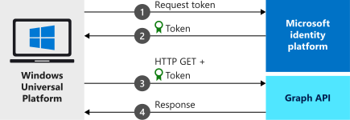

# Quickstart: Sign in users and call Microsoft Graph in a Universal Windows Platform app

In this quickstart, you download and run a code sample that demonstrates how a Universal Windows Platform (UWP) application can sign in users and get an access token to call the Microsoft Graph API. 

See [How the sample works](#how-the-sample-works) for an illustration.

## Prerequisites

* An Azure account with an active subscription. [Create an account for free](https://azure.microsoft.com/free/?WT.mc_id=A261C142F).
* [Visual Studio](https://visualstudio.microsoft.com/vs/)

## Register and download your quickstart app

You have two options to start your quickstart application:
* [Express] [Option 1: Register and auto configure your app and then download your code sample](#option-1-register-and-auto-configure-your-app-and-then-download-your-code-sample)
* [Manual] [Option 2: Register and manually configure your application and code sample](#option-2-register-and-manually-configure-your-application-and-code-sample)

### Option 1: Register and auto configure your app and then download your code sample

1. Go to the [AMicrosoft Entra admin center - App registrations](https://entra.microsoft.com/#blade/Microsoft_AAD_RegisteredApps/applicationsListBlade/quickStartType/UwpQuickstartPage/sourceType/docs) quickstart experience.
1. Enter a name for your application and select **Register**.
1. Follow the instructions to download and automatically configure your new application.

### Option 2: Register and manually configure your application and code sample

#### Step 1: Register your application

[!INCLUDE [portal updates](~/articles/active-directory/includes/portal-update.md)]

To register your application and add the app's registration information to your solution, follow these steps:
1. Sign in to the [Microsoft Entra admin center](https://entra.microsoft.com).
1. If you have access to multiple tenants, use the **Directories + subscriptions** filter :::image type="icon" source="media/common/portal-directory-subscription-filter.png" border="false"::: in the top menu to switch to the tenant in which you want to register the application.
1. Browse to **Identity** > **Applications** > **App registrations**, select **New registration**.
1. Enter a **Name** for your application, for example `UWP-App-calling-MsGraph`. Users of your app might see this name, and you can change it later.
1. In the **Supported account types** section, select **Accounts in any organizational directory and personal Microsoft accounts (for example, Skype, Xbox, Outlook.com)**.
1. Select **Register** to create the application, and then record the **Application (client) ID** for use in a later step.
1. Under **Manage**, select **Authentication**.
1. Select **Add a platform** > **Mobile and desktop applications**.
1. Under **Redirect URIs**, select `https://login.microsoftonline.com/common/oauth2/nativeclient`.
1. Select **Configure**.

#### Step 2: Download the project

[Download the UWP sample application](https://github.com/Azure-Samples/active-directory-dotnet-native-uwp-v2/archive/msal3x.zip)

[!INCLUDE [active-directory-develop-path-length-tip](includes/error-handling-and-tips/path-length-tip.md)]

#### Step 3: Configure the project

1. Extract the .zip archive to a local folder close to the root of your drive. For example, into **C:\Azure-Samples**.
1. Open the project in Visual Studio. Install the **Universal Windows Platform development** workload and any individual SDK components if prompted.
1. In *MainPage.Xaml.cs*, change the value of the `ClientId` variable to the **Application (Client) ID** of the application you registered earlier.

   ```csharp
   private const string ClientId = "Enter_the_Application_Id_here";
   ```

   You can find the **Application (client) ID** on the app's **Overview** pane in the Microsoft Entra admin center (**Identity** > **Applications** > **App registrations** > *{Your app registration}*).
1. Create and then select a new self-signed test certificate for the package:
    1. In the **Solution Explorer**, double-click the *Package.appxmanifest* file.
    1. Select **Packaging** > **Choose Certificate...** > **Create...**.
    1. Enter a password and then select **OK**. A certificate called *Native_UWP_V2_TemporaryKey.pfx* is created. 
    1. Select **OK** to dismiss the **Choose a certificate** dialog, and then verify that you see *Native_UWP_V2_TemporaryKey.pfx* in Solution Explorer.
    1. In the **Solution Explorer**, right-click the **Native_UWP_V2** project and select **Properties**.
    1. Select **Signing**, and then select the .pfx you created in the **Choose a strong name key file** drop-down.

#### Step 4: Run the application

To run the sample application on your local machine:

1. In the Visual Studio toolbar, choose the right platform (probably **x64** or **x86**, not ARM). The target device should change from *Device* to *Local Machine*.
1. Select **Debug** > **Start Without Debugging**.
    
    If you're prompted to do so, you might first need to enable **Developer Mode**, and then **Start Without Debugging** again to launch the app.

When the app's window appears, you can select the **Call Microsoft Graph API** button, enter your credentials, and consent to the permissions requested by the application. If successful, the application displays some token information and data obtained from the call to the Microsoft Graph API.

## How the sample works



### MSAL.NET

MSAL ([Microsoft.Identity.Client](/dotnet/api/microsoft.identity.client?)) is the library used to sign in users and request security tokens. The security tokens are used to access an API protected by the Microsoft identity platform. You can install MSAL by running the following command in Visual Studio's *Package Manager Console*:

```powershell
Install-Package Microsoft.Identity.Client
```

### MSAL initialization

You can add the reference for MSAL by adding the following code:

```csharp
using Microsoft.Identity.Client;
```

Then, MSAL is initialized using the following code:

```csharp
public static IPublicClientApplication PublicClientApp;
PublicClientApp = PublicClientApplicationBuilder.Create(ClientId)
                                                .WithRedirectUri("https://login.microsoftonline.com/common/oauth2/nativeclient")
                                                    .Build();
```

The value of `ClientId` is the **Application (client) ID** of the app you registered in the Microsoft Entra admin center. You can find this value in the app's **Overview** page in the Microsoft Entra admin center.

### Requesting tokens

MSAL has two methods for acquiring tokens in a UWP app: [`AcquireTokenInteractive`](/dotnet/api/microsoft.identity.client.acquiretokeninteractiveparameterbuilder?) and [`AcquireTokenSilent`](/dotnet/api/microsoft.identity.client.acquiretokensilentparameterbuilder).

#### Get a user token interactively

Some situations require forcing users to interact with the Microsoft identity platform through a pop-up window to either validate their credentials or to give consent. Some examples include:

- The first-time users sign in to the application
- When users may need to reenter their credentials because the password has expired
- When your application is requesting access to a resource, that the user needs to consent to
- When two factor authentication is required

```csharp
authResult = await PublicClientApp.AcquireTokenInteractive(scopes)
                      .ExecuteAsync();
```

The `scopes` parameter contains the scopes being requested, such as `{ "user.read" }` for Microsoft Graph or `{ "api://<Application ID>/access_as_user" }` for custom web APIs.

#### Get a user token silently

Use the `AcquireTokenSilent` method to obtain tokens to access protected resources after the initial `AcquireTokenInteractive` method. You don’t want to require the user to validate their credentials every time they need to access a resource. Most of the time you want token acquisitions and renewal without any user interaction

```csharp
var accounts = await PublicClientApp.GetAccountsAsync();
var firstAccount = accounts.FirstOrDefault();
authResult = await PublicClientApp.AcquireTokenSilent(scopes, firstAccount)
                                      .ExecuteAsync();
```

* `scopes` contains the scopes being requested, such as `{ "user.read" }` for Microsoft Graph or `{ "api://<Application ID>/access_as_user" }` for custom web APIs.
* `firstAccount` specifies the first user account in the cache (MSAL supports multiple users in a single app).

[!INCLUDE [Help and support](includes/error-handling-and-tips/help-support-include.md)]

## Next steps

Try out the Windows desktop tutorial for a complete step-by-step guide on building applications and new features, including a full explanation of this quickstart.

> [!div class="nextstepaction"]
> [UWP - Call Graph API tutorial](tutorial-v2-windows-uwp.md)
