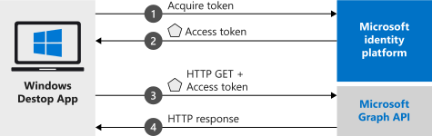

# Quickstart: Sign in users and call Microsoft Graph in a Windows desktop app

In this quickstart, you download and run a code sample that demonstrates how a Windows Presentation Foundation (WPF) application can sign in users and get an access token to call the Microsoft Graph API. The desktop app you build uses the authorization code flow paired with the Proof Key for Code Exchange (PKCE) standard. 

See [How the sample works](#how-the-sample-works) for an illustration.


## Prerequisites

* [Visual Studio](https://visualstudio.microsoft.com/vs/) with the [Universal Windows Platform development](/windows/apps/windows-app-sdk/set-up-your-development-environment) workload installed

## Register and download your quickstart app
You have two options to start your quickstart application:
* [Express] [Option 1: Register and auto configure your app and then download your code sample](#option-1-register-and-auto-configure-your-app-and-then-download-your-code-sample)
* [Manual] [Option 2: Register and manually configure your application and code sample](#option-2-register-and-manually-configure-your-application-and-code-sample)

### Option 1: Register and auto configure your app and then download your code sample

1. Go to the [Microsoft Entra admin center - App registrations](https://entra.microsoft.com/#blade/Microsoft_AAD_RegisteredApps/applicationsListBlade/quickStartType/WinDesktopQuickstartPage/sourceType/docs)quickstart experience.
1. Enter a name for your application and select **Register**.
1. Follow the instructions to download and automatically configure your new application with just one click.

### Option 2: Register and manually configure your application and code sample

#### Step 1: Register your application

[!INCLUDE [portal updates](~/articles/active-directory/includes/portal-update.md)]

To register your application and add the app's registration information to your solution manually, follow these steps:

1. Sign in to the [Microsoft Entra admin center](https://entra.microsoft.com).
1. If you have access to multiple tenants, use the **Directories + subscriptions** filter :::image type="icon" source="media/common/portal-directory-subscription-filter.png" border="false"::: in the top menu to switch to the tenant in which you want to register the application.
1. Browse to **Identity** > **Applications** > **App registrations**, select **New registration**.
1. Enter a **Name** for your application, for example `Win-App-calling-MsGraph`. Users of your app might see this name, and you can change it later.
1. In the **Supported account types** section, select **Accounts in any organizational directory and personal Microsoft accounts (for example, Skype, Xbox, Outlook.com)**.
1. Select **Register** to create the application.
1. Under **Manage**, select **Authentication**.
1. Select **Add a platform** > **Mobile and desktop applications**.
1. In the **Redirect URIs** section, select `https://login.microsoftonline.com/common/oauth2/nativeclient` and in **Custom redirect URIs** add `ms-appx-web://microsoft.aad.brokerplugin/{client_id}` where `{client_id}` is the application (client) ID of your application (the same GUID that appears in the `msal{client_id}://auth` checkbox).
1. Select **Configure**.

#### Step 2: Download the project

[Download the WPF sample application](https://github.com/Azure-Samples/active-directory-dotnet-desktop-msgraph-v2/archive/msal3x.zip)

[!INCLUDE [active-directory-develop-path-length-tip](includes/error-handling-and-tips/path-length-tip.md)]

#### Step 3: Configure the project
1. Extract the zip file to a local folder close to the root of the disk, for example, **C:\Azure-Samples**.
1. Open the project in Visual Studio.
1. Edit **App.Xaml.cs** and replace the values of the fields `ClientId` and `Tenant` with the following code:

   ```csharp
   private static string ClientId = "Enter_the_Application_Id_here";
   private static string Tenant = "Enter_the_Tenant_Info_Here";
   ```

Where:
- `Enter_the_Application_Id_here` - is the **Application (client) ID** for the application you registered.
   
    To find the value of **Application (client) ID**, go to the app's **Overview** page in the Microsoft Entra admin center.
- `Enter_the_Tenant_Info_Here` - is set to one of the following options:
  - If your application supports **Accounts in this organizational directory**, replace this value with the **Tenant Id** or **Tenant name** (for example, contoso.microsoft.com)
  - If your application supports **Accounts in any organizational directory**, replace this value with `organizations`
  - If your application supports **Accounts in any organizational directory and personal Microsoft accounts**, replace this value with `common`.

    To find the values of **Directory (tenant) ID** and **Supported account types**, go to the app's **Overview** page in the Microsoft Entra admin center.

#### Step 4: Run the application

To build and run the sample application in Visual Studio, select the **Debug menu** > **Start Debugging**, or press the F5 key. Your application's MainWindow is displayed.

When the app's main window appears, select the Call Microsoft Graph API button. You'll be prompted to sign in using your Microsoft Entra account (work or school account) or Microsoft account (live.com, outlook.com) credentials.

If you're running the application for the first time, you'll be prompted to provide consent to allow the application to access your user profile and sign you in. After consenting to the requested permissions, the application displays that you've successfully logged in. You should see some basic token information and user data obtained from the call to the Microsoft Graph API.

## More information

### How the sample works


### MSAL.NET
MSAL ([Microsoft.Identity.Client](https://www.nuget.org/packages/Microsoft.Identity.Client)) is the library used to sign in users and request tokens used to access an API protected by Microsoft identity platform. You can install MSAL by running the following command in Visual Studio's **Package Manager Console**:

```powershell
Install-Package Microsoft.Identity.Client -IncludePrerelease
```

### MSAL initialization

You can add the reference for MSAL by adding the following code:

```csharp
using Microsoft.Identity.Client;
```

Then, initialize MSAL using the following code:

```csharp
IPublicClientApplication publicClientApp = PublicClientApplicationBuilder.Create(ClientId)
                .WithRedirectUri("https://login.microsoftonline.com/common/oauth2/nativeclient")
                .WithAuthority(AzureCloudInstance.AzurePublic, Tenant)
                .Build();
```

|Where: | Description |
|---------|---------|
| `ClientId` | Is the **Application (client) ID** for the application registered in the Microsoft Entra admin center. You can find this value in the app's **Overview** page in the Microsoft Entra admin center. |

### Requesting tokens

MSAL has two methods for acquiring tokens: `AcquireTokenInteractive` and `AcquireTokenSilent`.

#### Get a user token interactively

Some situations require forcing users interact with the Microsoft identity platform through a pop-up window to either validate their credentials or to give consent. Some examples include:

- The first time users sign in to the application
- When users may need to reenter their credentials because the password has expired
- When your application is requesting access to a resource that the user needs to consent to
- When two factor authentication is required

```csharp
authResult = await app.AcquireTokenInteractive(_scopes)
                                      .ExecuteAsync();
```

|Where:| Description |
|---------|---------|
| `_scopes` | Contains the scopes being requested, such as `{ "user.read" }` for Microsoft Graph or `{ "api://<Application ID>/access_as_user" }` for custom web APIs. |

#### Get a user token silently

You don't want to require the user to validate their credentials every time they need to access a resource. Most of the time you want token acquisitions and renewal without any user interaction. You can use the `AcquireTokenSilent` method to obtain tokens to access protected resources after the initial `AcquireTokenInteractive` method:

```csharp
var accounts = await app.GetAccountsAsync();
var firstAccount = accounts.FirstOrDefault();
authResult = await app.AcquireTokenSilent(scopes, firstAccount)
                                      .ExecuteAsync();
```

|Where: | Description |
|---------|---------|
| `scopes` | Contains the scopes being requested, such as `{ "user.read" }` for Microsoft Graph or `{ "api://<Application ID>/access_as_user" }` for custom web APIs. |
| `firstAccount` | Specifies the first user in the cache (MSAL support multiple users in a single app). |

[!INCLUDE [Help and support](includes/error-handling-and-tips/help-support-include.md)]

## Next steps

Try out the Windows desktop tutorial for a complete step-by-step guide on building applications and new features, including a full explanation of this quickstart.

> [!div class="nextstepaction"]
> [Call Graph API tutorial](tutorial-v2-windows-desktop.md)
