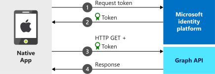

# Quickstart: Sign in users and call Microsoft Graph from an iOS or macOS app

In this quickstart, you download and run a code sample that demonstrates how a native iOS or macOS application can sign in users and get an access token to call the Microsoft Graph API.

The quickstart applies to both iOS and macOS apps. Some steps are needed only for iOS apps and will be indicated as such.

## Prerequisites

* An Azure account with an active subscription. [Create an account for free](https://azure.microsoft.com/free/?WT.mc_id=A261C142F).
* XCode 10+
* iOS 10+
* macOS 10.12+

## How the sample works



## Register your quickstart app

[!INCLUDE [portal updates](~/articles/active-directory/includes/portal-update.md)]

To register your application and add the app's registration information to your solution manually, follow these steps:

1. Sign in to the [Microsoft Entra admin center](https://entra.microsoft.com) as at least an [Application Developer](../roles/permissions-reference.md#application-developer).
1. If access to multiple tenants is available, use the **Directories + subscriptions** filter :::image type="icon" source="media/common/portal-directory-subscription-filter.png" border="false"::: in the top menu to switch to the tenant in which you want to register the application.
1. Browse to **Identity** > **Applications** > **App registrations**.
1. Select **New registration**.
1. Enter a **Name** for your application. Users of your app might see this name, and you can change it later.
1. Select **Register**.
1. Under **Manage**, select **Authentication** > **Add Platform** > **iOS**.
1. Enter the **Bundle Identifier** for your application. The bundle identifier is a unique string that uniquely identifies your application, for example `com.<yourname>.identitysample.MSALMacOS`. Make a note of the value you use. Note that the iOS configuration is also applicable to macOS applications.
1. Select **Configure** and save the **MSAL Configuration** details for later in this quickstart.
1. Select **Done**.

#### Step 2: Download the sample project

- [Download the code sample for iOS](https://github.com/Azure-Samples/active-directory-ios-swift-native-v2/archive/master.zip)
- [Download the code sample for macOS](https://github.com/Azure-Samples/active-directory-macOS-swift-native-v2/archive/master.zip)

#### Step 3: Install dependencies

1. Extract the zip file.
2. In a terminal window, navigate to the folder with the downloaded code sample and run `pod install` to install the latest MSAL library.

#### Step 4: Configure your project
If you selected Option 1 above, you can skip these steps.
1. Open the project in XCode.
1. Edit **ViewController.swift** and replace the line starting with 'let kClientID' with the following code snippet. Remember to update the value for `kClientID` with the clientID that you saved when you registered your app earlier in this quickstart:

   ```swift
   let kClientID = "Enter_the_Application_Id_Here"
   ```

1. If you're building an app for [Microsoft Entra national clouds](/graph/deployments#app-registration-and-token-service-root-endpoints), replace the line starting with 'let kGraphEndpoint' and 'let kAuthority' with correct endpoints. For global access, use default values:

   ```swift
   let kGraphEndpoint = "https://graph.microsoft.com/"
   let kAuthority = "https://login.microsoftonline.com/common"
   ```

1. Other endpoints are documented [here](/graph/deployments#app-registration-and-token-service-root-endpoints). For example, to run the quickstart with Microsoft Entra Germany, use following:

   ```swift
   let kGraphEndpoint = "https://graph.microsoft.de/"
   let kAuthority = "https://login.microsoftonline.de/common"
   ```

3. Open the project settings. In the **Identity** section, enter the **Bundle Identifier**.
4. Right-click **Info.plist** and select **Open As** > **Source Code**.
5. Under the dict root node, replace `Enter_the_bundle_Id_Here` with the ***Bundle Id*** that you used in the portal. Notice the `msauth.` prefix in the string.

   ```xml
   <key>CFBundleURLTypes</key>
   <array>
      <dict>
         <key>CFBundleURLSchemes</key>
         <array>
            <string>msauth.Enter_the_Bundle_Id_Here</string>
         </array>
      </dict>
   </array>
   ```

6. Build and run the app!

## More Information

Read these sections to learn more about this quickstart.

### Get MSAL

MSAL ([MSAL.framework](https://github.com/AzureAD/microsoft-authentication-library-for-objc)) is the library used to sign in users and request tokens used to access an API protected by Microsoft identity platform. You can add MSAL to your application using the following process:

```
$ vi Podfile
```

Add the following to this podfile (with your project's target):

```
use_frameworks!

target 'MSALiOS' do
   pod 'MSAL'
end
```

Run CocoaPods installation command:

`pod install`

### Initialize MSAL

You can add the reference for MSAL by adding the following code:

```swift
import MSAL
```

Then, initialize MSAL using the following code:

```swift
let authority = try MSALAADAuthority(url: URL(string: kAuthority)!)

let msalConfiguration = MSALPublicClientApplicationConfig(clientId: kClientID, redirectUri: nil, authority: authority)
self.applicationContext = try MSALPublicClientApplication(configuration: msalConfiguration)
```

|Where: | Description |
|---------|---------|
| `clientId` | The Application ID from the application registered in *portal.azure.com* |
| `authority` | The Microsoft identity platform. In most of cases this will be `https://login.microsoftonline.com/common` |
| `redirectUri` | The redirect URI of the application. You can pass 'nil' to use the default value, or your custom redirect URI. |

### For iOS only, additional app requirements

Your app must also have the following in your `AppDelegate`. This lets MSAL SDK handle token response from the Auth broker app when you do authentication.

```swift
func application(_ app: UIApplication, open url: URL, options: [UIApplication.OpenURLOptionsKey : Any] = [:]) -> Bool {

    return MSALPublicClientApplication.handleMSALResponse(url, sourceApplication: options[UIApplication.OpenURLOptionsKey.sourceApplication] as? String)
}
```

> [!NOTE]
> On iOS 13+, if you adopt `UISceneDelegate` instead of `UIApplicationDelegate`, place this code into the `scene:openURLContexts:` callback instead (See [Apple's documentation](https://developer.apple.com/documentation/uikit/uiscenedelegate/3238059-scene?language=objc)).
> If you support both UISceneDelegate and UIApplicationDelegate for compatibility with older iOS, MSAL callback needs to be placed into both places.

```swift
func scene(_ scene: UIScene, openURLContexts URLContexts: Set<UIOpenURLContext>) {

   guard let urlContext = URLContexts.first else {
      return
   }

   let url = urlContext.url
   let sourceApp = urlContext.options.sourceApplication

   MSALPublicClientApplication.handleMSALResponse(url, sourceApplication: sourceApp)
}
```

Finally, your app must have an `LSApplicationQueriesSchemes` entry in your ***Info.plist*** alongside the `CFBundleURLTypes`. The sample comes with this included.

   ```xml
   <key>LSApplicationQueriesSchemes</key>
   <array>
      <string>msauthv2</string>
      <string>msauthv3</string>
   </array>
   ```

### Sign in users & request tokens

MSAL has two methods used to acquire tokens: `acquireToken` and `acquireTokenSilent`.

#### acquireToken: Get a token interactively

Some situations require users to interact with Microsoft identity platform. In these cases, the end user may be required to select their account, enter their credentials, or consent to your app's permissions. For example,

* The first time users sign in to the application
* If a user resets their password, they'll need to enter their credentials
* When your application is requesting access to a resource for the first time
* When MFA or other Conditional Access policies are required

```swift
let parameters = MSALInteractiveTokenParameters(scopes: kScopes, webviewParameters: self.webViewParamaters!)
self.applicationContext!.acquireToken(with: parameters) { (result, error) in /* Add your handling logic */}
```

|Where:| Description |
|---------|---------|
| `scopes` | Contains the scopes being requested (that is, `[ "user.read" ]` for Microsoft Graph or `[ "<Application ID URL>/scope" ]` for custom web APIs  (`api://<Application ID>/access_as_user`)) |

#### acquireTokenSilent: Get an access token silently

Apps shouldn't require their users to sign in every time they request a token. If the user has already signed in, this method allows apps to request tokens silently.

```swift
self.applicationContext!.getCurrentAccount(with: nil) { (currentAccount, previousAccount, error) in

   guard let account = currentAccount else {
      return
   }

   let silentParams = MSALSilentTokenParameters(scopes: self.kScopes, account: account)
   self.applicationContext!.acquireTokenSilent(with: silentParams) { (result, error) in /* Add your handling logic */}
}
```

|Where: | Description |
|---------|---------|
| `scopes` | Contains the scopes being requested (that is, `[ "user.read" ]` for Microsoft Graph or `[ "<Application ID URL>/scope" ]` for custom web APIs (`api://<Application ID>/access_as_user`)) |
| `account` | The account a token is being requested for. This quickstart is about a single account application. If you want to build a multi-account app you'll need to define logic to identify which account to use for token requests using `accountsFromDeviceForParameters:completionBlock:` and passing correct `accountIdentifier` |

[!INCLUDE [Help and support](includes/error-handling-and-tips/help-support-include.md)]

## Next steps

Move on to the step-by-step tutorial in which you build an iOS or macOS app that gets an access token from the Microsoft identity platform and uses it to call the Microsoft Graph API.

> [!div class="nextstepaction"]
> [Tutorial: Sign in users and call Microsoft Graph from an iOS or macOS app](tutorial-v2-ios.md)
