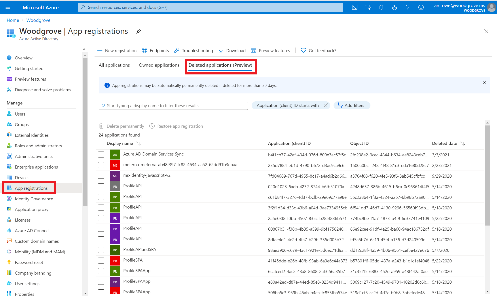
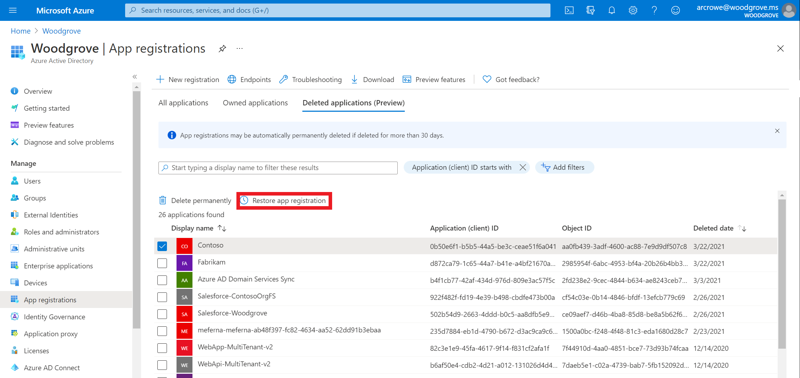
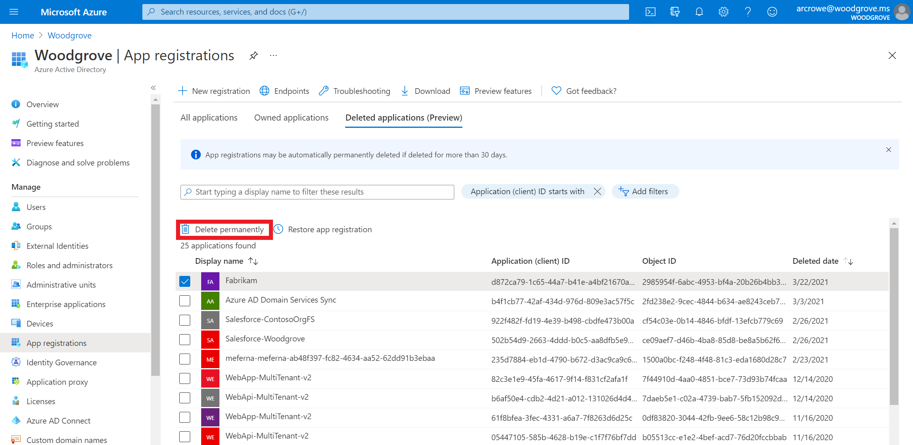

# Restore or remove a recently deleted application with the Microsoft identity platform
After you delete an app registration, the app remains in a suspended state for 30 days. During that 30-day window, the app registration can be restored, along with all its properties. After that 30-day window passes, app registrations cannot be restored and the permanent deletion process may be automatically started.

You can view your deleted applications, restore a deleted application, or permanently delete an application using the App Registrations experience under Azure Active Directory (Azure AD) in the Azure portal.

>[!Important]
>Neither you nor Microsoft customer support can restore a permanently deleted application.

## Required permissions
You must have one of the following roles to permanently delete applications.

- Global administrator

- Application administrator

- Cloud application administrator

- Hybrid identity administrator

- Application owner

You must have one of the following roles to restore applications.

- Global administrator

- Application owner

## Deleted applications UI | Preview

> [!IMPORTANT]
> The deleted applications portal UI feature [!INCLUDE [PREVIEW BOILERPLATE](../../../includes/active-directory-develop-preview.md)]

### View your deleted applications
You can see all the applications in a soft deleted state.  Only applications deleted less than 30 days ago can be restored.

#### To view your restorable applications
1. Sign in to the [Azure portal](https://portal.azure.com/).

2. Select **Azure Active Directory**, select **App Registrations**, and then select the **Deleted applications (Preview)** tab.

    Review the list of applications. Only applications that have been deleted in the past 30 days are available to restore. You can filter by the 'Deleted date' column to see only these applications.

    

### Restore a recently deleted application

When an app registration is deleted from the organization, the app is in a suspended state and its configurations are preserved. When you restore a app registration, its configurations are also restored.  However, if there were any organization-specific settings in **Enterprise applications**, those will not be restored.  This is because organization-specific settings are stored on a separate object, called the service principal.  For more information, see [Application and service principal objects](app-objects-and-service-principals.md). 

#### To restore an application
1. On the **Deleted applications** tab, search for and select one of the applications deleted less than 30 days ago. For example, _Contoso_.

2. Select **Restore app registration**.

    

### Permanently delete an application
You can manually permanently delete an application from your organization. A permanently deleted application can't be restored by you, another administrator, nor by Microsoft customer support.

#### To permanently delete an application

1. On the **Deleted applications** tab, search for and select one of the available applications. For example, _Fabrikam_.

2. Select **Delete permanently**.

    

## Next steps
After you've restored or permanently deleted your app, you can:

- [Add an application](quickstart-register-app.md)

- Learn more about [application and service principal objects](app-objects-and-service-principals.md) in the Microsoft identity platform.
