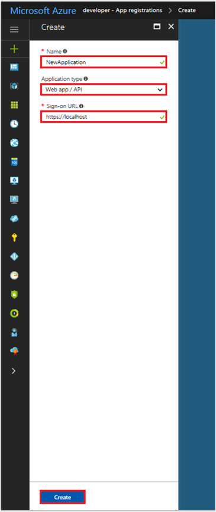

# Quickstart: Register an app with the Azure Active Directory v1.0 endpoint

[!INCLUDE [active-directory-develop-applies-v1](../../../includes/active-directory-develop-applies-v1.md)]

Enterprise developers and software-as-a-service (SaaS) providers can develop commercial cloud services or line-of-business applications, that can be integrated with Azure Active Directory (Azure AD) to provide secure sign-in and authorization for their services. To integrate an application or service with Azure AD, a developer must first register the application with Azure AD.

Any application that wants to use the capabilities of Azure AD must first be registered in an Azure AD tenant. This registration process involves giving Azure AD details about your application, such as the URL where it’s located, the URL to send replies after a user is authenticated, the URI that identifies the app, and so on.

This quickstart shows you how to add and register an application in Azure AD.

## Prerequisites

To get started, make sure have an Azure AD tenant that you can use to register your apps to. If you don't already have a tenant, [learn how to get one](quickstart-create-new-tenant.md).

## Register a new application using the Azure portal

1. Sign in to the [Azure portal](https://portal.azure.com).
1. If your account gives you access to more than one, select your account in the top right corner, and set your portal session to the desired Azure AD tenant.
1. In the left-hand navigation pane, select the **Azure Active Directory** service.
1. Select **App registrations** and then select **New application registration**.

    

1. When the **Create** page appears, enter your application's registration information: 

    - **Name:** Enter a meaningful application name
    - **Application type:**
      - Select **Native** for [client applications](developer-glossary.md#client-application) that are installed locally on a device. This setting is used for OAuth public [native clients](developer-glossary.md#native-client).
      - Select **Web app/API** for [client applications](developer-glossary.md#client-application) and [resource/API applications](developer-glossary.md#resource-server) that are installed on a secure server. This setting is used for OAuth confidential [web clients](developer-glossary.md#web-client) and public [user-agent-based clients](developer-glossary.md#user-agent-based-client). The same application can also expose both a client and resource/API.
    - **Sign-On URL:** For "Web app / API" applications, provide the base URL of your app. For example, `http://localhost:31544` might be the URL for a web app running on your local machine. Users would use this URL to sign in to a web client application. 
    - **Redirect URI:** For "Native" applications, provide the URI used by Azure AD to return token responses. Enter a value specific to your application, for example `http://MyFirstAADApp`

      

    If you'd like specific examples for web applications or native applications, check out the **Quickstarts** in our documentation.

1. When finished, select **Create**.

    Azure AD assigns a unique Application ID to your application, and you're taken to your application's main registration page. Depending on whether your application is a web or native application, different options are provided to add additional capabilities to your application.

      > [!NOTE]
      > By default, a newly registered web application is configured to allow **only** users from the same tenant to sign in to your application.

## Next steps

- See [Azure AD consent framework](consent-framework.md) for an overview of consent.
- To enable additional configuration features in your application registration--such as credentials, permissions, enable sign-in for users from other tenants--see [Update an application in Azure AD](quickstart-v1-update-azure-ad-app.md).
- Learn more about the two Azure AD objects that represent a registered application and the relationship between them, see [Application objects and service principal objects](app-objects-and-service-principals.md).
- Learn more about the branding guidelines you should use when developing applications with Azure Active Directory, see [Branding guidelines for applications](howto-add-branding-in-azure-ad-apps.md).
