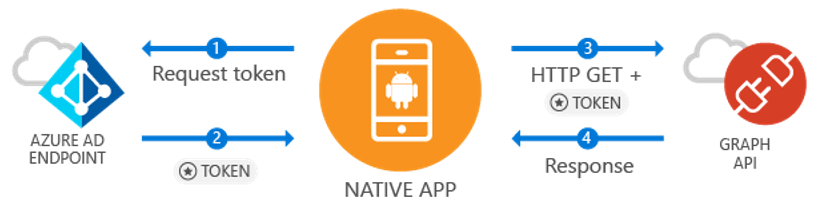

# Quickstart: Sign in users and call the Microsoft Graph API from an Android app

[!INCLUDE [active-directory-develop-applies-v1-adal](../../../includes/active-directory-develop-applies-v1-adal.md)]

If you're developing an Android application, Microsoft makes it simple and straightforward to sign in Azure Active Directory (Azure AD) users. Azure AD enables your application to access user data through the Microsoft Graph or your own protected web API.

The Azure AD Authentication Library (ADAL) Android library gives your app the ability to begin using the
[Microsoft Azure Cloud](https://cloud.microsoft.com) and [Microsoft Graph API](https://developer.microsoft.com/graph) by supporting [Microsoft Azure Active Directory accounts](https://azure.microsoft.com/services/active-directory/) using industry standard OAuth 2.0 and OpenID Connect.

In this quickstart, you'll learn how to:

* Get a token for the Microsoft Graph
* Refresh a token
* Call the Microsoft Graph
* Sign out the user

## Prerequisites

To get started, you'll need an Azure AD tenant where you can create users and register an application. If you don't already have a tenant, [learn how to get one](quickstart-create-new-tenant.md).

## Scenario: Sign in users and call the Microsoft Graph



You can use this app for all Azure AD accounts. It supports both single-tenant and multi-tenant scenarios (discussed in steps). It demonstrates how you can build apps to connect with enterprise users and access their Azure + O365 data through the Microsoft Graph. During the auth flow, end users will be required to sign in and consent to the permissions of the application, and in some cases may require an admin to consent to the app. The majority of the logic in this sample shows how to auth an end user and make a basic call to the Microsoft Graph.

## Sample code

You can find the full sample code [on GitHub](https://github.com/Azure-Samples/active-directory-android).

```Java
// Initialize your app with MSAL
AuthenticationContext mAuthContext = new AuthenticationContext(
        MainActivity.this,
        AUTHORITY,
        false);


// Perform authentication requests
mAuthContext.acquireToken(
    getActivity(),
    RESOURCE_ID,
    CLIENT_ID,
    REDIRECT_URI,
    PromptBehavior.Auto,
    getAuthInteractiveCallback());

// ...

// Get tokens to call APIs like the Microsoft Graph
mAuthResult.getAccessToken()
```

## Step 1: Register and configure your app

You will need to have a native client application registered with Microsoft using the
[Azure portal](https://portal.azure.com).

1. Getting to app registration
    - Navigate to the [Azure portal](https://aad.portal.azure.com).
    - Select ***Azure Active Directory*** > ***App Registrations***.

2. Create the app
    - Select **New registration**.
    - Enter an app name in the **Name** field.
    - Under **Supported account types**, select **Accounts in any organizational directory and personal Microsoft accounts**.
    - In **Redirect URI**, select **Public client (mobile and desktop)** from the dropdown and enter `http://localhost`.
    - Click **Register**.

3. Configure Microsoft Graph
    - Select **API permissions**.
    - Select **Add a permission**, inside **Select an API** select ***Microsoft Graph***.
    - Under **Delegated permissions**, select the permission **User.Read**, then hit **Add** to save.        
    
4. Congrats! Your app is successfully configured. In the next section, you'll need:
    - `Application ID`
    - `Redirect URI`

## Step 2: Get the sample code

1. Clone the code.
    ```
    git clone https://github.com/Azure-Samples/active-directory-android
    ```
2. Open the sample in Android Studio.
    - Select **Open an existing Android Studio project**.

## Step 3: Configure your code

You can find all the configuration for this code sample in the ***src/main/java/com/azuresamples/azuresampleapp/MainActivity.java*** file.

1. Replace the constant `CLIENT_ID` with the `ApplicationID`.
2. Replace the constant `REDIRECT URI` with the `Redirect URI` you configured earlier (`http://localhost`).

## Step 4: Run the sample

1. Select **Build > Clean Project**.
2. Select **Run > Run app**.
3. The app should build and show some basic UX. When you click the `Call Graph API` button, it will prompt for a sign in, and then silently call the Microsoft Graph API with the new token.

## Next steps

1. Check the [ADAL Android Wiki](https://github.com/AzureAD/azure-activedirectory-library-for-android/wiki) for more info on the library mechanics and how to configure new scenarios and capabilities.
2. In Native scenarios, the app will use an embedded Webview and will not leave the app. The `Redirect URI` can be arbitrary.
3. Find any problems or have requests? You can create an issue or post on Stack Overflow with the tag `azure-active-directory`.

### Cross-app SSO

Learn [how to enable cross-app SSO on Android by using ADAL](howto-v1-enable-sso-android.md).

### Auth telemetry

The ADAL library exposes auth telemetry to help app developers understand how their apps are behaving and build better experiences. This allows you to capture sign in success, active users, and several other interesting insights. Using auth telemetry does require app developers to establish a telemetry service to aggregate and store events.

To learn more about auth telemetry, checkout [ADAL Android auth telemetry](https://github.com/AzureAD/azure-activedirectory-library-for-android/wiki/Telemetry).
