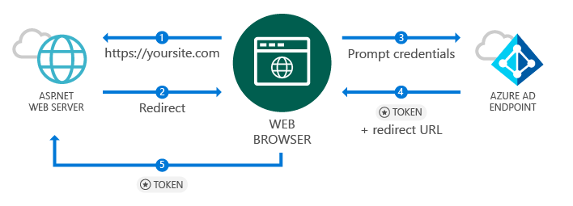
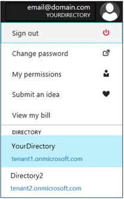

# Quickstart: Add sign-in with Microsoft to an ASP.NET web app

[!INCLUDE [active-directory-develop-applies-v1](../../../includes/active-directory-develop-applies-v1.md)]

In this quickstart, you'll learn how to implement sign-in with Microsoft using an ASP.NET Model View Controller (MVC) solution with a traditional web browser-based application using OpenID Connect. You'll learn how to enable sign-ins from work and school accounts in your ASP.NET application.

At the end of this quickstart, your application will accept sign ins of work and school accounts from organizations that have integrated with Azure Active Directory (Azure AD).

> [!NOTE]
> If you need to enable sign-ins for personal accounts in addition to work and school accounts, you can use the *[Microsoft identity platform endpoint](azure-ad-endpoint-comparison.md)*. For more info, see [this ASP.NET tutorial](tutorial-v2-asp-webapp.md) as well as [this article](active-directory-v2-limitations.md) explaining  the *Microsoft identity platform endpoint*.

## Prerequisites

To get started, make sure you meet these prerequisites:

* Have Visual Studio 2015 Update 3 or later installed. Don’t have it? [Download Visual Studio 2019 for free](https://www.visualstudio.com/downloads/)

## Scenario: Sign in users from work and school accounts in your ASP.NET app



A browser accesses an ASP.NET web site and requests a user to authenticate using a sign in button in this scenario. In this scenario, most of the work to render the web page occurs on the server side.

The quickstart demonstrates how to sign in users on an ASP.NET web application starting from an empty template. It also includes steps such as adding a sign-in button and every controller and methods and discusses the concepts behind these tasks. You can also create a project to sign in Azure AD users (work and school accounts) by using the [Visual Studio web template](https://docs.microsoft.com/aspnet/visual-studio/overview/2013/creating-web-projects-in-visual-studio#organizational-account-authentication-options) and selecting **Organizational Accounts** and then one of the cloud options - this option uses a richer template, with additional controllers, methods, and views.

## Libraries

This quickstart uses the following packages:

| Library | Description |
|---|---|
| [Microsoft.Owin.Security.OpenIdConnect](https://www.nuget.org/packages/Microsoft.Owin.Security.OpenIdConnect/) | Middleware that enables an application to use OpenIdConnect for authentication |
| [Microsoft.Owin.Security.Cookies](https://www.nuget.org/packages/Microsoft.Owin.Security.Cookies) |Middleware that enables an application to maintain user session using cookies |
| [Microsoft.Owin.Host.SystemWeb](https://www.nuget.org/packages/Microsoft.Owin.Host.SystemWeb) | Enables OWIN-based applications to run on IIS using the ASP.NET request pipeline |
|  |  |

## Step 1: Set up your project

These steps show how to install and configure the authentication pipeline through the OWIN middleware on an ASP.NET project using OpenID Connect.

To download this sample's Visual Studio project instead, follow these steps:
1. [Download the project on GitHub](https://github.com/AzureADQuickStarts/WebApp-OpenIdConnect-DotNet/archive/GuidedSetup.zip).
1. Skip to the Configuration step to configure the code sample before executing.

## Step 2: Create your ASP.NET project

1. In Visual Studio, go to **File > New > Project**.
2. For **Project type**, select **Web**, then select **ASP.NET Web Application (.NET Framework)**.
3. Name your application and select **Create**.
4. Select **Empty** and then select **MVC** under **Add folders & core references** to add MVC references.
5. Select **Create**.

## Step 3: Add authentication components

1. In Visual Studio, go to **Tools > Nuget Package Manager > Package Manager Console**.
2. Add **OWIN middleware NuGet packages** by typing the following in the Package Manager Console window:

    ```powershell
    Install-Package Microsoft.Owin.Security.OpenIdConnect
    Install-Package Microsoft.Owin.Security.Cookies
    Install-Package Microsoft.Owin.Host.SystemWeb
    ```

<!--start-collapse-->
> ### About these packages
>The libraries above enable single sign-on (SSO) using OpenID Connect via cookie-based authentication. After authentication is completed and the token representing the user is sent to your application, OWIN middleware creates a session cookie. The browser then uses this cookie on subsequent requests so the user doesn't need to reauthenticate, and no additional verification is needed.
<!--end-collapse-->

## Step 4: Configure the authentication pipeline

Follow these steps to create an OWIN middleware *Startup Class* to configure OpenID Connect authentication. This class is executed automatically.

> [!TIP]
> If your project doesn't have a `Startup.cs` file in the root folder:<br/>
> 1. Right-click on the project's root folder: >	**Add > New Item... > OWIN Startup class**<br/>
> 2. Name it `Startup.cs`<br/>
>
>> Make sure the class selected is an OWIN Startup Class and not a standard C# class. Confirm this by checking if you see `[assembly: OwinStartup(typeof({NameSpace}.Startup))]` above the namespace.

To create an OWIN middleware *Startup Class*:

1. Add *OWIN* and *Microsoft.IdentityModel* namespaces to `Startup.cs`:

    [!code-csharp[main](../../../WebApp-OpenIDConnect-DotNet/WebApp-OpenIDConnect-DotNet/Startup.cs?name=AddedNameSpaces "Startup.cs")]

2. Replace Startup class with the following code:

    [!code-csharp[main](../../../WebApp-OpenIDConnect-DotNet/WebApp-OpenIDConnect-DotNet/Startup.cs?name=Startup "Startup.cs")]

<!--start-collapse-->
> [!NOTE]
> The parameters you provide in *OpenIDConnectAuthenticationOptions* serve as coordinates for the application to communicate with Azure AD. Because the OpenID Connect middleware uses cookies, you also need to set up cookie authentication as the preceding code shows. The *ValidateIssuer* value tells OpenIdConnect to not restrict access to one specific organization.
<!--end-collapse-->

<!--end-setup-->

<!--start-use-->

## Step 5: Add a controller to handle sign-in and sign-out requests

Create a new controller to expose sign-in and sign-out methods.

1.	Right-click the **Controllers** folder and select **Add > Controller**
2.	Select **MVC {version} Controller – Empty**.
3.	Select **Add**.
4.	Name it `HomeController` and select **Add**.
5.	Add **OWIN** namespaces to the class:

    [!code-csharp[main](../../../WebApp-OpenIDConnect-DotNet/WebApp-OpenIDConnect-DotNet/Controllers/HomeController.cs?name=AddedNameSpaces "HomeController.cs")]

6. Add the following methods to handle sign-in and sign-out to your controller by initiating an authentication challenge via code:

    [!code-csharp[main](../../../WebApp-OpenIDConnect-DotNet/WebApp-OpenIDConnect-DotNet/Controllers/HomeController.cs?name=SigInAndSignOut "HomeController.cs")]

## Step 6: Create the app's home page to sign in users via a sign-in button

In Visual Studio, create a new view to add the sign-in button and display user information after authentication:

1. Right-click the **Views\Home** folder and select **Add View**.
1. Name it **Index**.
1. Add the following HTML, which includes the sign-in button, to the file:

    [!code-html[main](../../../WebApp-OpenIDConnect-DotNet/WebApp-OpenIDConnect-DotNet/Views/Home/Index.cshtml "Index.cshtml")]

<!--start-collapse-->
This page adds a sign-in button in SVG format with a black background:<br/><br/> For more sign-in buttons, go to [Branding guidelines for applications](howto-add-branding-in-azure-ad-apps.md).
<!--end-collapse-->

## Step 7: Display user's claims by adding a controller

This controller demonstrates the uses of the `[Authorize]` attribute to protect a controller. This attribute restricts access to the controller by only allowing authenticated users. The following code makes use of the attribute to display user claims that were retrieved as part of the sign-in.

1. Right-click the **Controllers** folder, then select **Add > Controller**.
1. Select **MVC {version} Controller – Empty**.
1. Select **Add**.
1. Name it **ClaimsController**.
1. Replace the code of your controller class with the following code - this example adds the `[Authorize]` attribute to the class:

    [!code-csharp[main](../../../WebApp-OpenIDConnect-DotNet/WebApp-OpenIDConnect-DotNet/Controllers/ClaimsController.cs?name=ClaimsController "ClaimsController.cs")]

<!--start-collapse-->
> [!NOTE]
> Because of the use of the `[Authorize]` attribute, all methods of this controller can only be executed if the user is authenticated. If the user is not authenticated and tries to access the controller, OWIN initiates an authentication challenge and force the user to authenticate. The code above looks at the claims collection of the user for specific attributes included in the user’s token. These attributes include the user’s full name and username, as well as the global user identifier subject. It also contains the *Tenant ID*, which represents the ID for the user’s organization.
<!--end-collapse-->

## Step 8: Create a view to display the user's claims

In Visual Studio, create a new view to display the user's claims in a web page:

1. Right-click the **Views\Claims** folder, then select **Add View**.
1. Name it **Index**.
1. Add the following HTML to the file:

    [!code-html[main](../../../WebApp-OpenIDConnect-DotNet/WebApp-OpenIDConnect-DotNet/Views/Claims/Index.cshtml "Index.cshtml")]

<!--end-use-->

<!--start-configure-->

## Step 9: Configure your *web.config* and register an application

1. In Visual Studio, add the following to `web.config` (located in the root folder) under the section `configuration\appSettings`:

    ```xml
    <add key="ClientId" value="Enter_the_Application_Id_here" />
    <add key="RedirectUrl" value="Enter_the_Redirect_Url_here" />
    <add key="Tenant" value="common" />
    <add key="Authority" value="https://login.microsoftonline.com/{0}" />
    ```
2. In Solution Explorer, select the project and look at the <i>Properties</i> window (if you don’t see a Properties window, press F4)
3. Change SSL Enabled to <code>True</code>
4. Copy the project's SSL URL to the clipboard:<br/><br/><br />
5. In <code>web.config</code>, replace <code>Enter_the_Redirect_URL_here</code> with the SSL URL of your project.

### Register your application in the Azure portal, then add its information to *web.config*

1. Sign in to the [Azure portal](https://portal.azure.com/) using either a work or school account, or a personal Microsoft account.
2. If your account gives you access to more than one tenant, select your account in the top right corner, and set your portal session to the desired Azure AD tenant.
3. Navigate to the Microsoft identity platform for developers [App registrations](https://go.microsoft.com/fwlink/?linkid=2083908) page.
4. Select **New registration**.
5. When the **Register an application** page appears, enter a name for your application.
6. Under **Supported account types**, select **Accounts in any organizational directory and personal Microsoft accounts**.
7. Select the **Web** platform under the **Redirect URI** section and set the value to the Visual Studio project's *SSL URL* (the location to which Azure AD will return tokens).
78. When finished, select **Register**. On the app **Overview** page, copy the **Application (client) ID** value.
9. Go back to Visual Studio and, in `web.config`, replace `Enter_the_Application_Id_here` with the Application ID from the application you registered.

> [!TIP]
> If your account is configured to access to multiple directories, make sure you have selected the right directory for the organization you want the application to be registered by clicking on your account name in the top right in the Azure portal, and then verifying the selected directory as indicated:<br/>

## Step 10: Configure sign-in options

You can configure your application to allow only users that belong to one organization's Azure AD instance to sign in, or accept sign-ins from users that belong to any organization. Follow the instructions of one of following choices:

### Configure your application to allow sign ins of work and school accounts from any company or organization (multi-tenant)

Follow the following steps if you want to accept sign ins of work and school accounts from any company or organization that has integrated with Azure AD. This scenario is common for *SaaS applications*:

1. Go back to [Microsoft Azure portal - App registrations](https://portal.azure.com/#blade/Microsoft_AAD_IAM/ActiveDirectoryMenuBlade/RegisteredApps) and locate the application you registered.
2. Under **All Settings**, select **Properties**.
3. Change **Multi-tenanted** property to **Yes**, and then select **Save**.

For more information about this setting and the concept of multi-tenant applications, see [Multi-tenant overview](howto-convert-app-to-be-multi-tenant.md).

### Restrict users from only one organization's Active Directory instance to sign in to your application (single-tenant)

This option is a common scenario for line-of-business applications.

If you want your application to accept sign-ins only from accounts that belong to a specific Azure AD instance (including *guest accounts* of that instance), follow these steps:

1. Replace the `Tenant` parameter in *web.config* from `Common` with the tenant name of the organization – example, *contoso.onmicrosoft.com*.
1. Change the `ValidateIssuer` argument in your [*OWIN Startup class*](#step-4-configure-the-authentication-pipeline) to `true`.

To allow users from only a list of specific organizations, follow these steps:

1. Set `ValidateIssuer` to true.
1. Use the `ValidIssuers` parameter to specify a list of organizations.

Another option is to implement a custom method to validate the issuers using the *IssuerValidator* parameter. For more information about `TokenValidationParameters`, see [this MSDN article](https://msdn.microsoft.com/library/system.identitymodel.tokens.tokenvalidationparameters.aspx "TokenValidationParameters MSDN article").

<!--end-configure-->

<!--start-configure-arp-->
<!--
## Configure your ASP.NET Web App with the application's registration information

In this step, you will configure your project to use SSL, and then use the SSL URL to configure your application’s registration information. After this, add the application’ registration information to your solution via *web.config*.

1.	In Solution Explorer, select the project and look at the `Properties` window (if you don’t see a Properties window, press F4)
2.	Change `SSL Enabled` to `True`
3.	Copy the value from `SSL URL` above and paste it in the `Redirect URL` field on the top of this page, then click *Update*:<br/><br/><br />
4.	Add the following in `web.config` file located in root’s folder, under section `configuration\appSettings`:

```xml
<add key="ClientId" value="[Enter the application Id here]" />
<add key="RedirectUri" value="[Enter the Redirect URL here]" />
<add key="Tenant" value="common" />
<add key="Authority" value="https://login.microsoftonline.com/{0}" /> 
```
-->
<!--end-configure-arp-->
<!--start-test-->

## Step 11: Test your code

1. Press **F5** to run your project in Visual Studio. The browser opens and directs you to `http://localhost:{port}` where you see the **Sign in with Microsoft** button.
1. Select the button to sign in.

### Sign in

When you're ready to test, use a work account (Azure AD) to sign in.


#### Expected results

After the user signs in, the user is redirected to the home page of your web site, which is the HTTPS URL specified in your application's registration information in the Microsoft Application Registration Portal. This page now shows *Hello {User}* and a link to sign out, and a link to see the user’s claims – which is a link to the Authorize controller created earlier.

### See user's claims

Select the hyperlink to see the user's claims. This action leads you to the controller and view that is only available to users that are authenticated.

#### Expected results

 You should see a table containing the basic properties of the logged user:

| Property | Value | Description |
|---|---|---|
| Name | {User Full Name} | The user’s first and last name |
| Username | <span>user@domain.com</span> | The username used to identify the logged user |
| Subject| {Subject} |A string to uniquely identify the user sign in across the web |
| Tenant ID | {Guid} | A *guid* to uniquely represent the user’s Azure AD organization |

In addition, you see a table including all user claims included in authentication request. For a list of all claims in an ID Token and their explanation, see [List of claims in ID token](https://docs.microsoft.com/azure/active-directory/develop/active-directory-token-and-claims).

### (Optional) Access a method that has an *[Authorize]* attribute

In this step, you test accessing the Claims controller as an anonymous user:<br/>
Select the link to sign-out the user and complete the sign-out process.<br/>
Now in your browser, type `http://localhost:{port}/claims` to access your controller that is protected with the `[Authorize]` attribute

#### Expected results

You should receive the prompt requiring you to authenticate to see the view.

## Additional information

<!--start-collapse-->
### Protect your entire web site

To protect your entire web site, add the `AuthorizeAttribute` to `GlobalFilters` in `Global.asax` `Application_Start` method:

```csharp
GlobalFilters.Filters.Add(new AuthorizeAttribute());
```
<!--end-collapse-->

<div></div>
<br/>

<!--end-test-->

## Next steps

You can now move on to additional scenarios.

> [!div class="nextstepaction"]
> [ASP.NET tutorial](https://docs.microsoft.com/azure/active-directory/develop/tutorial-v2-asp-webapp)
