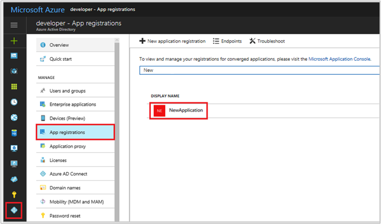
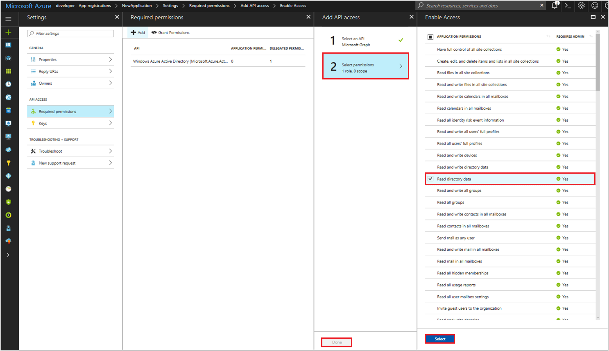

# Quickstart: Update an application in Azure Active Directory

Enterprise developers and software-as-a-service (SaaS) providers who have registered applications with Azure Active Directory (Azure AD) may need to configure your applications to access other resources such as web APIs, make it available in other organizations, and more.

In this quickstart, you'll learn the various ways you can configure or update your application to meet yours and other organizations' requirements or needs.

## Prerequisites

To get started, make sure you've completed these steps:

* Read the overview of the [Azure AD consent framework](consent-framework.md), which is important to understand when building applications that need to be used by other users or applications.
* Have an Azure AD tenant that has applications registered to it.
  * If you don't already have a tenant, [learn how to get one](quickstart-create-new-tenant.md).
  * If you don't have apps registered in your tenant, [learn how to add an application to Azure AD](quickstart-v1-integrate-apps-with-azure-ad.md).

## Configure a client application to access web APIs

For a web/confidential client application to be able to participate in an authorization grant flow that requires authentication (and obtain an access token), it must establish secure credentials. The default authentication method supported by the Azure portal is client ID + secret key. This section covers the configuration steps required to provide the secret key with your client's credentials.

Before a client can access a web API exposed by a resource application (such as the Microsoft Graph API), the consent framework ensures the client obtains the permission grant required, based on the permissions requested. By default, all applications can choose permissions from **Azure Active Directory** (Graph API) and Azure classic deployment model. The [Graph API “Sign-in and read user profile” permission](https://msdn.microsoft.com/Library/Azure/Ad/Graph/howto/azure-ad-graph-api-permission-scopes#PermissionScopeDetails) is also selected by default. If your client is being registered in a tenant that has accounts subscribed to Office 365, web APIs and permissions for SharePoint and Exchange Online are available for selection. You can select from two types of permissions for each desired web API:

- Application permissions: Your client application needs to access the web API directly as itself (no user context). This type of permission requires administrator consent and is also not available for native client applications.
- Delegated permissions: Your client application needs to access the web API as the signed-in user, but with access limited by the selected permission. This type of permission can be granted by a user unless the permission requires administrator consent.

  > [!NOTE]
  > Adding a delegated permission to an application does not automatically grant consent to the users within the tenant. Users must still manually consent for the added delegated permissions at runtime, unless the administrator grants consent on behalf of all users.

### Add application credentials, or permissions to access web APIs

1. Sign in to the [Azure portal](https://portal.azure.com).
2. If your account gives you access to more than one, select your account in the top right corner, and set your portal session to the desired Azure AD tenant.
3. In the left-hand navigation pane, select the **Azure Active Directory** service, select **App registrations**, and then find/select the application you want to configure.

   

4. You are taken to the application's main registration page, which contains the **Settings** page for the application. To add a credential for your web application:
  1. Select the **Keys** section on the **Settings** page.
  2. To add a certificate:
    - Select **Upload Public Key**.
    - Select the file you'd like to upload. It must be one of the following file types: .cer, .pem, .crt.
  - To add a password:
    - Add a description for your key.
    - Select a duration.
    - Select **Save**. The right-most column will contain the key value, after you save the configuration changes. **Be sure to copy the key** for use in your client application code, as it is not accessible once you leave this page.

5. To add permission(s) to access resource APIs from your client
  1. Select the **Required permissions** section on the **Settings** page, and then select **Add**.
  1. Select **Select an API** to select the type of resources you want to pick from.
  1. Browse through the list of available APIs or use the search box to select from the available resource applications in your directory that expose a web API. Select the resource you are interested in, then click **Select**.
  1. In the **Enable Access** page, select the application permissions and/or delegated permissions that your application needs when accessing the API.
   
  

  

6. When finished, select the **Select** button on **Enable Access** page, then the  **Done** button on the **Add API access** page. You are returned to the **Required permissions** page, where the new resource is added to the list of APIs.

## Configuring a resource application to expose web APIs

You can develop a web API and make it available to client applications by exposing access [scopes](developer-glossary.md#scopes) and [roles](developer-glossary.md#roles). A correctly configured web API is made available just like the other Microsoft web APIs, including the Graph API and the Office 365 APIs. Access scopes and roles are exposed through your [application's manifest](developer-glossary.md#application-manifest), which is a JSON file that represents your application’s identity configuration.

The following section shows you how to expose access scopes, by modifying the resource application's manifest.

### Add access scopes to your resource application

1. Sign in to the [Azure portal](https://portal.azure.com).
2. If your account gives you access to more than one, select your account in the top right corner, and set your portal session to the desired Azure AD tenant.
3. In the left-hand navigation pane, select the **Azure Active Directory > App registrations**, then find/select the application you want to configure.

   

4. You are taken to the application's main registration page, which opens up the **Settings** page for the application. Switch to the **Edit manifest** page by clicking **Manifest** from the application's registration page. A web-based manifest editor opens, allowing you to **Edit** the manifest within the portal. Optionally, you can click **Download** and edit locally, then use **Upload** to reapply it to your application.
5. In this example, we will expose a new scope called `Employees.Read.All` on our resource/API, by adding the following JSON element to the `oauth2Permissions` collection. The existing `user_impersonation` scope is provided by default during registration. `user_impersonation` allows a client application to request permission to access the resource, under the identity of the signed-in user. Be sure to add the comma after the existing `user_impersonation` scope element, and change the property values to suit your resource's needs. 

  ```json
  {
    "adminConsentDescription": "Allow the application to have read-only access to all Employee data.",
    "adminConsentDisplayName": "Read-only access to Employee records",
    "id": "2b351394-d7a7-4a84-841e-08a6a17e4cb8",
    "isEnabled": true,
    "type": "User",
    "userConsentDescription": "Allow the application to have read-only access to your Employee data.",
    "userConsentDisplayName": "Read-only access to your Employee records",
    "value": "Employees.Read.All"
  }
  ```

  > [!NOTE]
  > The `id` value must be generated programatically or using a GUID generation tool such as [guidgen](https://msdn.microsoft.com/library/ms241442%28v=vs.80%29.aspx). The `id` represents a unique identifier for the scope as exposed by the web API. Once a client is appropriately configured with permissions to access your web API, it is issued an OAuth2.0 access token by Azure AD. When the client calls the web API, it presents the access token that has the scope (scp) claim set to the permissions requested in its application registration.
  >
  > You can expose additional scopes later as necessary. Consider that your web API might expose multiple scopes associated with a variety of different functions. Your resource can control access to the web API at runtime, by evaluating the scope (`scp`) claim(s) in the received OAuth 2.0 access token.

6. When finished, click **Save**. Now your web API is configured for use by other applications in your directory.

  

### Verify the web API is exposed to other applications in your tenant

1. Go back to your Azure AD tenant, select **App registrations** again, then find/select the client application you want to configure.

   

2. Repeat step 5 as you did in [Configure a client application to access web APIs](#configure-a-client-application-to-access-web-apis). When you get to the **Select an API** step, search for your resource by entering its application name in the search field, and click **Select**.

3. On the **Enable Access** page you should see the new scope, available for client permission requests.

  

### More on the application manifest

The application manifest serves as a mechanism for updating the Application entity, which defines all attributes of an Azure AD application's identity configuration, including the API access scopes we discussed. For more information on the Application entity and its schema, see the [Graph API Application entity documentation](https://msdn.microsoft.com/Library/Azure/Ad/Graph/api/entity-and-complex-type-reference#application-entity). The article contains complete reference information on the Application entity members used to specify permissions for your API, including:  

- The appRoles member, which is a collection of [AppRole](https://msdn.microsoft.com/Library/Azure/Ad/Graph/api/entity-and-complex-type-reference#approle-type) entities, used to define [application permissions](developer-glossary.md#permissions) for a web API. 
- The oauth2Permissions member, which is a collection of [OAuth2Permission](https://msdn.microsoft.com/Library/Azure/Ad/Graph/api/entity-and-complex-type-reference#oauth2permission-type) entities, used to define [delegated permissions](developer-glossary.md#permissions) for a web API.

For more info on application manifest concepts in general, see [Azure AD app manifest](reference-app-manifest.md).

## Accessing the Azure AD Graph and Office 365 via Microsoft Graph APIs  

As mentioned earlier, in addition to exposing/accessing APIs for your own applications, you can register your client application to access APIs exposed by Microsoft resources. The Microsoft Graph API, referred to as “Microsoft Graph” in the portal's resource/API list, is available to all applications that are registered with Azure AD. If you are registering your client application in a tenant containing accounts that have signed up for an Office 365 subscription, you can also access the scopes exposed by the various Office 365 resources.

For a complete discussion on scopes exposed by Microsoft Graph API, see the [Microsoft Graph permissions reference](https://developer.microsoft.com/en-us/graph/docs/concepts/permissions_reference) article.

> [!NOTE]
> Due to a current limitation, native client applications can only call into the Azure AD Graph API if they use the “Access your organization's directory” permission. This restriction does not apply for web applications.

## Configuring multi-tenant applications

When registering an application in Azure AD, you may want your application to be accessed only by users in your organization. Alternatively, you may also want your application to be accessible by users in external organizations. These two application types are called single-tenant and multi-tenant applications. This section discusses how to modify the configuration of a single-tenant application to make it a multi-tenant application.

It’s important to note the differences between a single-tenant and multi-tenant application:  

- A single-tenant application is intended for use in one organization. It's typically a line-of-business (LoB) application written by an enterprise developer. A single-tenant application can only be accessed by users with accounts in the same tenant as the application registration. As a result, it only needs to be provisioned in one directory.
- A multi-tenant application is intended for use in many organizations. Referred to as a software-as-a-service (SaaS) web application, it's typically written by an independent software vendor (ISV). Multi-tenant applications must be provisioned in each tenant where users need access. For tenants other than the one where the application is registered, user or administrator consent is required in order to register them. Note that native client applications are multi-tenant by default as they are installed on the resource owner's device. See the preceding [Overview of the consent framework](#overview-of-the-consent-framework) section for details on the consent framework.

Making an application multi-tenant requires both application registration changes, as well as changes to the web application itself. The following sections cover both.

### Changing the application registration to support multi-tenant

If you are writing an application that you want to make available to your customers or partners outside of your organization, you need to update the application definition in the Azure portal.

> [!IMPORTANT]
> Azure AD requires the App ID URI of multi-tenant applications to be globally unique. The App ID URI is one of the ways an application is identified in protocol messages. For a single tenant application, it is sufficient for the App ID URI to be unique within that tenant. For a multi-tenant application, it must be globally unique so Azure AD can find the application across all tenants.
> Global uniqueness is enforced by requiring the App ID URI to have a host name that matches a verified domain of the Azure AD tenant. For example, if the name of your tenant is contoso.onmicrosoft.com then a valid App ID URI would be https://contoso.onmicrosoft.com/myapp. If your tenant has a verified domain of contoso.com, then a valid App ID URI would also be https://contoso.com/myapp. If the App ID URI doesn’t follow this pattern, setting an application as multi-tenant fails.

To give external users the ability to access your application:

1. Sign in to the [Azure portal](https://portal.azure.com).
2. If your account gives you access to more than one, click your account in the top right corner, and set your portal session to the desired Azure AD tenant.
3. In the left-hand navigation pane, click the **Azure Active Directory** service, click **App registrations**, then find/click the application you want to configure. You are taken to the application's main registration page, which opens up the **Settings** page for the application.
4. From the **Settings** page, click **Properties** and change the **Multi-tenanted** switch to **Yes**.

After you have made the changes, users and administrators in other organizations are able to grant their users the ability to sign in to your application, allowing your application to access resources secured by their tenant.

### Changing the application to support multi-tenant

Support for multi-tenant applications relies heavily on the Azure AD consent framework. Consent is the mechanism that allows a user from another tenant to grant the application access to resources secured by the user's tenant. This experience is referred to as "user consent."

Your web application may also offer:

- The ability for administrators to "sign up my company." This experience, referred to as "admin consent", gives an administrator the capability to grant consent on behalf *all users* in their organization. Only a user that authenticates with an account that belongs to the Global Admin role can provide admin consent; others receive an error.
- A sign-up experience for users. It is expected that the user is provided a "sign-up" button that will redirect the browser to the Azure AD OAuth2.0 `/authorize` endpoint or an OpenID Connect `/userinfo` endpoint. These endpoints allow the application to get information about the new user by inspecting the id_token. Following the sign-up phase the user is presented with a consent prompt, similar to the one shown in the [Overview of the consent framework](#overview-of-the-consent-framework) section.

For more information on the application changes required to support multi-tenanted access and sign-in/sign-up experiences, see:

- [How to sign in any Azure Active Directory (AD) user using the multi-tenant application pattern](howto-convert-app-to-be-multi-tenant.md)
- The list of [Multi-tenant code samples](https://azure.microsoft.com/documentation/samples/?service=active-directory&term=multi-tenant).
- [Quickstart: Add company branding to your sign-in page in Azure AD](../fundamentals/customize-branding.md)

## Enabling OAuth 2.0 implicit grant for single-page applications

Single-page applications (SPAs) are typically structured with a JavaScript-heavy front end that runs in the browser, which calls the application’s web API back-end to perform its business logic. For SPAs hosted in Azure AD, you use OAuth 2.0 Implicit Grant to authenticate the user with Azure AD and obtain a token that you can use to secure calls from the application's JavaScript client to its back-end web API.

After the user has granted consent, this same authentication protocol can be used to obtain tokens to secure calls between the client and other web API resources configured for the application. To learn more about the implicit authorization grant, and help you decide whether it's right for your application scenario, see [Understanding the OAuth2 implicit grant flow in Azure Active Directory](v1-oauth2-implicit-grant-flow.md).

By default, OAuth 2.0 implicit Grant is disabled for applications. You can enable OAuth 2.0 Implicit Grant for your application by setting the `oauth2AllowImplicitFlow` value in its [application manifest](reference-app-manifest.md).

### To enable OAuth 2.0 implicit grant

> [!NOTE]
> For details on how to edit the application manifest, be sure to first review the preceding section, [Configuring a resource application to expose web APIs](#configuring-a-resource-application-to-expose-web-apis).

1. Sign in to the [Azure portal](https://portal.azure.com).
2. If your account gives you access to more than one, click your account in the top right corner, and set your portal session to the desired Azure AD tenant.
3. In the left-hand navigation pane, click the **Azure Active Directory** service, click **App registrations**, then find/click the application you want to configure. You are taken to the application's main registration page, which opens up the **Settings** page for the application.
4. Switch to the **Edit manifest** page, by clicking **Manifest** from the application's registration page. A web-based manifest editor opens, allowing you to **Edit** the manifest within the portal. Locate and set the "oauth2AllowImplicitFlow" value to "true." By default, it is set to "false."
   
  ```json
  "oauth2AllowImplicitFlow": true,
  ```
5. Save the updated manifest. Once saved, your web API is now configured to use OAuth 2.0 Implicit Grant to authenticate users.

## Next steps

Learn about these other related app management quickstarts for apps using the Azure AD v1.0 endpoint:
- [Add an application to Azure AD](quickstart-v1-integrate-apps-with-azure-ad.md)
- [Remove an application from Azure AD](quickstart-v1-remove-azure-ad-app.md)

To learn more about the two Azure AD objects that represent a registered application and the relationship between them, see [Application objects and service principal objects](app-objects-and-service-principals.md).

To learn more about the branding guidelines you should use when developing applications with Azure Active Directory, see [Branding guidelines for applications](howto-add-branding-in-azure-ad-apps.md).