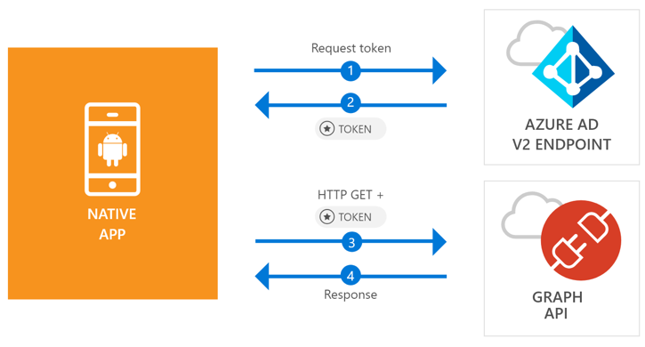

# Quickstart: Sign in users and call the Microsoft Graph API from an Android app

[!INCLUDE [active-directory-develop-applies-v2-msal](../../../includes/active-directory-develop-applies-v2-msal.md)]

This quickstart contains a code sample that demonstrates how an Android application can sign in personal or work and school accounts, get an access token, and call the Microsoft Graph API.



> [!NOTE]
> **Prerequisites**
> * Android Studio 3+
> * Android 21+ is required 


> [!div renderon="docs"]
> ## Register and download your quickstart app
> You have two options to start your quickstart application:
> * [Express] [Option 1: Register and auto configure your app and then download your code sample](#option-1-register-and-auto-configure-your-app-and-then-download-your-code-sample)
> * [Manual] [Option 2: Register and manually configure your application and code sample](#option-2-register-and-manually-configure-your-application-and-code-sample)
>
> ### Option 1: Register and auto configure your app and then download your code sample
> #### Step 1: Register your application
> To register your app,
> 1. Go to the [Azure portal - Application Registration (Preview)](https://portal.azure.com/#blade/Microsoft_AAD_RegisteredApps/applicationsListBlade/quickStartType/AndroidQuickstartPage/sourceType/docs).
> 1. Enter a name for your application and select **Register**.
> 1. Follow the instructions to download and automatically configure your new application with just one click.
>
> ### Option 2: Register and manually configure your application and code sample
>
> #### Step 1: Register your application
> To register your application and add the app's registration information to your solution manually, follow these steps:
>
> 1. Sign in to the [Azure portal](https://portal.azure.com) using either a work or school account or a personal Microsoft account.
> 1. If your account gives you access to more than one tenant, select your account in the top right corner, and set your portal session to the desired Azure AD tenant.
> 1. In the left-hand navigation pane, select the **Azure Active Directory** service, and then select **App registrations (Preview)** > **New registration**.
> 1. When the **Register an application page** appears, enter your application's registration information:
>      - In the **Name** section, enter a meaningful application name that will be displayed to users of the app, for example `Android-Quickstart`.
>      - Hit the `Register` button.
> 1. Go to `Authentication` > `Redirect URIs` > `Suggested Redirect URIs for public clients`, and select the Redirect URI of format **msal{AppId}://auth**. Save the change


> [!div renderon="portal" class="sxs-lookup"]
> #### Step 1: Configure your application
> For the code sample for this quickstart to work, you need to add a reply URL as **msal{AppId}://auth** (where {AppId} is the application ID of your app).
> > [!div renderon="portal" id="makechanges" class="nextstepaction"]
> > [Make this change for me]()
>
> > [!div id="appconfigured" class="alert alert-info"]
> >  Your application is configured with these attributes

#### Step 2: Download the project

* [Download the Android Studio Project](https://github.com/Azure-Samples/active-directory-android-native-v2/archive/master.zip)

#### Step 3: Configure your project

1. Extract and open the Project in Android Studio.
1. Inside **app** > **res** > **raw**, open **auth_config.json**.
1. Edit **auth_config.json** and replace the `client_id` and `tenant_id`:

	> [!div renderon="portal" class="sxs-lookup"]
    > ```javascript
    > "client_id" : "ENTER_THE_APPLICATION_ID_HERE",
    > "tenant_id" : "Enter_the_Tenant_Info_Here",
    > ```

	> [!div renderon="docs"]
    > ```javascript
    > "client_id" : "ENTER_THE_APPLICATION_ID_HERE",
    > "tenant_id" : "Enter_the_Tenant_Info_Here",
    > ```

1. Inside **app** > **manifests**, open  **AndroidManifest.xml**.
1. Add the following activity to the **manifest\application** node. This code snippet registers a **BrowserTabActivity** to allow the OS to resume your application after completing the authentication:

	> [!div renderon="docs"]
	> ```xml
    > <!--Intent filter to capture System Browser calling back to our app after Sign In-->
    > <activity
    >     android:name="com.microsoft.identity.client.BrowserTabActivity">
    >     <intent-filter>
    >         <action android:name="android.intent.action.VIEW" />
    >         <category android:name="android.intent.category.DEFAULT" />
    >         <category android:name="android.intent.category.BROWSABLE" />
    > 
    >         <!--Add in your scheme/host from registered redirect URI-->
    >         <!--By default, the scheme should be similar to 'msal[appId]' -->
    >         <data android:scheme="msal<ENTER_THE_APPLICATION_ID_HERE>"
    >             android:host="auth" />
    >     </intent-filter>
    > </activity>
    > ```

	> [!div renderon="portal" class="sxs-lookup"]
	> ```xml
    > <!--Intent filter to capture System Browser calling back to our app after Sign In-->
    > <activity
    >     android:name="com.microsoft.identity.client.BrowserTabActivity">
    >     <intent-filter>
    >         <action android:name="android.intent.action.VIEW" />
    >         <category android:name="android.intent.category.DEFAULT" />
    >         <category android:name="android.intent.category.BROWSABLE" />
    > 
    >         <!--Add in your scheme/host from registered redirect URI-->
    >         <!--By default, the scheme should be similar to 'msal[appId]' -->
    >         <data android:scheme="msalENTER_THE_APPLICATION_ID_HERE"
    >             android:host="auth" />
    >     </intent-filter>
    > </activity>
    > ```

> [!div renderon="docs"]
> <span>6.</span> Replace `<ENTER_THE_APPLICATION_ID_HERE>` with the *Application ID* for your application. If you need to find the *Application ID*, go to the *Overview* page.

## More Information

Read the following sections for more info about this quickstart.

### MSAL

MSAL ([com.microsoft.identity.client](http://javadoc.io/doc/com.microsoft.identity.client/msal)) is the library used to sign in users and request tokens used to access an API protected by Microsoft Azure Active Directory (Azure AD). You can use Gradle to install it by adding the following in **Gradle Scripts** > **build.gradle (Module: app)** under **Dependencies**:

```gradle  
implementation 'com.android.volley:volley:1.1.1'
implementation 'com.microsoft.identity.client:msal:0.2.+'
```

### MSAL initialization

You can add the reference for MSAL by adding the following code:

```java
import com.microsoft.identity.client.*;
```

Then, initialize MSAL using the following code:

```java
    sampleApp = new PublicClientApplication(
        this.getApplicationContext(),
        R.raw.auth_config);
```

> |Where: ||
> |---------|---------|
> |`CLIENT_ID` | The Application ID from the application registered in *portal.azure.com* |

### Requesting tokens

MSAL has two methods used acquire tokens: `acquireToken` and `acquireTokenSilentAsync`

#### Getting a user token interactively

Some situations require forcing users to interact with Azure AD v2.0 endpoint, which results in a context switch to the system browser to either validate the users's credentials or for consent. Some examples include:

* The first time users sign in to the application
* When users may need to reenter their credentials because the password has expired
* When your application is requesting access to a resource that the user needs to consent to
* When two factor authentication is required

```java
sampleApp.acquireToken(this, SCOPES, getAuthInteractiveCallback());
```

> |Where:||
> |---------|---------|
> | `SCOPES` | Contains the scopes being requested (that is, `{ "user.read" }` for Microsoft Graph or `{ "<Application ID URL>/scope" }` for custom Web APIs (i.e. `api://<Application ID>/access_as_user`) |
> | `getAuthInteractiveCallback` | Callback executed when control is given back to the application after authentication |

#### Getting a user token silently

You don't want to require user to validate their credentials every time they need to access a resource. Most of the time you want token acquisitions and renewal without any user interaction. You can use `AcquireTokenSilentAsync` method to obtain tokens to access protected resources after the initial `acquireToken` method:

```java
List<IAccount> accounts = sampleApp.getAccounts();
if (sample.size() == 1) {
    sampleApp.acquireTokenSilentAsync(SCOPES, accounts.get(0), getAuthSilentCallback());
} else {
    // No or multiple accounts
}
```

> |Where:||
> |---------|---------|
> | `SCOPES` | Contains the scopes being requested (that is, `{ "user.read" }` for Microsoft Graph or `{ "<Application ID URL>/scope" }` for custom Web APIs (i.e. `api://<Application ID>/access_as_user`) |
> | `accounts.get(0)` | Contains the Account you're trying to get tokens for silently |
> | `getAuthInteractiveCallback` | Callback executed when control is given back to the application after authentication |

## Next steps

### Learn the steps to create the application used in this quickstart

Try out the Android tutorial for a complete step-by-step guide on building applications and new features, including a full explanation of this quickstart.

> [!div class="nextstepaction"]
> [Call Graph API Android tutorial](https://docs.microsoft.com/azure/active-directory/develop/guidedsetups/active-directory-android)

### MSAL for Android library wiki

Read more information about MSAL library for Android:

> [!div class="nextstepaction"]
> [MSAL for Android library wiki](https://github.com/AzureAD/microsoft-authentication-library-for-android/wiki)

[!INCLUDE [Help and support](../../../includes/active-directory-develop-help-support-include.md)]