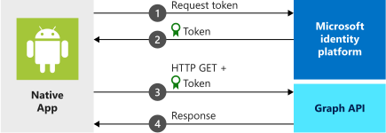
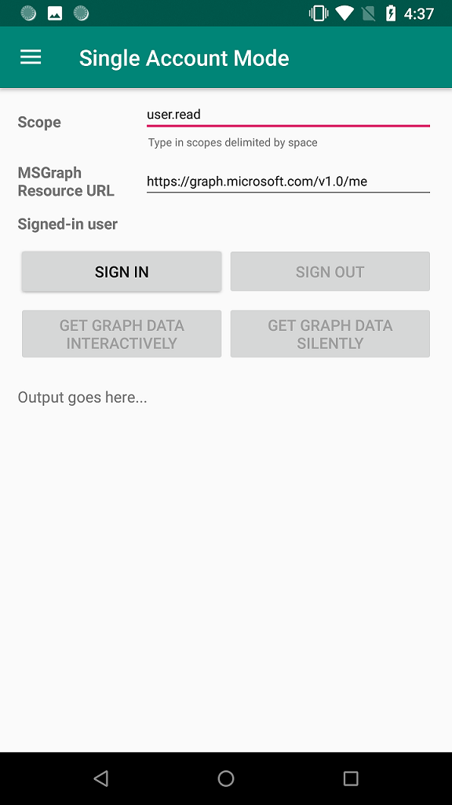

# Quickstart: Sign in users and call the Microsoft Graph API from an Android app

This quickstart uses a code sample to demonstrate how an Android application can sign in personal, work, or school accounts using the Microsoft identity platform, and then get an access token and call the Microsoft Graph API.

Applications must be represented by an app object in Azure Active Directory so that the Microsoft identity platform can share tokens with your application.

> [!div renderon="docs"]
> As a convenience, the code sample comes with a default `redirect_uri` preconfigured in the `AndroidManifest.xml` file so that you don't have to first register your own app object. A `redirect_uri` is partly based on your app's signing key. The sample project is preconfigured with a signing key so that the provided `redirect_uri` will work. To learn more about registering an app object and integrating it with your application, see the [Sign in users and call the Microsoft Graph from an Android app](tutorial-v2-android.md) tutorial.



> [!NOTE]
> **Prerequisites**
> * Android Studio 
> * Android 16+

> [!div class="sxs-lookup" renderon="portal"]
> ### Step 1: Configure your application in the Azure portal 
>  For the code sample for this quickstart to work, you need to add a redirect URI compatible with the Auth broker.
> > [!div renderon="portal" id="makechanges" class="nextstepaction"]
> > [Make these changes for me]()
>
> > [!div id="appconfigured" class="alert alert-info"]
> >  Your application is configured with these attributes
>
> ### Step 2: Download the project 
> * [Download the code sample](https://github.com/Azure-Samples/ms-identity-android-java/archive/master.zip)
>
> ### Step 3: Configure your project
> 1. Extract and open the Project in Android Studio.
> 2. Inside **app** > **src** > **main** > **res** > **raw**, open **auth_config_multiple_account.json** and replace it with the following code:
> ```javascript 
> {
>   "client_id" : "Enter_the_Application_Id_Here",
>   "authorization_user_agent" : "DEFAULT",
>   "redirect_uri" : "Enter_the_Redirect_Uri_Here",
>   "account_mode" : "MULTIPLE",
>   "broker_redirect_uri_registered": true,
>   "authorities" : [
>     {
>       "type": "AAD",
>       "audience": {
>         "type": "Enter_the_Audience_Info_Here",
>         "tenant_id": "Enter_the_Tenant_Info_Here"
>       }
>     }
>   ]
> }
> ```

> [!div class="sxs-lookup" renderon="portal"]
> 3. Inside **app** > **src** > **main** > **res** > **raw**, open **auth_config_single_account.json** and replace it with the following code:
> ```javascript 
> {
>   "client_id" : "Enter_the_Application_Id_Here",
>   "authorization_user_agent" : "DEFAULT",
>   "redirect_uri" : "Enter_the_Redirect_Uri_Here",
>   "account_mode" : "SINGLE",
>   "broker_redirect_uri_registered": true,
>   "authorities" : [
>     {
>       "type": "AAD",
>       "audience": {
>         "type": "Enter_the_Audience_Info_Here",
>         "tenant_id": "Enter_the_Tenant_Info_Here"
>       }
>     }
>   ]
> }
> ```

> [!div class="sxs-lookup" renderon="portal"]
> 4. Inside **app** > **src** > **main**, open  **AndroidManifest.xml**.
> 5. In the **manifest\application** node, replace the **activity android:name="com.microsoft.identity.client.BrowserTabActivity"** node with the following:	
> ```xml
> <!--Intent filter to catch Microsoft's callback after Sign In-->
> <activity android:name="com.microsoft.identity.client.BrowserTabActivity">
>     <intent-filter>
>         <action android:name="android.intent.action.VIEW" />
>         <category android:name="android.intent.category.DEFAULT" />
>         <category android:name="android.intent.category.BROWSABLE" />
>         <!--
>             Add in your scheme/host from registered redirect URI 
>             note that the leading "/" is required for android:path
>         -->
>         <data 
>             android:host="Enter_the_Package_Name"
>             android:path="/Enter_the_Signature_Hash"
>             android:scheme= "msauth" />
>     </intent-filter>
> </activity>
> ```
> 6. Run the app!   
> The sample app starts on the **Single Account Mode** screen. A default scope, **user.read**, is provided by default, which is used when reading your own profile data during the Microsoft Graph API call. The URL for the Microsoft Graph API call is provided by default. You can change both of these if you wish.
>
> 
>
> Use the app menu to change between single and multiple account modes.
>
> In single account mode, sign in using a work or home account:
>
> 1. Select **Get graph data interactively** to prompt the user for their credentials. You'll see the output from the call to the Microsoft Graph API in the bottom of the screen.
> 2. Once signed in, select **Get graph data silently** to make a call to the Microsoft Graph API without prompting the user for credentials again. You'll see the output from the call to the Microsoft Graph API in the bottom of the screen.
>
> In multiple account mode, you can repeat the same steps.  Additionally, you can remove the signed-in account, which also removes the cached tokens for that account.

> [!div class="sxs-lookup" renderon="portal"]
> > [!NOTE]
> > This quickstart supports Enter_the_Supported_Account_Info_Here.

> [!div renderon="docs"]
> ## Step 1: Get the sample app
>
> [Download the code](https://github.com/Azure-Samples/ms-identity-android-java/archive/master.zip).
>
> ## Step 2: Run the sample app
>
> Select your emulator, or physical device, from Android Studio's **available devices** dropdown and run the app.
>
> The sample app starts on the **Single Account Mode** screen. A default scope, **user.read**, is provided by default, which is used when reading your own profile data during the Microsoft Graph API call. The URL for the Microsoft Graph API call is provided by default. You can change both of these if you wish.
>
> 
>
> Use the app menu to change between single and multiple account modes.
>
> In single account mode, sign in using a work or home account:
>
> 1. Select **Get graph data interactively** to prompt the user for their credentials. You'll see the output from the call to the Microsoft Graph API in the bottom of the screen.
> 2. Once signed in, select **Get graph data silently** to make a call to the Microsoft Graph API without prompting the user for credentials again. You'll see the output from the call to the Microsoft Graph API in the bottom of the screen.
>
> In multiple account mode, you can repeat the same steps.  Additionally, you can remove the signed-in account, which also removes the cached tokens for that account.

## How the sample works

The code is organized into fragments that show how to write a single and multiple accounts MSAL app. The code files are organized as follows:

| File  | Demonstrates  |
|---------|---------|
| MainActivity | Manages the UI |
| MSGraphRequestWrapper  | Calls the Microsoft Graph API using the token provided by MSAL |
| MultipleAccountModeFragment  | Initializes a multi-account application, loads a user account, and gets a token to call the Microsoft Graph API |
| SingleAccountModeFragment | Initializes a single-account application, loads a user account, and gets a token to call the Microsoft Graph API |
| res/auth_config_multiple_account.json  | The multiple account configuration file |
| res/auth_config_single_account.json  | The single account configuration file |
| Gradle Scripts/build.grade (Module:app) | The MSAL library dependencies are added here |

We'll now look at these files in more detail and call out the MSAL-specific code in each.

### Adding MSAL to the app

MSAL ([com.microsoft.identity.client](https://javadoc.io/doc/com.microsoft.identity.client/msal)) is the library used to sign in users and request tokens used to access an API protected by Microsoft identity platform. Gradle 3.0+ installs the library when you add the following to **Gradle Scripts** > **build.gradle (Module: app)** under **Dependencies**:

```gradle  
implementation 'com.microsoft.identity.client:msal:1.0.0'
```

You can see this in the sample project in build.gradle (Module: app):

```java
dependencies {
    ...
    implementation 'com.microsoft.identity.client:msal:1.0.+'
    ...
}
```

This instructs Gradle to download and build MSAL from maven central.

### MSAL imports

The imports that are relevant to the MSAL library are `com.microsoft.identity.client.*`.  For example, you'll see `import com.microsoft.identity.client.PublicClientApplication;` which is the namespace for the `PublicClientApplication` class, which represents your public client application.

### SingleAccountModeFragment.java

This file demonstrates how to create a single account MSAL app and call a Microsoft Graph API.

Single account apps are only used by a single user.  For example, you might just have one account that you sign into your mapping app with.

#### Single account MSAL initialization

In `auth_config_single_account.json`, in `onCreateView()`, a single account `PublicClientApplication` is created using the config information stored in the `auth_config_single_account.json` file.  This is how you initialize the MSAL library for use in a single-account MSAL app:

```java
...
// Creates a PublicClientApplication object with res/raw/auth_config_single_account.json
PublicClientApplication.createSingleAccountPublicClientApplication(getContext(),
        R.raw.auth_config_single_account,
        new IPublicClientApplication.ISingleAccountApplicationCreatedListener() {
            @Override
            public void onCreated(ISingleAccountPublicClientApplication application) {
                /**
                 * This test app assumes that the app is only going to support one account.
                 * This requires "account_mode" : "SINGLE" in the config json file.
                 **/
                mSingleAccountApp = application;
                loadAccount();
            }

            @Override
            public void onError(MsalException exception) {
                displayError(exception);
            }
        });
```

#### Sign in a user

In `SingleAccountModeFragment.java`, the code to sign in a user is in `initializeUI()`, in the `signInButton` click handler.

Call `signIn()` before trying to acquire tokens. `signIn()` behaves as though `acquireToken()` is called, resulting in an interactive prompt for the user to sign in.

Signing in a user is an asynchronous operation. A callback is passed that calls the Microsoft Graph API and update the UI once the user signs in:

```java
mSingleAccountApp.signIn(getActivity(), null, getScopes(), getAuthInteractiveCallback());
```

#### Sign out a user

In `SingleAccountModeFragment.java`, the code to sign out a user is in `initializeUI()`, in the `signOutButton` click handler.  Signing a user out is an asynchronous operation. Signing the user out also clears the token cache for that account. A callback is created to update the UI once the user account is signed out:

```java
mSingleAccountApp.signOut(new ISingleAccountPublicClientApplication.SignOutCallback() {
    @Override
    public void onSignOut() {
        updateUI(null);
        performOperationOnSignOut();
    }

    @Override
    public void onError(@NonNull MsalException exception) {
        displayError(exception);
    }
});
```

#### Get a token interactively or silently

To present the fewest number of prompts to the user, you'll typically get a token silently. Then, if there's an error, attempt to get to token interactively. The first time the app calls `signIn()`, it effectively acts as a call to `acquireToken()`, which will prompt the user for credentials.

Some situations when the user may be prompted to select their account, enter their credentials, or consent to the permissions your app has requested are:

* The first time the user signs in to the application
* If a user resets their password, they'll need to enter their credentials
* If consent is revoked
* If your app explicitly requires consent
* When your application is requesting access to a resource for the first time
* When MFA or other Conditional Access policies are required

The code to get a token interactively, that is with UI that will involve the user, is in  `SingleAccountModeFragment.java`, in `initializeUI()`, in the `callGraphApiInteractiveButton` click handler:

```java
/**
 * If acquireTokenSilent() returns an error that requires an interaction (MsalUiRequiredException),
 * invoke acquireToken() to have the user resolve the interrupt interactively.
 *
 * Some example scenarios are
 *  - password change
 *  - the resource you're acquiring a token for has a stricter set of requirement than your Single Sign-On refresh token.
 *  - you're introducing a new scope which the user has never consented for.
 **/
mSingleAccountApp.acquireToken(getActivity(), getScopes(), getAuthInteractiveCallback());
```

If the user has already signed in, `acquireTokenSilentAsync()` allows apps to request tokens silently as shown in `initializeUI()`, in the `callGraphApiSilentButton` click handler:

```java
/**
 * Once you've signed the user in,
 * you can perform acquireTokenSilent to obtain resources without interrupting the user.
 **/
  mSingleAccountApp.acquireTokenSilentAsync(getScopes(), AUTHORITY, getAuthSilentCallback());
```

#### Load an account

The code to load an account is in `SingleAccountModeFragment.java` in `loadAccount()`.  Loading the user's account is an asynchronous operation, so callbacks to handle when the account loads, changes, or an error occurs is passed to MSAL.  The following code also handles `onAccountChanged()`, which occurs when an account is removed, the user changes to another account, and so on.

```java
private void loadAccount() {
    ...

    mSingleAccountApp.getCurrentAccountAsync(new ISingleAccountPublicClientApplication.CurrentAccountCallback() {
        @Override
        public void onAccountLoaded(@Nullable IAccount activeAccount) {
            // You can use the account data to update your UI or your app database.
            updateUI(activeAccount);
        }

        @Override
        public void onAccountChanged(@Nullable IAccount priorAccount, @Nullable IAccount currentAccount) {
            if (currentAccount == null) {
                // Perform a cleanup task as the signed-in account changed.
                performOperationOnSignOut();
            }
        }

        @Override
        public void onError(@NonNull MsalException exception) {
            displayError(exception);
        }
    });
```

#### Call Microsoft Graph

When a user is signed in, the call to Microsoft Graph is made via an HTTP request by `callGraphAPI()` which is defined in `SingleAccountModeFragment.java`. This function is a wrapper that simplifies the sample by doing some tasks such as getting the access token from the `authenticationResult` and packaging the call to the MSGraphRequestWrapper, and displaying the results of the call.

```java
private void callGraphAPI(final IAuthenticationResult authenticationResult) {
    MSGraphRequestWrapper.callGraphAPIUsingVolley(
            getContext(),
            graphResourceTextView.getText().toString(),
            authenticationResult.getAccessToken(),
            new Response.Listener<JSONObject>() {
                @Override
                public void onResponse(JSONObject response) {
                    /* Successfully called graph, process data and send to UI */
                    ...
                }
            },
            new Response.ErrorListener() {
                @Override
                public void onErrorResponse(VolleyError error) {
                    ...
                }
            });
}
```

### auth_config_single_account.json

This is the configuration file for a MSAL app that uses a single account.

See [Understand  the Android MSAL configuration file ](msal-configuration.md) for an explanation of these fields.

Note the presence of `"account_mode" : "SINGLE"`, which configures this app to use a single account.

`"client_id"` is preconfigured to use an app object registration that Microsoft maintains.
`"redirect_uri"`is preconfigured to use the signing key provided with the code sample.

```json
{
  "client_id" : "0984a7b6-bc13-4141-8b0d-8f767e136bb7",
  "authorization_user_agent" : "DEFAULT",
  "redirect_uri" : "msauth://com.azuresamples.msalandroidapp/1wIqXSqBj7w%2Bh11ZifsnqwgyKrY%3D",
  "account_mode" : "SINGLE",
  "broker_redirect_uri_registered": true,
  "authorities" : [
    {
      "type": "AAD",
      "audience": {
        "type": "AzureADandPersonalMicrosoftAccount",
        "tenant_id": "common"
      }
    }
  ]
}
```

### MultipleAccountModeFragment.java

This file demonstrates how to create a multiple account MSAL app and call a Microsoft Graph API.

An example of a multiple account app is a mail app that allows you to work with multiple user accounts such as a work account and a personal account.

#### Multiple account MSAL initialization

In the `MultipleAccountModeFragment.java` file, in `onCreateView()`, a multiple account app object (`IMultipleAccountPublicClientApplication`) is created using the config information stored in the `auth_config_multiple_account.json file`:

```java
// Creates a PublicClientApplication object with res/raw/auth_config_multiple_account.json
PublicClientApplication.createMultipleAccountPublicClientApplication(getContext(),
        R.raw.auth_config_multiple_account,
        new IPublicClientApplication.IMultipleAccountApplicationCreatedListener() {
            @Override
            public void onCreated(IMultipleAccountPublicClientApplication application) {
                mMultipleAccountApp = application;
                loadAccounts();
            }

            @Override
            public void onError(MsalException exception) {
                ...
            }
        });
```

The created `MultipleAccountPublicClientApplication` object is stored in a class member variable so that it can be used to interact with the MSAL library to acquire tokens and load and remove the user account.

#### Load an account

Multiple account apps usually call `getAccounts()` to select the account to use for MSAL operations. The code to load an account is in the `MultipleAccountModeFragment.java` file, in  `loadAccounts()`.  Loading the user's account is an asynchronous operation. So a callback handles the situations when the account is loaded, changes, or an error occurs.

```java
/**
 * Load currently signed-in accounts, if there's any.
 **/
private void loadAccounts() {
    if (mMultipleAccountApp == null) {
        return;
    }

    mMultipleAccountApp.getAccounts(new IPublicClientApplication.LoadAccountsCallback() {
        @Override
        public void onTaskCompleted(final List<IAccount> result) {
            // You can use the account data to update your UI or your app database.
            accountList = result;
            updateUI(accountList);
        }

        @Override
        public void onError(MsalException exception) {
            displayError(exception);
        }
    });
}
```

#### Get a token interactively or silently

Some situations when the user may be prompted to select their account, enter their credentials, or consent to the permissions your app has requested are:

* The first time users sign in to the application
* If a user resets their password, they'll need to enter their credentials 
* If consent is revoked 
* If your app explicitly requires consent 
* When your application is requesting access to a resource for the first time
* When MFA or other Conditional Access policies are required

Multiple account apps should typically acquire tokens interactively, that is with UI that involves the user, with a call to `acquireToken()`.  The code to get a token interactively is in the `MultipleAccountModeFragment.java` file in `initializeUI()`, in the `callGraphApiInteractiveButton` click handler:

```java
/**
 * Acquire token interactively. It will also create an account object for the silent call as a result (to be obtained by getAccount()).
 *
 * If acquireTokenSilent() returns an error that requires an interaction,
 * invoke acquireToken() to have the user resolve the interrupt interactively.
 *
 * Some example scenarios are
 *  - password change
 *  - the resource you're acquiring a token for has a stricter set of requirement than your SSO refresh token.
 *  - you're introducing a new scope which the user has never consented for.
 **/
mMultipleAccountApp.acquireToken(getActivity(), getScopes(), getAuthInteractiveCallback());
```

Apps shouldn't require the user to sign in every time they request a token. If the user has already signed in, `acquireTokenSilentAsync()` allows apps to request tokens without prompting the user, as shown in the `MultipleAccountModeFragment.java` file, in`initializeUI()` in the `callGraphApiSilentButton` click handler:

```java
/**
 * Performs acquireToken without interrupting the user.
 *
 * This requires an account object of the account you're obtaining a token for.
 * (can be obtained via getAccount()).
 */
mMultipleAccountApp.acquireTokenSilentAsync(getScopes(),
    accountList.get(accountListSpinner.getSelectedItemPosition()),
    AUTHORITY,
    getAuthSilentCallback());
```

#### Remove an account

The code to remove an account, and any cached tokens for the account, is in the `MultipleAccountModeFragment.java` file in `initializeUI()` in the handler for the remove account button. Before you can remove an account, you need an account object, which you obtain from MSAL methods like `getAccounts()` and `acquireToken()`. Because removing an account is an asynchronous operation, the `onRemoved` callback is supplied to update the UI.

```java
/**
 * Removes the selected account and cached tokens from this app (or device, if the device is in shared mode).
 **/
mMultipleAccountApp.removeAccount(accountList.get(accountListSpinner.getSelectedItemPosition()),
        new IMultipleAccountPublicClientApplication.RemoveAccountCallback() {
            @Override
            public void onRemoved() {
                ...
                /* Reload account asynchronously to get the up-to-date list. */
                loadAccounts();
            }

            @Override
            public void onError(@NonNull MsalException exception) {
                displayError(exception);
            }
        });
```

### auth_config_multiple_account.json

This is the configuration file for a MSAL app that uses multiple accounts.

See [Understand  the Android MSAL configuration file ](msal-configuration.md) for an explanation of the various fields.

Unlike the [auth_config_single_account.json](#auth_config_single_accountjson) configuration file, this config file has `"account_mode" : "MULTIPLE"` instead of `"account_mode" : "SINGLE"` because this is a multiple account app.

`"client_id"` is preconfigured to use an app object registration that Microsoft maintains.
`"redirect_uri"`is preconfigured to use the signing key provided with the code sample.

```json
{
  "client_id" : "0984a7b6-bc13-4141-8b0d-8f767e136bb7",
  "authorization_user_agent" : "DEFAULT",
  "redirect_uri" : "msauth://com.azuresamples.msalandroidapp/1wIqXSqBj7w%2Bh11ZifsnqwgyKrY%3D",
  "account_mode" : "MULTIPLE",
  "broker_redirect_uri_registered": true,
  "authorities" : [
    {
      "type": "AAD",
      "audience": {
        "type": "AzureADandPersonalMicrosoftAccount",
        "tenant_id": "common"
      }
    }
  ]
}
```

## Next steps

### Learn the steps to create the application used in this quickstart

Try out the [Sign in users and call the Microsoft Graph from an Android app](tutorial-v2-android.md) tutorial for a step-by-step guide for building an Android app that gets an access token and uses it to call the Microsoft Graph API.

> [!div class="nextstepaction"]
> [Call Graph API Android tutorial](https://docs.microsoft.com/azure/active-directory/develop/guidedsetups/active-directory-android)

### MSAL for Android library wiki

Read more information about MSAL library for Android:

> [!div class="nextstepaction"]
> [MSAL for Android library wiki](https://github.com/AzureAD/microsoft-authentication-library-for-android/wiki)

[!INCLUDE [Help and support](../../../includes/active-directory-develop-help-support-include.md)]

Help us improve the Microsoft identity platform. Tell us what you think by completing a short two-question survey.

> [!div class="nextstepaction"]
> [Microsoft identity platform survey](https://forms.office.com/Pages/ResponsePage.aspx?id=v4j5cvGGr0GRqy180BHbRyKrNDMV_xBIiPGgSvnbQZdUQjFIUUFGUE1SMEVFTkdaVU5YT0EyOEtJVi4u)
