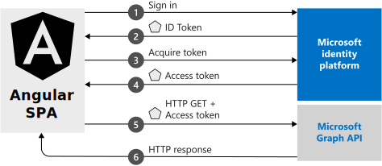

# Quickstart: Sign in users and get an access token in an Angular single-page application

In this quickstart, you download and run a code sample that demonstrates how an Angular single-page application (SPA) can sign in users and call Microsoft Graph. The code sample demonstrates how to get an access token to call the Microsoft Graph API or any web API.

## Prerequisites

* An Azure subscription. [Create one for free](https://azure.microsoft.com/free/?WT.mc_id=A261C142F).
* [Node.js](https://nodejs.org/en/download/).
* [Visual Studio Code](https://code.visualstudio.com/download) to edit project files, or [Visual Studio 2019](https://visualstudio.microsoft.com/downloads/) to run the project.

> [!div renderon="docs"]
>
> ## Register and download the quickstart app
>
> To start the quickstart app, use either of the following options.
>
> ### Option 1 (express): Register and automatically configure the app, and then download the code sample
>
> 1. Go to the <a href="https://portal.azure.com/#blade/Microsoft_AAD_RegisteredApps/ApplicationsListBlade/quickStartType/JavascriptSpaQuickstartPage/sourceType/docs" target="_blank">Azure portal - App registrations</a> quickstart experience.
> 1. Enter a name for your application, and then select **Register**.
> 1. On the quickstart pane, find the Angular quickstart. Follow the instructions to download and automatically configure your new application.
>
> ### Option 2 (manual): Register and manually configure the application and code sample
>
> #### Step 1: Register the application
>
> 1. Follow the instructions to [register a single-page application](./scenario-spa-app-registration.md) in the Azure portal.
> 1. Add a new platform on the **Authentication** pane of your app registration and register the redirect URI: `http://localhost:4200/`.
> 1. This quickstart uses the [implicit grant flow](v2-oauth2-implicit-grant-flow.md). In the **Implicit grant and hybrid flows** section, select **ID tokens** and **Access tokens**. ID tokens and access tokens are required because this app signs users in and calls an API.

> [!div class="sxs-lookup" renderon="portal"]
>
> #### Step 1: Configure the application in the Azure portal
>
> For the code sample in this quickstart to work, you need to add a redirect URI to `http://localhost:4200/` and enable **Implicit grant**.
> > [!div renderon="portal" id="makechanges" class="nextstepaction"]
> > [Make these changes for me]()
>
> > [!div id="appconfigured" class="alert alert-info"]
> >  Your application is configured with these attributes.

#### Step 2: Download the code sample
>[!div renderon="docs"]
>To run the project with a web server by using Node.js, clone the [sample repository](https://github.com/Azure-Samples/active-directory-javascript-singlepageapp-angular) or [download the core project files](https://github.com/Azure-Samples/active-directory-javascript-singlepageapp-angular/archive/master.zip). Open the files in an editor such as Visual Studio Code.

> [!div renderon="portal" id="autoupdate" class="sxs-lookup nextstepaction"]
> [Download the code sample](https://github.com/Azure-Samples/active-directory-javascript-singlepageapp-angular/archive/master.zip)

> [!div renderon="docs"]
>#### Step 3: Configure the JavaScript app
>
> In the *src/app* folder, edit *app.module.ts* and set the `clientId` and `authority` values under `MsalModule.forRoot`.
>
>```javascript
>MsalModule.forRoot({
>    auth: {
>        clientId: 'Enter_the_Application_Id_here', // This is your client ID
>        authority: 'https://login.microsoftonline.com/Enter_the_Tenant_Info_Here', // This is your tenant info
>        redirectUri: 'Enter_the_Redirect_Uri_Here' // This is your redirect URI
>    },
>    cache: {
>        cacheLocation: 'localStorage',
>        storeAuthStateInCookie: isIE, // set to true for IE 11
>    },
>},
> //... )
>```

> [!div class="sxs-lookup" renderon="portal"]
> > [!NOTE]
> > Enter_the_Supported_Account_Info_Here

> [!div renderon="docs"]
>
> Replace these values:
>
>|Value name|Description|
>|---------|---------|
>|Enter_the_Application_Id_Here|On the **Overview** page of your application registration, this is your **Application (client) ID** value. |
>|Enter_the_Cloud_Instance_Id_Here|This is the Azure cloud instance. For the main or global Azure cloud, enter `https://login.microsoftonline.com`. For national clouds (for example, China), see [National clouds](./authentication-national-cloud.md).|
>|Enter_the_Tenant_Info_Here| Set to one of the following options: If your application supports *accounts in this organizational directory*, replace this value with the directory (tenant) ID or tenant name (for example, `contoso.microsoft.com`). If your application supports *accounts in any organizational directory*, replace this value with `organizations`. If your application supports *accounts in any organizational directory and personal Microsoft accounts*, replace this value with `common`. To restrict support to *personal Microsoft accounts only*, replace this value with `consumers`. |
>|Enter_the_Redirect_Uri_Here|Replace with `http://localhost:4200`.|
>|cacheLocation  | (Optional) Set the browser storage for the authentication state. The default is `sessionStorage`.   |
>|storeAuthStateInCookie  | (Optional) Identify the library that stores the authentication request state. This state is required to validate the authentication flows in the browser cookies. This cookie is set for Internet Explorer and Microsoft Edge to accommodate those two browsers. For more details, see the [known issues](https://github.com/AzureAD/microsoft-authentication-library-for-js/wiki/Known-issues->on-IE-and-Edge-Browser#issues). |
>
> To find the values of **Application (client) ID**, **Directory (tenant) ID**, and **Supported account types**, go to the app's **Overview** page in the Azure portal.

> For more information about available configurable options, see [Initialize client applications](msal-js-initializing-client-applications.md).

> You can find the source code for the MSAL.js library in the [AzureAD/microsoft-authentication-library-for-js](https://github.com/AzureAD/microsoft-authentication-library-for-js) repository on GitHub.

> [!div class="sxs-lookup" renderon="portal"]
> #### Step 3: Your app is configured and ready to run
> We have configured your project with values of your app's properties.

> [!div renderon="docs"]
>
> Scroll down in the same file and update the `graphMeEndpoint`. 
> - Replace the string `Enter_the_Graph_Endpoint_Herev1.0/me` with `https://graph.microsoft.com/v1.0/me`
> - `Enter_the_Graph_Endpoint_Herev1.0/me` is the endpoint that API calls will be made against. For the main (global) Microsoft Graph API service, enter `https://graph.microsoft.com/` (include the trailing forward-slash). For more information, see the [documentation](https://docs.microsoft.com/graph/deployments).
>
>
> ```javascript
>      protectedResourceMap: [
>        ['Enter_the_Graph_Endpoint_Herev1.0/me', ['user.read']]
>      ],
> ```
>
>

>[!div renderon="docs"]
>#### Step 4: Run the project

If you're using Node.js:

1. Start the server by running the following commands from the project directory:

   ```console
   npm install
   npm start
   ```

1. Go to `http://localhost:4200/`.
1. Select **Login**. The first time you sign in, you're prompted to allow the application to access your profile and sign you in automatically.
1. Select **Profile** to call Microsoft Graph. Your user profile information is displayed on the page.

## How the sample works



## Next steps

Learn how to sign in a user and acquire tokens in the Angular tutorial:

> [!div class="nextstepaction"]
> [Angular tutorial](./tutorial-v2-angular.md)
