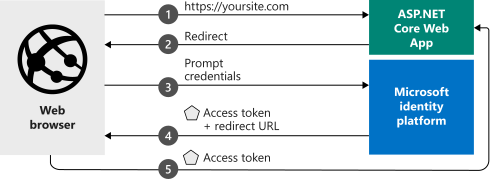

# Quickstart: ASP.NET Core web app that signs in users and calls Microsoft Graph on their behalf

In this quickstart, you download and run a code sample that demonstrates how an ASP.NET Core web app can sign in users from any Azure Active Directory (Azure AD) organization and calls Microsoft Graph.  

See [How the sample works](#how-the-sample-works) for an illustration.

> [!div renderon="docs"]
> ## Prerequisites
>
> * [Visual Studio 2019](https://visualstudio.microsoft.com/vs/) or [Visual Studio Code](https://code.visualstudio.com/)
> * [.NET Core SDK 3.1+](https://dotnet.microsoft.com/download)
>
> ## Register and download the quickstart app
> You have two options to start your quickstart application:
> * [Express] [Option 1: Register and auto configure your app and then download your code sample](#option-1-register-and-auto-configure-your-app-and-then-download-your-code-sample)
> * [Manual] [Option 2: Register and manually configure your application and code sample](#option-2-register-and-manually-configure-your-application-and-code-sample)
>
> ### Option 1: Register and auto configure your app and then download your code sample
>
> 1. Go to the <a href="https://portal.azure.com/#blade/Microsoft_AAD_RegisteredApps/applicationsListBlade/quickStartType/AspNetCoreWebAppQuickstartPage/sourceType/docs" target="_blank">Azure portal - App registrations</a> quickstart experience.
> 1. Enter a name for your application and select **Register**.
> 1. Follow the instructions to download and automatically configure your new application for you in one click.
>
> ### Option 2: Register and manually configure your application and code sample
>
> #### Step 1: Register your application
> To register your application and add the app's registration information to your solution manually, follow these steps:
>
> 1. Sign in to the <a href="https://portal.azure.com/" target="_blank">Azure portal</a>.
> 1. If you have access to multiple tenants, use the **Directory + subscription** filter :::image type="icon" source="./media/common/portal-directory-subscription-filter.png" border="false"::: in the top menu to select the tenant in which you want to register an application.
> 1. Search for and select **Azure Active Directory**.
> 1. Under **Manage**, select **App registrations** > **New registration**.
> 1. Enter a **Name** for your application, for example `AspNetCoreWebAppCallsGraph-Quickstart`. Users of your app might see this name, and you can change it later.
> 1. Enter a **Redirect URI** of `https://localhost:44321/signin-oidc`.
> 1. Select **Register**.
> 1. Under **Manage**, select **Authentication**.
> 1. Enter a **Front-channel logout URL** of `https://localhost:44321/signout-oidc`.
> 1. Select **Save**.
> 1. Under **Manage**, select **Certificates & secrets** > **New client secret**.
> 1. Enter a **Description**, for example `clientsecret1`.
> 1. Select **In 1 year** for the secret's expiration.
> 1. Select **Add** and immediately record the secret's **Value** for use in a later step. The secret value is *never displayed again* and is irretrievable by any other means. Record it in a secure location as you would any password.

> [!div class="sxs-lookup" renderon="portal"]
> #### Step 1: Configure your application in the Azure portal
> For the code sample in this quickstart to work, add a **Redirect URI** of `https://localhost:44321/signin-oidc` and **Front-channel logout URL** of `https://localhost:44321/signout-oidc` in the app registration.
> > [!div renderon="portal" id="makechanges" class="nextstepaction"]
> > [Make this change for me]()
>
> > [!div id="appconfigured" class="alert alert-info"]
> >  Your application is configured with these attributes.

#### Step 2: Download the ASP.NET Core project

> [!div renderon="docs"]
> [Download the ASP.NET Core solution](https://github.com/Azure-Samples/active-directory-aspnetcore-webapp-openidconnect-v2/archive/aspnetcore3-1-callsgraph.zip)

> [!div renderon="portal" class="sxs-lookup"]
> Run the project.

> [!div renderon="portal" class="sxs-lookup" id="autoupdate" class="nextstepaction"]
> [Download the code sample](https://github.com/Azure-Samples/active-directory-aspnetcore-webapp-openidconnect-v2/archive/aspnetcore3-1-callsgraph.zip)

[!INCLUDE [active-directory-develop-path-length-tip](../../../includes/active-directory-develop-path-length-tip.md)]

> [!div class="sxs-lookup" renderon="portal"]
> #### Step 3: Your app is configured and ready to run
> We have configured your project with values of your app's properties and it's ready to run.
> [!div class="sxs-lookup" renderon="portal"]
> > [!NOTE]
> > `Enter_the_Supported_Account_Info_Here`
> [!div renderon="docs"]
> #### Step 3: Configure your ASP.NET Core project
> 1. Extract the .zip archive into a local folder near the root of your drive. For example, into *C:\Azure-Samples*.
> 1. Open the solution in Visual Studio 2019.
> 1. Open the *appsettings.json* file and modify the following:
>
>    ```json
>    "ClientId": "Enter_the_Application_Id_here",
>    "TenantId": "common",
>    "clientSecret": "Enter_the_Client_Secret_Here"
>    ```
>
>    - Replace `Enter_the_Application_Id_here` with the **Application (client) ID** of the application you registered in the Azure portal. You can find **Application (client) ID** in the app's **Overview** page.
>    - Replace `common` with one of the following:
>       - If your application supports **Accounts in this organizational directory only**, replace this value with the **Directory (tenant) ID** (a GUID) or **tenant name** (for example, `contoso.onmicrosoft.com`). You can find the **Directory (tenant) ID** on the app's **Overview** page.
>       - If your application supports **Accounts in any organizational directory**, replace this value with `organizations`
>       - If your application supports **All Microsoft account users**, leave this value as `common`
>    - Replace `Enter_the_Client_Secret_Here` with the **Client secret** you created and recorded in an earlier step.
> 
> For this quickstart, don't change any other values in the *appsettings.json* file.
>
> #### Step 4: Build and run the application
>
> Build and run the app in Visual Studio by selecting the **Debug** menu > **Start Debugging**, or by pressing the `F5` key.
>
> You're prompted for your credentials, and then asked to consent to the permissions your app requires. Select **Accept** on the consent prompt.
>
> :::image type="content" source="media/quickstart-v2-aspnet-core-webapp-calls-graph/webapp-01-consent.png" alt-text="Consent dialog showing the permissions the app is requesting from the > user":::
>
> After consenting to the requested permissions, the app displays that you've successfully logged in using your Azure Active Directory credentials, and you'll see your email address in the "Api result" section of the page. This was extracted using Microsoft Graph.
>
> :::image type="content" source="media/quickstart-v2-aspnet-core-webapp-calls-graph/webapp-02-signed-in.png" alt-text="Web browser displaying the running web app and the user signed in":::

## About the code

This section gives an overview of the code required to sign in users and call the Microsoft Graph API on their behalf. This overview can be useful to understand how the code works, main arguments, and also if you want to add sign-in to an existing ASP.NET Core application and call Microsoft Graph. It uses [Microsoft.Identity.Web](microsoft-identity-web.md), which is a wrapper around [MSAL.NET](msal-overview.md).

### How the sample works


### Startup class

The *Microsoft.AspNetCore.Authentication* middleware uses a `Startup` class that's executed when the hosting process initializes:

```csharp
  // Get the scopes from the configuration (appsettings.json)
  var initialScopes = Configuration.GetValue<string>("DownstreamApi:Scopes")?.Split(' ');

  public void ConfigureServices(IServiceCollection services)
  {
      // Add sign-in with Microsoft
      services.AddAuthentication(OpenIdConnectDefaults.AuthenticationScheme)
        .AddMicrosoftIdentityWebApp(Configuration.GetSection("AzureAd"))

            // Add the possibility of acquiring a token to call a protected web API
            .EnableTokenAcquisitionToCallDownstreamApi(initialScopes)

                // Enables controllers and pages to get GraphServiceClient by dependency injection
                // And use an in memory token cache
                .AddMicrosoftGraph(Configuration.GetSection("DownstreamApi"))
                .AddInMemoryTokenCaches();

      services.AddControllersWithViews(options =>
      {
          var policy = new AuthorizationPolicyBuilder()
              .RequireAuthenticatedUser()
              .Build();
          options.Filters.Add(new AuthorizeFilter(policy));
      });

      // Enables a UI and controller for sign in and sign out.
      services.AddRazorPages()
          .AddMicrosoftIdentityUI();
  }
```

The `AddAuthentication()` method configures the service to add cookie-based authentication, which is used in browser scenarios and to set the challenge to OpenID Connect.

The line containing `.AddMicrosoftIdentityWebApp` adds the Microsoft identity platform authentication to your application. This is provided by [Microsoft.Identity.Web](microsoft-identity-web.md). It's then configured to sign in using the Microsoft identity platform based on the information in the `AzureAD` section of the *appsettings.json* configuration file:

| *appsettings.json* key | Description                                                                                                                                                          |
|------------------------|----------------------------------------------------------------------------------------------------------------------------------------------------------------------|
| `ClientId`             | **Application (client) ID** of the application registered in the Azure portal.                                                                                       |
| `Instance`             | Security token service (STS) endpoint for the user to authenticate. This value is typically `https://login.microsoftonline.com/`, indicating the Azure public cloud. |
| `TenantId`             | Name of your tenant or its tenant ID (a GUID), or *common* to sign in users with work or school accounts or Microsoft personal accounts.                             |

The `EnableTokenAcquisitionToCallDownstreamApi` method enables your application to acquire a token to call protected web APIs. `AddMicrosoftGraph` enables your controllers or Razor pages to benefit directly the `GraphServiceClient` (by dependency injection) and the `AddInMemoryTokenCaches` methods enables your app to benefit from a token cache.

The `Configure()` method contains two important methods, `app.UseAuthentication()` and `app.UseAuthorization()`, that enable their named functionality. Also in the `Configure()` method, you must register Microsoft Identity Web's routes with at least one call to `endpoints.MapControllerRoute()` or a call to `endpoints.MapControllers()`.

```csharp
app.UseAuthentication();
app.UseAuthorization();

app.UseEndpoints(endpoints =>
{

    endpoints.MapControllerRoute(
        name: "default",
        pattern: "{controller=Home}/{action=Index}/{id?}");
    endpoints.MapRazorPages();
});

// endpoints.MapControllers(); // REQUIRED if MapControllerRoute() isn't called.
```

### Protect a controller or a controller's method

You can protect a controller or its methods by applying the `[Authorize]` attribute to the controller's class or one or more of its methods. This `[Authorize]` attribute restricts access by allowing only authenticated users. If the user isn't already authenticated, an authentication challenge can be started to access the controller. In this quickstart, the scopes are read from the configuration file:

```CSharp
[AuthorizeForScopes(ScopeKeySection = "DownstreamApi:Scopes")]
public async Task<IActionResult> Index()
{
    var user = await _graphServiceClient.Me.Request().GetAsync();
    ViewData["ApiResult"] = user.DisplayName;

    return View();
}
 ```

[!INCLUDE [Help and support](../../../includes/active-directory-develop-help-support-include.md)]

## Next steps

The GitHub repo that contains the ASP.NET Core code sample referenced in this quickstart includes instructions and more code samples that show you how to:

- Add authentication to a new ASP.NET Core Web application
- Call Microsoft Graph, other Microsoft APIs, or your own web APIs
- Add authorization
- Sign in users in national clouds or with social identities

> [!div class="nextstepaction"]
> [ASP.NET Core web app tutorials on GitHub](https://github.com/Azure-Samples/active-directory-aspnetcore-webapp-openidconnect-v2/)
