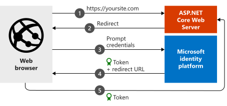

# Quickstart: Add sign-in with Microsoft to an ASP.NET Core web app


> [!div renderon="docs"]
> Welcome! This probably isn't the page you were expecting. While we work on a fix, this link should take you to the right article:
>
> > [Quickstart: ASP.NET Core web app with user sign-in](web-app-quickstart.md?pivots=devlang-aspnet-core)
> 
> We apologize for the inconvenience and appreciate your patience while we work to get this resolved.

> [!div renderon="portal" class="sxs-lookup"]
> In this quickstart, you download and run a code sample that demonstrates how an ASP.NET Core web app can sign in users from any Azure Active Directory (Azure AD) organization.  
> 
> #### Step 1: Configure your application in the Azure portal
> For the code sample in this quickstart to work:
> - For **Redirect URI**, enter **https://localhost:44321/** and **https://localhost:44321/signin-oidc**.
> - For **Front-channel logout URL**, enter **https://localhost:44321/signout-oidc**. 
> 
> The authorization endpoint will issue request ID tokens.
> > [!div class="nextstepaction"]
> > [Make this change for me]()
> 
> > [!div class="alert alert-info"]
> >  Your application is configured with these attributes.
> 
> #### Step 2: Download the ASP.NET Core project
> 
> Run the project.
> 
> > [!div class="nextstepaction"]
> > [Download the code sample](https://github.com/Azure-Samples/active-directory-aspnetcore-webapp-openidconnect-v2/archive/aspnetcore3-1.zip)
> 
> [!INCLUDE [active-directory-develop-path-length-tip](../../../includes/active-directory-develop-path-length-tip.md)]
> 
> 
> #### Step 3: Your app is configured and ready to run
> We've configured your project with values of your app's properties, and it's ready to run.
> 
> > [!NOTE]
> > `Enter_the_Supported_Account_Info_Here`
> 
> ## More information
> 
> This section gives an overview of the code required to sign in users. This overview can be useful to understand how the code works, what the main arguments are, and how to add sign-in to an existing ASP.NET Core application.
> 
> > [!div class="sxs-lookup" renderon="portal"]
> > ### How the sample works
> >
> > 
> 
> ### Startup class
> 
> The *Microsoft.AspNetCore.Authentication* middleware uses a `Startup` class that's run when the hosting process starts:
> 
> ```csharp
> public void ConfigureServices(IServiceCollection services)
> {
>     services.AddAuthentication(OpenIdConnectDefaults.AuthenticationScheme)
>         .AddMicrosoftIdentityWebApp(Configuration.GetSection("AzureAd"));
> 
>     services.AddControllersWithViews(options =>
>     {
>         var policy = new AuthorizationPolicyBuilder()
>             .RequireAuthenticatedUser()
>             .Build();
>         options.Filters.Add(new AuthorizeFilter(policy));
>     });
>    services.AddRazorPages()
>         .AddMicrosoftIdentityUI();
> }
> ```
> 
> The `AddAuthentication()` method configures the service to add cookie-based authentication. This authentication is used in browser scenarios and to set the challenge to OpenID Connect.
> 
> The line that contains `.AddMicrosoftIdentityWebApp` adds Microsoft identity platform authentication to your application. The application is then configured to sign in users based on the following information in the `AzureAD` section of the *appsettings.json* configuration file:
> 
> | *appsettings.json* key | Description                                                                                                                                                          |
> |------------------------|----------------------------------------------------------------------------------------------------------------------------------------------------------------------|
> | `ClientId`             | Application (client) ID of the application registered in the Azure portal.                                                                                       |
> | `Instance`             | Security token service (STS) endpoint for the user to authenticate. This value is typically `https://login.microsoftonline.com/`, indicating the Azure public cloud. |
> | `TenantId`             | Name of your tenant or the tenant ID (a GUID), or `common` to sign in users with work or school accounts or Microsoft personal accounts.                             |
> 
> The `Configure()` method contains two important methods, `app.UseAuthentication()` and `app.UseAuthorization()`, that enable their named functionality. Also in the `Configure()` method, you must register Microsoft Identity Web routes with at least one call to `endpoints.MapControllerRoute()` or a call to `endpoints.MapControllers()`:
> 
> ```csharp
> app.UseAuthentication();
> app.UseAuthorization();
> 
> app.UseEndpoints(endpoints =>
> {
>     endpoints.MapControllerRoute(
>         name: "default",
>         pattern: "{controller=Home}/{action=Index}/{id?}");
>     endpoints.MapRazorPages();
> });
> ```
> 
> ### Attribute for protecting a controller or methods
> 
> You can protect a controller or controller methods by using the `[Authorize]` attribute. This attribute restricts access to the controller or methods by allowing only authenticated users. An authentication challenge can then be started to access the controller if the user isn't authenticated.
> 
> [!INCLUDE [Help and support](../../../includes/active-directory-develop-help-support-include.md)]
> 
> ## Next steps
> 
> The GitHub repo that contains this ASP.NET Core tutorial includes instructions and more code samples that show you how to:
> 
> - Add authentication to a new ASP.NET Core web application.
> - Call Microsoft Graph, other Microsoft APIs, or your own web APIs.
> - Add authorization.
> - Sign in users in national clouds or with social identities.
> 
> > [!div class="nextstepaction"]
> > [ASP.NET Core web app tutorials on GitHub](https://github.com/Azure-Samples/active-directory-aspnetcore-webapp-openidconnect-v2/)
