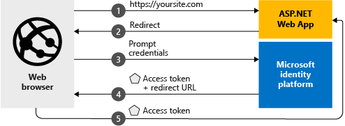

# Quickstart: Add sign-in with Microsoft to an ASP.NET web app

[!INCLUDE [active-directory-develop-applies-v2](../../../includes/active-directory-develop-applies-v2.md)]

In this quickstart, you'll learn how an ASP.NET web app can sign in personal accounts (hotmail.com, outlook.com, others) and work and school accounts from any Azure Active Directory (Azure AD) instance.



> [!div renderon="docs"]
> ## Register your application and download your quickstart app
>
> ### Register and configure your application and code sample
> #### Step 1: Register your application
> 
> 1. Go to the [Microsoft Application Registration Portal](https://apps.dev.microsoft.com/portal/register-app).
> 1. Enter a name for your application, make sure the option for **Guided Setup** is unchecked, and click **Create**.
> 1. Click `Add Platform`, then select `Web`.
> 1. Make sure **Allow Implicit Flow** is *checked*.
> 1. In **Redirect URLs**, enter `https://localhost:44368/`.
> 1. Scroll down to the bottom of the page and click **Save**.

> [!div class="sxs-lookup" renderon="portal"]
> #### Step 1: Configure your application in Azure portal
> For the code sample for this quickstart to work, you need to add a reply URL as `https://localhost:44368/`.
> > [!div renderon="portal" id="makechanges" class="nextstepaction"]
> > [Make this change for me]()
>
> > [!div id="appconfigured" class="alert alert-info"]
> >  Your application is configured with this attribute

#### Step 2: Download your project

[Download the Visual Studio 2017 solution](https://github.com/AzureADQuickStarts/AppModelv2-WebApp-OpenIDConnect-DotNet/archive/master.zip)

#### Step 3: Configure your Visual Studio project

1. Extract the zip file to a local folder closer to the root folder - for example, **C:\Azure-Samples**
1. Open the solution in Visual Studio (AppModelv2-WebApp-OpenIDConnect-DotNet.sln)
1. Edit **Web.config** and replace `Enter_the_Application_Id_here` with the Application ID from the application you just registered:

    ```xml
    <add key="ClientId" value="Enter_the_Application_Id_here" />
    ```
    
> [!div class="sxs-lookup" renderon="portal"]
> [!IMPORTANT]
> If your application is a *single-tenant application* (targeting accounts in this directory only), in your **Web.config** file, find the value for `Tenant` and replace `common` with your **Tenant Id** or **Tenant name** (for example, contoso.microsoft.com). You can obtain the tenant name in the **Overview page**.

## More information

This section gives an overview of the code required to sign-in users. This can be useful to understand how the code works, main arguments, and also if you want to add sign-in to an existing ASP.NET application.

### OWIN middleware NuGet packages

You can set up the authentication pipeline with cookie-based authentication using OpenID Connect in ASP.NET with OWIN Middleware packages. You can install these packages by running the following commands in Visual Studio's **Package Manager Console**:

```powershell
Install-Package Microsoft.Owin.Security.OpenIdConnect
Install-Package Microsoft.Owin.Security.Cookies
Install-Package Microsoft.Owin.Host.SystemWeb
```

### OWIN Startup Class

The OWIN middleware uses a *startup class* that is executed when the hosting process initializes (in the case of this quickstart, the *startup.cs* file located in root folder). The following code shows the parameter used by this quickstart:

```csharp
public void Configuration(IAppBuilder app)
{
    app.SetDefaultSignInAsAuthenticationType(CookieAuthenticationDefaults.AuthenticationType);

    app.UseCookieAuthentication(new CookieAuthenticationOptions());
    app.UseOpenIdConnectAuthentication(
        new OpenIdConnectAuthenticationOptions
        {
            // Sets the ClientId, authority, RedirectUri as obtained from web.config
            ClientId = clientId,
            Authority = authority,
            RedirectUri = redirectUri,
            // PostLogoutRedirectUri is the page that users will be redirected to after sign-out. In this case, it is using the home page
            PostLogoutRedirectUri = redirectUri,
            Scope = OpenIdConnectScope.OpenIdProfile,
            // ResponseType is set to request the id_token - which contains basic information about the signed-in user
            ResponseType = OpenIdConnectResponseType.IdToken,
            // ValidateIssuer set to false to allow personal and work accounts from any organization to sign in to your application
            // To only allow users from a single organizations, set ValidateIssuer to true and 'tenant' setting in web.config to the tenant name
            // To allow users from only a list of specific organizations, set ValidateIssuer to true and use ValidIssuers parameter 
            TokenValidationParameters = new TokenValidationParameters()
            {
                ValidateIssuer = false
            },
            // OpenIdConnectAuthenticationNotifications configures OWIN to send notification of failed authentications to OnAuthenticationFailed method
            Notifications = new OpenIdConnectAuthenticationNotifications
            {
                AuthenticationFailed = OnAuthenticationFailed
            }
        }
    );
}
```

> |Where  |  |
> |---------|---------|
> | `ClientId`     | Application ID from the application registered in the Azure portal |
> | `Authority`    | The STS endpoint for user to authenticate. Usually https://login.microsoftonline.com/{tenant}/v2.0 for public cloud, where {tenant} is the name of your tenant, your tenant Id, or *common* for a reference to the common endpoint (used for multi-tenant applications) |
> | `RedirectUri`  | URL where users are sent after authentication against Azure AD v2.0 endpoint |
> | `PostLogoutRedirectUri`     | URL where users are sent after signing-off |
> | `Scope`     | The list of scopes being requested, separated by spaces |
> | `ResponseType`     | Request that the response from authentication contains an ID token |
> | `TokenValidationParameters`     | A list of parameters for token validation. In this case, `ValidateIssuer` is set to `false` to indicate that it can accept sign-ins from any personal, or work or school account types |
> | `Notifications`     | A list of delegates that can be executed on different *OpenIdConnect* messages |

### Initiate an authentication challenge

You can force a user to sign in by requesting an authentication challenge in your controller:

```csharp
public void SignIn()
{
    if (!Request.IsAuthenticated)
    {
        HttpContext.GetOwinContext().Authentication.Challenge(
            new AuthenticationProperties{ RedirectUri = "/" },
            OpenIdConnectAuthenticationDefaults.AuthenticationType);
    }
}
```

> [!TIP]
> Requesting an authentication challenge using the method above is optional and normally used when you want a view to be accessible from both authenticated and non-authenticated users. Alternatively, you can protect controllers by using the method described in the next section.

### Protect a controller or a controller's method

You can protect a controller or controller actions using the `[Authorize]` attribute. This attribute restricts access to the controller or actions by allowing only authenticated users to access the actions in the controller, which means that authentication challenge will happen automatically when a *non-authenticated* user tries to access one of the actions or controller decorated by the `[Authorize]` attribute.

## Next steps

Try out the ASP.NET tutorial for a complete step-by-step guide on building applications and new features, including a full explanation of this quickstart.

### Learn the steps to create the application used in this quickstart

> [!div class="nextstepaction"]
> [Sign-in tutorial](.\tutorial-v2-asp-webapp.md)

[!INCLUDE [Help and support](../../../includes/active-directory-develop-help-support-include.md)]