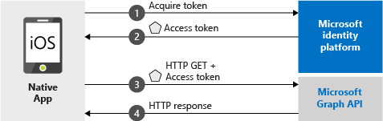

# Quickstart: Sign in users and call the Microsoft Graph API from an iOS native app

[!INCLUDE [active-directory-develop-applies-v2-msal](../../../includes/active-directory-develop-applies-v2-msal.md)]

This quickstart contains a code sample that demonstrates how a native iOS application can sign in personal, work and school accounts, get an access token, and call the Microsoft Graph API.



> [!div renderon="docs"]
> ## Register and download
> ### Register and configure your application and code sample
> #### Step 1: Register your application
> To register your application and add your application registration information to your solution, do the following:
> 1. Go to the [Microsoft Application Registration Portal](https://apps.dev.microsoft.com/portal/register-app) to register an application.
> 1. In the **Application Name** box, enter a name for your application.
> 1. Ensure that the **Guided Setup** check box is cleared, and then select **Create**.
> 1. Select **Add Platform**, select **Native Application**, and then select **Save**.

> [!div renderon="portal" class="sxs-lookup"]
> #### Step 1: Configure your application
> For the code sample for this quickstart to work, you need to add a reply URL as `msal<AppId>://auth` (where msal<AppId> is this application Id).
> > [!div renderon="portal" id="makechanges" class="nextstepaction"]
> > [Make this change for me]()
>
> > [!div id="appconfigured" class="alert alert-info"]
> >  Your application is configured with this attribute

#### Step 2: Download your web server or project

- [Download the XCode Project](https://github.com/Azure-Samples/active-directory-ios-swift-native-v2/archive/master.zip)

#### Step 3: Configure your project

1. Extract the zip file and open the project in XCode.
1. Edit **ViewController.swift** and replace the line starting with 'let kClientID' with the following code snippet:

	> [!div renderon="portal" class="sxs-lookup"]
    > ```swift
    > let kClientID = "Enter_the_Application_Id_here"
    > ```

	> [!div renderon="docs"]
    > ```swift
    > let kClientID = "<ENTER_THE_APPLICATION_ID_HERE>"
    > ```	
1. Press Control + click **Info.plist** to bring up the contextual menu, and then select **Open As** > **Source Code**.
1. Under the dict root node, add the following code:

	> [!div renderon="portal" class="sxs-lookup"]
    > ```xml
    > <key>CFBundleURLTypes</key>
    > <array>
    >     <dict>
    >         <key>CFBundleTypeRole</key>
    >         <string>Editor</string>
    >         <key>CFBundleURLName</key>
    >         <string>$(PRODUCT_BUNDLE_IDENTIFIER)</string>
    >         <key>CFBundleURLSchemes</key>
    >         <array>
    >             <string>msalEnter_the_Application_Id_here</string>
    >         </array>
    >     </dict>
    > </array>
    > ```

	> [!div renderon="docs"]
    > ```xml
    > <key>CFBundleURLTypes</key>
    > <array>
    >     <dict>
    >         <key>CFBundleTypeRole</key>
    >         <string>Editor</string>
    >         <key>CFBundleURLName</key>
    >         <string>$(PRODUCT_BUNDLE_IDENTIFIER)</string>
    >         <key>CFBundleURLSchemes</key>
    >         <array>
    >             <string>msal<ENTER_THE_APPLICATION_ID_HERE></string>
    >         </array>
    >     </dict>
    > </array>
    > ```
    
> [!div renderon="docs"]
> <span>5.</span> Replace `<ENTER_THE_APPLICATION_ID_HERE>` with the *Application ID* for your application. If you need to find the *Application ID*, go to the *Overview* page.

## More Information

Read these sections to learn more about this quickstart.

### MSAL

MSAL ([MSAL.framework](https://github.com/AzureAD/microsoft-authentication-library-for-objc)) is the library used to sign in users and request tokens used to access an API protected by Microsoft Azure Active Directory. You can add MSAL to your application using the following process:

```
$ vi Podfile
```
Add the following to this podfile:

```
 target 'QuickStart' do
   use_frameworks!
 pod 'MSAL'
 end
```

### MSAL initialization

You can add the reference for MSAL by adding the following code:

```swift
import MSAL
```

Then, initialize MSAL using the following code:

```swift
let authority = MSALAuthority(url: URL(string: kAuthority)!)
self.applicationContext = try MSALPublicClientApplication(clientId: kClientID, authority: authority)
```

> |Where: ||
> |---------|---------|
> | `clientId` | The Application ID from the application registered in *portal.azure.com* |
> | `authority` | The Azure AD v2.0 endpoint. In most of cases this will be *https<span/>://login.microsoftonline.com/common* |

### Requesting tokens

MSAL has two methods used to acquire tokens: `acquireToken` and `acquireTokenSilent`.

#### Getting an access token interactively

Some situations require forcing users to interact with Azure Active Directory (Azure AD) v2.0 endpoint which will result in a context switch to the system browser to either validate users's credentials or for consent. Some examples include:

* The first time users sign in to the application
* When users may need to reenter their credentials because the password has expired
* When your application is requesting access to a resource that the user needs to consent to
* When two factor authentication is required

```swift
applicationContext.acquireToken(forScopes: self.kScopes) { (result, error) in /* Add your handling logic */}
```

> |Where:||
> |---------|---------|
> | `forScopes` | Contains the scopes being requested (that is, [ "user.read" ]` for Microsoft Graph or `[ "<Application ID URL>/scope" ]` for custom Web APIs (i.e. `api://<Application ID>/access_as_user`)) |

#### Getting an access token silently

You don't want to require the user to validate their credentials every time they need to access a resource. Most of the time you want token acquisitions and renewal without any user interaction. You can use the `acquireTokenSilent`method to obtain tokens to access protected resources after the initial `acquireToken` method:

```swift
applicationContext.acquireTokenSilent(forScopes: self.kScopes, account: applicationContext.allAccounts().first) { (result, error) in /* Add your handling logic */}
```

> |Where: ||
> |---------|---------|
> | `forScopes` | Contains the scopes being requested (that is, `[ "user.read" ]` for Microsoft Graph or `[ "<Application ID URL>/scope" ]` for custom Web APIs (i.e. `api://<Application ID>/access_as_user`)) |
> | `account` | The account requesting the token (MSAL supports multiple accounts in a single app). In the case of this Quickstart, the value points to the first account in the cache (`applicationContext.allAccounts().first`). |

## Next steps

Try out the iOS tutorial for a complete step-by-step guide on building applications and new features, including a full explanation of this quickstart.

### Learn the steps to create the application used in this quickstart

> [!div class="nextstepaction"]
> [Call Graph API iOS tutorial](https://docs.microsoft.com/azure/active-directory/develop/guidedsetups/active-directory-ios)

[!INCLUDE [Help and support](../../../includes/active-directory-develop-help-support-include.md)]
