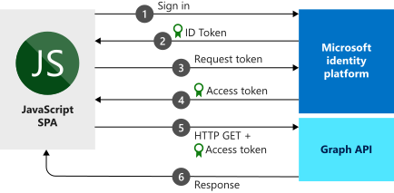

# Quickstart: Sign in users and get an access token in a JavaScript SPA

In this quickstart, you use a code sample to learn how a JavaScript single-page application (SPA) can sign in users of personal accounts, work accounts, and school accounts. A JavaScript SPA can also get an access token to call the Microsoft Graph API or any web API. (See [How the sample works](#how-the-sample-works) for an illustration.)

## Prerequisites

* Azure subscription - [create one for free](https://azure.microsoft.com/free/?WT.mc_id=A261C142F)
* [Node.js](https://nodejs.org/en/download/).
* Either [Visual Studio Code](https://code.visualstudio.com/download) (to edit project files), or [Visual Studio 2019](https://visualstudio.microsoft.com/downloads/) (ro run the project as a Visual Studio Solution).

> [!div renderon="docs"]
> ## Register and download your quickstart application
> To start your quickstart application, use either of the following options.
>
> ### Option 1 (Express): Register and auto configure your app and then download your code sample
>
> 1. Sign in to the [Azure portal](https://portal.azure.com) by using either a work or school account, or a personal Microsoft account.
> 1. If your account gives you access to more than one tenant, select the account at the top right, and then set your portal session to the Azure Active Directory (Azure AD) tenant you want to use.
> 1. Go to the new [Azure portal - App registrations](https://portal.azure.com/#blade/Microsoft_AAD_RegisteredApps/ApplicationsListBlade/quickStartType/JavascriptSpaQuickstartPage/sourceType/docs) pane.
> 1. Enter a name for your application, and select **Register**.
> 1. Follow the instructions to download and automatically configure your new application.
>
> ### Option 2 (Manual): Register and manually configure your application and code sample
>
> #### Step 1: Register your application
>
> 1. Sign in to the [Azure portal](https://portal.azure.com) by using either a work or school account, or a personal Microsoft account.
>
> 1. If your account gives you access to more than one tenant, select your account at the top right, and then set your portal session to the Azure AD tenant you want to use.
> 1. Go to the Microsoft identity platform for developers [App registrations](https://go.microsoft.com/fwlink/?linkid=2083908) page.
> 1. Select **New registration**.
> 1. When the **Register an application** page appears, enter a name for your application.
> 1. Under **Supported account types**, select **Accounts in any organizational directory and personal Microsoft accounts**.
> 1. Under the **Redirect URI** section, in the drop-down list, select the **Web** platform, and then set the value to `http://localhost:30662/`.
> 1. Select **Register**. On the app **Overview** page, note the **Application (client) ID** value for later use.
> 1. This quickstart requires the [Implicit grant flow](v2-oauth2-implicit-grant-flow.md) to be enabled. In the left pane of the registered application, select **Authentication**.
> 1. In the **Advanced settings** section, under **Implicit grant**, select the **ID tokens** and **Access tokens** check boxes. ID tokens and access tokens are required, because this app needs to sign in users and call an API.
> 1. At the top of the pane, select **Save**.

> [!div class="sxs-lookup" renderon="portal"]
> #### Step 1: Configure your application in the Azure portal
> For the code sample for this quickstart to work, you need to add a `redirectUri` as `http://localhost:30662/` and enable **Implicit grant**.
> > [!div renderon="portal" id="makechanges" class="nextstepaction"]
> > [Make these changes for me]()
>
> > [!div id="appconfigured" class="alert alert-info"]
> >  Your application is configured with these attributes.

#### Step 2: Download the project

Select the option that's suitable to your development environment:

* To run the project with a web server by using Node.js, [download the core project files](https://github.com/Azure-Samples/active-directory-javascript-graphapi-v2/archive/quickstart.zip). To open the files, use an editor such as [Visual Studio Code](https://code.visualstudio.com/).

* (Optional) To run the project with the IIS server, [download the Visual Studio project](https://github.com/Azure-Samples/active-directory-javascript-graphapi-v2/archive/vsquickstart.zip). Extract the zip file to a local folder (for example, *C:\Azure-Samples*).

#### Step 3: Configure your JavaScript app

> [!div renderon="docs"]
> In the *JavaScriptSPA* folder, edit *index.html*, and set the `clientID` and `authority` values under `msalConfig`.

> [!div class="sxs-lookup" renderon="portal"]
> In the *JavaScriptSPA* folder, edit *index.html*, and replace `msalConfig` with the following code:

```javascript
var msalConfig = {
    auth: {
        clientId: "Enter_the_Application_Id_here",
        authority: "https://login.microsoftonline.com/Enter_the_Tenant_info_here",
        redirectUri: "http://localhost:30662/"
    },
    cache: {
        cacheLocation: "localStorage",
        storeAuthStateInCookie: true
    }
};

```
> [!div renderon="portal"]
> > [!NOTE]
> > This quickstart supports Enter_the_Supported_Account_Info_Here.


> [!div renderon="docs"]
>
> Where:
> - *\<Enter_the_Application_Id_here>* is the **Application (client) ID** for the application you registered.
> - *\<Enter_the_Tenant_info_here>* is set to one of the following options:
>    - If your application supports *accounts in this organizational directory*, replace this value with the **Tenant ID** or **Tenant name** (for example, *contoso.microsoft.com*).
>    - If your application supports *accounts in any organizational directory*, replace this value with **organizations**.
>    - If your application supports *accounts in any organizational directory and personal Microsoft accounts*, replace this value with **common**. To restrict support to *personal Microsoft accounts only*, replace this value with **consumers**.
>
> > [!TIP]
> > To find the values of **Application (client) ID**, **Directory (tenant) ID**, and **Supported account types**, go to the app's **Overview** page in the Azure portal.
>

#### Step 4: Run the project

* If you're using [Node.js](https://nodejs.org/en/download/):

    1. To start the server, run the following command from the project directory:

        ```batch
        npm install
        node server.js
        ```

    1. Open a web browser and go to `http://localhost:30662/`.
    1. Select **Sign In** to start the sign-in, and then call Microsoft Graph API.


* If you're using [Visual Studio](https://visualstudio.microsoft.com/downloads/), select the project solution, and then select F5 to run the project.

After the browser loads the application, select **Sign In**. The first time that you sign in, you're prompted to provide your consent to allow the application to access your profile and to sign you in. After you're signed in successfully, your user profile information should be displayed on the page.

## More information

### How the sample works



### msal.js

The MSAL library signs in users and requests the tokens that are used to access an API that's protected by Microsoft identity platform. The quickstart *index.html* file contains a reference to the library:

```html
<script src="https://secure.aadcdn.microsoftonline-p.com/lib/1.0.0/js/msal.min.js"></script>
```
> [!TIP]
> You can replace the preceding version with the latest released version under [MSAL.js releases](https://github.com/AzureAD/microsoft-authentication-library-for-js/releases).


Alternatively, if you have Node.js installed, you can download the latest version through Node.js Package Manager (npm):

```batch
npm install msal
```

### MSAL initialization

The quickstart code also shows how to initialize the MSAL library:

```javascript
var msalConfig = {
    auth: {
        clientId: "Enter_the_Application_Id_here",
        authority: "https://login.microsoftonline.com/Enter_the_Tenant_Info_Here",
        redirectUri: "http://localhost:30662/"
    },
    cache: {
        cacheLocation: "localStorage",
        storeAuthStateInCookie: true
    }
};

var myMSALObj = new Msal.UserAgentApplication(msalConfig);
```

> |Where  |  |
> |---------|---------|
> |`clientId`     | The application ID of the application that's registered in the Azure portal.|
> |`authority`    | (Optional) The authority URL that supports account types, as described previously in the configuration section. The default authority is `https://login.microsoftonline.com/common`. |
> |`redirectUri`     | The application registration's configured reply/redirectUri. In this case, `http://localhost:30662/`. |
> |`cacheLocation`  | (Optional) Sets the browser storage for the auth state. The default is sessionStorage.   |
> |`storeAuthStateInCookie`  | (Optional) The library that stores the authentication request state that's required for validation of the authentication flows in the browser cookies. This cookie is set for IE and Edge browsers to mitigate certain [known issues](https://github.com/AzureAD/microsoft-authentication-library-for-js/wiki/Known-issues-on-IE-and-Edge-Browser#issues). |

For more information about available configurable options, see [Initialize client applications](msal-js-initializing-client-applications.md).

### Sign in users

The following code snippet shows how to sign in users:

```javascript
var requestObj = {
    scopes: ["user.read"]
};

myMSALObj.loginPopup(requestObj).then(function (loginResponse) {
    //Login Success callback code here
}).catch(function (error) {
    console.log(error);
});
```

> |Where  |  |
> |---------|---------|
> | `scopes`   | (Optional) Contains scopes that are being requested for user consent at sign-in time. For example, `[ "user.read" ]` for Microsoft Graph or `[ "<Application ID URL>/scope" ]` for custom Web APIs (that is, `api://<Application ID>/access_as_user`). |

> [!TIP]
> Alternatively, you might want to use the `loginRedirect` method to redirect the current page to the sign-in page instead of a popup window.

### Request tokens

MSAL uses three methods to acquire tokens: `acquireTokenRedirect`, `acquireTokenPopup`, and `acquireTokenSilent`

#### Get a user token silently

The `acquireTokenSilent` method handles token acquisitions and renewal without any user interaction. After the `loginRedirect` or `loginPopup` method is executed for the first time, `acquireTokenSilent` is the method commonly used to obtain tokens that are used to access protected resources for subsequent calls. Calls to request or renew tokens are made silently.

```javascript
var requestObj = {
    scopes: ["user.read"]
};

myMSALObj.acquireTokenSilent(requestObj).then(function (tokenResponse) {
    // Callback code here
    console.log(tokenResponse.accessToken);
}).catch(function (error) {
    console.log(error);
});
```

> |Where  |  |
> |---------|---------|
> | `scopes`   | Contains scopes being requested to be returned in the access token for API. For example, `[ "user.read" ]` for Microsoft Graph or `[ "<Application ID URL>/scope" ]` for custom Web APIs (that is, `api://<Application ID>/access_as_user`).|

#### Get a user token interactively

There are situations where you need to force users to interact with the Microsoft identity platform endpoint. For example:
* Users might need to reenter their credentials because their password has expired.
* Your application is requesting access to additional resource scopes that the user needs to consent to.
* Two-factor authentication is required.

The usual recommended pattern for most applications is to call `acquireTokenSilent` first, then catch the exception, and then call `acquireTokenPopup` (or `acquireTokenRedirect`) to start an interactive request.

Calling the `acquireTokenPopup` results in a popup window for signing in. (Or `acquireTokenRedirect` results in redirecting users to the Microsoft identity platform endpoint.) In that window, users need to interact by confirming their credentials, giving the consent to the required resource, or completing the two-factor authentication.

```javascript
var requestObj = {
    scopes: ["user.read"]
};

myMSALObj.acquireTokenPopup(requestObj).then(function (tokenResponse) {
    // Callback code here
    console.log(tokenResponse.accessToken);
}).catch(function (error) {
    console.log(error);
});
```

> [!NOTE]
> This quickstart uses the `loginRedirect` and `acquireTokenRedirect` methods with Microsoft Internet Explorer, because of a [known issue](https://github.com/AzureAD/microsoft-authentication-library-for-js/wiki/Known-issues-on-IE-and-Edge-Browser#issues) related to the handling of popup windows by Internet Explorer.

## Next steps

For a more detailed step-by-step guide on building the application for this quickstart, see:

> [!div class="nextstepaction"]
> [Tutorial to sign in and call MS Graph](https://docs.microsoft.com/azure/active-directory/develop/guidedsetups/active-directory-javascriptspa)

To browse the MSAL repo for documentation, FAQ, issues, and more, see:

> [!div class="nextstepaction"]
> [MSAL.js GitHub repo](https://github.com/AzureAD/microsoft-authentication-library-for-js)

Help us improve the Microsoft identity platform. Tell us what you think by completing a short two-question survey.

> [!div class="nextstepaction"]
> [Microsoft identity platform survey](https://forms.office.com/Pages/ResponsePage.aspx?id=v4j5cvGGr0GRqy180BHbRyKrNDMV_xBIiPGgSvnbQZdUQjFIUUFGUE1SMEVFTkdaVU5YT0EyOEtJVi4u)
