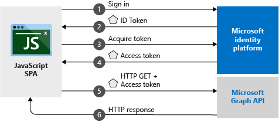

# Quickstart: Sign in users and acquire an access token from a JavaScript application

[!INCLUDE [active-directory-develop-applies-v2-msal](../../../includes/active-directory-develop-applies-v2-msal.md)]

In this quickstart, you'll learn how to use a code sample that demonstrates how a JavaScript single page application (SPA) can sign in personal accounts, work and school accounts, get an access token to call the Microsoft Graph API or any web API.



> [!div renderon="docs"]
> ## Register your application and download your quickstart app
>
> ### Step 1: Register your application
>
> 1. Go to the [Microsoft Application Registration Portal](https://apps.dev.microsoft.com/portal/register-app) to register an application.
> 1. In the **Application Name** box, enter a name for your application.
> 1. Ensure that the **Guided Setup** check box is cleared, and then select **Create**.
> 1. Click **Add Platform**, then select **Web**.
> 1. Make sure **Allow Implicit Flow** is *checked*.
> 1. Under **Redirect URLs** add `http://localhost:30662/`.
> 1. Click **Save**.

> [!div class="sxs-lookup" renderon="portal"]
> #### Step 1: Configure your application in Azure portal
> For the code sample for this quickstart to work, you need to add a redirect URI as `http://localhost:30662/` and enable **Implicit Grant**.
> > [!div renderon="portal" id="makechanges" class="nextstepaction"]
> > [Make these changes for me]()
>
> > [!div id="appconfigured" class="alert alert-info"]
> >  Your application is configured with these attributes

#### Step 2: Download the project

You can choose one of these options suitable to your development environment.
* [Download the core project files - for a web server, such as Node.js](https://github.com/Azure-Samples/active-directory-javascript-graphapi-v2/archive/quickstart.zip)
* [Download the Visual Studio project](https://github.com/Azure-Samples/active-directory-javascript-graphapi-v2/archive/vsquickstart.zip)

Extract the zip file to a local folder (for example, **C:\Azure-Samples**).

#### Step 3: Configure your JavaScript app

> [!div renderon="docs"]
> Edit `index.html` and replace `Enter_the_Application_Id_here` under `applicationConfig` with the Application ID of the app you just registered.

> [!div class="sxs-lookup" renderon="portal"]
> Edit `index.html` and replace `applicationConfig` with:

```javascript
var applicationConfig = {
    clientID: "Enter_the_Application_Id_here",
    graphScopes: ["user.read"],
    graphEndpoint: "https://graph.microsoft.com/v1.0/me"
};
```
> [!NOTE]
>If you use [Node.js](https://nodejs.org/en/download/), the *server.js* file is configured for the server to start listening on the port 30662.
> If you use [Visual Studio 2017](https://visualstudio.microsoft.com/downloads/), the code sample's *.csproj* file is configured for the server to start listening on the port 30662.
>

#### Step 4: Run the project

If using Node.js, on a command line you can run the following from the project's directory to start the server:
 ```batch
 npm install
 node server.js
 ```
Open a web browser and navigate to `http://localhost:30662/`. Click **Sign In** button to start sign-in and then call Microsoft Graph API.

If using Visual Studio, make sure to select the project solution and then press **F5** to run your project.

## More Information

### *msal.js*

MSAL is the library used to sign in users and request tokens used to access an API protected by Microsoft Azure Active Directory (Azure AD). The quickstart's *index.html* contains a reference to the library:

```html
<script src="https://secure.aadcdn.microsoftonline-p.com/lib/0.2.3/js/msal.min.js"></script>
```

Alternatively, if you have Node installed, you can download it through npm:

```batch
npm install msal
```

### MSAL initialization

The quickstart code also shows how to initialize the library:

```javascript
var myMSALObj = new Msal.UserAgentApplication(applicationConfig.clientID, null, acquireTokenRedirectCallBack, {storeAuthStateInCookie: true, cacheLocation: "localStorage"});
```

> |Where  |  |
> |---------|---------|
> |`ClientId`     |Application Id from the application registered in the Azure portal|
> |`authority`    |It is the authority URL. Passing *null* sets the default authority to `https://login.microsoftonline.com/common`. If your app is single-tenant (targeting accounts in one directory only), set this value to `https://login.microsoftonline.com/<tenant name or ID>`|
> |`tokenReceivedCallback`| Callback method called after the authentication redirects back to app. Here `acquireTokenRedirectCallBack` is passed. This is null if using loginPopup.|
> |`options`  |A collection of optional parameters. In this case `storeAuthStateInCookie` and `cacheLocation` are optional configuration. See the [wiki](https://github.com/AzureAD/microsoft-authentication-library-for-js/wiki/MSAL-basics#configuration-options) for more details on the options. |

### Sign in users

The following code snippet shows how to sign in users:

```javascript
myMSALObj.loginPopup(applicationConfig.graphScopes).then(function (idToken) {
    //Callback code here
})
```

> |Where  |  |
> |---------|---------|
> | `scopes`   | (Optional) Contains scopes being requested for user consent at login time (Ex: `[ "user.read" ]` for Microsoft Graph or `[ "<Application ID URL>/scope" ]` for custom Web APIs ( i.e. `api://<Application ID>/access_as_user` ). Here `applicationConfig.graphScopes` is passed. |

> [!TIP]
> Alternatively, you may want to use the `loginRedirect` method to redirect the current page to the sign-in page instead of a popup window.


### Request tokens

MSAL has three methods used to acquire tokens: `acquireTokenRedirect`, `acquireTokenPopup` and `acquireTokenSilent`:

#### Get a user token silently

The `acquireTokenSilent` method handles token acquisitions and renewal without any user interaction. After the `loginRedirect` or `loginPopup` method is executed for the first time, `acquireTokenSilent` is the method commonly used to obtain tokens that are used to access protected resources for subsequent calls. Calls to request or renew tokens are made silently.

```javascript
myMSALObj.acquireTokenSilent(applicationConfig.graphScopes).then(function (accessToken) {
    // Callback code here
})
```

> |Where  |  |
> |---------|---------|
> | `scopes`   | Contains scopes being requested to be returned in the access token for API (Ex: `[ "user.read" ]` for Microsoft Graph or `[ "<Application ID URL>/scope" ]` for custom Web APIs ( i.e. `api://<Application ID>/access_as_user` ). Here `applicationConfig.graphScopes` is passed.|

#### Get a user token interactively

 There are situations where you need to force users to interact with Azure AD v2.0 endpoint. For example:
* Users may need to reenter their credentials because their password has expired
* Your application is requesting access to additional resource scopes that the user needs to consent to
* Two factor authentication is required

The usual recommended pattern for most applications is to call `acquireTokenSilent` first, then catch the exception and then call `acquireTokenRedirect` (or `acquireTokenPopup`) to start an interactive request.

Calling the `acquireTokenPopup(scope)` results in a popup window to sign in (or `acquireTokenRedirect(scope)` results in redirecting users to the Azure AD v2.0 endpoint) where users need to interact by either confirming their credentials, giving the consent to the required resource, or completing the two factor authentication.

```javascript
myMSALObj.acquireTokenPopup(applicationConfig.graphScopes).then(function (accessToken) {
    // Callback code here
})
```

> [!NOTE]
> This quickstart uses the `loginRedirect` and `acquireTokenRedirect` methods  when the browser used is Internet Explorer due to a [known issue](https://github.com/AzureAD/microsoft-authentication-library-for-js/wiki/Known-issues-on-IE-and-Edge-Browser#issues) related to handling of popup windows by Internet Explorer browser.

## Next steps

For a more detailed step-by-step guide on how to build the application for this quickstart, try out the JavaScript tutorial below.

### Learn the steps to create the application for this quickstart

> [!div class="nextstepaction"]
> [Call Graph API tutorial](https://docs.microsoft.com/azure/active-directory/develop/guidedsetups/active-directory-javascriptspa)

### Browse the MSAL repo for documentation, FAQ, issues, and more

> [!div class="nextstepaction"]
> [msal.js GitHub repo](https://github.com/AzureAD/microsoft-authentication-library-for-js)


[!INCLUDE [Help and support](../../../includes/active-directory-develop-help-support-include.md)]
