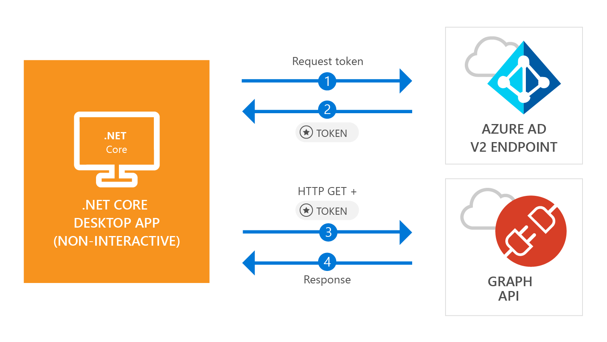

# Quickstart: Acquire a token and call Microsoft Graph API from a console app using app's identity

[!INCLUDE [active-directory-develop-applies-v2-msal](../../../includes/active-directory-develop-applies-v2-msal.md)]

In this quickstart, you'll learn how to write a .NET Core application that can get an access token using the app's own identity and then call the Microsoft Graph API to display a [list of users](https://docs.microsoft.com/graph/api/user-list) in the directory. This scenario is useful for situations where headless, unattended job or a windows service needs to run with an application identity, instead of a user's identity.



## Prerequisites

This quickstart requires [.NET Core 2.1](https://www.microsoft.com/net/download/dotnet-core/2.1).

> [!div renderon="docs"]
> ## Register and download your quickstart app

> [!div renderon="portal" class="sxs-lookup"]
> You have two options to start your quickstart application:
> * [Express] [Option 1: Register and auto configure your app and then download your code sample](#option-1-register-and-auto-configure-your-app-and-then-download-your-code-sample)
> * [Manual] [Option 2: Register and manually configure your application and code sample](#option-2-register-and-manually-configure-your-application-and-code-sample)
>
> ### Option 1: Register and auto configure your app and then download your code sample
>
> 1. Go to the [Azure portal - Application Registration (Preview)](https://portal.azure.com/?Microsoft_AAD_RegisteredApps=true#blade/Microsoft_AAD_RegisteredApps/applicationsListBlade/quickStartType/WinDesktopQuickstartPage/sourceType/docs).
> 1. Enter a name for your application and select **Register**.
> 1. Follow the instructions to download and automatically configure your new application with just one click.
>
> ### Option 2: Register and manually configure your application and code sample
>

> [!div renderon="docs"]
> #### Step 1: Register your application
> To register your application and add the app's registration information to your solution manually, follow these steps:
>
> 1. Sign in to the [Azure portal](https://portal.azure.com) using either a work or school account or a personal Microsoft account.
> 1. If your account gives you access to more than one tenant, select your account in the top right corner, and set your portal session to the desired Azure AD tenant.
> 1. In the left-hand navigation pane, select the **Azure Active Directory** service, and then select **App registrations (Preview)** > **New registration**.
> 1. In the **Name** section, enter a meaningful application name that will be displayed to users of the app, for example `Daemon-console`, then select **Register** to create the application.
> 1. Once registered, select the **Certificates & secrets** menu.
> 1. Under **Client secrets**, select **+ New client secret**. Give it a name and select **Add**. Copy the secret on a safe location. You will need it to use in your code.
> 1. Now, select the **API Permissions** menu, select **+ Add a permission** button, select **Microsoft Graph**.
> 1. Select **Application permissions**.
> 1. Under **User** node, select **User.Read.All**, then select **Add permissions**

> [!div class="sxs-lookup" renderon="portal"]
> #### Step 1: Configure your application in Azure portal
> For the code sample for this quickstart to work, you need to create a client secret, and add Graph API's **User.Read.All** application permission.
> > [!div renderon="portal" id="makechanges" class="nextstepaction"]
> > [Make these changes for me]()
>
> > [!div id="appconfigured" class="alert alert-info"]
> >  Your application is configured with these attributes.

#### Step 2: Download your Visual Studio project

[Download the Visual Studio project](https://github.com/Azure-Samples/active-directory-dotnetcore-daemon-v2/archive/master.zip)

#### Step 3: Configure your Visual Studio project

1. Extract the zip file to a local folder close to the root of the disk, for example, **C:\Azure-Samples**.
1. Open the solution in Visual Studio - **daemon-console.sln** (optional).
1. Edit **appsettings.json** and replace the values of the fields `ClientId`, `Tenant` and `ClientSecret` with the following:

    ```json
    "Tenant": "Enter_the_Tenant_Id_Here",
    "ClientId": "Enter_the_Application_Id_Here",
    "ClientSecret": "Enter_the_Client_Secret_Here"
    ```
    > > [!div renderon="portal" id="certandsecretspage" class="sxs-lookup"]
    > > [Generate a new client secret]()
    
    > [!div renderon="docs"]
    >> Where:
    >> * `Enter_the_Application_Id_Here` - is the **Application (client) ID** for the application you registered.
    >> * `Enter_the_Tenant_Id_Here` - replace this value with the **Tenant Id** or **Tenant name** (for example, contoso.microsoft.com)
    >> * `Enter_the_Client_Secret_Here` - replace this value with the client secret created on step 1.

    > > [!TIP]
    > > To find the values of **Application (client) ID**, **Directory (tenant) ID**, go to the app's **Overview** page in the Azure portal. To generate a new key, go to **Certificates & secrets** page.
    
#### Step 4: Admin consent

Any *app-only permission* requires Admin consent - which means that it needs an global administrator of your directory to give consent to your application. Select one of the options below depending your role:

##### Global tenant administrator

> [!div renderon="docs"]
> If you are a global tenant administrator, go to **API Permissions** page in the Azure Portal's Application Registration (Preview) and select **Grant admin consent for {Tenant Name}** (Where {Tenant Name} is the name of your directory).

> [!div renderon="portal" class="sxs-lookup"]
> If you are a global administrator, go to **API Permissions** page select **Grant admin consent for Enter_the_Tenant_Name_Here**
> > [!div id="apipermissionspage"]
> > [Go to the API Permissions page]()

##### Standard user

If you are a standard user of your tenant, then you need to ask a global administrator to grant admin consent for your application. To do this, give the following URL to your administrator:

```url
https://login.microsoftonline.com/Enter_the_Tenant_Id_Here/adminconsent?client_id=Enter_the_Application_Id_Here
```

> [!div renderon="docs"]
>> Where:
>> * `Enter_the_Tenant_Id_Here` - replace this value with the **Tenant Id** or **Tenant name** (for example, contoso.microsoft.com)
>> * `Enter_the_Application_Id_Here` - is the **Application (client) ID** for the application you registered.

> [!NOTE]
> You may see the error *'AADSTS50011: No reply address is registered for the application'* after granting consent to the app using the preceding URL. This happen because this application and the URL do not have a redirect URI - please ignore the error.

#### Step 5: Run the application

If you are using Visual Studio, press **F5** to run the application, otherwise, run the application via command prompt or console:

```console
cd {ProjectFolder}\daemon-console
dotnet run
```

> Where:
> * *{ProjectFolder}* is the folder where you extracted the zip file. Example **C:\Azure-Samples\active-directory-dotnetcore-daemon-v2**

You should see a list of users in your Azure AD directory as result.

## More information

### MSAL.NET

MSAL ([Microsoft.Identity.Client](https://www.nuget.org/packages/Microsoft.Identity.Client)) is the library used to sign in users and request tokens used to access an API protected by Microsoft Azure Active Directory (Azure AD). As described, this quickstart request tokens by using the application own identity instead of delegated permissions. The authentication flow used in this case is known as *[client credentials oauth flow](v2-oauth2-client-creds-grant-flow.md)*. For more information on how to use MSAL.NET with client credentials flow, please see [this article](https://aka.ms/msal-net-client-credentials).

 You can install MSAL.NET by running the following command in Visual Studio's **Package Manager Console**:

```powershell
Install-Package Microsoft.Identity.Client -Pre
```

### MSAL initialization

You can add the reference for MSAL by adding the following code:

```csharp
using Microsoft.Identity.Client;
```

Then, initialize MSAL using the following code:

```csharp
ClientCredential clientCredentials = new ClientCredential(secret: config.ClientSecret);

var app = new ConfidentialClientApplication(
    clientId: config.ClientId, 
    authority: config.Authority, 
    redirectUri: "https://daemon", 
    clientCredential: clientCredentials, 
    userTokenCache: null, 
    appTokenCache: new TokenCache()
);
```

> | Where: ||
> |---------|---------|
> | `secret` | Is the client secret created for the application in Azure Portal. |
> | `clientId` | Is the **Application (client) ID** for the application registered in the Azure portal. You can find this value in the app's **Overview** page in the Azure portal. |
> | `Authority`    | (Optional) The STS endpoint for user to authenticate. Usually https://login.microsoftonline.com/{tenant} for public cloud, where {tenant} is the name of your tenant or your tenant Id.|
> | `redirectUri`  | URL where users are sent after authentication. In this case, because this is a console/non-interactive application, this parameter is not used |
> | `clientCredentials`  | The client credentials object, containing either the secret or certificate |
> | `userTokenCache`  | Instance of a token cache for the user. In this case, because this app runs in context of the app, and not the user, this value is null|
> | `appTokenCache`  | Instance of a token cache for the app|

For more information, please see the [reference documentation for `ConfidentialClientApplication`](https://docs.microsoft.com/dotnet/api/microsoft.identity.client.confidentialclientapplication.-ctor?view=azure-dotnet#Microsoft_Identity_Client_ConfidentialClientApplication__ctor_System_String_System_String_System_String_Microsoft_Identity_Client_ClientCredential_Microsoft_Identity_Client_TokenCache_Microsoft_Identity_Client_TokenCache)

### Requesting tokens

To request a token using app's identity, use `AcquireTokenForClientAsync` method:

```csharp
result = await app.AcquireTokenForClientAsync(scopes);
```

> |Where:| |
> |---------|---------|
> | `scopes` | Contains the scopes requested. For confidential clients, this should use the format similar to `{Application ID URI}/.default` to indicate that the scopes being requested are the ones statically defined in the app object set in the Azure Portal (for Microsoft Graph, `{Application ID URI}` points to `https://graph.microsoft.com`). For custom Web APIs, `{Application ID URI}` is defined under **Expose an API** section in Azure Portal's Application Registration (Preview). |

For more information, please see the [reference documentation for `AcquireTokenForClientAsync`](https://docs.microsoft.com/dotnet/api/microsoft.identity.client.confidentialclientapplication.acquiretokenforclientasync?view=azure-dotnet#Microsoft_Identity_Client_ConfidentialClientApplication_AcquireTokenForClientAsync_System_Collections_Generic_IEnumerable_System_String__)

[!INCLUDE [Help and support](../../../includes/active-directory-develop-help-support-include.md)]

## Next steps

Learn more about permissions and consent:

> [!div class="nextstepaction"]
> [Permissions and Consent](v2-permissions-and-consent.md)

To know more about the auth flow for this scenario, see the Oauth 2.0 client credentials flow:

> [!div class="nextstepaction"]
> [Client credentials Oauth flow](v2-oauth2-client-creds-grant-flow.md)

> [!div class="nextstepaction"]
> [Client credential flows with MSAL.NET](https://aka.ms/msal-net-client-credentials)