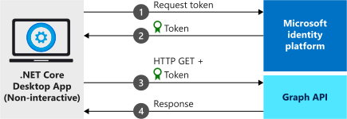

# Quickstart: Get a token and call the Microsoft Graph API by using a console app's identity


> [!div renderon="docs"]
> Welcome! This probably isn't the page you were expecting. While we work on a fix, this link should take you to the right article:
>
> > [Quickstart: Acquire a token and call Microsoft Graph in a .NET Core console app](quickstart-console-app-netcore-acquire-token.md)
>
> We apologize for the inconvenience and appreciate your patience while we work to get this resolved.

> [!div renderon="portal" class="sxs-lookup"]
> The following quickstart uses a code sample to demonstrates how a .NET Core console application can get an access token to call the Microsoft Graph API and display a [list of users](/graph/api/user-list) in the directory. It also demonstrates how a job or a Windows service can run with an application identity, instead of a user's identity. The sample console application in this quickstart is also a daemon application, therefore it's a confidential client application.
>
> ## Prerequisites
>
> This quickstart requires the [.NET Core 6.0 SDK](https://dotnet.microsoft.com/download).
>
> > [!div class="sxs-lookup"]
> ### Download and configure your quickstart app
>
> #### Step 1: Configure your application in the Azure portal
> For the code sample in this quickstart to work, create a client secret and add the Graph API's **User.Read.All** application permission.
> > [!div class="nextstepaction"]
> > [Make these changes for me]()
>
> > [!div class="alert alert-info"]
> >  Your application is configured with these attributes.
>
> #### Step 2: Download your Visual Studio project
>
> > [!div class="sxs-lookup"]
> > Run the project by using Visual Studio 2022.
> > [!div class="sxs-lookup" id="autoupdate" class="nextstepaction"]
> > [Download the code sample](https://github.com/Azure-Samples/active-directory-dotnetcore-daemon-v2/archive/master.zip)
>
> [!INCLUDE [active-directory-develop-path-length-tip](./includes/error-handling-and-tips/path-length-tip.md)]
>
> > [!div class="sxs-lookup"]
> > > [!NOTE]
> > > `Enter_the_Supported_Account_Info_Here`
>
> #### Step 3: Admin consent
>
> Running the application now results in the output `HTTP 403 - Forbidden* error: "Insufficient privileges to complete the operation`. This error occurs because any app-only permission requires a global administrator of the directory to give consent to the application. Select one of the following options, depending on the role.
>
> ##### Global tenant administrator
>
> For a global tenant administrator, go to the **API Permissions** page and select **Grant admin consent for Enter_the_Tenant_Name_Here**.
> > [!div id="apipermissionspage"]
> > [Go to the API Permissions page]()
>
> ##### Standard user
>
> For a standard user of your tenant, ask a global administrator to grant admin consent to the application. To do this, provide the following URL to the administrator:
>
> ```url
> https://login.microsoftonline.com/Enter_the_Tenant_Id_Here/adminconsent?client_id=Enter_the_Application_Id_Here
> ```
>
> The error `AADSTS50011: No reply address is registered for the application` may be displayed after you grant consent to the app by using the preceding URL. This error occurs because the application and the URL don't have a redirect URI. This can be ignored.
>
> #### Step 4: Run the application
>
> In Visual Studio, press **F5** to run the application. Otherwise, run the application via command prompt, console, or terminal:
>
> ```dotnetcli
> cd {ProjectFolder}\1-Call-MSGraph\daemon-console
> dotnet run
> ```
>
> In that code:
> * `{ProjectFolder}` is the folder where you extracted the .zip file. An example is `C:\Azure-Samples\active-directory-dotnetcore-daemon-v2`.
> 
> A list of users in Microsoft Entra ID should be displayed as a result.
>
> This quickstart application uses a client secret to identify itself as a confidential client. The client secret is added as a plain-text file to the project files. For security reasons, it is recommended to use a certificate instead of a client secret before considering the application as a production application. For more information on how to use a certificate, see [these instructions](https://github.com/Azure-Samples/active-directory-dotnetcore-daemon-v2/#variation-daemon-application-using-client-credentials-with-certificates).
>
> ## More information
>
> This section gives an overview of the code required to sign in users. This overview can be useful to understand how the > code works, what the main arguments are, and how to add sign-in to an existing .NET Core console application.
>
> > [!div class="sxs-lookup"]
> ### How the sample works
>
> 
>
> ### Microsoft.Identity.Web.GraphServiceClient
>
> Microsoft Identity Web (in the [Microsoft.Identity.Web.TokenAcquisition](https://www.nuget.org/packages/Microsoft.Identity.Web.TokenAcquisition) package) is the library that's used to request tokens for accessing an API protected by the Microsoft identity platform. This quickstart requests tokens by using the application's own identity instead of delegated permissions. The authentication flow in this case is known as a [client credentials OAuth flow](v2-oauth2-client-creds-grant-flow.md). For more information on how to use MSAL.NET with a client credentials flow, see [this article](https://aka.ms/msal-net-client-credentials). Given the daemon app in this quickstart calls Microsoft Graph, you install the [Microsoft.Identity.Web.GraphServiceClient](https://www.nuget.org/packages/Microsoft.Identity.Web.GraphServiceClient) package, which handles automatically authenticated requests to Microsoft Graph (and references itself Microsoft.Identity.Web.TokenAcquisition)
>
> Microsoft.Identity.Web.GraphServiceClient can be installed by running the following command in the Visual Studio Package Manager Console:
>
> ```dotnetcli
> dotnet add package Microsoft.Identity.Web.GraphServiceClient
> ```
>
> ### Application initialization
>
> Add the reference for Microsoft.Identity.Web by adding the following code:
>
> ```csharp
> using Microsoft.Extensions.Configuration;
> using Microsoft.Extensions.DependencyInjection;
> using Microsoft.Graph;
> using Microsoft.Identity.Abstractions;
> using Microsoft.Identity.Web;
> ```
>
> Then, initialize the app with the following:
>
> ```csharp
> // Get the Token acquirer factory instance. By default it reads an appsettings.json
> // file if it exists in the same folder as the app (make sure that the 
> // "Copy to Output Directory" property of the appsettings.json file is "Copy if newer").
> TokenAcquirerFactory tokenAcquirerFactory = TokenAcquirerFactory.GetDefaultInstance();
>
> // Configure the application options to be read from the configuration
> // and add the services you need (Graph, token cache)
> IServiceCollection services = tokenAcquirerFactory.Services;
> services.AddMicrosoftGraph();
> // By default, you get an in-memory token cache.
> // For more token cache serialization options, see https://aka.ms/msal-net-token-cache-serialization
>
> // Resolve the dependency injection.
> var serviceProvider = tokenAcquirerFactory.Build();
> ```
>
> This code uses the configuration defined in the appsettings.json file:
>
> ```json
> {
>    "AzureAd": {
>        "Instance": "https://login.microsoftonline.com/",
>        "TenantId": "[Enter here the tenantID or domain name for your Azure AD tenant]",
>        "ClientId": "[Enter here the ClientId for your application]",
>        "ClientCredentials": [
>            {
>               "SourceType": "ClientSecret",
>               "ClientSecret": "[Enter here a client secret for your application]"
>            }
>        ]
>    }
> }
> ```
>
>  | Element | Description |
>  |---------|---------|
>  | `ClientSecret` | The client secret created for the application in the Azure portal. |
>  | `ClientId` | The application (client) ID for the application registered in the Azure portal. This value can be found on the app's **Overview** page in the Azure portal. |
>  | `Instance`    | (Optional) The security token service (STS) could instance endpoint for the app to authenticate. It's usually `https://login.microsoftonline.com/` for the public cloud.|
>  | `TenantId`    |  Name of the tenant or the tenant ID.|
>
> For more information, see the [reference documentation for `ConfidentialClientApplication`](/dotnet/api/microsoft.identity.web.tokenacquirerfactory).
>
> ### Calling Microsoft Graph
>
> To request a token by using the app's identity, use the `AcquireTokenForClient` method:
>
> ```csharp
> GraphServiceClient graphServiceClient = serviceProvider.GetRequiredService<GraphServiceClient>();
> var users = await graphServiceClient.Users
>               .GetAsync(r => r.Options.WithAppOnly());
> ```
>
> [!INCLUDE [Help and support](./includes/error-handling-and-tips/help-support-include.md)]
> 
> ## Next steps
>
> To learn more about daemon applications, see the scenario overview:
>
> > [!div class="nextstepaction"]
> > [Daemon application that calls web APIs](scenario-daemon-overview.md)
