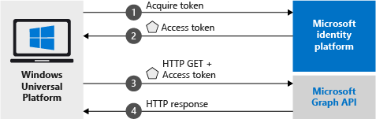

# Call the Microsoft Graph API from a Universal Windows Platform (UWP) application

[!INCLUDE [active-directory-develop-applies-v2-msal](../../../includes/active-directory-develop-applies-v2-msal.md)]

This quickstart contains a code sample that demonstrates how a Universal Windows Platform (UWP) application can sign users with in personal or work and school accounts, get an access token, and call the Microsoft Graph API.



> [!div renderon="docs"]
> ## Register and download
> ### Register and configure your application and code sample
> #### Step 1: Register your application
> To register your application and add your application registration information to your solution, do the following:
> 1. Go to the [Microsoft Application Registration Portal](https://apps.dev.microsoft.com/portal/register-app) to register an application.
> 1. In the **Application Name** box, enter a name for your application.
> 1. Ensure that the **Guided Setup** check box is cleared, and then select **Create**.
> 1. Select **Add Platform**, select **Native Application**, and then select **Save**.

> [!div renderon="portal" class="sxs-lookup alert alert-info"]
> #### Step 1: Configure your application
> For the code sample for this quickstart to work, you need to add a redirect URL as **urn:ietf:wg:oauth:2.0:oob**.
> > [!div renderon="portal" id="makechanges" class="nextstepaction"]
> > [Make this change for me]()
>
> > [!div id="appconfigured" class="alert alert-info"]
> >  Your application is configured with these attributes

#### Step 2: Download your Visual Studio project

 - [Download the Visual Studio 2017 project](https://github.com/Azure-Samples/active-directory-dotnet-native-uwp-v2/archive/master.zip)

#### Step 3: Configure your Visual Studio project

1. Extract the zip file to a local folder (for example, **C:\Azure-Samples**)
1. Open the project in Visual Studio
1. Edit **App.Xaml.cs** and replace the line starting with `private static string ClientId` with:

    ```csharp
    private static string ClientId = "Enter_the_Application_Id_here";
    ```

## More Information

Below an overview of this Quickstart:

### MSAL.NET

MSAL ([Microsoft.Identity.Client](https://www.nuget.org/packages/Microsoft.Identity.Client)) is the library used to sign in users and request tokens used to access an API protected by Microsoft Azure Active Directory. You can install it by running the following command in Visual Studio's *Package Manager Console*:

```powershell
Install-Package Microsoft.Identity.Client -Pre
```

### MSAL Initialization

You can add the reference for MSAL by adding the line below:

```csharp
using Microsoft.Identity.Client;
```

Then initialize MSAL using the line below:

```csharp
public static PublicClientApplication PublicClientApp = new PublicClientApplication(ClientId);
```

> |Where: ||
> |---------|---------|
> |ClientId | The Application Id from the application registered in *portal.microsoft.com* |

### Requesting tokens

Msal has two methods used acquire tokens - `AcquireTokenAsync` and `AcquireTokenSilentAsync`:

#### Get a user token interactively

 Some situations require forcing users interact with Azure Active Directory v2 endpoint via an popup window to either validate their credentials or give consent - some examples include:

- The first time users signs-in to the application
- Users may need to reenter their credentials because the password has expired
- Your application is requesting access to a resource that the user needs to consent to
- Two factor authentication is required

```csharp
authResult = await App.PublicClientApp.AcquireTokenAsync(scopes);
```

> |Where:||
> |---------|---------|
> |scopes | Contains the scopes being requested (i.e. `{ "user.read" }` for Microsoft Graph or `{ "api://<Application ID>/access_as_user" }` for custom Web APIs) |

#### Get a user token silently

You don't want to require user to validate their credentials every time they need to access a resource - most of the time you want token acquisitions and renewal without any user interaction - `AcquireTokenSilentAsync` is the method commonly used to obtain tokens used to access protected resources after the initial `AcquireTokenAsync`:

```csharp
var accounts = await App.PublicClientApp.GetAccountsAsync();
authResult = await App.PublicClientApp.AcquireTokenSilentAsync(scopes, accounts.FirstOrDefault());
```

> |Where: ||
> |---------|---------|
> |scopes | Contains the scopes being requested (i.e. `{ "user.read" }` for Microsoft Graph or `{ "api://<Application ID>/access_as_user" }` for custom Web APIs) |
> |accounts.FirstOrDefault() | The first user in the cache (MSAL support multiple users in a single app) |

## Next steps

Try out the Windows Desktop tutorial for a complete step-by-step guide on building applications and building new features, including a full explanation of this Quickstart:

### Learn the steps to create the application used in this Quickstart

> [!div class="nextstepaction"]
> [UWP - Call Graph API tutorial](tutorial-v2-windows-uwp.md)

[!INCLUDE [Help and support](../../../includes/active-directory-develop-help-support-include.md)]