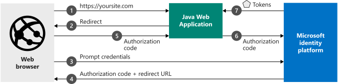

# Quickstart: Sign in users and call the Microsoft Graph API from a Java web app

In this quickstart, you download and run a code sample that demonstrates how a Java web application can sign in users and call the Microsoft Graph API. Users from any Azure Active Directory (Azure AD) organization can sign in to the application.

See [How the sample works](#how-the-sample-works) for an illustration.

## Prerequisites

To run this sample, you need:

- [Java Development Kit (JDK)](https://openjdk.java.net/) 8 or later.
- [Maven](https://maven.apache.org/).


## Register and download your quickstart app

[!INCLUDE [portal updates](~/articles/active-directory/includes/portal-update.md)]

There are two ways to start your quickstart application: express (option 1) and manual (option 2).

### Option 1: Register and automatically configure your app, and then download the code sample

1. Go to the [Azure portal - App registrations](https://portal.azure.com/#blade/Microsoft_AAD_RegisteredApps/ApplicationsListBlade/quickStartType/AngularSpaQuickstartPage/sourceType/docs) quickstart experience.
1. Enter a name for your application, and then select **Register**.
1. Follow the instructions in the portal's quickstart experience to download the automatically configured application code.

### Option 2: Register and manually configure your application and code sample

#### Step 1: Register your application

To register your application and manually add the app's registration information to it, follow these steps:

1. Sign in to the [Azure portal](https://portal.azure.com).
1. If you have access to multiple tenants, use the **Directories + subscriptions** filter :::image type="icon" source="media/common/portal-directory-subscription-filter.png" border="false"::: in the top menu to switch to the tenant in which you want to register the application.
1. Search for and select **Azure Active Directory**.
1. Under **Manage**, select **App registrations**.
1. Select **New registration**.
1. Enter a **Name** for your application, for example **java-webapp**. Users of your app might see this name. You can change it later.
1. Select **Register**.
1. On the **Overview** page, note the **Application (client) ID** and the **Directory (tenant) ID**. You'll need these values later.
1. Under **Manage**, select **Authentication**.
1. Select **Add a platform** > **Web**.
1. In the **Redirect URIs** section, enter `https://localhost:8443/msal4jsample/secure/aad`.
1. Select **Configure**.
1. In the **Web** section, under **Redirect URIs**, enter `https://localhost:8443/msal4jsample/graph/me` as a second redirect URI.
1. Under **Manage**, select **Certificates & secrets**. In the **Client secrets** section, select **New client secret**.
1. Enter a key description (for example, *app secret*), leave the default expiration, and select **Add**.
1. Note the **Value** of the client secret. You'll need it later.

#### Step 2: Download the code sample

[Download the code sample](https://github.com/Azure-Samples/ms-identity-java-webapp/archive/master.zip)

#### Step 3: Configure the code sample
1. Extract the zip file to a local folder.
2. *Optional.* If you use an integrated development environment, open the sample in that environment.
3. Open the *application.properties* file. You can find it in the *src/main/resources/* folder. Replace the values in the fields `aad.clientId`, `aad.authority`, and `aad.secretKey` with the application ID, tenant ID, and client secret values, respectively. Here's what it should look like:

     ```file
      aad.clientId=Enter_the_Application_Id_here
      aad.authority=https://login.microsoftonline.com/Enter_the_Tenant_Info_Here/
      aad.secretKey=Enter_the_Client_Secret_Here
      aad.redirectUriSignin=https://localhost:8443/msal4jsample/secure/aad
      aad.redirectUriGraph=https://localhost:8443/msal4jsample/graph/me
      aad.msGraphEndpointHost="https://graph.microsoft.com/"
     ```
  In the previous code:

   - `Enter_the_Application_Id_here` is the application ID for the application you registered.
   - `Enter_the_Client_Secret_Here` is the **Client Secret** you created in **Certificates & secrets** for the application you registered.
   - `Enter_the_Tenant_Info_Here` is the **Directory (tenant) ID** value of the application you registered.
4. To use HTTPS with localhost, provide the `server.ssl.key` properties. To generate a self-signed certificate, use the keytool utility (included in JRE).

 Here's an example:

```
keytool -genkeypair -alias testCert -keyalg RSA -storetype PKCS12 -keystore keystore.p12 -storepass password

server.ssl.key-store-type=PKCS12
server.ssl.key-store=classpath:keystore.p12
server.ssl.key-store-password=password
server.ssl.key-alias=testCert
```
5. Put the generated keystore file in the *resources* folder.

#### Step 4: Run the code sample

To run the project, take one of these steps:

- Run it directly from your IDE by using the embedded Spring Boot server.
- Package it to a WAR file by using [Maven](https://maven.apache.org/plugins/maven-war-plugin/usage.html), and then deploy it to a J2EE container solution like [Apache Tomcat](http://tomcat.apache.org/).

##### Running the project from an IDE

To run the web application from an IDE, select run, and then go to the home page of the project. For this sample, the standard home page URL is https://localhost:8443.

1. On the front page, select the **Login** button to redirect users to Azure Active Directory and prompt them for credentials.

1. After users are authenticated, they're redirected to `https://localhost:8443/msal4jsample/secure/aad`. They're now signed in, and the page will show information about the user account. The sample UI has these buttons:
    - **Sign Out**: Signs the current user out of the application and redirects that user to the home page.
    - **Show User Info**: Acquires a token for Microsoft Graph and calls Microsoft Graph with a request that contains the token, which returns basic information about the signed-in user.

##### Running the project from Tomcat

If you want to deploy the web sample to Tomcat, make a couple changes to the source code.

1. Open *ms-identity-java-webapp/src/main/java/com.microsoft.azure.msalwebsample/MsalWebSampleApplication*.

    - Delete all source code and replace it with this code:

      ```Java
       package com.microsoft.azure.msalwebsample;

       import org.springframework.boot.SpringApplication;
       import org.springframework.boot.autoconfigure.SpringBootApplication;
       import org.springframework.boot.builder.SpringApplicationBuilder;
       import org.springframework.boot.web.servlet.support.SpringBootServletInitializer;

       @SpringBootApplication
       public class MsalWebSampleApplication extends SpringBootServletInitializer {

        public static void main(String[] args) {
         SpringApplication.run(MsalWebSampleApplication.class, args);
        }

        @Override
        protected SpringApplicationBuilder configure(SpringApplicationBuilder builder) {
         return builder.sources(MsalWebSampleApplication.class);
        }
       }
      ```

2.   Tomcat's default HTTP port is 8080, but you need an HTTPS connection over port 8443. To configure this setting:
        - Go to *tomcat/conf/server.xml*.
        - Search for the `<connector>` tag, and replace the existing connector with this connector:

          ```xml
          <Connector
                   protocol="org.apache.coyote.http11.Http11NioProtocol"
                   port="8443" maxThreads="200"
                   scheme="https" secure="true" SSLEnabled="true"
                   keystoreFile="C:/Path/To/Keystore/File/keystore.p12" keystorePass="KeystorePassword"
                   clientAuth="false" sslProtocol="TLS"/>
          ```

3. Open a Command Prompt window. Go to the root folder of this sample (where the pom.xml file is located), and run `mvn package` to build the project.
    - This command will generate a *msal-web-sample-0.1.0.war* file in your */targets* directory.
    - Rename this file to *msal4jsample.war*.
    - Deploy the WAR file by using Tomcat or any other J2EE container solution.
        - To deploy the msal4jsample.war file, copy it to the */webapps/* directory in your Tomcat installation, and then start the Tomcat server.

4. After the file is deployed, go to https://localhost:8443/msal4jsample by using a browser.

> [!IMPORTANT]
> This quickstart application uses a client secret to identify itself as a confidential client. Because the client secret is added as plain text to your project files, for security reasons we recommend that you use a certificate instead of a client secret before using the application in a production environment. For more information on how to use a certificate, see [Certificate credentials for application authentication](active-directory-certificate-credentials.md).

## More information

### How the sample works


### Get MSAL

MSAL for Java (MSAL4J) is the Java library used to sign in users and request tokens that are used to access an API that's protected by the Microsoft identity platform.

Add MSAL4J to your application by using Maven or Gradle to manage your dependencies by making the following changes to the application's pom.xml (Maven) or build.gradle (Gradle) file.

In pom.xml:

```xml
<dependency>
    <groupId>com.microsoft.azure</groupId>
    <artifactId>msal4j</artifactId>
    <version>1.0.0</version>
</dependency>
```

In build.gradle:

```$xslt
compile group: 'com.microsoft.azure', name: 'msal4j', version: '1.0.0'
```

### Initialize MSAL

Add a reference to MSAL for Java by adding the following code at the start of the file where you'll be using MSAL4J:

```Java
import com.microsoft.aad.msal4j.*;
```

[!INCLUDE [Help and support](includes/error-handling-and-tips/help-support-include.md)]

## Next steps

For a more in-depth discussion of building web apps that sign in users on the Microsoft identity platform, see the multipart scenario series:

> [!div class="nextstepaction"]
> [Scenario: Web app that signs in users](scenario-web-app-sign-user-overview.md?tabs=java)