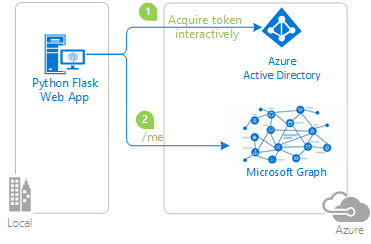

# Quickstart: Sign in users and call the Microsoft Graph API from a Python web app

In this quickstart, you download and run a code sample that demonstrates how a Python web application can sign in users and call the Microsoft Graph API. Users with a personal Microsoft Account or an account in any Microsoft Entra organization can sign into the application.

The following diagram displays how the sample app works:



1. The application uses the [`identity` package](https://pypi.org/project/identity/) to obtain an access token from the Microsoft identity platform.
2. The access token is used as a bearer token to authenticate the user when calling the Microsoft Graph API.


## Prerequisites

- An Azure account with an active subscription. [Create an account for free](https://azure.microsoft.com/free/?WT.mc_id=A261C142F).
- A Microsoft Entra tenant. For more information on how to get a Microsoft Entra tenant, see [how to get a Microsoft Entra tenant.](./quickstart-create-new-tenant.md)
- [Python 3.7+](https://www.python.org/downloads/)

## Step 1: Register your application

[!INCLUDE [portal updates](~/articles/active-directory/includes/portal-update.md)]

Follow these steps to register your application in the Microsoft Entra admin center:

1. Sign in to the [Microsoft Entra admin center](https://entra.microsoft.com) as at least a [Cloud Application Administrator](../roles/permissions-reference.md#cloud-application-administrator). 
1. If you have access to multiple tenants, use the **Directories + subscriptions** filter :::image type="icon" source="./media/quickstart-configure-app-access-web-apis/portal-01-directory-subscription-filter.png" border="false"::: in the top menu to select the tenant containing your client app's registration.
1. Browse to **Identity** > **Applications** > **App registrations** and select **New registration**.
1. Enter a **Name** for your application, for example *python-webapp*. 
1. Under **Supported account types**, select **Accounts in any organizational directory and personal Microsoft accounts**.
1. Under **Redirect URIs**, select **Web** for the platform.
1. Enter a redirect URI of `http://localhost:5000/getAToken`. This can be changed later.
1. Select **Register**.

## Step 2: Add a client secret

1. On the app **Overview** page, note the **Application (client) ID** value for later use.
1. Under **Manage**, select the **Certificates & secrets** and from the **Client secrets** section, select **New client secret**.
1. Enter a description for the client secret, leave the default expiration, and select **Add**.
1. Save the **Value** of the **Client Secret** in a safe location. You'll need it to configure the code, and you can't retrieve it later.

## Step 3: Add a scope

1. Under **Manage**, select **API permissions** > **Add a permission**.
1. Ensure that the **Microsoft APIs** tab is selected.
1. From the *Commonly used Microsoft APIs* section, select **Microsoft Graph**.
1. From the **Delegated permissions** section, ensure that **User.ReadBasic.All** is selected. Use the search box if necessary.
1. Select **Add permissions**.

## Step 4: Download the sample app

[Download the Python code sample](https://github.com/Azure-Samples/ms-identity-python-webapp/archive/main.zip) or clone the repository:

```powershell
git clone https://github.com/Azure-Samples/ms-identity-python-webapp.git
```

You can also use an integrated development environment to open the folder.

## Step 5: Configure the sample app

1. Go to the application folder.

1. Create an *.env* file in the root folder of the project using *.env.sample* as a guide.

    :::code language="python" source="~/ms-identity-python-webapp-quickstart/.env.sample" range="4-16" highlight="1,2,13":::

    * Set the value of `CLIENT_ID` to the **Application (client) ID** for the registered application, available on the overview page.
    * Set the value of `CLIENT_SECRET` to the client secret you created in **Certificates & Secrets** for the registered application.
    * Set the value of `AUTHORITY` to a URL that includes **Directory (tenant) ID** of the registered application. That ID is also available on the overview page.
    
    The environment variables are referenced in *app_config.py*, and are kept in a separate *.env* file to keep them out of source control. The provided *.gitignore* file prevents the *.env* file from being checked in.

## Step 6: Run the sample app

1. Create a virtual environment for the app:

    [!INCLUDE [Virtual environment setup](../../app-service/includes/quickstart-python/virtual-environment-setup.md)]

1. Install the requirements using `pip`:

    ```shell
    python3 -m pip install -r requirements.txt
    ```

2. Run the app from the command line, specifying the host and port to match the redirect URI:

    ```shell
    python3 -m flask run --debug --host=localhost --port=5000
    ```

   > [!IMPORTANT]
   > This quickstart application uses a client secret to identify itself as confidential client. Because the client secret is added as a plain-text to your project files, for security reasons, it is recommended that you use a certificate instead of a client secret before considering the application as production application. For more information on how to use a certificate, see [these instructions](./certificate-credentials.md).


[!INCLUDE [Help and support](includes/error-handling-and-tips/help-support-include.md)]

## Next steps

Learn more about web apps that sign in users in our multi-part scenario series.

> [!div class="nextstepaction"]
> [Scenario: Web app that signs in users](scenario-web-app-sign-user-overview.md)

> [!div class="nextstepaction"]
> [Scenario: Web app that calls web APIs](scenario-web-app-call-api-overview.md)
