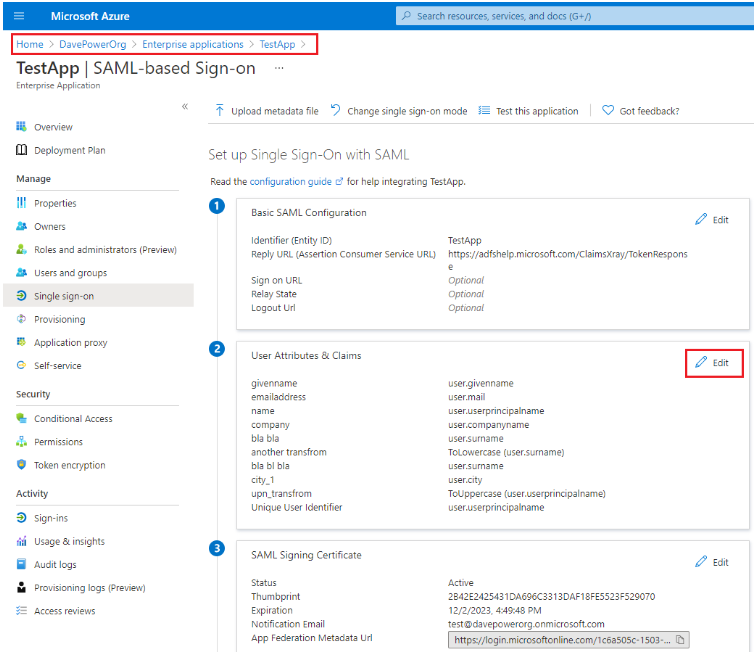
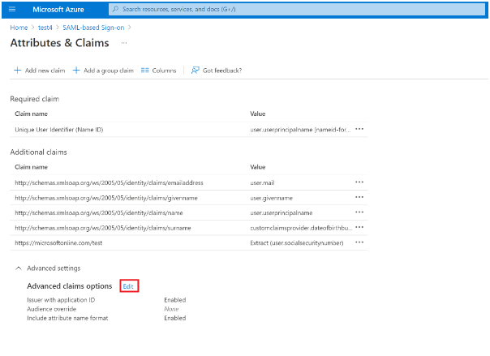
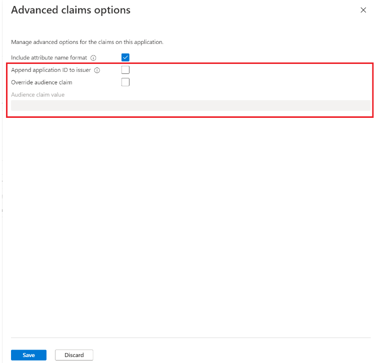

# Configure SAML app multi-instancing for an application in Azure Active Directory    
App multi-instancing refers to the need for the configuration of multiple instances of the same application within a tenant.  For example, the organization has multiple Amazon Web Services accounts, each of which needs a separate service principal to handle instance-specific claims mapping (adding the AccountID claim for that AWS tenant) and roles assignment.  Or the customer has multiple instances of Box, which doesn’t need special claims mapping, but does need separate service principals for separate signing keys.  

## IDP versus SP initiated SSO     
A user can sign-in to an application one of two ways, either through the application directly, which is known as service provider (SP) initiated single sign-on (SSO), or by going directly to the identity provider (IDP), known as IDP initiated SSO. Depending on which approach is used within your organization you'll need to follow the appropriate instructions below.  

## SP Initiated   
In the SAML request of SP initiated SSO, the Issuer specified is usually the App ID Uri. Utilizing App ID Uri doesn’t allow the customer to distinguish which instance of an application is being targeted when using SP initiated SSO.   

## SP Initiated Configuration Instructions  
Update the SAML single sign-on service URL configured within the service provider for each instance to include the service principal guid as part of the URL. For example, the general SSO sign-in URL for SAML would have been `https://login.microsoftonline.com/<tenantid>/saml2`, the URL can now be updated to target a specific service principal as follows `https://login.microsoftonline.com/<tenantid>/saml2/<issuer>`.  

Only service principal identifiers in GUID format are accepted for the ‘issuer’ value. The service principal identifiers override the issuer in the SAML request and response, and the rest of the flow is completed as usual. There's one exception: if the application requires the request to be signed, the request is rejected even if the signature was valid. The rejection is done to avoid any security risks with functionally overriding values in a signed request.  

## IDP Initiated   
The IDP initiated feature exposes two settings for each application.   

- An “audience override” option exposed for configuration by using claims mapping or the portal.  The intended use case is applications that require the same audience for multiple instances. This setting is ignored if no custom signing key is configured for the application.    

- An “issuer with application id” flag to indicate the issuer should be unique for each application instead of unique for each tenant.  This setting is ignored if no custom signing key is configured for the application.  

## IDP Initiated Configuration Instructions  
1. Open any SSO enabled enterprise app and navigate to the SAML single sign on blade.   
1. Select the ‘Edit’ button on the ‘User Attributes & Claims’ panel.

1. Open the advanced options blade.

1. Configure both options according to your preferences and hit save.

## Next steps

- To explore the claims mapping policy in graph see [Claims mapping policy](/graph/api/resources/claimsMappingPolicy?view=graph-rest-1.0)  
- To learn more about how to configure this policy see [Customize app SAML token claims](active-directory-saml-claims-customization.md)
