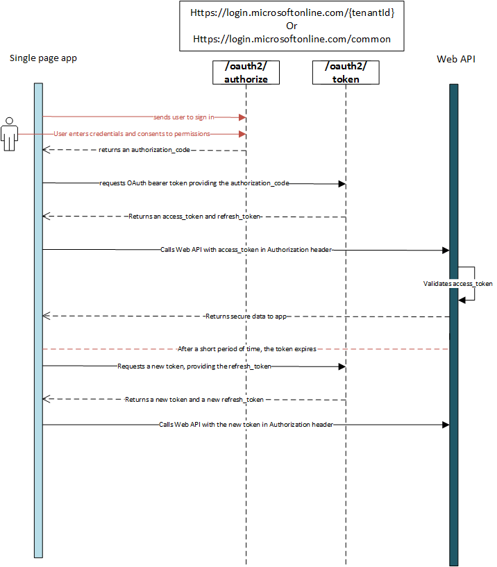

# Handle ITP in Safari and other browsers where third-party cookies are blocked

Many browsers today are blocking third-party cookies - cookies on requests to domains that are not the same as the one showing in the browser bar. This breaks the implicit flow and requires new authentication patterns to successfully sign in users. In the Microsoft identity platform, we use the authorization flow with PKCE and refresh tokens to keep users signed in when third-party cookies are blocked.

## What is Intelligent Tracking Protection (ITP)?

Apple Safari has an on-by-default privacy protection feature called [Intelligent Tracking Protection](https://webkit.org/tracking-prevention-policy/), or *ITP*. ITP blocks "third-party" cookies, cookies on requests that cross domains.

A common form of user tracking is done by loading an iframe to third-party site in the background and using cookies to correlate the user across the Internet. Unfortunately, this pattern is also the standard way of implementing the [implicit flow](v2-oauth2-implicit-grant-flow.md) in single-page apps (SPAs). When a browser blocks third-party cookies to prevent user tracking, SPAs are also broken.

Safari isn't alone in blocking third-party cookies to enhance user privacy. Brave has blocked third-party cookies by default, and Chromium (the platform behind Google Chrome and Microsoft Edge) has announced that they as well will stop supporting third-party cookies in the future.

The solution outlined in this article works in all of these browsers, or anywhere third-party cookies are blocked.

## Overview of the solution

To continue authenticating users in SPAs, app developers must use the [authorization code flow](v2-oauth2-auth-code-flow.md). In the auth code flow, the identity provider issues a code, and the SPA redeems the code for an access token and a refresh token. When the app requires additional tokens, it can use the [refresh token flow](v2-oauth2-auth-code-flow.md#refresh-the-access-token) to get new tokens. MSAL.js 2.0, the Microsoft identity platform library for SPAs, implements the authorization code flow for SPAs and, with minor updates, is a drop-in replacement for MSAL.js 1.x.

For the Microsoft identity platform, SPAs and native clients follow similar protocol guidance:

* Use of a [PKCE code challenge](https://tools.ietf.org/html/rfc7636)
    * PKCE is *required* for SPAs on the Microsoft identity platform. PKCE is *recommended* for native and confidential clients.
* No use of a client secret

SPAs have two additional restrictions:

* [The redirect URI must be marked as type `spa`](v2-oauth2-auth-code-flow.md#setup-required-for-single-page-apps) to enable CORS on login endpoints.
* Refresh tokens issued through the authorization code flow to `spa` redirect URIs have a 24-hour lifetime rather than a 90-day lifetime.

## Performance and UX implications

Some applications using the implicit flow attempt sign-in without redirecting by opening a login iframe using `prompt=none`. In most browsers, this request will respond with tokens for the currently signed-in user (assuming consent has already been granted). This pattern meant applications did not need a full page redirect to sign the user in, improving performance and user experience - the user visits the web page and is signed in already. Because `prompt=none` in an iframe is no longer an option when third-party cookies are blocked, applications must visit the login page in a top-level frame to have an authorization code issued.

There are two ways of accomplishing sign-in:

* **Full page redirects**
    * On the first load of the SPA, redirect the user to the sign-in page if no session already exists (or if the session is expired). The user's browser will visit the login page, present the cookies containing the user session, and then redirect back to the application with the code and tokens in a fragment.
    * The redirect does result in the SPA being loaded twice. Follow best practices for caching of SPAs so that the app is not downloaded in-full twice.
    * Consider having a pre-load sequence in the app that checks for a login session and redirects to the login page before the app fully unpacks and executes the JavaScript payload.
* **Popups**
    * If the user experience (UX) of a full page redirect doesn't work for the application, consider using a popup to handle authentication.
    * When the popup finishes redirecting to the application after authentication, code in the redirect handler will store the code and tokens in local storage for the application to use. MSAL.js supports popups for authentication, as do most libraries.
    * Browsers are decreasing support for popups, so they may not be the most reliable option. User interaction with the SPA before creating the popup may be needed to satisfy browser requirements.

>[!NOTE]
> Apple [describes a popup method](https://webkit.org/blog/8311/intelligent-tracking-prevention-2-0/) as a temporary compatibility fix to give the original window access to third-party cookies. While Apple may remove this transferral of permissions in the future, it will not impact the guidance here. Here, the popup is being used as a first party navigation to the login page so that a session is found and an auth code can be provided. This should continue working into the future.

### A note on iframe apps

A common pattern in web apps is to use an iframe to embed one app inside another. The top-level frame handles authenticating the user, and the application hosted in the iframe can trust that the user is signed in, fetching tokens silently using the implicit flow. Silent token acquisition no longer works when third-party cookies are blocked - the application embedded in the iframe must switch to using popups to access the user's session as it can't navigate to the login page.

## Security implications of refresh tokens in the browser

Issuing refresh tokens to the browser is considered a security issue. Cross-site scripting (XSS) attacks or compromised JS packages can steal the refresh token and use it remotely until it expires or is revoked. In order to minimize the risk of stolen refresh tokens, SPAs will be issued tokens valid for only 24 hours. After 24 hours, the app must acquire a new authorization code via a top-level frame visit to the login page.

This limited-lifetime refresh token pattern was chosen as a balance between security and degraded UX. Without refresh tokens or third-party cookies, the authorization code flow (as recommended by the [OAuth security best current practices draft](https://tools.ietf.org/html/draft-ietf-oauth-security-topics-14)) becomes onerous when new or additional tokens are required. A full page redirect or popup is needed for every single token, every time a token expires (every hour usually, for Microsoft identity platform tokens).

## Next steps

Learn more about the [authorization code flow](v2-oauth2-auth-code-flow.md).

Try out the authorization code flow with the [MSAL.js 2.0 quickstart](quickstart-v2-javascript-auth-code.md).
