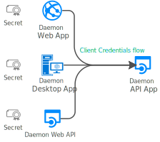

# Scenario: Daemon application that calls web APIs

Learn all you need to build a daemon application that calls web APIs.

## Prerequisites

[!INCLUDE [Pre-requisites](../../../includes/active-directory-develop-scenarios-prerequisites.md)]

## Overview

Your application can acquire a token to call a web API on behalf of itself (not on behalf of a user). This scenario is useful for daemon applications. It uses the standard OAuth 2.0 [client credentials](v2-oauth2-client-creds-grant-flow.md) grant.

Here are some examples of use cases for daemon apps:

- Web applications that are used to provision or administer users or do batch processes in a directory
- Desktop applications (like Windows services on Windows or daemon processes on Linux) that perform batch jobs, or an operating system service that runs in the background
- Web APIs that need to manipulate directories, not specific users

There's another common case where non-daemon applications use client credentials: even when they act on behalf of users, they need to access a web API or a resource under their own identity for technical reasons. An example is access to secrets in Azure Key Vault or an Azure SQL database for a cache.

Applications that acquire a token for their own identities:

- Are confidential client applications. These apps, given that they access resources independently of users, need to prove their identity. They're also rather sensitive apps. They need to be approved by the Azure Active Directory (Azure AD) tenant admins.
- Have registered a secret (application password or certificate) with Azure AD. This secret is passed in during the call to Azure AD to get a token.

## Specifics

> [!IMPORTANT]
>
> - Users can't interact with a daemon application. A daemon application requires its own identity. This type of application requests an access token by using its application identity and presenting its application ID, credential (password or certificate), and application ID URI to Azure AD. After successful authentication, the daemon receives an access token (and a refresh token) from the Microsoft identity platform endpoint. This token is then used to call the web API (and is refreshed as needed).
> - Because users can't interact with daemon applications, incremental consent isn't possible. All the required API permissions need to be configured at application registration. The code of the application just requests statically defined permissions. This also means that daemon applications won't support incremental consent.

For developers, the end-to-end experience for this scenario has the following aspects:

- Daemon applications can work only in Azure AD tenants. It wouldn't make sense to build a daemon application that attempts to manipulate Microsoft personal accounts. If you're a line-of-business (LOB) app developer, you'll create your daemon app in your tenant. If you're an ISV, you might want to create a multitenant daemon application. Each tenant admin will need to provide consent.
- During [application registration](./scenario-daemon-app-registration.md), the reply URI isn't needed. You need to share secrets or certificates or signed assertions with Azure AD. You also need to request application permissions and grant admin consent to use those app permissions.
- The [application configuration](./scenario-daemon-app-configuration.md) needs to provide client credentials as shared with Azure AD during the application registration.
- The [scope](scenario-daemon-acquire-token.md#scopes-to-request) used to acquire a token with the client credentials flow needs to be a static scope.

## Next steps

> [!div class="nextstepaction"]
> [Daemon app - app registration](./scenario-daemon-app-registration.md)
