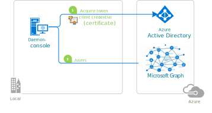
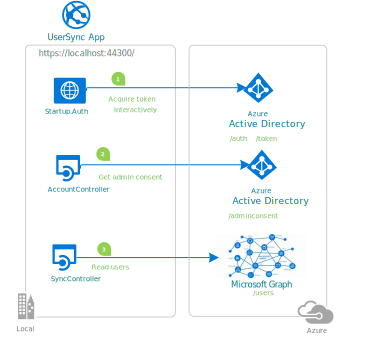

# Daemon app that calls web APIs - move to production

Now that you know how to acquire and use a token for a service-to-service call, learn how to move your app to production.

## Deployment - multitenant daemon apps

If you're an ISV creating a daemon application that can run in several tenants, make sure that the tenant admin:

- Provisions a service principal for the application.
- Grants consent to the application.

You'll need to explain to your customers how to perform these operations. For more info, see [Requesting consent for an entire tenant](./permissions-consent-overview.md#requesting-consent-for-an-entire-tenant).

[!INCLUDE [Pre-requisites](./includes/scenarios/scenarios-production.md)]

## Code samples

# [.NET](#tab/dotnet)

- Reference documentation for:
  - Instantiating [ConfidentialClientApplication](/dotnet/api/microsoft.identity.client.confidentialclientapplicationbuilder).
  - Calling [AcquireTokenForClient](/dotnet/api/microsoft.identity.client.acquiretokenforclientparameterbuilder?view=azure-dotnet&preserve-view=true).
- Other samples/tutorials:
  - [microsoft-identity-platform-console-daemon](https://github.com/Azure-Samples/microsoft-identity-platform-console-daemon) features a small .NET Core daemon console application that displays the users of a tenant querying Microsoft Graph.

    

    The same sample also illustrates a variation with certificates:

    

  - [microsoft-identity-platform-aspnet-webapp-daemon](https://github.com/Azure-Samples/microsoft-identity-platform-aspnet-webapp-daemon) features an ASP.NET MVC web application that syncs data from Microsoft Graph by using the identity of the application instead of on behalf of a user. This sample also illustrates the admin consent process.

    

# [Java](#tab/java)

Try the quickstart [Acquire a token and call Microsoft Graph API from a Java console app using app's identity](quickstart-v2-java-daemon.md).

# [Node.js](#tab/nodejs)

- For more information, see:
  - Understanding [Configuration](https://github.com/AzureAD/microsoft-authentication-library-for-js/blob/dev/lib/msal-node/docs/configuration.md)
  - Instantiating [ConfidentialClientApplication](https://github.com/AzureAD/microsoft-authentication-library-for-js/blob/dev/lib/msal-node/docs/initialize-confidential-client-application.md)
  - [FAQ](https://github.com/AzureAD/microsoft-authentication-library-for-js/blob/dev/lib/msal-node/docs/faq.md)
- Other samples/tutorials:
  - [MSAL Node console daemon sample](https://github.com/Azure-Samples/ms-identity-javascript-nodejs-console)

# [Python](#tab/python)

Try the quickstart [Acquire a token and call Microsoft Graph API from a Python console app using app's identity](quickstart-v2-python-daemon.md).

---

## Next steps

Here are a few links to help you learn more:

# [.NET](#tab/dotnet)

Try the quickstart [Acquire a token and call Microsoft Graph API from a .NET Core console app using app's identity](quickstart-v2-netcore-daemon.md).

# [Java](#tab/java)

Try the quickstart [Acquire a token and call Microsoft Graph API from a Java console app using app's identity](quickstart-v2-java-daemon.md).

# [Node.js](#tab/nodejs)

Try the quickstart [Acquire a token and call Microsoft Graph API from a Node.js console app using app's identity](quickstart-v2-nodejs-console.md).

# [Python](#tab/python)

Try the quickstart [Acquire a token and call Microsoft Graph API from a Python console app using app's identity](quickstart-v2-python-daemon.md).

---
