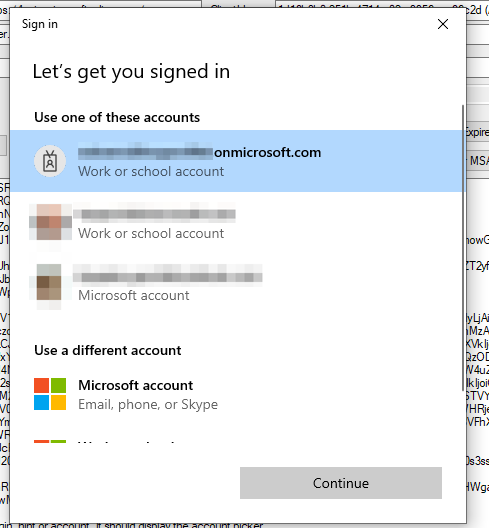

# Desktop app that calls web APIs: Acquire a token using WAM

MSAL is able to call Web Account Manager, a Windows 10 component that ships with the OS. This component acts as an authentication broker and users of your app benefit from integration with accounts known from Windows, such as the account you signed-in with in your Windows session.

## Availability

MSAL 4.25+ supports WAM on UWP, .NET Classic, .NET Core 3.1, and .NET 5.

For .NET Classic and .NET Core 3.1, WAM functionality is fully supported but you have to add a reference to [Microsoft.Identity.Client.Desktop](https://www.nuget.org/packages/Microsoft.Identity.Client.Desktop/) package, alongside MSAL, and instead of `WithBroker()`, call `.WithWindowsBroker()`.

For .NET 5, target `net5.0-windows10.0.17763.0` (or higher) and not just `net5.0`. Your app will still run on older versions of Windows if you add `<SupportedOSPlatformVersion>7</SupportedOSPlatformVersion>` in the csproj. MSAL will use a browser when WAM isn't available.

## WAM value proposition

Using an authentication broker such as WAM has numerous benefits.

- Enhanced security (your app doesn't have to manage the powerful refresh token)
- Better support for Windows Hello, Conditional Access and FIDO keys
- Integration with Windows' "Email and Accounts" view
- Better Single Sign-On (users don't have to reenter passwords)
- Most bug fixes and enhancements will be shipped with Windows

## WAM limitations

- B2C and ADFS authorities aren't supported. MSAL will fall back to a browser.
- Available on Win10+ and Win Server 2019+. On Mac, Linux, and earlier versions of Windows, MSAL will fall back to a browser.
- Not available on Xbox.

## WAM calling pattern

You can use the following pattern to use WAM.

```csharp
// 1. Configuration - read below about redirect URI
var pca = PublicClientApplicationBuilder.Create("client_id")
              .WithBroker()
              .Build();

// Add a token cache, see https://learn.microsoft.com/azure/active-directory/develop/msal-net-token-cache-serialization?tabs=desktop

// 2. GetAccounts
var accounts = await pca.GetAccountsAsync();
var accountToLogin = // choose an account, or null, or use PublicClientApplication.OperatingSystemAccount for the default OS account

try
{
    // 3. AcquireTokenSilent 
    var authResult = await pca.AcquireTokenSilent(new[] { "User.Read" }, accountToLogin)
                              .ExecuteAsync();
}
catch (MsalUiRequiredException) // no change in the pattern
{
    // 4. Specific: Switch to the UI thread for next call . Not required for console apps.
    await SwitchToUiThreadAsync(); // not actual code, this is different on each platform / tech

    // 5. AcquireTokenInteractive
    var authResult = await pca.AcquireTokenInteractive(new[] { "User.Read" })
                              .WithAccount(accountToLogin)  // this already exists in MSAL, but it is more important for WAM
                              .WithParentActivityOrWindow(myWindowHandle) // to be able to parent WAM's windows to your app (optional, but highly recommended; not needed on UWP)
                              .ExecuteAsync();
}
```

Call `.WithBroker(true)`. If a broker isn't present (for example, Win8.1, Mac, or Linux), then MSAL will fall back to a browser. Redirect URI rules apply to the browser.

## Redirect URI

WAM redirect URIs don't need to be configured in MSAL, but they must be configured in the app registration.

### Win32 (.NET framework / .NET 5)

```
ms-appx-web://microsoft.aad.brokerplugin/{client_id}
```

### UWP
```csharp
            // returns smth like S-1-15-2-2601115387-131721061-1180486061-1362788748-631273777-3164314714-2766189824
            string sid = WebAuthenticationBroker.GetCurrentApplicationCallbackUri().Host.ToUpper();

            // the redirect uri you need to register
            string redirectUri = $"ms-appx-web://microsoft.aad.brokerplugin/{sid}";
```

## Token cache persistence

It's important to persist MSAL's token cache because MSAL needs to save internal WAM account IDs there. Without it, restarting the app means that `GetAccounts` API will miss some of the accounts. On UWP, MSAL knows where to save the token cache.

## GetAccounts

`GetAccounts` returns accounts of users who have previously logged in interactively into the app.

In addition, WAM can list the OS-wide Work and School accounts configured in Windows (for Win32 apps but not for UWP apps). To opt-into this feature, set `ListWindowsWorkAndSchoolAccounts` in `WindowsBrokerOptions` to **true**. You can enable it as below.

```csharp
.WithWindowsBrokerOptions(new WindowsBrokerOptions()
{
    // GetAccounts will return Work and School accounts from Windows
    ListWindowsWorkAndSchoolAccounts = true,

    // Legacy support for 1st party apps only
    MsaPassthrough = true
})
```

>[!NOTE]
> Microsoft (outlook.com etc.) accounts will not be listed in Win32 nor UWP for privacy reasons.

Applications cannot remove accounts from Windows! 

## RemoveAsync

- Removes all account information from MSAL's token cache (this includes MSA, that is, personal accounts information copied by MSAL into its cache).
- Removes app-only (not OS-wide) accounts.

>[!NOTE]
> Apps cannot remove OS accounts. Only users can do that. If an OS account is passed into `RemoveAsync`, and then `GetAccounts` is called with `ListWindowsWorkAndSchoolAccounts` enabled - the same OS account will still be returned.

## Other considerations

- WAM's interactive operations require being on the UI thread. MSAL throws a meaningful exception when not on UI thread. This doesn't apply to console apps.
- `WithAccount` provides an accelerated authentication experience if the MSAL account was originally obtained via WAM, or, WAM can find a work and school account in Windows.
- WAM isn't able to pre-populate the username field with a login hint, unless a Work and School account with the same username is found in Windows.
- If WAM is unable to offer an accelerated authentication experience, it will show an account picker. Users can add new accounts.



- New accounts are automatically remembered by Windows. Work and School have the option of joining the organization's directory or opting out completely, in which case the account won't appear under "Email & Accounts". Microsoft accounts are automatically added to Windows. Apps can't list these accounts programmatically (but only through the Account Picker).

## Troubleshooting

### "Either the user canceled the authentication or the WAM Account Picker crashed because the app is running in an elevated process" error message

When an app that uses MSAL is run as an elevated process, some of these calls within WAM may fail due to different process security levels. Internally MSAL.NET uses native Windows methods ([COM](/windows/win32/com/the-component-object-model)) to integrate with WAM. Starting with version 4.32.0, MSAL will display a descriptive error message when it detects that the app process is elevated and WAM returned no accounts.

One solution is to not run the app as elevated, if possible. Another solution is for the app developer to call `WindowsNativeUtils.InitializeProcessSecurity` method when the app starts up. This will set the security of the processes used by WAM to the same levels. See [this sample app](https://github.com/AzureAD/microsoft-authentication-library-for-dotnet/blob/master/tests/devapps/WAM/NetCoreWinFormsWam/Program.cs#L18-L21) for an example. However, note, that this solution isn't guaranteed to succeed to due external factors like the underlying CLR behavior. In that case, an `MsalClientException` will be thrown. For more information, see issue [#2560](https://github.com/AzureAD/microsoft-authentication-library-for-dotnet/issues/2560).

### "WAM Account Picker did not return an account" error message

This message indicates that either the application user closed the dialog that displays accounts, or the dialog itself crashed. A crash might occur if AccountsControl, a Windows control, is registered incorrectly in Windows. To resolve this issue: 

1. In the taskbar, right-click **Start**, and then select **Windows PowerShell (Admin)**.
1. If you're prompted by a User Account Control (UAC) dialog, select **Yes** to start PowerShell.
1. Copy and then run the following script:

   ```powershell
   if (-not (Get-AppxPackage Microsoft.AccountsControl)) { Add-AppxPackage -Register "$env:windir\SystemApps\Microsoft.AccountsControl_cw5n1h2txyewy\AppxManifest.xml" -DisableDevelopmentMode -ForceApplicationShutdown } Get-AppxPackage Microsoft.AccountsControl
   ```

### Connection issues

The application user sees an error message similar to "Please check your connection and try again". If this issue occurs regularly, see the [troubleshooting guide for Office](/office365/troubleshoot/authentication/connection-issue-when-sign-in-office-2016), which also uses WAM.

## Sample

[WPF sample that uses WAM](https://github.com/azure-samples/active-directory-dotnet-desktop-msgraph-v2)

[UWP sample that uses WAM, along Xamarin](https://github.com/Azure-Samples/active-directory-xamarin-native-v2/tree/master/2-With-broker)

---
## Next steps

Move on to the next article in this scenario,
[Call a web API from the desktop app](scenario-desktop-call-api.md).
