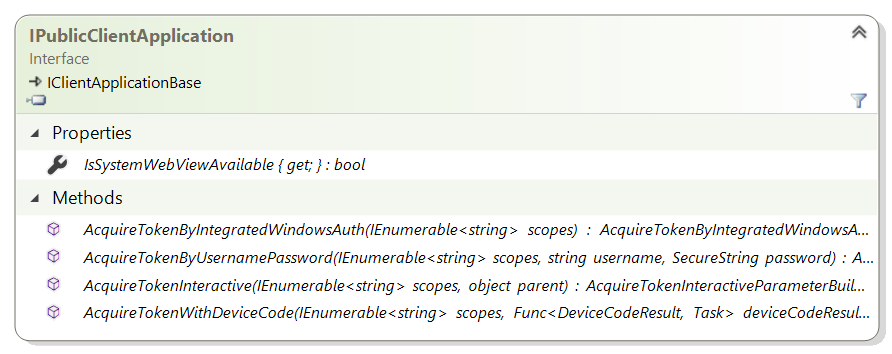

# Desktop app that calls web APIs - code configuration

Now that you've created your application, you'll learn how to configure the code with the application's coordinates.

## MSAL libraries

The only MSAL library supporting desktop applications today is MSAL.NET

## Public client application

From a code point of view, desktop applications are public client applications, and that's why you'll build and manipulate MSAL.NET `IPublicClientApplication`. Again things will be a bit different whether you use interactive authentication or not.



### Exclusively by code

The following code instantiates a public client application, signing-in users in the Microsoft Azure public cloud, with a work and school account, or a personal Microsoft account.

```CSharp
IPublicClientApplication app = PublicClientApplicationBuilder.Create(clientId)
    .Build();
```

If you intend to use interactive authentication or Device Code Flow, as seen above, you want to use the `.WithRedirectUri` modifier:

```CSharp
IPublicClientApplication app;
app = PublicClientApplicationBuilder.Create(clientId)
        .WithDefaultRedirectUri()
        .Build();
```

### Using configuration files

The following code instantiates a Public client application from a configuration object, which could be filled-in programmatically or read from a configuration file

```CSharp
PublicClientApplicationOptions options = GetOptions(); // your own method
IPublicClientApplication app = PublicClientApplicationBuilder.CreateWithApplicationOptions(options)
        .WithDefaultRedirectUri()
        .Build();
```

### More elaborated configuration

You can elaborate the application building by adding a number of modifiers. For instance, if you want your application to be a multi-tenant application in a national cloud (here US Government), you could write:

```CSharp
IPublicClientApplication app;
app = PublicClientApplicationBuilder.Create(clientId)
        .WithDefaultRedirectUri()
        .WithAadAuthority(AzureCloudInstance.AzureUsGovernment,
                         AadAuthorityAudience.AzureAdMultipleOrgs)
        .Build();
```

MSAL.NET also contains a modifier for ADFS 2019:

```CSharp
IPublicClientApplication app;
app = PublicClientApplicationBuilder.Create(clientId)
        .WithAdfsAuthority("https://consoso.com/adfs")
        .Build();
```

Finally, if you want to acquire tokens for an Azure AD B2C tenant, can specify your tenant as shown in the following code snippet:

```CSharp
IPublicClientApplication app;
app = PublicClientApplicationBuilder.Create(clientId)
        .WithB2CAuthority("https://fabrikamb2c.b2clogin.com/tfp/{tenant}/{PolicySignInSignUp}")
        .Build();
```

### Learn more

To learn more on how to configure an MSAL.NET desktop application:

- For the list of all modifiers available on `PublicClientApplicationBuilder`, see the reference documentation [PublicClientApplicationBuilder](https://docs.microsoft.com/dotnet/api/microsoft.identity.client.publicclientapplicationbuilder#methods)
- For the description of all the options exposed in `PublicClientApplicationOptions` see [PublicClientApplicationOptions](https://docs.microsoft.com/dotnet/api/microsoft.identity.client.publicclientapplicationoptions), in the reference documentation

## Complete example with configuration Options

Imagine a .NET Core console application that has the following `appsettings.json` configuration file:

```JSon
{
  "Authentication": {
    "AzureCloudInstance": "AzurePublic",
    "AadAuthorityAudience": "AzureAdMultipleOrgs",
    "ClientId": "ebe2ab4d-12b3-4446-8480-5c3828d04c50"
  },

  "WebAPI": {
    "MicrosoftGraphBaseEndpoint": "https://graph.microsoft.com"
  }
}
```

You have little code to read this file using the .NET provided configuration framework;

```CSharp
public class SampleConfiguration
{
 /// <summary>
 /// Authentication options
 /// </summary>
 public PublicClientApplicationOptions PublicClientApplicationOptions { get; set; }

 /// <summary>
 /// Base URL for Microsoft Graph (it varies depending on whether the application is ran
 /// in Microsoft Azure public clouds or national / sovereign clouds
 /// </summary>
 public string MicrosoftGraphBaseEndpoint { get; set; }

 /// <summary>
 /// Reads the configuration from a json file
 /// </summary>
 /// <param name="path">Path to the configuration json file</param>
 /// <returns>SampleConfiguration as read from the json file</returns>
 public static SampleConfiguration ReadFromJsonFile(string path)
 {
  // .NET configuration
  IConfigurationRoot Configuration;
  var builder = new ConfigurationBuilder()
                    .SetBasePath(Directory.GetCurrentDirectory())
                    .AddJsonFile(path);
  Configuration = builder.Build();

  // Read the auth and graph endpoint config
  SampleConfiguration config = new SampleConfiguration()
  {
   PublicClientApplicationOptions = new PublicClientApplicationOptions()
  };
  Configuration.Bind("Authentication", config.PublicClientApplicationOptions);
  config.MicrosoftGraphBaseEndpoint =
  Configuration.GetValue<string>("WebAPI:MicrosoftGraphBaseEndpoint");
  return config;
 }
}
```

Now, to create your application, you'll just need to write the following code:

```CSharp
SampleConfiguration config = SampleConfiguration.ReadFromJsonFile("appsettings.json");
var app = PublicClientApplicationBuilder.CreateWithApplicationOptions(config.PublicClientApplicationOptions)
           .WithDefaultRedirectUri()
           .Build();
```

and before the call to the `.Build()` method, you can override your configuration with calls to `.WithXXX` methods as seen previously.

## Next steps

> [!div class="nextstepaction"]
> [Acquiring a token for a desktop app](scenario-desktop-acquire-token.md)
