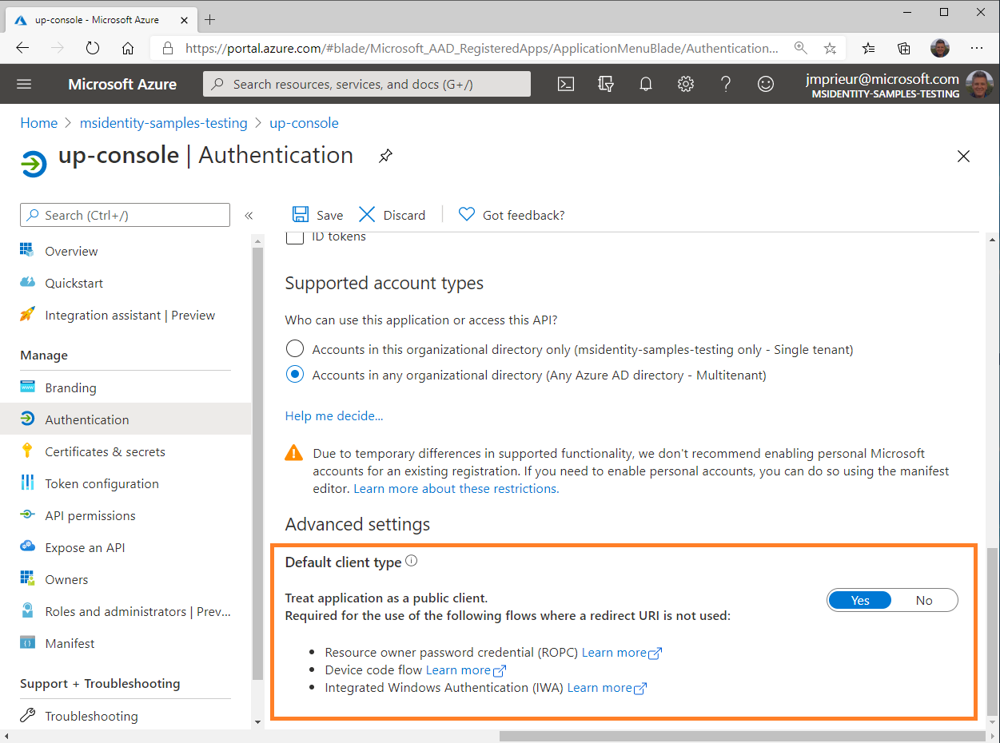

# Desktop app that calls web APIs: App registration

This article covers the app registration specifics for a desktop application.

## Supported account types

The account types supported in a desktop application depend on the experience that you want to light up. Because of this relationship, the supported account types depend on the flows that you want to use.

### Audience for interactive token acquisition

If your desktop application uses interactive authentication, you can sign in users from any [account type](quickstart-register-app.md#register-a-new-application-using-the-azure-portal).

### Audience for desktop app silent flows

- To use Integrated Windows Authentication or a username and a password, your application needs to sign in users in your own tenant, for example, if you're a line-of-business (LOB) developer. Or, in Azure Active Directory organizations, your application needs to sign in users in your own tenant if it's an ISV scenario. These authentication flows aren't supported for Microsoft personal accounts.
- If you want to use device code flow, you can't sign in users with their Microsoft personal accounts yet.
- If you sign in users with social identities that pass a business-to-commerce (B2C) authority and policy, you can only use the interactive and username-password authentication.

## Redirect URIs

The redirect URIs to use in a desktop application depend on the flow you want to use.

- If you use interactive authentication or device code flow, use `https://login.microsoftonline.com/common/oauth2/nativeclient`. To achieve this configuration, select the corresponding URL in the **Authentication** section for your application.
  
  > [!IMPORTANT]
  > Today, MSAL.NET uses another redirect URI by default in desktop applications that run on Windows (`urn:ietf:wg:oauth:2.0:oob`). In the future, we'll want to change this default, so we recommend that you use `https://login.microsoftonline.com/common/oauth2/nativeclient`.

- If you build a native Objective-C or Swift app for macOS, register the redirect URI based on your application's bundle identifier in the following format: msauth.<your.app.bundle.id>://auth. Replace <your.app.bundle.id> with your application's bundle identifier.
- If your app uses only Integrated Windows Authentication or a username and a password, you don't need to register a redirect URI for your application. These flows do a round trip to the Microsoft identity platform v2.0 endpoint. Your application won't be called back on any specific URI.
- To distinguish device code flow, Integrated Windows Authentication, and a username and a password from a confidential client application flow that doesn't have redirect URIs either (the client credential flow used in daemon applications), you need to express that your application is a public client application. To achieve this configuration, go to the **Authentication** section for your application. In the **Advanced settings** subsection, in the **Default client type** paragraph, select **Yes** for **Treat application as a public client**.

  

## API permissions

Desktop applications call APIs for the signed-in user. They need to request delegated permissions. They can't request application permissions, which are handled only in [daemon applications](scenario-daemon-overview.md).

## Next steps

> [!div class="nextstepaction"]
> [Desktop app: App configuration](scenario-desktop-app-configuration.md)
