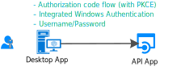
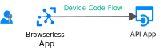

# Scenario: Desktop app that calls web APIs

Learn all you need to build a Desktop app that calls web APIs

## Prerequisites

[!INCLUDE [Pre-requisites](../../../includes/active-directory-develop-scenarios-prerequisites.md)]

## Getting started

If you haven't already, create your first application by following the .NET desktop quickstart or the UWP quickstart:

> [!div class="nextstepaction"]
> [Quickstart: Acquire a token and call Microsoft Graph API from a Windows desktop app](./quickstart-v2-windows-desktop.md)

> [!div class="nextstepaction"]
> [Quickstart: Acquire a token and call Microsoft Graph API from a UWP app](./quickstart-v2-uwp.md)

## Overview

You write a desktop application, and you want to sign in users to your application and call web APIs such as the Microsoft Graph, other Microsoft APIs, or your own web API. You have several possibilities:

- You can use the interactive token acquisition:

  - If your desktop application supports graphical controls, for instance if it's a Windows.Form application or a WPF application.
  - Of if it's a .NET Core application and you agree to have the authentication interaction with Azure AD happen in the system browser

- For Windows hosted applications, it's also possible for applications running on computers joined to a Windows domain or AAD joined to acquire a token silently by using Integrated Windows Authentication.
- Finally, and although it's not recommended, you can use Username/Password in public client applications. It's still needed in some scenarios (like DevOps), but beware that using it will impose constraints on your application. For instance, it can't sign in user who needs to perform multi-factor authentication (Conditional Access). Also your application won't benefit from single sign-on (SSO).

  It's also against the principles of modern authentication and is only provided for legacy reasons.

  

- If you're writing a portable command-line tool - probably a .NET Core application running on Linux or Mac - and if you accept that the authentication be delegated to the system browser, you will be able to use interactive authentication. (.NET Core doesn't provide yet a [Web browser](https://aka.ms/msal-net-uses-web-browser) and therefore the authentication happens in the system browser), Otherwise, the best option in that case is to use device code flow. This flow is also used for applications without a browser, such as  IoT applications

  

## Specifics

Desktop applications have a number of specificities, which depends mainly on whether your application uses the interactive authentication or not.

## Next steps

> [!div class="nextstepaction"]
> [Desktop app - app registration](scenario-desktop-app-registration.md)
