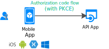

# Scenario: Mobile application that calls web APIs

Learn all you need to know to build a mobile app that calls web APIs.

## Prerequisites

[!INCLUDE [Prerequisites](../../../includes/active-directory-develop-scenarios-prerequisites.md)]

## Getting started

Create your first mobile application and try out a quickstart!

> [!div class="nextstepaction"]
> [Quickstart: Acquire a token and call Microsoft Graph API from an Android app](./quickstart-v2-android.md)
>
> [Quickstart: Acquire a token and call Microsoft Graph API from an iOS app](./quickstart-v2-ios.md)
>
> [Quickstart: Acquire a token and call Microsoft Graph API from a Xamarin iOS & Android app](https://github.com/Azure-Samples/active-directory-xamarin-native-v2)

## Overview

A personalized, seamless user experience is essential for mobile apps.  Microsoft identity platform enables mobile developers to create that experience for iOS and Android users. Your application can sign in Azure Active Directory (Azure AD) users, personal Microsoft account users, and Azure AD B2C users and acquire tokens to call a web API on their behalf. To implement these flows, we'll use Microsoft Authentication Library (MSAL), which implements the industry standard [OAuth2.0 authorization code flow](v2-oauth2-auth-code-flow.md).

Considerations for mobile apps:

- **User experience is key**: Allow users to see the value of your app before asking for sign-in, and request only the required permissions.
- **Support all user configurations**: Many mobile business users are under Conditional Access and device compliance policies. Be sure to support these key scenarios.
- **Implement single sign-on (SSO)**: MSAL and Microsoft identity platform make enabling single sign-on simple through the device's browser or the Microsoft Authenticator (and Intune Company Portal on Android).

## Specifics

Keep these considerations in mind when you build a mobile app on Microsoft identity platform:

- Depending on the platform, some user interaction might be required the first time users sign in. For example, iOS requires apps to show user interaction when using SSO the first time through Microsoft Authenticator (and Intune Company Portal on Android).
- On iOS and Android, MSAL might use an external browser (which might appear on top of your app) to sign in users. You can customize the configuration to use in-app WebViews instead.
- Never use a secret in a mobile application. It will be accessible to all users.

## Next steps

> [!div class="nextstepaction"]
> [App registration](scenario-mobile-app-registration.md)
