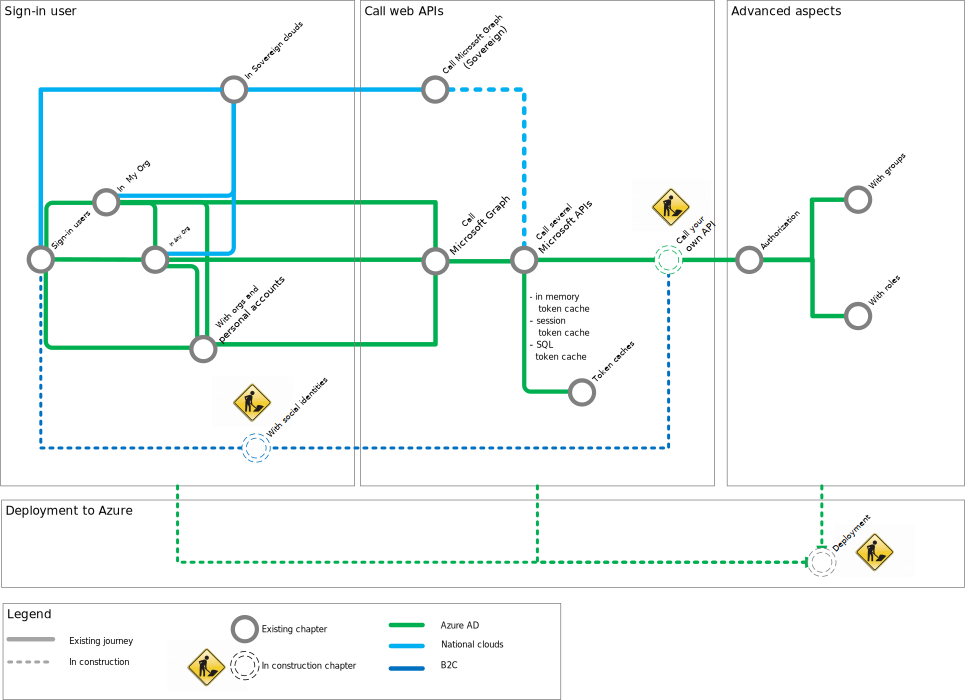

# Web app that signs in users - move to production

Now that you know how to acquire a token to call web APIs, learn how to move it to production.

[!INCLUDE [Move to production common steps](../../../includes/active-directory-develop-scenarios-production.md)]

## Next steps

### Calling web APIs scenario

Once your web app signs-in users, it can call web APIs on behalf of the signed-in users. Calling web APIs from the web app is the object of the following scenario:

> [!div class="nextstepaction"]
> [Web app that calls web APIs](scenario-web-app-call-api-overview.md)

### Deep dive - web app tutorial

Learn about other ways of sign-in users with the ASP.NET Core tutorial: [ms-identity-aspnetcore-webapp-tutorial](https://github.com/Azure-Samples/ms-identity-aspnetcore-webapp-tutorial). This is a progressive tutorial with production ready code for a web app including how to add sign in.

<!--- Removed the diagram as it's already shown in the above link to GitHub

--->
