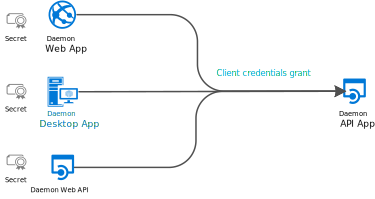
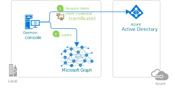

# Scenario - Acquiring a token for the application (daemon apps)

## Scenario

### Overview

Your application can acquire a token to call a Web API on behalf of itself (not on behalf of a user), by using the **client credentials grant**. This scenario is useful for daemon applications.



Examples of use cases are:

- Web applications, for instance provisioning or administrating users, or doing batch processes in a directory
- Desktop applications (for instance windows services on Windows, or daemons processes on Linux) like batch job, or an operating system service running in the background
- Web APIs, which need to manipulate directories, not specific users

There is another common case where non-daemon applications use client credentials: even when they act on behalf of users,  they need to access a Web API or a resource with their identity for technical reasons. Example of such are access to secrets in KeyVault, or an Azure SQL database for a cache.

Applications acquiring a token for their own identities:

- are confidential client applications. These apps, given that they access resources independently of a user need to prove their identity. They'are also rather sensitive apps, which they need to be approved by the Azure Active Directory tenant admins.
- have registered a secret (application password or certificate) with Azure AD. This secret is passed-in during the call to Azure AD to get a token

### Specifics

it’s important to understand that:

- user interaction is not possible with a daemon application, which requires the application to have its own identity. This type of application requests an access token by using its application identity and presenting its Application ID, credential (password or certificate), and application ID URI to Azure AD. After successful authentication, the daemon receives an access token (and a refresh token) from the Microsoft identity platform endpoint, which is then used to call the web API (and is refreshed as needed)

- because user interaction is not possible, incremental consent won't be possible. Therefore, the API permissions need to be configured at application registration, and the code of the application just requests statically defined permissions.

The end to end experience of developers for this scenario has, therefore, specific aspects as:

- During the [Application registration](#app-registration-specifics), the Reply URI is not needed, secrets or certificates need to be shared with Azure AD, and API permissions need to be app permissions and admin consent needs to be granted to those app permissions.
- The [Application configuration](#msal-libraries-applications-code-configuration) needs to provide client credentials as shared with Azure AD during the application registration
- The [scope](#scopes-to-request) used to acquire a token with client credentials needs to be a static scope.

## MSAL Libraries supporting client credentials

The libraries supporting client credentials are:

  MSAL library | Description
  ------------ | ----------
 <br/> MSAL.NET  | Supported platforms are .NET Framework and .NET Core platforms (not UWP, Xamarin.iOS, and Xamarin.Android as those platforms are used to build public client applications)
 <br/> MSAL.Python | development in progress - public preview to come
 <br/> MSAL.Java | development in progress

## App registration specifics

### Authentication - No Reply URI needed

In the case where your confidential client application uses **only** the client credentials flow, the reply URL does not need to be registered. It's not needed either for the application configuration/construction. The client credentials flow does not use it.

### Registration of secrets or certificates

Like for any confidential client application, you need to register a secret or certificate. You can register your application secrets either through the interactive experience in the [Azure portal](https://portal.azure.com/#blade/Microsoft_AAD_IAM/ActiveDirectoryMenuBlade/RegisteredAppsPreview), or using command-line tools (like PowerShell)

#### Registering client secrets using the application registration portal

The management of client credentials happens in the **certificates & secrets** page for an application:


- the application secret (also named client secret) is generated by Azure AD, during the registration of the confidential client application, when you select **New client secret**. At that point, you must copy the secret string in the clipboard for use in your app, before selecting **Save**. This string won't be presented any longer.
- the certificate is uploaded in the application registration using the **Upload certificate** button

For details, see [Quickstart: Configure a client application to access web APIs | Add credentials to your application](quickstart-configure-app-access-web-apis.md#add-credentials-to-your-web-application)

#### Registering client secrets using PowerShell

Alternatively, you can register your application with Azure AD using command-line tools. The [active-directory-dotnetcore-daemon-v2](https://github.com/Azure-Samples/active-directory-dotnetcore-daemon-v2) sample shows how to register an application secret or a certificate with an Azure AD application:

- For details on how to register an application secret, see [AppCreationScripts/Configure.ps1](https://github.com/Azure-Samples/active-directory-dotnetcore-daemon-v2/blob/5199032b352a912e7cc0fce143f81664ba1a8c26/AppCreationScripts/Configure.ps1#L190)
- For details on how to register a certificate with the application, see [AppCreationScripts-withCert/Configure.ps1](https://github.com/Azure-Samples/active-directory-dotnetcore-daemon-v2/blob/5199032b352a912e7cc0fce143f81664ba1a8c26/AppCreationScripts-withCert/Configure.ps1#L162-L178)

#### API Permissions - app permissions and admin consent

A daemon application can only request application permissions to APIs (not delegated permissions). In the **API Permission** page for the application registration, after you have selected **Add a permission** and chosen the API family, you'll need to choose **Application permissions** and then select your permissions


Daemon applications require have a tenant admin pre-consent to the application calling the Web API. This consent is provided in the same **API Permission** page, by a tenant admin selecting **Grant admin consent to *our organization***

## MSAL libraries: Application's code configuration

### Authority

Given that the daemon applications don't use delegated permissions, but application permissions, their Supported account type cannot be Accounts in any organizational directory and personal Microsoft accounts (for example, Skype, Xbox, Outlook.com), as there is no tenant admin to grant consent to the daemon application for Microsoft personal accounts. It needs to be accounts in my organization or accounts in any organizations.

Therefore the authority specified in the application configuration should be tenanted (specifying a Tenant ID or a domain name associated with your organization). If you are an ISV and want to provide a multi-tenant tool, you can use `organizations`. But keep in mind that you will also need to explain to your customers how to provide admin consent. See [Requesting consent for an entire tenant](v2-permissions-and-consent.md#requesting-consent-for-an-entire-tenant) for details

### Application configuration and instantiation

In MSAL libraries, the Client Credentials (secret or certificate) are passed as a parameter of the ``ConfidentialClientApplication`` construction.

# [.NET](#tab/dotnet)

```CSharp
using Microsoft.Identity.Client.ApiConfig;

IConfidentialClientApplication app;
```

Here is the code to build an application with an application secret:

```CSharp
app = ConfidentialClientApplicationBuilder.Create(config.ClientId)
           .WithClientSecret(config.ClientSecret)
           .WithAuthority(new Uri(config.Authority))
           .Build();
```

Here is the code to build an application with a certificate:

```CSharp
X509Certificate2 certificate = ReadCertificate(config.CertificateName);
app = ConfidentialClientApplicationBuilder.Create(config.ClientId)
    .WithCertificate(certificate)
    .WithAuthority(new Uri(config.Authority))
    .Build();
```

# [Python](#tab/python)

```Python
# Create a preferably long-lived app instance which maintains a token cache.

app = msal.ConfidentialClientApplication(
    config["client_id"], authority=config["authority"],
    client_credential=config["secret"],
    # token_cache=...  # Default cache is in memory only.
                       # You can learn how to use SerializableTokenCache from
                       # https://msal-python.rtfd.io/en/latest/#msal.SerializableTokenCache

    )
```

___

## MSAL libraries: Token acquisition

Then, once the confidential client application is constructed, acquiring the token is a question of calling ``AcquireTokenForClient``, passing the scope, and forcing or not a refresh of the token.

### Scopes to request

The scope to request for a client credential flow is the name of the resource followed by `/.default`. This notation tells Azure AD to use the **application level permissions** declared statically during the application registration. Also, as seen previously, these API permissions must be granted by a tenant administrator

# [.NET](#tab/dotnet)

```CSharp
ResourceId = "someAppIDURI";
var scopes = new [] {  ResourceId+"/.default"};

var result = app.AcquireTokenForClient(scopes)
                .ExecuteAsync();
```

# [Python](#tab/python)

In MSAL.Python, the configuration file would look like this:

```Python
{
    "authority": "https://login.microsoftonline.com/organizations",
    "client_id": "your_client_id",
    "secret": "This is a sample only. You better NOT persist your password."
    "scope": ["https://graph.microsoft.com/.default"]
}
```

___

### AcquireTokenForClient API

# [.NET](#tab/dotnet)

```CSharp
using Microsoft.Identity.Client.ApiConfig;

// With client credentials flows the scopes is ALWAYS of the shape "resource/.default", as the
// application permissions need to be set statically (in the portal or by PowerShell), and then granted by
// a tenant administrator
string[] scopes = new string[] { "https://graph.microsoft.com/.default" };

AuthenticationResult result = null;
try
{
 result = await app.AcquireTokenForClient(scopes)
                  .ExecuteAsync();
}
catch (MsalServiceException ex) when (ex.Message.Contains("AADSTS70011"))
{
    // Invalid scope. The scope has to be of the form "https://resourceurl/.default"
    // Mitigation: change the scope to be as expected
}
```

### Remark

In MSAL.NET, `AcquireTokenForClient` uses the **application token cache** (whereas all the other AcquireTokenXX method use the user token cache)
Don't call `AcquireTokenSilent` before calling `AcquireTokenForClient` as `AcquireTokenSilent` uses the **user** token cache. `AcquireTokenForClient` checks the **application** token cache itself and updates it.

# [Python](#tab/python)

```Python
# Firstly, looks up a token from cache
# Since we are looking for token for the current app, NOT for an end user,
# notice we give account parameter as None.
result = app.acquire_token_silent(config["scope"], account=None)

if not result:
    logging.info("No suitable token exists in cache. Let's get a new one from AAD.")
    result = app.acquire_token_for_client(scopes=config["scope"])
```

___

## Next steps

Here are a few links to learn more:

# [.NET](#tab/dotnet)

To learn more:

- Try the quickstart:
  - [Acquire a token and call Microsoft Graph API from a console app using app's identity](./quickstart-v2-netcore-daemon.md)
- Conceptual documentation:
  - [Client applications](https://aka.ms/msal-net-client-applications)
- Reference documentation for:
  - Instantiating [ConfidentialClientApplication](https://docs.microsoft.com/en-us/dotnet/api/microsoft.identity.client.appconfig.confidentialclientapplicationbuilder?view=azure-dotnet)
  - Calling [AcquireTokenForClient](https://docs.microsoft.com/en-us/dotnet/api/microsoft.identity.client.apiconfig.acquiretokenforclientparameterbuilder?view=azure-dotnet)
- Other samples / tutorials:
  - [microsoft-identity-platform-console-daemon](https://github.com/Azure-Samples/microsoft-identity-platform-console-daemon) features a simple .NET Core 2.1 console application that displays the users of a tenant querying the Microsoft Graph using the identity of the application, instead of on behalf of a user. 

    

    The same sample also illustrates the variation with certificates.

    

  - [microsoft-identity-platform-aspnet-webapp-daemon](https://github.com/Azure-Samples/microsoft-identity-platform-aspnet-webapp-daemon) features an ASP.NET MVC web application that sync's data from the Microsoft Graph using the identity of the application, instead of on behalf of a user. Also illustrates the admin consent process.

    

# [Python](#tab/python)

See https://github.com/AzureAD/azure-activedirectory-library-for-python

___

- Protocol documentation: [Azure Active Directory v2.0 and the OAuth 2.0 client credentials flow](https://docs.microsoft.com/en-us/azure/active-directory/develop/v2-oauth2-client-creds-grant-flow)
