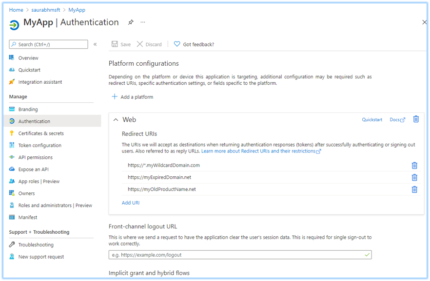
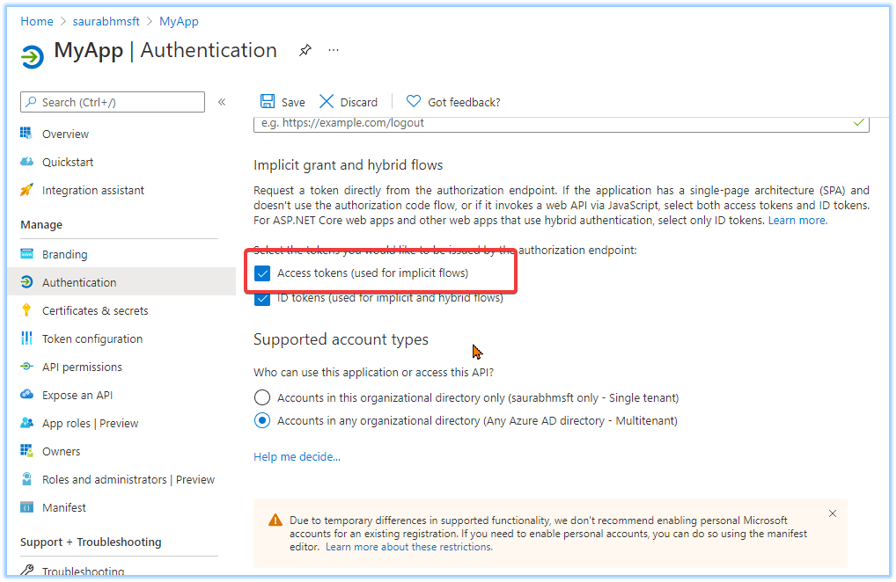
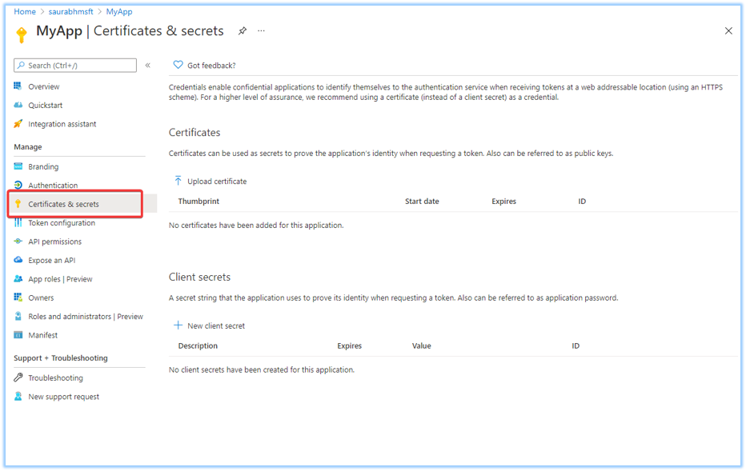
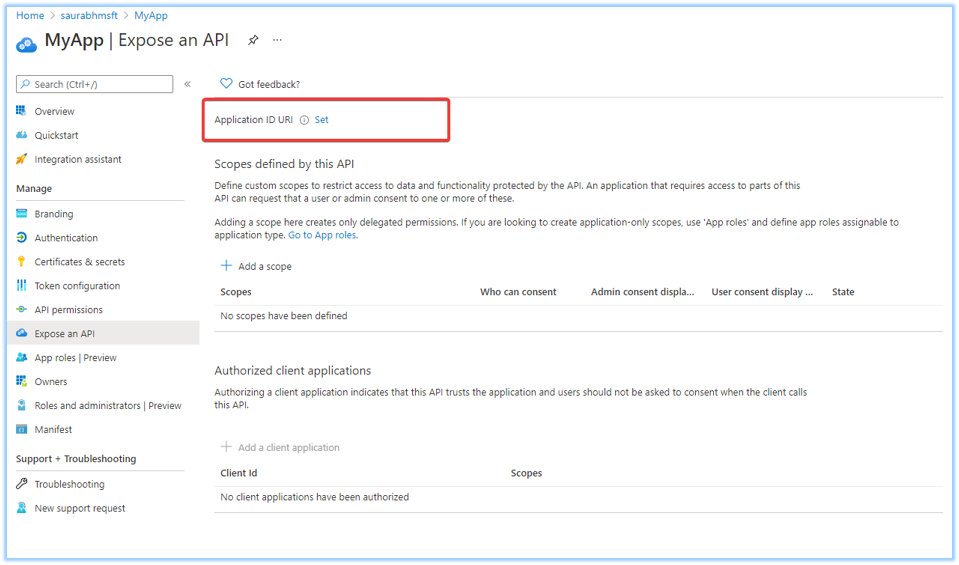
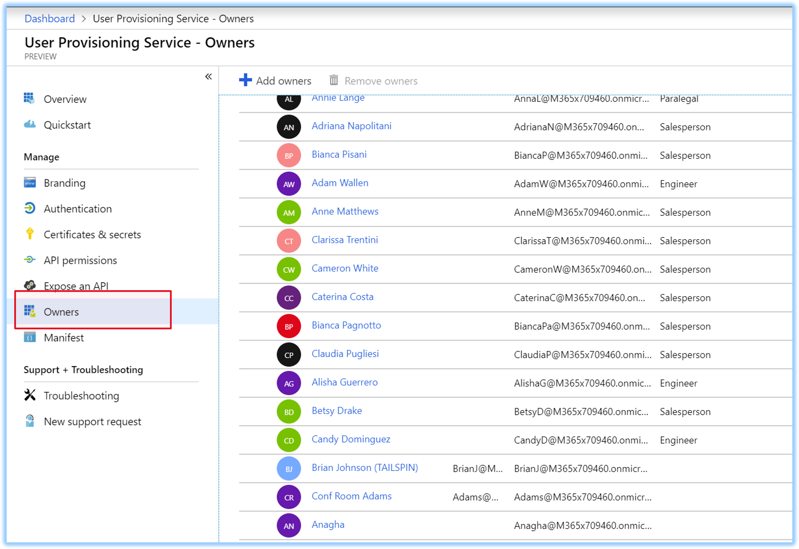
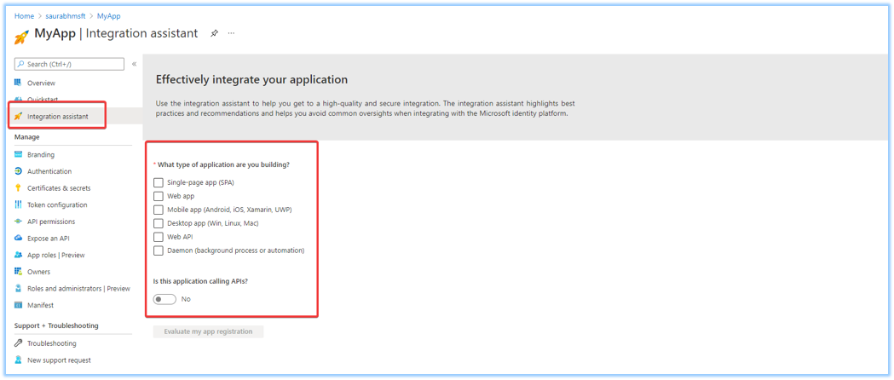

# Azure AD application registration security best practices

An Azure Active Directory (Azure AD) application registration is a critical part of your business application. Any misconfiguration or lapse in hygiene of your application can result in downtime or compromise.

It's important to understand that your application registration has a wider impact than the business application because of its surface area. Depending on the permissions added to your application, a compromised app can have an organization-wide effect.
Since an application registration is essential to getting your users logged in, any downtime to it can affect your business or some critical service that your business depends upon. So, it's important to allocate time and resources to ensure your application registration stays in a healthy state always. We recommend that you conduct a periodical security and health assessment of your applications much like a Security Threat Model assessment for your code. For a broader perspective on security for organizations, check the [security development lifecycle](https://www.microsoft.com/securityengineering/sdl) (SDL).

This article describes security best practices for the following application registration properties.

- Redirect URI
- Implicit grant flow for access token
- Credentials
- AppId URI
- Application ownership
- Checklist

## Redirect URI configuration

It's important to keep Redirect URIs of your application up to date. A lapse in the ownership of one of the redirect URIs can lead to an application compromise. Ensure that all DNS records are updated and monitored periodically for changes. Along with maintaining ownership of all URIs, don't use wildcard reply URLs or insecure URI schemes such as http, or URN.

### Redirect URI summary

| Do                                    | Don't          |
| ------------------------------------- | -------------- |
| Maintain ownership of all URIs        | Use wildcards  |
| Keep DNS up to date                   | Use URN scheme |
| Keep the list small                   |   -----        |
| Trim any unnecessary URIs             |   -----        |
| Update URLs from Http to Https scheme |   -----        |

## Implicit flow token configuration

Scenarios that require **implicit flow** can now use **Auth code flow** to reduce the risk of compromise associated with implicit grant flow misuse. If you configured your application registration to get Access tokens using implicit flow, but don't actively use it, we recommend you turn off the setting to protect from misuse.

### Implicit grant flow summary

| Do                                                                    | Don't                                                                  |
| --------------------------------------------------------------------- | ---------------------------------------------------------------------- |
| Understand if [implicit flow is required](./v2-oauth2-implicit-grant-flow.md#suitable-scenarios-for-the-oauth2-implicit-grant) | Use implicit flow unless [explicitly required](./v2-oauth2-implicit-grant-flow.md#suitable-scenarios-for-the-oauth2-implicit-grant) |
| Separate app registration for (valid) implicit flow scenarios |   -----                                                |
| Turn off unused implicit flow | -----              |

## Credential configuration

Credentials are a vital part of an application registration when your application is used as a confidential client. If your app registration is used only as a Public Client App (allows users to sign in using a public endpoint), ensure that you don't have any credentials on your application object. Review the credentials used in your applications for freshness of use and their expiration. An unused credential on an application can result in security breach.
While it's convenient to use password secrets as a credential, we strongly recommend that you use x509 certificates as the only credential type for getting tokens for your application. Monitor your production pipelines to ensure credentials of any kind are never committed into code repositories. If using Azure, we strongly recommend using Managed Identity so application credentials are automatically managed. Refer to the [managed identities documentation](../managed-identities-azure-resources/overview.md) for more details. [Credential Scanner](../../security/develop/security-code-analysis-overview.md#credential-scanner) is a static analysis tool that you can use to detect credentials (and other sensitive content) in your source code and build output.

| Do                                                                     | Don't                             |
| ---------------------------------------------------------------------- | --------------------------------- |
| Use [certificate credentials](./active-directory-certificate-credentials.md)              | Use Password credentials          |
| Use Key Vault with [Managed identities](../managed-identities-azure-resources/overview.md) | Share credentials across apps     |
| Rollover frequently                                                    | Have many credentials on one app  |
|     -----                                                              | Leave stale credentials available |
|     -----                                                              | Commit credentials in code        |

## AppId URI configuration

Certain applications can expose resources (via WebAPI) and as such need to define an AppId URI that uniquely identifies the resource in a tenant. We recommend using either of the following URI schemes: api or https, and set the AppId URI in the following formats to avoid URI collisions in your organization.

**Valid api schemes:**

- api://_{appId}_
- api://_{tenantId}/{appId}_
- api://_{tenantId}/{string}_
- https://_{verifiedCustomerDomain}/{string}_
- https://_{string}.{verifiedCustomerDomain}_
- https://_{string}.{verifiedCustomerDomain}/{string}_

### AppId URI summary

| Do                                           | Don't                  |
| -------------------------------------------- | ---------------------- |
| Avoid collisions by using valid URI formats. | Use wildcard AppId URI |
| Use verified domain in Line of Business (LoB) apps | Malformed URI    |
| Inventory your AppId URIs                    |      -----             |

## App ownership configuration

Ensure app ownership is kept to a minimal set of people within the organization. It's recommended to run through the owners list once every few months to ensure owners are still part of the organization and their charter accounts for ownership of the application registration. Check out [Azure AD access reviews](../governance/access-reviews-overview.md) for more details.

### App ownership summary

| Do                  | Don't |
| ------------------- | ----- |
| Keep it small       | ----- |
| Monitor owners list | ----- |

## Checklist

App developers can use the _Checklist_ available in Azure portal to ensure their app registration meets a high quality bar and provides guidance to integrate securely. The integration assistant highlights best practices and recommendation that help avoid common oversights when integrating with Microsoft identity platform.

### Checklist summary

| Do                                                 | Don't |
| -------------------------------------------------- | ----- |
| Use checklist to get scenario-based recommendation | ----- |
| Deep link into app registration blades             | ----- |

## Next steps
For more information on Auth code flow, see the [OAuth 2.0 authorization code flow](./v2-oauth2-auth-code-flow.md).