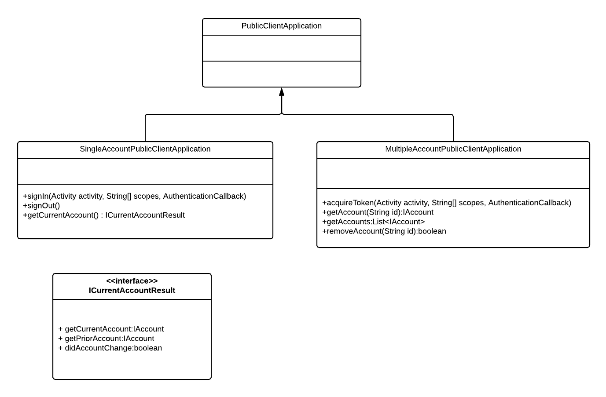

# Single and multiple account public client apps

## Introduction

The Azure Active Directory Authentication Library (ADAL) models the server.  The Microsoft Authentication Library (MSAL) instead models your client application.  The majority of Android apps are considered public clients. A public client is an app that can't securely keep a secret.  

MSAL specializes the API surface of `PublicClientApplication` to simplify and clarify the development experience for apps that allow only one account to be used at a time. `PublicClientApplication` is subclassed by `SingleAccountPublicClientApplication` and `MultipleAccountPublicClientApplication`.  The following diagram shows the relationship between these classes.



## Single Account Public Client Application

The `SingleAccountPublicClientApplication` class allows you to create an MSAL-based app that only allows a single account to be signed in at a time. `SingleAccountPublicClientApplication` differs from `PublicClientApplication` in the following ways:

- MSAL tracks the currently signed-in account.
  - If your app is using a broker (the default during Azure Portal app registration) and is installed on a device where a broker is present, MSAL will verify that the account is still available on the device.
- `signIn` allows you to sign in an account explicitly and separately from requesting scopes.
- `acquireTokenSilent` doesn't require an account parameter.  If you do provide an account, and the account you provide doesn't match the current account tracked by MSAL, an `MsalClientException` is thrown.
- `acquireToken` doesn't allow the user to switch accounts. If the user attempts to switch to a different account, an exception is thrown.
- `getCurrentAccount` returns a result object that provides the following:
  - A boolean indicating whether the account changed. An account may be changed as a result of being removed from the device, for example.
  - The prior account. This is useful if you need to do any local data cleanup when the account is removed from the device or when a new account is signed in.
  - The currentAccount.
- `signOut` removes any tokens associated with your client from the device.  

>Note: When an Android Authentication broker such as Microsoft Authenticator or Intune Company Portal is installed on the device and your app is configured to use the broker, `signOut` won't remove the account from the device.

## Single account scenario

The following pseudo code illustrates using `SingleAccountPublicClientApplication`.

```java
// Construct Single Account Public Client Application
ISingleAccountPublicClientApplication app = PublicClientApplication.createSingleAccountPublicClientApplication(getApplicationContext(), R.raw.msal_config);

// UI Thread
String[] scopes = {"User.Read"};
IAccount mAccount = null;
app.signIn(getActivity(), scopes new AuthenticationCallback()
{

        @Override
        public void onSuccess(IAuthenticationResult authenticationResult) 
        {
            mAccount = authenticationResult.getAccount();
        }

        @Override
        public void onError(MsalException exception)
        {
        }

        @Override
        public void onCancel()
        {
        }
    }
);

// Load Account Specific Data
getDataForAccount(account);

// Get Current Account
ICurrentAccountResult currentAccountResult = app.getCurrentAccount();
if (currentAccountResult.didAccountChange())
{
    // Account Changed Clear existing account data
    clearDataForAccount(currentAccountResult.getPriorAccount());
    mAccount = currentAccountResult.getCurrentAccount();
    if (account != null)
    {
        //load data for new account
        getDataForAccount(account);
    }
}


// Sign out
if (app.signOut())
{
    clearDataForAccount(mAccount);
    mAccount = null;
}

```

### Add Account

Use one or more accounts in your application by calling `acquireToken` one or more times.  

### Get Accounts / Get Account

- Call `getAccount` to get a specific account
- Call `getAccounts`to get a list of accounts currently known to the app.

> Note: Your app will not be able to enumerate all Microsoft identity platform accounts on the device known to the broker app.  It can only accounts that have been used by your app.  Accounts that have been removed from the device won't be returned by these functions.

### Remove Account

Remove an account by calling `removeAccount` with an account identifier.

> Note: If your app is configured to use a broker, and a broker is installed on the device, the account won't be removed from the broker when you call `removeAccount`.  Only tokens associated with your client are removed.
