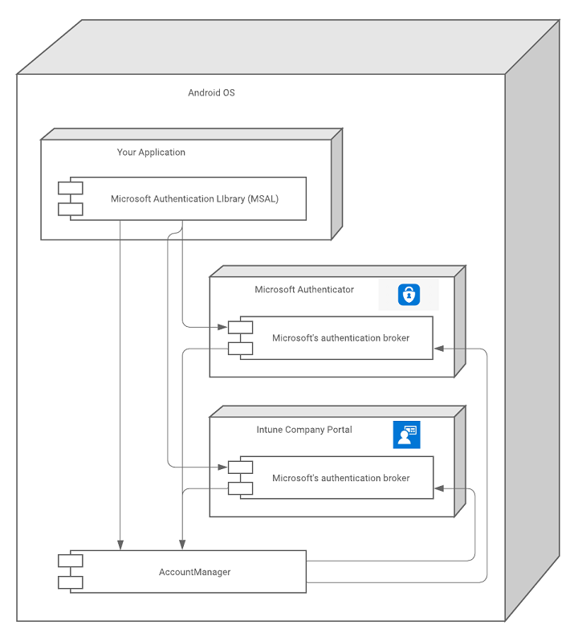

# How to: Enable cross-app SSO on Android using MSAL 


Single sign-on (SSO) allows users to only enter their credentials once and have those credentials automatically work across applications.

[The Microsoft identity platform](https://docs.microsoft.com/azure/active-directory/develop/), along with the developer SDKs, makes it easy to enable SSO within your own suite of apps. With the broker capability and Authenticator applications, you can extend SSO across the entire device.

In this how-to, you'll learn how to configure the SDK within your application to provide SSO to your customers. 

### Prerequisites

This how-to assumes that you know how to:

- Provision your app using the Azure portal. For more information on this topic, see the instructions for creating an app in [the Android tutorial](https://docs.microsoft.com/azure/active-directory/develop/tutorial-v2-android#create-a-project)
- Integrate your application with the [Microsoft Authentication Library for Android](https://github.com/AzureAD/microsoft-authentication-library-for-android).

### Single sign-on concepts

There are two ways for third party applications using MSAL for Android to accheive SSO, through the system browser and through a broker application. Using a broker application allows for additional benefits such as device wide SSO, account management, and conditional access, however, it does require your users download additional applications.

## SSO through System Browser 

Android applications have the option to use the webview, system browser, or Chrome Custom Tabs for authentication user experience. If the application is not using brokered authentication, it will need to use the system browser rather than the native webview in order to achieve SSO. [Read more about authorization agents and SSO implications](https://docs.microsoft.com/azure/active-directory/develop/authorization-agents). 

### Authorization agents (Android)

Choosing a specific strategy for authorization agents is optional and represents additional functionality apps can customize. Most apps will use the MSAL defaults (see [Understand  the Android MSAL configuration file](msal-configuration.md) to see the various defaults).

MSAL supports authorization using a `WebView`, or the system browser.  The image below shows how it looks using the `WebView`, or the system browser with CustomTabs or without CustomTabs:


### Single sign-in implications

By default, applications integrated with MSAL use the system browser's Custom Tabs to authorize. Unlike WebViews, Custom Tabs share a cookie jar with the default system browser enabling fewer sign-ins with web or other native apps that have integrated with Custom Tabs.

If the application uses a `WebView` strategy without integrating Microsoft Authenticator or Company Portal support into their app, users won't have a Single Sign On (SSO) experience across the device or between native apps and web apps.

If the application uses MSAL with Microsoft Authenticator or Company Portal support, then users can have a SSO experience across applications if the user has an active sign-in with one of the apps.

### WebView

To use the in-app WebView, put the following line in the app configuration JSON that is passed to MSAL:

```json
"authorization_user_agent" : "WEBVIEW"
```

When using the in-app `WebView`, the user signs in directly to the app. The tokens are kept inside the sandbox of the app and aren't available outside the app's cookie jar. As a result, the user can't have a SSO experience across applications unless the apps integrate with the Authenticator or Company Portal.

However, `WebView` does provide the capability to customize the look and feel for sign-in UI. See [Android WebViews](https://developer.android.com/reference/android/webkit/WebView) for more about how to do this customization.

### Default browser plus custom tabs

By default, MSAL uses the browser and a [custom tabs](https://developer.chrome.com/multidevice/android/customtabs) strategy. You can explicitly indicate this strategy to prevent changes in future releases to `DEFAULT` by using the following JSON configuration in the custom configuration file:

```json
"authorization_user_agent" : "BROWSER"
```

Use this approach to provide a SSO experience through the device's browser. MSAL uses a shared cookie jar, which allows other native apps or web apps to achieve  SSO on the device by using the persist session cookie set by MSAL.

### Browser selection heuristic

Because it's impossible for MSAL to specify the exact browser package to use on each of the broad array of Android phones, MSAL implements a browser selection heuristic that tries to provide the best cross-device SSO.

MSAL retrieves the full list of browsers installed on the device to select which browser to use. The list is in the order returned by the package manager, which indirectly reflects the user's preferences. For example, the default browser, if set, is the first entry in the list. The _first_ browser in the list will be chosen regardless of whether it supports custom tabs. If the browser supports Custom Tabs, MSAL will launch the Custom Tab. Custom Tabs have a look and feel closer to an in-app `WebView` and allow basic UI customization. See [Custom Tabs in Android](https://developer.chrome.com/multidevice/android/customtabs) to learn more.

If there are no browser packages on the device, MSAL uses the in-app `WebView`.

The order of browsers in the browser list is determined by the operating system. It is in order from most preferred to least. If the device default setting isn't changed, the same browser should be launched for each sign in to ensure a SSO experience.

> [!NOTE]
> MSAL no longer always prefers Chrome if another browser is set as default. For example, on a device which has both Chrome and another browser pre-installed, MSAL will use the browser the user has set as the default.

#### Tested Browsers

The following browsers have been tested to see if they correctly redirect to the `"redirect_uri"` specified in the configuration file:

| Device | Built-in Browser | Chrome | Opera  | Microsoft Edge | UC Browser | Firefox |
| -- |:-------------:| -----:|-----:|-----:|-----:|-----:|
| Nexus 4 (API 17) | pass | pass |not applicable |not applicable |not applicable |not applicable |
| Samsung S7 (API 25) | pass* | pass | pass | pass | fail |pass |
| Huawei (API 26) |pass** | pass | fail | pass | pass |pass |
| Vivo (API 26) |pass|pass|pass|pass|pass|fail|
| Pixel 2 (API 26) |pass | pass | pass | pass | fail |pass |
| Oppo | pass | not applicable*** |not applicable  |not applicable |not applicable | not applicable|
| OnePlus (API 25) |pass | pass | pass | pass | fail |pass |
| Nexus (API 28) |pass | pass | pass | pass | fail |pass |
|MI | pass | pass | pass | pass | fail |pass |

*Samsung's built-in browser is Samsung Internet.  
**Huawei's built-in browser is Huawei Browser.  
***The default browser can't be changed inside the Oppo device setting.

## SSO through Brokered authentication 

You must use one of Microsoft's authentication brokers to participate in device-wide single sign-on (SSO) and to meet organizational Conditional Access policies. Integrating with a broker provides the following benefits:

- Device single sign-on
- Conditional access for:
  - Intune App Protection
  - Device Registration (Workplace Join)
  - Mobile Device Management
- Device-wide Account Management
  -  via Android AccountManager & Account Settings
  - "Work Account" - custom account type

On Android, the Microsoft Authentication Broker is a component that's included with [Microsoft Authenticator App](https://play.google.com/store/apps/details?id=com.azure.authenticator) and [Intune Company Portal](https://play.google.com/store/apps/details?id=com.microsoft.windowsintune.companyportal).

The following diagram illustrates the relationship between your app, the Microsoft Authentication Library (MSAL), and Microsoft's authentication brokers.



### Installing apps that host a broker

Broker-hosting apps can be installed by the device owner from their app store (typically Google Play Store) at any time. However, some APIs (resources) are protected by Conditional Access Policies that require devices to be:

- Registered (workplace joined) and/or
- Enrolled in Device Management or
- Enrolled in Intune App Protection

If a device doesn't already have a broker app installed, MSAL instructs the user to install one as soon as the app attempts to get a token interactively. The app will then need to lead the user through the steps to make the device compliant with the required policy.

### Effects of installing and uninstalling a broker

#### When a broker is installed

When a broker is installed on a device, all subsequent interactive token requests (calls to `acquireToken()`) are handled by the broker rather than locally by MSAL. Any SSO state previously available to MSAL is not available to the broker. As a result, the user will need to authenticate again, or select an account from the existing list of accounts known to the device.

Installing a broker doesn't require the user to sign in again. Only when the user needs to resolve an `MsalUiRequiredException` will the next request go to the broker. `MsalUiRequiredException` can be thrown for several reasons, and needs to be resolved interactively. For example:

- The user changed the password associated with their account.
- The user's account no longer meets a Conditional Access policy.
- The user revoked their consent for the app to be associated with their account.

##### Multiple brokers

If multiple brokers are installed on a device, the broker that was installed first is always the active broker. Only a single broker can be active on a device.

#### When a broker is uninstalled

If there is only one broker hosting app installed, and it is removed, then the user will need to sign in again. Uninstalling the active broker removes the account and associated tokens from the device.

If Intune Company Portal is installed and is operating as the active broker, and Microsoft Authenticator is also installed, then if the Intune Company Portal (active broker) is uninstalled the user will need to sign in again. Once they sign in again, the Microsoft Authenticator app  becomes the active broker.

### Integrating with a broker

#### Generating a redirect URI for a broker

You must register a redirect URI that is compatible with the broker. The redirect URI for the broker should include your app's package name and the Base64-encoded representation of your app's signature.

The format of the redirect URI is: `msauth://<yourpackagename>/<base64urlencodedsignature>`

You can use [keytool](https://manpages.debian.org/buster/openjdk-11-jre-headless/keytool.1.en.html) to generate a Base64-encoded signature hash using your app's signing keys, and then use the Azure portal to generate your redirect URI using that hash.

Linux and macOS:

```bash
keytool -exportcert -alias androiddebugkey -keystore ~/.android/debug.keystore | openssl sha1 -binary | openssl base64
```

Windows:

```powershell
keytool -exportcert -alias androiddebugkey -keystore %HOMEPATH%\.android\debug.keystore | openssl sha1 -binary | openssl base64
```

Once you've generated a signature hash with *keytool*, use the Azure portal to generate the redirect URI:

1. Sign in to the [Azure portal](https://portal.azure.com) and select your Android app in **App registrations**.
1. Select **Authentication** > **Add a platform** > **Android**.
1. In the **Configure your Android app** pane that opens, enter the **Signature hash** that you generated earlier and a **Package name**.
1. Select the **Configure** button.

The Azure portal generates the redirect URI for you and displays it in the **Android configuration** pane's **Redirect URI** field.

For more information about signing your app, see [Sign your app](https://developer.android.com/studio/publish/app-signing) in the Android Studio User Guide.

> [!IMPORTANT]
> Use your production signing key for the production version of your app.

#### Configure MSAL to use a broker

To use a broker in your app, you must attest that you've configured your broker redirect. For example, include both your broker enabled redirect URI--and indicate that you registered it--by including the following settings in your MSAL configuration file:

```json
"redirect_uri" : "<yourbrokerredirecturi>",
"broker_redirect_uri_registered": true
```

#### Broker-related exceptions

MSAL communicates with the broker in two ways:

- Broker bound service
- Android AccountManager

MSAL first uses the broker-bound service because calling this service doesn't require any Android permissions. If binding to the bound service fails, MSAL will use the Android AccountManager API. MSAL only does so if your app has already been granted the `"READ_CONTACTS"` permission.

If you get an `MsalClientException` with error code `"BROKER_BIND_FAILURE"`, then there are two options:

- Ask the user to disable power optimization for the Microsoft Authenticator app and the Intune Company Portal.
- Ask the user to grant the `"READ_CONTACTS"` permission

### Verifying broker integration

It might not be immediately clear that broker integration is working, but you can use the following steps to check:

1. On your Android device, complete a request using the broker.
1. In the settings on your Android device, look for a newly created account corresponding to the account that you authenticated with. The account should be of type *Work account*.

You can remove the account from settings if you want to repeat the test.
